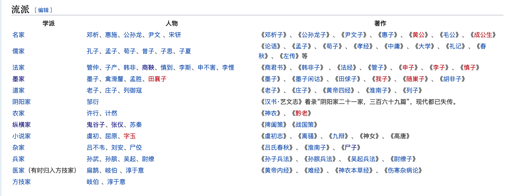

- [中国朝代顺序表](#中国朝代顺序表)
- [夏商周介绍](#夏商周介绍)
- [新武侠四大宗师（金、古、梁、温）](#新武侠四大宗师)
- [晚清四大名臣:曾、李、左、张](#晚清四大名臣)
- [钓鱼城为什么被称为“上帝折鞭处”和“东方麦加”？](#钓鱼城为什么被称为“上帝折鞭处”和“东方麦加”？)
- [春秋战国](#春秋战国)
    - [春秋五霸战国七雄](#春秋五霸战国七雄)
    - [春秋五霸](#春秋五霸)
    - [战国七雄](#战国七雄)
    - [战国四公子](#战国四公子)
    - [战国四大名将](#战国四大名将)
    - [五国相王](#五国相王)
    - [合纵连横](#合纵连横)
    - [欧冶子](#欧冶子)
    - [干将莫邪](#干将莫邪)
    - [越五剑](#越五剑)
    - [越王八剑](#越王八剑)
    - [欧冶子所铸各剑的去向](#欧冶子所铸各剑的去向)
    - [诸子百家](#诸子百家)
    - [四书五经](#四书五经)
    - [三教九流](#三教九流)
    - [三姑六婆](#三姑六婆)
    - [鬼谷子](#鬼谷子)
    - [尸子](#尸子)
    - [吴起](#吴起)
    - [孙膑](#孙膑)
    - [庞涓](#庞涓)
    - [商鞅](#商鞅)
    - [廉颇](#廉颇)
    - [苏秦](#苏秦)
    - [张仪](#张仪)
    - [公孙衍](#公孙衍)
    - [芈月（芈八子）](#芈月（芈八子）)
    - [白起](#白起)
    - [王翦](#王翦)
    - [李牧](#李牧)
- [诸子百家人物](#诸子百家人物)
    - [道家](#道家)
        - [老子](#老子)
        - [庄周（庄子）](#庄周（庄子）)
        - [列御寇（列子）](#列御寇（列子）)
    - [儒家](#儒家)
        - [孔丘（孔子、孔夫子）](#孔丘（孔子、孔夫子）)
        - [孟轲（孟子）](#孟轲（孟子）)
        - [荀况（荀子）](#荀况（荀子）)
    - [墨家](#墨家)
        - [墨翟（墨子）](#墨翟（墨子）)
        - [禽滑釐](#禽滑釐)
        - [孟胜](#孟胜)
        - [墨家巨子](#墨家巨子)
    - [法家](#法家)
        - [管仲（管子）](#管仲（管子）)
        - [子产（姬侨）](#子产（姬侨）)
        - [韩非（子）](#韩非（子）)
        - [商鞅（卫鞅、公孙鞅、商君）](#商鞅（卫鞅、公孙鞅、商君）)
        - [申不害](#申不害)
        - [慎到](#慎到)
        - [李斯](#李斯)
    - [名家](#名家)
    - [阴阳家](#阴阳家)
        - [邹衍](#邹衍)
    - [兵家](#兵家)
        - [孙武（孙子）](#孙武（孙子）)
        - [孙膑（孙伯灵）](#孙膑（孙伯灵）)
        - [吴起(兵家)](#吴起(兵家))
    - [医家](#医家)
        - [岐伯](#岐伯)
        - [扁鹊](#扁鹊)
        - [淳于意（仓公）](#淳于意（仓公）)
    - [农家](#农家)
    - [纵横家](#纵横家)
    - [杂家](#杂家)
        - [吕不韦](#吕不韦)
        - [刘安](#刘安)
        - [尸佼（尸子）](#尸佼（尸子）)
    - [小说家](#小说家)
        - [虞初](#虞初)
        - [屈原](#屈原)
        - [字玉](#字玉)

---------------------------------------------------------------------------------------------------------------------
## 中国朝代顺序表

夏商周、春秋战国、秦汉三国（魏）晋南北朝、隋唐五代十国、（唐）宋元明清、中华民国、中华人民共和国。

中国朝代顺序表：
夏、商、周【西周、东周（春秋、战国）】、
秦、汉（西汉、东汉）、东汉末年分三国、
三国（魏、蜀、吴）、三国归晋、
晋（西晋、东晋）、五胡乱华、南北朝：五胡十六国、南北朝【南朝（刘宋、萧齐、萧梁、南陈）、北朝（北魏、东魏、西魏、北齐、北周）】、
隋唐五代传：隋、唐、五代十国【五代（后梁、后唐、后晋、后汉、后周）、十国（前蜀、后蜀、杨吴、南唐、吴越、闽、马楚、南汉、南平、北汉）】、
宋（北宋、南宋）、元、明、清：唐宋元明清

夏商周（西周、东周）、秦汉（西汉、东汉）、三国（魏、蜀、吴）、晋（西晋、东晋）、南北朝（南朝(宋、齐、梁、陈)、北朝(北魏、东魏、西魏、北齐、北周)）、隋唐、五代(后梁、后唐、后晋、后汉、后周)、十国（前蜀、后蜀、吴、南唐、吴越、闽、楚、南汉、南平(荆南)、北汉）、（唐）宋(北宋、南宋)元明清、中华民国、中华人民共和国。

中国朝代顺序如下：夏、商、周[西周、东周(春秋、战国)]、秦、汉（西汉、新朝、玄汉、东汉）、三国时期(魏、蜀、吴)、晋(西晋、东晋)、南北朝[南朝(宋、齐、梁、陈)、北朝(北魏、东魏、西魏、北齐、北周)、隋、唐、五代(后梁、后唐、后晋、后汉、后周)、十国[前蜀、后蜀、吴、南唐、吴越、闽、楚、南汉、南平(荆南)、北汉]、宋(北宋、南宋)、辽、西夏、金、元、明、清、中华民国、中华人民共和国。

---------------------------------------------------------------------------------------------------------------------
## 新武侠四大宗师
新武侠四大宗师（金、古、梁、温）
金庸,查良镛，GBM ，OBE（英语：Louis Cha Jing-yong，1924年3月10日－2018年10月30日）
古龙（1938年6月7日－1985年9月21日），原名熊耀华
梁羽生（本名陈文统，1924年4月5日－2009年1月22日）
温瑞安（原名温凉玉）

## 晚清四大名臣
晚清四大名臣:曾、李、左、张
（从左至右）曾国藩、李鸿章、左宗棠、张之洞

---------------------------------------------------------------------------------------------------------------------
## 夏商周介绍

夏：鲧（ gǔn ）禹治水（大禹治水）、太康失国、少康中兴、商汤灭夏、鸣条之战、夏桀、妺喜
鸣条之战是约公元前1600年，商汤在鸣条（今山西省运城市夏县之西，一说今河南省洛阳市附近）与夏军进行的一场决战，战争导致夏朝灭亡，商汤建立了商朝。
鸣条之战，夏室被推翻，在方国部落的支持下汤在亳[注 108]称“王”，建立商王朝，成为中国历史上的第一次朝代更替。中国的首个世袭制政权，夏朝，传十四世、十七君[注 1]，历时四百七十一年[注 3]，于前17世纪末、前16世纪初灭亡。
夏朝统治了400多年，到夏桀履癸统治时期，已是危机四伏。他宠信王后妺喜，重用嬖臣，残杀忠臣关龙逄，并对民众及所属方国、部落进行残酷的压榨奴役，引起普遍的憎恨与反对。
在后世的传说中，夏后桀被描写成一代暴君，后人常将夏后桀与商纣王、周厉王和周幽王四个祸国殃民的暴君并称，但在较早的文献中关于桀的记载甚为简略。
妺喜被视为红颜祸水的第一例证，其后又陆续出现商代妲己、周代褒姒。因此，当越王勾践差范蠡把西施献给吴王夫差的时候，伍子胥进言：“臣闻：夏亡以妺喜，殷亡以妲己，周亡以褒姒。夫美女者，亡国之物也，王不可受。”[6]

商：殷商、商汤、比九世乱（九世之乱、兄终弟及）、盘庚迁殷、武丁中兴、祖甲改制、武乙射天、帝辛亡国、牧野之战（武王伐纣）、帝辛（纣王）、妲己、比干、西伯昌、伯邑考、周武王、
商朝又称殷、殷商
是中国历史上第一个有直接文字记载的朝代。这标志着中国历史离开了传疑时代。商朝前期屡屡迁都，直至盘庚定都于殷（今河南省安阳市），以后再没有迁都，所以商朝又叫殷朝
商代出现的甲骨文和金文（因多刻于青铜器上，亦称“铭文”）是目前已经发现的中国最早的有系统性的文字符号。
其后经历17代30王的统治，末代君王帝辛于牧野之战被从西方崛起的周人统治者周武王率领联军击败而亡。

牧野之战：史称“武王克殷”[1]、“武王克商”、“武王伐纣”
受命十一年（约前1046年），商纣（帝辛）不顾虑财政，持续发动征讨东南夷的战争，已把商朝弄得国困民乏。周武王见时机己到，便联合庸、蜀、羌、髳卢、彭、濮等部族，亲自率领战车三百辆，虎贲三千人、甲士四万五千人，进攻商朝首都朝歌，在牧野发动战斗，血流漂杵。

周：
周文王：西伯昌、长子伯邑考，次子周武王
周朝是中国历史上继商朝之后的王朝，也是最后一个完全施行封建制度的世袭王朝，也是中国历史上历时最长的朝代，分为西周（约前11世纪－前771年）与东周（前770年－前256年）两个时期。

---------------------------------------------------------------------------------------------------------------------

## 钓鱼城为什么被称为“上帝折鞭处”和“东方麦加”？

1、“上帝折鞭处bai”：蒙古大军的西征欧洲被du欧洲历史学家们认为是上帝派来惩罚zhi欧洲的，因此钓dao鱼城被称为。

2、“东方麦加”：钓鱼城之战延续了南宋王朝的历史，与穆罕默德拿下麦加城，从而为统一阿拉伯半岛奠定基础有相同之处。

3、历史：1258年，蒙哥大汗挟西征欧亚非40余国的威势，分兵三路伐宋。蒙哥亲率一路军马进犯四川，于次年2月兵临合川钓鱼城。蒙哥铁骑东征西讨，所向披靡，然而在钓鱼城主将王坚与副将张珏的顽强抗击下，却不能越雷池半步。

蒙古打到欧洲的：巴格达（伊拉克首都）、叙利亚的大马士革

---------------------------------------------------------------------------------------------------------------------
清朝历史

清朝历代皇帝顺序表
1、清太祖——努尔哈赤（称汗）
2、清太宗——皇太极（称汗后称帝）

3、清世祖——顺治皇帝
4、清圣祖——康熙皇帝
5、清世宗——雍正皇帝
6、清高宗——乾隆皇帝
7、清仁宗——嘉庆皇帝

8、清宣宗——道光皇帝
9、清文宗——咸丰皇帝（皇后慈禧）
10、清穆宗——同治皇帝
11、清德宗——光绪皇帝
12、宣统皇帝（没有庙号）

---------------------------------------------------------------------------------------------------------------------
## 春秋战国

## 春秋五霸战国七雄

春秋战国时期，同属于东周  
东周可分为春秋时期与战国时期，中国进入诸侯争霸的时代，周王威严扫地，仅有天下共主的虚名。  
春秋战国分界：三家灭智、三家分晋

春秋是春秋五霸（齐、晋、楚、吴、越；一说：齐、晋、宋、秦、楚），战国是战国七雄（齐、楚、燕、韩、赵、魏、秦）。

- 春秋时期：周王室名义存在，诸侯分裂
- 战国时期：周王室彻底衰微，诸侯兼并

在中国几千年的历史长河里，有三个比较典型的"大乱世"。一个是春秋战国时期，一个是三国两晋南北朝时期，一个是唐末五代十国时期。

春秋战国分为春秋时期和战国时期，其分水岭是在公元前453年，韩、赵、魏三家灭掉智氏，瓜分晋国为标志。 

春秋时期，"礼乐征伐自天子出"向"礼乐征伐自诸侯出"过渡，周王室虽然已经在衰微，但依然是各诸侯国名义上的共主，诸侯依旧需要履行义务。譬如定期朝见、上供、协从作战等，周王室依然具有一定的号召力。

战国时期，由"礼乐征伐自诸侯出"转向"礼乐征伐自卿大夫出"，周王室彻底衰微，不仅表现在其统治的地域的缩小，不过局促于一个小地方苟延残喘，更表现在各国势力的坐大，不再听命服从于周王室，也不再主动履行义务，以至于周王室穷困衰微，为了生存甚至违反"天子不可向诸侯索要供物"的规矩。

春秋时期，所展现的更多是从诸侯在周王室统一管辖下治理地方到分裂为数个小国家，彼此混战，这时天下是分裂的。

战国时期，由于长期战乱，一方面加速着民族融合，一方面也使人民逐渐厌战，渴望出现一个强大势力统一全国。因而已经由分裂开始转向统一，国与国之间的战争，兼并性质更浓，为秦统一六国，建立中央集权国家铺垫。

春秋时期，简称春秋，指公元前770年-公元前476年，是属于东周的一个时期。春秋时代周王的势力减弱，诸侯群雄纷争，齐桓公、晋文公、宋襄公、秦穆公、楚庄王相继称霸，史称春秋五霸（另一说认为春秋五霸是齐桓公、晋文公、楚庄王、吴王阖闾、越王勾践）。

战国时期简称战国，指公元前475年~公元前221年，是中国历史上东周后期至秦统一中原前，各国混战不休，故被后世称之为“战国”。“战国”一名取自于西汉刘向所编注的《战国策》。

### 春秋五霸

齐桓公、晋文公、宋襄公、秦穆公、楚庄王相继称霸，史称春秋五霸（另一说认为春秋五霸是齐桓公、晋文公、楚庄王、吴王阖闾、越王勾践）

春秋时期（公元前770年－公元前476年/公元前403年），简称春秋， 是东周的前半段时期。周室在平王东迁后实力大减， 没有足够的威望号令诸侯，因而形成春秋初期之局面。

春秋时代周天子的势力减弱，群雄纷争，春秋霸政形成，齐桓公、宋襄公、晋文公、秦穆公、楚庄王相继称霸，史称“春秋五霸”。当时齐桓公提出“尊周室，攘夷狄，禁篡弑，抑兼并”(尊王攘夷)的思想，因此周天子于表面上仍获尊重。

春秋时期因孔子修订的《春秋》而得名。这部书记载了从鲁隐公元年（前722年）到鲁哀公十四年（前481年）的历史，共二百四十二年。后史学家为了方便起见，一般从周平王元年（前770年）东周立国，平王东迁到洛邑起，到周敬王四十三年（前477年）或四十四年（前476年）为止（也有学者认为应到《左传》记载之终（前468年）、三家灭智（前453年）或三家分晋（前403年）），称为“春秋时期”。  
春秋时期之后是战国时期。  
据史书记载，春秋二百四十二年间，有三十六名君主被臣下或敌国杀之，五十二个诸侯国被灭。[2]。有大小战事四百八十多次，诸侯的朝聘和盟会四百五十余次。鲁国朝王三次，聘周四次。

前771年，因周幽王宠信褒姒，废太子宜臼。宜臼逃至申国，他外公申侯联合曾侯、许文公及犬戎（外族）推翻周幽王，都城宗周被毁坏，后周平王上任，前770年周平王被迫将国都从镐京迁至成周（雒邑）。因雒邑在镐京之东，此后的周朝史称东周。

### 战国七雄

战国时期简称战国，指公元前475年~公元前221年，是中国历史上东周后期至秦统一中原前，各国混战不休，故被后世称之为“战国”。“战国”一名取自于西汉刘向所编注的《战国策》。

参考  
[春秋和战国的根本区别是什么？](https://www.zhihu.com/question/27016855)  
[3分钟看懂春秋和战国之间的区别](https://www.sohu.com/a/328597139_118889)

### 战国四公子
- 齐国孟尝君田文
- 赵国平原君赵胜
- 魏国信陵君魏无忌
- 楚国春申君黄歇

### 战国四大名将
《千字文》将白起与王翦、廉颇和李牧并称为战国四名将
- 白起（秦国）
- 王翦（秦国）
- 廉颇（赵国）
- 李牧（赵国）

### 五国相王

五国相王，指的是古中国时期中的战国时代中叶五个主要诸侯国互相承认对方君主王位的事件，该事件标志着周天子权威的彻底丧失。

### 合纵连横

合纵，或合从，合众弱以攻一强[1]，中国春秋时期及战国时期的外交及军事策略，是南北纵向诸个国家合作，抵挡西边秦国的东向发展。战略上即使倡议诸国组成被动的联合防御阵线，依然不是长远有效的方式。同时各国间存在着历史的矛盾，携手联手防御简直是空谈。合纵最主要的战略创新则是从联合抗秦，提升到合作攻秦灭秦。

根据《史记·苏秦列传》，苏秦在游说秦惠王连横不成后，转而游说六国联合起来对抗秦国。合纵之势形成，苏秦掌六国宰相印，然而各国之间也存在大小矛盾，苏秦在齐国被刺杀，合纵联盟随之瓦解。最后被连横所破解。在合纵抗秦基础建立后，亦有合纵灭齐之举。

纵横家，是中国战国时期连合政军外交联盟的一派，《汉书·艺文志》列为“九流十家”之一。纵横家出现于战国至秦汉之际，多为游说策辩之士，可称为中国史上最早之外交政治家。他们的出现主要是因为当时列国割据分争，需要在国力富足的基础上，利用联合、排斥、威逼、利诱不战而胜，或辅之以兵法以较少的损失获得最大的收益。纵横家朝秦暮楚，事无定主，反复无常，策计划谋多基于国际现实政治要求。合纵派的主要代表是公孙衍和苏秦，连横派的主要代表是张仪。

纵横家的鼻祖是鬼谷子。纵横家的代表人物有公孙衍、张仪、苏秦（其中苏秦、张仪二人为同门师兄弟，同属鬼谷子门生）。另有甘茂、司马错、乐毅、范雎、蔡泽、邹忌、毛遂、郦食其、蒯彻等，事皆详于《战国策》。

### 欧冶子

欧冶子（？－？），春秋末期至战国初期越国人。中国古代铸剑鼻祖。据《越绝书》记载，他曾为越王允常铸了五柄宝剑：湛卢、巨阙、胜邪、鱼肠、纯钧；为楚昭王铸了三柄名剑：龙渊、泰阿、工布。 其女儿名为“莫邪”，而“干将”为其女婿。“干将莫邪”这二把剑就是其女儿女婿铸成。

欧冶子，春秋末期至战国初期越国人，莫邪之父。中国古代铸剑鼻祖。据《越绝书》记载，他曾为越王勾践铸了五柄宝剑：湛卢（仁道之剑）、巨阙、胜邪、鱼肠（勇绝之剑）、纯钧（尊贵无双之剑）；也为楚昭王铸了三柄名剑：龙渊（诚信高洁之剑）、太阿（威道之剑）、工布。

1965年12月在湖北省江陵县望山1号楚墓出土的“越王勾践剑”据传也是欧冶子所铸[来源请求]。该剑出土时仍寒光四射，锋利无比，反映了中国古代高超的铸剑技术，为古代兵器中的奇宝。

越王允常献给吴王僚的三把宝剑胜邪，鱼肠，湛卢

巨阙相传为春秋时欧冶子所铸。干将，莫邪，巨阙，辟闾号称四大剑。巨阙钝而厚重。阙：通“缺”意为残缺，但其坚无比故号“天下至尊”就是其他宝剑亦不敢与之争锋。

巨阙钝而厚重，阙：通“缺”，意为残缺。相传是“越五剑”里面最垃圾的一把，但其坚硬无比，故号“天下至尊”。

### 干将莫邪
干将（上古汉语（沙—白构拟系统）：kˁa[r] tsaŋ-s）与莫邪（上古汉语（沙—白）：mˁak ɢa）是一对铸剑师夫妻，最早出现于春秋时代。莫邪之父欧冶子亦为当时铸剑大宗师。干将与莫邪亦是中国传说中的非常著名的两把名剑，最早出现于春秋时代，取名自舍身炼剑的干将莫邪夫妇。

### 越五剑
- 湛卢：（仁道之剑）
- 巨阙
- 胜邪、
- 鱼肠、（勇绝之剑）
- 纯钧（尊贵无双之剑）

### 越王八剑
据拾遗记卷十，越王勾践曾采昆吾山之铜，铸了八把名剑：  
- 一名掩日，以之指日，则光昼暗。金阴也，阴盛则阳灭。
- 二名断水，以之划水，开即不合。
- 三名转魄，以之指月，蟾兔为之倒转。
- 四名悬翦，飞鸟游过触其刃，如斩截焉。
- 五名惊鲵，以之泛海，鲸鲵为之深入。
- 六名灭魂，挟之夜行，不逢魑魅。
- 七名却邪，有妖魅者，见之则伏。
- 八名真刚，以切玉断金，如削土木矣。

### 欧冶子所铸各剑的去向
- 1、湛卢剑：吴越争霸，越王勾践战败，将湛卢剑作为贡品敬献吴王阖闾，吴王视为国宝，终日佩带在身，后飞往楚国被楚昭王所得，后传到南宋名将岳飞手中，岳被害后，不知去向。
- 2、纯钧剑：吴国名将伍子胥所佩，伍曾用此剑指挥干军万马历沙场，后沉入杭州钱塘江，若干年后，伍子胥也葬身于此。
- 3、鱼肠剑：专诸所用，公子姬光指使专诸用此剑刺死吴王僚谋夺王位，公子姬光继位后称阖闾，吴王做贼心虚，害怕见物思情，总觉得鱼肠匕首是不祥之物，因而封藏不敢佩用。事过十八年之后，阖闾王在吴越战争中受伤死亡，吴太孙夫差于公元前495年嗣位，并在破楚门外的海涌山为其父做了坟墓，连同鱼肠剑一同埋葬海涌山。到了公元前221年秦始皇统一中国，命人掘阎阊的坟墓，以求取鱼肠剑，但“凿山求剑无所得，洞凿处成深洞”，现为虎邱剑池，今日苏州风景区之一。
- 4、龙渊、工布二剑：越王灭吴之后，北上会齐、晋诸侯称霸业(中原)。到公元前235年，越国被楚国消灭，公元前222年，楚国被秦国灭，秦始皇统一中国，楚王所用的“龙渊”“工布”被秦始皇缴获成了他腰中之物。
- 5、干将莫 剑：吴越争霸时沉入延平（今南平）剑溪（闽江）。

### 诸子百家

诸子百家是后世对华夏先秦学术思想人物和派别之总称。  
诸子是指中国先秦时期老子、庄子、孔子、孟子、荀子、墨子、列子、申子、韩非子等学术思想代表人物。  
春秋后期已出现颇有社会影响的道家、儒家、法家、墨家、兵家、名家、阴阳家等不同学术流派，而至战国中期，百家争鸣，众多学说纷呈，丰富多彩，为中华文化奠定了深厚基础。

西汉司马迁在《史记》中引述了司马谈（司马迁之父）对学术流派的见解，司马谈把先秦以来的学派总归纳为六家(论六家要旨)，即：道家、儒家、墨家、法家、名家、阴阳家。

东汉班固在《汉书》中则把先秦以来的学派归纳为十家(九流十家)，即：道家、儒家、墨家、法家、名家、阴阳家、农家、纵横家、杂家、小说家。

吕思勉认为“术数”、“方技”、“兵书”三略，亦可称为先秦诸子，可算为十二家[1]。

各家学派和人物代表
 

儒家	孔子、孟子、荀子、曾子、子思、子夏	《论语》、《孟子》、《荀子》、《孝经》、《中庸》、《大学》、《礼记》、《春秋》、《左传》等
法家	管仲、子产、韩非、商鞅、慎到、李斯、申不害、李悝	《商君书》、《韩非子》 、《法经》、《管子》、《申子》、《李子》、《慎子》
墨家	墨子、禽滑釐、孟胜、田襄子	《墨子》、《墨子闲诂》、《田俅子》、《我子》、《随巢子》、《胡非子》
道家	老子、庄子、列御寇	《老子》、《庄子》、《黄帝四经》、《淮南子》、《列子》
阴阳家	邹衍	《汉书‧艺文志》着录“阴阳家二十一家，三百六十九篇”，现代都已失传。
纵横家	鬼谷子、张仪、苏秦	《捭阖策》《战国策》
杂家	吕不韦、刘安、尸佼	《吕氏春秋》、《淮南子》、《尸子》
兵家	孙武、孙膑、吴起、尉缭	《孙子兵法》、《孙膑兵法》、《吴起兵法》、《尉缭子》
医家（有时归入方技家）	扁鹊、岐伯 、淳于意	《黄帝内经》、《难经》、《神农本草经》、《伤寒杂病论》
方技家	岐伯 、淳于意

《汉书・艺文志》持诸子百家出于王官论：
- “儒家者流，盖出于司徒之官（司徒掌教育）。”
- “道家者流，盖出于史官（史官掌纪录典籍）。”
- “阴阳家者流，盖出于羲和之官（羲和掌星历）。”
- “法家者流，盖出于理官（理官掌刑法）。”
- “名家者流，盖出于礼官（礼官掌礼秩）。”
- “墨家者流，盖出于清庙之守（清庙之守掌祀典）。”
- “纵横家者流，盖出于行人之官（行人掌朝觐聘问）。”
- “杂家者流，盖出于议官（议官乃谏官议郎之属）。”
- “农家者流，盖出于农稷之官（神农、后稷教民稼穑）。”
- “小说家者流，盖出于稗官（稗官乃小官)

“九流十家”的“九流”与“三教九流”的“九流”不同。

### 四书五经

四书五经是四书和五经的合称，是中国儒家的经典书籍。

四书又称为四子书，是指《论语》、《孟子》、《大学》、《中庸》。

五经是《诗经》、《尚书》、《礼记》、《周易》和《春秋》。

### 三教九流

三教九流（亦作九流三教）泛指古代中国的宗教与各种学术流派，是古代中国对人的地位和职业名称划分的等级。在古代白话小说中，往往含有贬义。

三教，指中国三大传统宗教：儒、释、道。

九流，指尊卑不同的九种身份。由尊至卑依次是：帝王、文士、官吏、医卜、僧道、士兵、农民、工匠、商贾。

在《汉书·艺文志》分别指：儒家、道家、阴阳家、法家、名家、墨家、纵横家、杂家、农家。九流十家，是九流以外加上小说家。

上九流  
帝王、圣贤、隐士、童仙、文人、武士、农、工、商。

中九流  
举子(科举中省试被取录者)、医生、相命、丹青(画匠、买画人)、书生、琴棋、僧、道、尼。

下九流  
师爷、衙差、升秤(秤手)、媒婆、走卒、时妖(拐骗及巫婆)、盗、窃、娼。

### 三姑六婆

三姑：尼姑、道姑、卦姑

六婆：牙婆、媒婆、师婆、虔婆、药婆、稳婆

三姑六婆原本指的是古代中国民间女性的几种职业。语出元末明初陶宗仪的《南村辍耕录》。[1]

现代汉语中的“三姑六婆”常指社会上各式市井女性或喜爱搬弄是非的人。

三姑指的是三种宗教的出家女性。尼姑是佛教女性僧侣、道姑是道教女性教徒、卦姑是专门占卦的。

六婆中，牙婆即女性牙人，为包括贩卖人口在内之商业交易牵线搭桥的中介。媒婆是专为人介绍配偶的女性。师婆是专门画符施咒、请神问命的巫婆。虔婆是妓院内的鸨母。药婆是专门卖药的女人。稳婆则是专门接生的接生婆，六婆是各种专业的名称，有时一人可以身兼数职。

由于三姑六婆因职业关系，而其中的牙婆、虔婆、师婆多为恶行被人病垢，而且在中国古代人的观念中三姑六婆是不正当职业，因此三姑六婆负上恶名，而事实上，对于三姑六婆的歧视，是多个方面因素造成的，有古时男女不平等的思想因素，也有三姑六婆的职业因素造成的。

### 鬼谷子
鬼谷子（？－？），传说原名王诩，又作王禅、王利、王通，一说字诩[1][2]，道号玄微子，世称鬼谷先生、王禅老祖，是大约活跃于战国中期的显赫人物，为“诸子百家”之一、纵横家的鼻祖，亦有政治家、外交官、阴阳家、预言家、教育家等身份。

根据《史记 卷六十九 苏秦列传 第九》及《史记 卷七十 张仪列传 第十》记载，鬼谷子有苏秦与张仪两个叱咤战国时代的杰出弟子，另传说孙膑与庞涓亦为其弟子，故被喻为纵横家之鼻祖[3][4]。

### 尸子

《尸子》，东周战国尸佼撰，原书有二十卷，目录一卷[1]。

尸佼是秦相卫鞅上客，卫鞅死，尸佼恐并诛，逃至蜀国[2]，后来尸佼对法家思想进行反思，并取各家之长，著成《尸子》一书，思想兼宗儒、墨、名、法，是为杂家，如主张“节葬”、“非乐”是墨家思想。《尸子》中提出“四方上下曰宇，往古来今曰宙。”，是今日“宇宙”一词的由来。

### 吴起

吴起（前440年－前381年），中国战国初期军事家、政治家、改革家，兵家代表人物。卫国左氏（今山东省定陶县，一说山东省曹县东北）人。[1]

吴起历侍鲁、魏、楚三国，通晓兵家、法家、儒家三家思想，在内政、军事上都有极高的成就。仕鲁时曾击退齐国的入侵；仕魏时屡次破秦，尽取秦国的河西地区（今山西、陕西两省间黄河南段以西地区），成就魏文侯的霸业；仕楚时主持改革，史称吴起变法。但吴起的变法损害了楚国贵族的利益，他本人也遭到了旧势力的报复。前381年，楚悼王去世后，楚国贵族发动兵变杀害吴起。

吴起著有《吴子兵法》一书，由于他在军事理论上的贡献，后人将孙武、吴起并称为“孙吴”。[2]唐肃宗时将吴起等历史上十位武功卓著的名将供奉于武成王庙内，被称为武庙十哲。[3]宋徽宗时追尊吴起为广宗伯，位列宋武庙七十二将之一。[4]司马迁著《史记》时，将孙武和吴起合立于《孙子吴起列传》。现代学者马非百著《秦集史》时，将李悝和吴起合立于列传中。[5]

### 孙膑

孙膑（前382年－前316年），原名孙伯灵[注 1]，因受过膑刑，故世人习称“孙膑”。是活跃于战国中期的军事家，兵家代表人物。

孙膑曾与庞涓为同窗，二人一同拜师[注 5]学习兵法。庞涓后来出仕魏国，担任了魏惠王的将军，但是他认为自己的才能比不上孙膑，于是暗地派人将孙膑请到魏国加以监视。孙膑到魏国后，庞涓嫉妒他的才能，于是捏造罪名将孙膑处以膑刑和黥刑，砍去了孙膑的双足[注 6]并在他脸上刺字，想使他埋没于世不为人知。

桂陵之战
马陵之战（庞涓死）
围魏救赵

### 庞涓

庞涓（前385年－前342年），活跃于战国中期的军事家，魏国将军。因妒贤迫害同仕魏国的同学孙膑，孙膑逃至齐国。前354年在桂陵之战被孙膑俘虏，透过调停后释放。前342年马陵之战与太子申一并败于田盼，于此战阵亡。

相传与孙膑同拜于隐士鬼谷子门下，庞涓在魏国被拜为将军，引孙膑入魏国，向魏王推荐他，却恐其贤于己，因而诬陷孙膑罪名，处以膑刑和黥刑，砍去了孙膑的双足，并在其脸上刺青，因为古时这样的罪犯被士大夫所轻视，基本上不能任官[1]。孙膑于是逃奔齐国，在齐国获得田忌的赏识，担任其军师。

桂陵之战
马陵之战（死）
围魏救赵

### 商鞅

战国时代政治家。有人说他是尸子的徒弟。

商鞅（前390年－前338年），中国历史上战国时代政治家、统帅，法家法派[注 1]代表人物。卫国国君的后裔，姬姓，故称为卫鞅，又称公孙鞅。[3]后因在河西之战中立功获封于商[注 2]十五邑，号为商君，故称之为商鞅。

### 廉颇

廉颇（？－？），嬴姓，廉氏，名颇，晋系金文作𡉣波，籍贯有山西太原、山西运城、山东德州等说。封信平君，战国末期赵国之良将，与白起、王翦、李牧并称“战国四大名将”[1]。曾战胜齐国、魏国、燕国。

### 苏秦
苏秦，雒邑（今河南洛阳东）乘轩里人，战国时期著名纵横家，提倡合纵（联合六国对付秦国）。

苏秦（？－前284年），己姓，苏氏，字季子，东周雒邑（今河南洛阳东）乘轩里人，相传为鬼谷子徒弟。战国时期纵横家、外交官和谋略官。

苏秦与张仪同出自鬼谷子门下，跟随鬼谷子学习纵横之术。

有说法认为他和张仪两人彼此呼应，共同达到个人的目的。

苏秦游说完各个诸侯后，六国达成合纵联盟，团结一致。苏秦被任命为纵约长（合纵联盟的联盟长），并且担任了六国的宰相，同时佩戴六国相印。

### 张仪
张仪，魏国安邑（今山西夏县）人，战国时期著名纵横家。提倡连横，（由秦国联合其他诸侯国对抗其他诸侯国），多次破坏了苏秦的合纵（联合六国对付秦国），为秦惠王重用，后来亦就任秦国宰相，卒于魏国。《战国纵横家书》则记载张仪与当时提倡合纵的公孙衍对峙。

张仪（前373年－前310年），姬姓，张氏，魏国安邑（今山西夏县）人，战国时期著名的纵横家。提倡连横，即秦国联合其他诸侯国中的几个，然后对抗其他的诸侯国，多次破坏了公孙衍的合纵，为秦惠王重用，后来亦就任秦国宰相，卒于魏国。

1973年在长沙马王堆汉墓出土的《战国纵横家书》中所载，苏秦死于公元前284年，张仪死于公元前310年。与张仪的连横同时对峙的可能为犀首（即公孙衍）的合纵，而非苏秦的合纵；苏秦亦未用计入张仪于秦，这些都不同于《史记》与《资治通鉴》所言。

近代有学者认为苏秦活跃于张仪死后，《史记》关于苏秦用计让张仪入秦的记载有误，与张仪的连横同时对峙的应为公孙衍的合纵。

### 公孙衍

公孙衍（约前360年－约前300年），魏国阴晋（今华阴市东北）人。曾仕魏，任犀首之官（军官名），人因以犀首称之[1]，是战国时期出身于魏国的纵横家，和张仪同期，先后于秦国、魏国为官，为张仪的连横策略的主要对手。公孙衍在当时一些人的心目中是与张仪齐名的，但传下来的事迹不多。《史记》有公孙衍传，系附于张仪传。《战国策》也只有几条零星的记载。

### 芈月（芈八子）

宣太后（前337年－前265年），芈姓，又称芈八子、秦宣太后。战国时期秦国王太后，秦惠文王之妾，秦昭襄王之母，中国第一位号为“太后”者。

宣太后的本名、父母、出生时间、早年事迹均无详细记载，仅知宣太后是楚国人。而后在出土的文物中，发现刻有芈姓及月字。秦惠文王的妃嫔，位阶为“八子”，号称“芈八子”。秦国后宫分八级：王后、夫人、美人、良人、八子、七子、长使、少使。前325年，宣太后生下公子稷（即秦昭襄王），另有两子公子市和公子悝。

### 白起

白起（前332年？－前257年11月），赢姓白氏，公子白之后故称公孙，《战国策》作公孙起，[2][3][4]郿县（今陕西省眉县常兴镇白家村）人，中国战国时代军事家、秦国名将，兵家代表人物。

白起担任秦国将领30多年，攻城70余座，歼灭近百万敌军，未尝一败，被封为武安君。白起一生有伊阙之战、鄢郢之战、华阳之战、陉城之战和长平之战等辉煌胜利，《千字文》将白起与王翦、廉颇和李牧并称为战国四名将。[5]

### 王翦

王翦（？－？），战国时期秦国名将，关中频阳东乡（今陕西富平东北）人，主要战绩：破赵国都城邯郸，消灭燕和赵；以秦国绝大部分兵力消灭楚国后，接着率领平楚大军南下平定百越。与白起、廉颇、李牧并称战国四大名将。其曾孙是琅琊王氏和太原王氏的始祖。

### 李牧
李牧（？－前229年），名繓zuǒ[1]，字牧[2]，战国后期军事家，赵国名将，与白起、王翦、廉颇并称战国四大名将。

李牧驻守代郡、雁门郡期间，率军大破匈奴。在肥之战、番吾之战两次击败秦国，受封武安君，但最终被赵幽缪王杀害。而关于李牧的死因，史料记载也多有不同。李牧死后仅三个月，赵国首都邯郸（今河北省邯郸市）被秦军攻破，赵幽缪王成为阶下之囚。

---------------------------------------------------------------------------------------------------------------------

## 诸子百家人物

### 道家

道家是中国诸子百家中重要的思想学派之一，也是九流十家之一，在春秋战国时期以老子、庄子为代表。

一般认为老子应是实质可考的道家始祖，经由庄子、列子、杨朱等人的发展，成为一门经典，其中法家，名家，纵横家也受道家的影响。

道家主张“顺其自然”，认为要用到法律时（法和法律有不同；法好比物理，而法律则是人为），大道已经废弃了。因此社会上没有道德仁义[1]，因此不主张要用法去治人；法家则主张要用法律去惩治人，认为人类本性顽劣，要用权威与固定的法条以治天下。道家思想与法家思想多有抵触，但到了法家的韩非子时，却利用道家《道德经》的章句，以阐发法家思想。

道家虽然学派上有所区别，但就其主旨来说是相通的：以“道”为本，自然无为。

老子思想的核心是“道”，老子曾在其著作中说：“有物混成，先天地生。寂兮寥兮！独立而不改，周行而不殆，可以为天地母。吾未知其名，字之曰道。”[2] “大邦以下小邦，则取小邦，小邦以下大邦，则取大邦”[3]

以大邦为世界，以大邦以下小邦为国家，小邦以下大邦为本土。道家是中国最早的本土独立思想，与董仲舒的春秋大一统思想大异旨趣。

庄子思想的核心是“逍遥”与“齐物”。主张“天地与我并生，万物与我为一”的哲学思想。杨朱据说是老子的弟子，但他非常激进，提出“贵己”，“为我”。主张“全性保真，不以物累形”。战国时期稷下学宫的《管子》诸篇，主张“守则重，不守则轻”与“一年树谷，十年树木，百年树人”自小入大的道家哲学思想。

老子提出“道”是宇宙本源，也是统治宇宙中一切运动的法则。这一观点被后来所有道家所有流派支持，成为道家最基础核心。道家贵生，存生，养生，轻视物质，以心灵的逍遥，万物的齐一为最高价值。

#### 老子

老子（？－？），姓李，一说姓老又一说姓利，名耳或贞，字伯阳、外字聃，世人尊称为“老子”[注 1]，生于东周的楚国苦县厉乡曲仁里（原属陈国，今河南省鹿邑县），师从殷商末臣商容[2]，于东周春秋时周朝守藏室[注 2]任柱下史[注 3]。中国春秋时代思想家，隐居邢台广阳山。其著作被人们广泛称为《道德经》，是道家的经典，亦是全球文字出版发行量最大的著作之一。

老子的学说后被庄周、杨朱、列御寇等人发展[3]，后人奉为道家学派之开教宗师。《史记·老子韩非列传》中曾记载孔子向老子请教关于礼的问题。老子主张无为而治、天人合一、清静无为的统治理念，和庄子同样是道家的重要人物，合称“老庄”。

老子被尊为道家与道教始祖、东方三大圣人之首，唐朝追认李聃为李姓始祖。老子是世界文化名人，世界百位历史名人之一。

#### 庄周（庄子）

庄子（约前369年－前286年）[1]，庄氏，名周，一说字子休，约与孟子同时，为战国时代宋国蒙（商丘民权庄子镇）人，曾任漆园吏。他是著名思想家、哲学家、文学家，是道家学派的代表人物，老子思想的继承和发展者，后世将他与老子并称为“老庄”。公元742年，唐玄宗天宝初，诏封庄周为南华真人，称其著书《庄子》为南华经[2]，在四库全书之中归类为子部道家类。宋徽宗时，追封为“微妙元通真君”。

#### 列御寇（列子）

列御寇（前450年－前375年），或称列圄寇，春秋时期[1]郑国人，道家学派的先驱者，人称列子，主张“贵虚”。

### 儒家

儒家，又称儒学、孔孟思想、孔儒思想，诸子百家及九流十家之一，是一种起源于中国并同时影响及流传至其他周遭东亚地区国家的文化主流思想、哲理。前5世纪由孔子创立，脱胎自周朝礼乐传统，以仁、恕、诚、孝为核心价值，着重君子的品德修养，强调仁与礼相辅相成，重视五伦与家族伦理，提倡教化和仁政，轻徭薄赋，抨击暴政，力图重建礼乐秩序，移风易俗，保国安民，富于入世理想与人文主义精神。

儒家尊崇孔子为圣人，以四书五经为经典，得孟子、荀子、董仲舒、韩愈、二程、朱熹、王阳明、顾炎武、朝鲜李退溪、日本山崎闇斋等等大儒加以发扬，历久而犹新，对东亚政治文化与道德教育都有重大贡献。

#### 孔丘（孔子、孔夫子）

孔丘（前551年9月28日[1][2]－前479年4月11日[3]），子姓，孔氏，名丘[4]，字仲尼，后代敬称孔子或孔夫子。生于鲁国陬邑，祖先为宋国人，东周春秋末期鲁国的教育家与哲学家，曾在鲁国担任官府要职。孔子为儒家创始人[5][6][7]，其德性论五行思想（仁义礼智信）对邻近地区，如：朝鲜半岛、琉球、日本、越南、东南亚等有深远影响，此等地区也被称为儒家文化圈。

#### 孟轲（孟子）

孟子之弟子万章与其余弟子著有《孟子》一书。继承并发扬孔子的思想，成为仅次于孔子的一代儒家宗师，被尊称为孟亚圣，又称孟子林[2]，与孔子合称为“孔孟”。

孟子（公元前372年－公元前289年）[1]，名轲，邹国（今山东省邹城市）人，东周战国时期儒家代表人物。其字号在汉代以前的古书没有记载，但曹魏、晋代之后却传出子车、子居、子舆、子展等不同的字号，字号可能是后人的附会而未必可信。生卒年月因史传未记载而有许多的说法，其中又以《孟子世家谱》上所记载之生于周烈王四年（前372年），卒于周赧王二十六年（前289年）较为多数学者所采用。

#### 荀况（荀子）

荀子（约公元前316年－约公元前237年至公元前235年），名况，被尊称为荀卿，又称孙卿、孙卿子[1]:273，中国战国时代儒家学者和思想家，赵国人，曾担任齐国稷下学宫祭酒、楚国兰陵令，到赵国、秦国游说诸侯，宣扬儒学和传授六经，批评子思、孟子等其他儒者及墨家、道家等其他学派，有韩非、李斯等弟子，著作后世编为《荀子》一书。

### 墨家

墨家逻辑是中国古代第一个逻辑学体系，全球三大古典逻辑体系之一，主要以三物论为代表，三物分别为故、理、类。《墨辩》是墨家逻辑的主要著作。

墨家的政治思想主要有以下十点（亦可称为“十论”）：  
兼爱、非攻、尚贤、尚同、天志、明鬼、非命、非乐、节用、节葬

#### 墨翟（墨子）

墨子（前468年？－前376年[a]），子姓，墨氏，名翟，春秋末战国初期宋国（今河南商丘）人，一说鲁国（今山东滕州木石镇）人，是中国战国时期著名思想家、政治家、科学家、军事家。

提出了“非儒”、“兼爱”、“非攻”、“尚贤”、“尚同”、“天志”、“明鬼”、“非命”、“非乐”、“节葬”、“节用”、“交相利”等观点，创立墨家学说，并有《墨子》一书传世。墨家在当时影响很大，墨子因反儒，创立墨学。重视科学。《墨子》一书中体现的墨子的思想在后世仍具有一定影响，广为流传的《千字文》中便记载了出自《墨子·所染》的“墨悲丝染”的故事。到了清朝，随着诸子学的兴起，学者对墨子思想的研究又提升到新的高度。

#### 禽滑釐

禽滑gǔ釐lí[1]（？－？），字慎子[2]，是战国时期魏国人，墨子弟子。

禽滑釐早年学于子夏[3]，后来拜墨子为师，曾询问墨子小国如何防守大国攻城的方法。墨子很信任他，“尽传其学，与墨子并称”。禽滑釐尝率墨者三百人[4]，协助宋国守城，以抵御楚国入侵。

#### 孟胜

孟胜（？－？），中国东周末年的墨家钜子。其著名事迹是为了守义，与约180名弟子死于楚国阳城君（一说鲁阳文君）的封地。

#### 墨家巨子

钜子又称巨子，墨学，在先秦时代和儒学同称显学，可惜在秦以后逐渐寝寂了，一直有很少的人在做墨子的研究，但是直到清朝中期墨学的中兴才开始。

墨家有着严密的组织，其领袖也就是巨子（钜子），墨子有没有当过巨子，这个无法考证，但方授楚《墨学源流》认为墨子是墨家第一任巨子，禽滑釐（qín gǔ xī）是第二任巨子，这也只是一家之言，从先秦典籍中可考证的墨家巨子只有三人：孟胜，田襄子，腹䵍，见于《吕氏春秋》。

### 法家

法家中有三派：慎到重“势”、申不害重“术”，商鞅重“法”[2]。

法家是中国历史上研究提倡用法治理国家的思想学派，春秋战国时期从未有一个组织或学派叫“法家”，而只是在西汉司马谈的《论六家要指》将韩非子、管子等理念相似的人归类为一派并命名“法家”。《汉书·艺文志》列为“九流”之一。法家成熟很晚，但成型很早，其思想源头可上追溯于夏商时期的理官。春秋、战国等时期管仲、李悝、子产、吴起、商鞅、慎子、申子、乐毅、剧辛等人予以发展，遂成为一个学派，到了战国末期由韩非集其大成。汉代时对他们的学说加以总结、综合，其思想则成治理国家的基础。

法家的治国思想完全从统治者的角度出发，来审视战国时期的问题[1]。法家学说的作者本身并不是统治者，但希望通过其思想，被统治者任用。法家指出统治者如何有效地组织和控制政府，使国家财富和领土得到最大限度的增加。法家认为，要扩大疆域、增加财富，只能以君主专制，即统治者在其领域内的绝对个人权力，才能实现。

在战国时期盛行的所有关于个人和政治的思想学派中，如果有一个赢家，那只能是法家[1]。依靠法家思想，秦国宰相商鞅在公元前360-338年期间，在秦国推行了一系列改革。商鞅变法是秦国能统一六国的重要原因。

#### 管仲（管子）

管仲（前725年？－前645年），姬姓，管氏，名夷吾，字仲，谥敬，被称为管子、管夷吾、管敬仲，颍上（今安徽省颍上县）人，春秋时代法家代表人物。齐国的政治家，哲学家，与乐毅齐名，周穆王的后代[1]。管仲虽然仅是齐国下卿[2]，却被视为中国历史上宰相的典范，任内大兴改革，重视商业。[3]《国语·齐语》、《史记·管晏列传》、《管子》、《左传》等都载有他的生活传记，《论语》中也有几处关于孔子对他的评论，北宋苏洵的《管仲论》也对管仲做出了分析和批判。

管鲍之交：  
年轻时家境贫困，鲍叔牙与管仲往来，发现管仲有才能，胜过自己[4]，往来过程中，管仲常占小便宜，鲍叔牙不以为意，反为他设想，蔚为美谈，史称“管鲍之交”。后来，管仲辅佐齐国公子纠，鲍叔牙辅佐其弟公子小白。

#### 子产（姬侨）

子产（？－前522年），姬姓，国氏，名侨，字子产，又字子美，谥成[2][注 1]，又称公孙侨、公孙成子、东里子产、国子、国侨、郑乔，是春秋末期郑国的政治家、思想家、改革家。

子产执政期间，改革内政，慎修外交，捍卫郑国利益，极受郑国百姓爱戴，后世对其评价甚高，将他视为中国历史宰相的典范，清朝的王源更推许他为春秋第一人。

#### 韩非（子）

韩非（约前281年－前233年），生活于战国末期时期的韩国（今属河南省新郑市）的思想家，为中国古代法家思想的代表人物，认为应该要“法”、“术”、“势”三者并重，是法家的集大成者。

韩非总结法家三位代表人物商鞅、申不害、慎到的思想，主张君王应该用“法”、“术”、“势”三者结合起来治理国家，此为法家之博采众长之集大成者。韩非也是先秦诸子百家史料可证中最后一位子学思想人物。

韩非（约公元前280年－公元前233年），又称韩非子，战国末期韩国新郑（今属河南）人。中国古代思想家、哲学家和散文家，法家学派代表人物。 [1]

韩非是法家思想之集大成者。他将商鞅的“法”、申不害的“术”和慎到的“势”集于一身，并且将老子的辩证法、朴素唯物主义与法融为一体，为后世留下了大量言论著作。其学说一直是中国封建统治阶级治国的思想基础。

韩非著有《孤愤》《五蠹》《内储说》《外储说》《说林》《说难》等文章，后人收集整理编纂成《韩非子》。 [2]

#### 商鞅（卫鞅、公孙鞅、商君）
   参考 [商鞅](#商鞅

#### 申不害

申不害（前420年－前337年），尊称申子，中国战国时代郑国京邑（今河南荥阳）人，郑国被韩国所灭之后，以法家学说，成为韩昭侯的宰相，为中国先秦诸子百家中法家‘术’派代表人物。著作《申子》。

#### 慎到

慎到（前395年－前315年），赵国邯郸人，时期约稍早于孟子，为战国时道家、法家思想家。法家中有三派：慎到重“势”、申不害重“术”，商鞅重“法”[1]。

慎到早年学黄老道术，也受到儒家西河学派（子夏学派）的影响，曾到齐国稷下讲学而负盛名，受上大夫之禄。齐湣王十七年（前284年）慎到离齐至韩，为韩大夫，和田骈、接子、环渊同时[2]。《庄子·天下》把他与田骈同归一派，后成为从道家分化出来的法家，主张“尚法”和“重势”。由“弃知去己”观点，提出“大君任法而弗躬，则事断于法矣。”[3]的法家政治主张，强调“官不私亲，法不遗爱”。同时重视“势治”，以为“贤智未足以服众，而势位足以蹳贤者”[4]，权势者应“抱法处势”，“无为而治天下”。《史记·孟子荀卿列传》谓其著有十二论。

#### 李斯

李斯（前284年－前208年）[2]，字通古，楚国上蔡（今河南省上蔡县西南方）人，是秦朝著名的政治家、文学家和书法家。李斯曾任秦朝左丞相，司马迁著《史记》，将李斯和赵高并写于《李斯列传》。

### 名家

### 阴阳家
#### 邹衍

### 兵家

兵家[1]，为中国春秋战国时期诸子百家中的一家，研究讨论的主要是军事哲学思想（西方近似的称作：The philosophy of war），学说重点在于“用兵”，即战略战术问题。春秋战国之后，那些通晓军事的用兵者，学者也往往归入或称为“兵家”。[2]在中国古代指拥兵一方的豪强或军将，亦为部曲私兵之称。

《汉书·艺文志·兵书略》将兵家著作分为四类：
- 兵权谋类，侧重于军事思想、战略策略；
- 兵形势类，专论用兵之形势；
- 兵阴阳类，以阴阳五行论兵，且杂以鬼神助战之说；
- 兵技巧类，以兵器和技巧为主要内容。

兵家的主要代表人物在春秋战国时期主要有孙武、吴起、孙膑、尉缭、田穰苴等。兵家的思想源头可以追溯到商周时期的吕尚（即史上著名的姜太公）。

#### 孙武（孙子）

孙武（前544年－前470年或前496年），字长卿，春秋时期齐国人，著名军事家、政治家，兵家代表人物。兵书《孙子兵法》的作者，后人尊称为孙子、兵圣、东方兵圣，山东、苏州等地尚有祀奉孙武的庙宇兵圣庙。其族人为乐安孙氏始祖，次子孙明为富春孙氏始祖。

孙武年轻时阅读古代军事典籍《军志》，了解黄帝战胜四帝的作战经验以及古代名相伊尹、姜尚、管仲的用兵策略，出仕吴国。

其著有巨作《孙子兵法》十三篇，为后世兵法家所推崇，被誉为“兵学圣典”，置于《武经七书》之首。他撰著的《孙子兵法》在中国乃至世界军事史、军事学术史和哲学思想史上都占有极为重要的地位，并在政治、经济、军事、文化、哲学等领域被广泛运用。被译为日文、法文、德文、英文，该书成为国际间最著名的兵学典范之书。 [4]

#### 孙膑（孙伯灵）
   参考 [孙膑](#孙膑)

#### 吴起(兵家)
   参考 [吴起](#吴起)

### 医家

医家，学术学派，诸子百家之一，代表人物为仓公、扁鹊[1]。

有时医家被归入方技家，后者于先秦至汉初成形，主要研究养生和医药。《汉书·艺文志》将方技家分为“医经”、“经方”、“神仙”、“房中”四大派。方技家是以医学为理论基础，但研究范围宽于医学，包括医家与方士。而房中、神仙二家后世多归入道家[2]。

#### 岐伯

岐伯，传说中的上古时代医家。白天识药、尝药性，晚上习养生之道，掌握经络医术。黄帝在崆峒山问道于广成子时，中南子向黄帝推举了岐伯。岐伯后来成为黄帝的大臣。他受黄帝的命令品尝百草。传说他曾经驾驭由12只白鹿拉的绛云车赴蓬莱山问不死之药[1]。“岐黄”为岐伯与黄帝二人的合称，相传为医家之祖。

#### 扁鹊

扁鹊（约前407年－约前310年），原姓秦（姬姓秦氏，秦朝以前，姓氏分离，男子称氏，女子称姓。），名越人[3]，一名缓，号卢医、扁鹊，中国战国时代医师。约生于周威烈王十九年（公元前407年）前后，卒于周赧王五年（公元前310年）。传说中东周战国时期姜齐勃海郡莫州（今河北省任丘市鄚州镇）人。[4]与华佗、张仲景、李时珍并称中国古代四大名医。

学界一说扁鹊乃古代良医的称号，非特定一人。[7]

#### 淳于意（仓公）

淳于意（前205年－前150年），临淄（今山东淄博）人，汉初著名医学家，因其曾任太仓令（或曰太仓长），故世称仓公。

### 农家

### 纵横家

### 杂家
#### 吕不韦
#### 刘安
#### 尸佼（尸子）

### 小说家
#### 虞初
#### 屈原
#### 字玉

名人名将

大的会议

