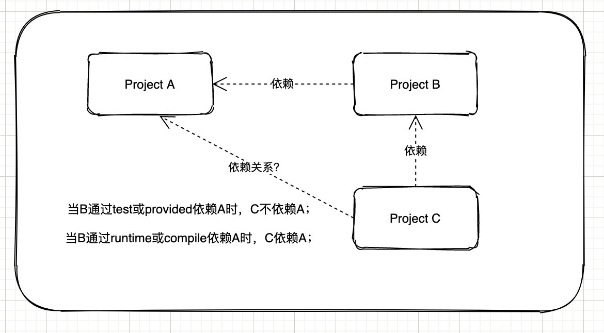

# Maven中optional和scope元素的使用

## optional元素

这里的optional元素设置为true表示何意？optional是Maven依赖jar时的一个选项，表示该依赖是可选的，项目之间依赖不传递。不设置optional（默认）或者optional是false，表示传递依赖。

## scope元素

scope元素主要用来控制依赖的使用范围，指定当前包的依赖范围和依赖的传递性，也就是哪些依赖在哪些classpath中可用。常见的可选值有：compile, provided, runtime, test, system等。

### compile（编译）
默认值。compile表示对应依赖会参与当前项目的编译、测试、运行等，是一个比较强的依赖。打包时通常会包含该依赖，部署时会打包到lib目录下。比如：spring-core这些核心的jar包。

### provided（已提供）
provided适合在编译和测试的环境，和compile功能相似，但provide仅在编译和测试阶段生效，provide不会被打包，也不具有传递性。

### runntime（运行时）
runntime仅仅适用于运行和测试环节，在编译环境下不会被使用。比如编译时只需要JDBC API的jar，而只有运行时才需要JDBC驱动实现。

### system
system范围依赖与provided类似，不过依赖项不会从maven仓库获取，而需要从本地文件系统提供。使用时，一定要配合systemPath属性。不推荐使用，尽量从Maven库中引用依赖。

### test（测试）
scope为test表示依赖项目仅参与测试环节，在编译、运行、打包时不会使用。最常见的使用就是单元测试类了：

### scope依赖的传递性

其中B依赖A，C依赖B，传递性的关键是B依赖A时所设置的scope值，当B采用不同的值时对应的依赖关系如下：当B通过test或provided依赖A时，C不依赖A；当B通过runtime或compile依赖A时，C依赖A；

上面讲解scope的不同参数值，针对这些参数值，在多个项目中的依赖传递性如下：

[Maven中optional和scope元素的使用，你弄明白了？](https://cloud.tencent.com/developer/article/1756145)

[Maven optional关键字透彻图解](https://juejin.cn/post/6844903987322290189)

