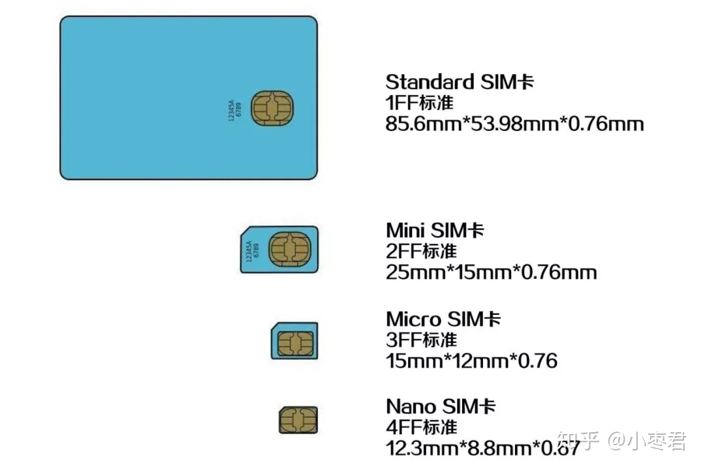

# SIM卡的PIN码和PUK码

- [常见名词](#常见名词)
- [SIM介绍](#SIM介绍)
- [SIM卡四种类型的密码](#SIM卡四种类型的密码)
- [SIM卡大小分类](#SIM卡大小分类)
- [虚拟SIM技术](#虚拟SIM技术)
- [USIM卡](#USIM卡)
- [RUIM卡](#RUIM卡)
- [UIM卡](#UIM卡)

---------------------------------------------------------------------------------------------------------------------
## 常见名词

SIM（Subscriber Identity Module）：GSM网络
UIM（User Identify Module）：CDMA网络
USIM卡（英语：UMTS Subscriber Identity Module），是用于UMTS网络中的用户身份识别模块。
RUIM卡（Removable User Identity Module）内含可移动用户识别模块(RUIM)

SIM大小分类：标准SIM卡、Mini SIM卡、Micro SIM卡、Nano SIM卡
SIM通信协议分类：SIM卡、UIM卡、USIM卡、RUIM卡
虚拟SIM技术：eSIM、softSIM和vSIM，都是虚拟SIM技术。

PIN (Personal Identification Number)：4位，身份认证
PUK (Personal Unblocking Key)：8位，解锁PIN码

PIN2码：主要用于计费等
PUK2码：该密码由运营商提供，可用于在PIN2码输错3次后解锁并重置PIN2码

OTA，也就是Over The Air，空中放号。

---------------------------------------------------------------------------------------------------------------------

## SIM介绍

用户身份模块（Subscriber Identity Module，SIM），通常称为“SIM卡”或“电话卡”，是主要用于存储用户身份识别数据、短信数据和电话号码的智能卡。

SIM卡主要用于GSM网络和TD-SCDMA网络，但是兼容的模块也可以用于IDEN电话。有人把CDMA2000和cdmaOne的RUIM卡和UIM卡，也称作SIM卡，虽然两者作用类似，并遵守了一样的所有机械、电气标准和部分软件标准，但是上层应用并不一定兼容。

SIM由CPU、ROM、RAM、EEPROM和I/O电路组成。用户使用SIM时，实际上是手机向SIM卡发出命令，SIM卡应该根据标准规范来执行或者拒绝；SIM卡并不是单纯的信息存储器。

SIM( Subscriber Identity Module)卡是GSM系统的移动用户所持有的IC卡，称为用户识别卡。GSM系统通过SIM卡来识别GSM用户。同一张SIM卡可在不同的手机上使用。GSM手机只有插入SIM卡后，才能入网使用

SIM卡，通常简称SIM，全名是Subscriber Identity Module（用户识别模块），因为它一直以卡片形式存在，所以我们都习惯叫它SIM卡。

实际上，SIM卡是一个装有微处理器的芯片卡。  
嗯，没错，SIM卡里竟然有个CPU！  
除了CPU之外，SIM卡上面还有程序存储器ROM、工作存储器RAM、数据存储器EEPROM，以及串行通信单元。  
是不是觉得很耳熟？对，一台计算机就有CPU、ROM、RAM、I/O设备。所以说，一个SIM卡，基本上就是一个微型计算机了。  

---------------------------------------------------------------------------------------------------------------------
## SIM卡四种类型的密码

SIM卡内共有四种类型的密码：
- PIN码（Personal Identification Number，又称PIN1码）：该密码可由用户自行设置，可用于开机解锁等操作，如果输错3次，SIM卡会被锁住，此时需要使用PUK码解锁
- PUK码（Personal Unlock Key，又称PUK1码）：该密码由运营商提供，可用于在PIN码输错3次后解锁并重置PIN码，如果输错超过10次，SIM将无法继续使用，此时需要向运营商申请换卡
- PIN2码：主要用于计费等，如果输错3次，SIM卡会被锁住，此时需要使用PUK2码解锁
- PUK2码：该密码由运营商提供，可用于在PIN2码输错3次后解锁并重置PIN2码，如果输错超过10次，SIM将无法继续使用，此时需要向运营商申请换卡

PIN是指SIM卡的密码，为4位，存在SIM卡中。激活PIN码后，每次开机要输入PIN码才能登入网络，绝大部分手机PIN的出厂值为0000。  
PUK码是用来解PIN码的万能钥匙，8位长，用户不知道，只有到营业厅由营业员操作。  
当PIN码输错3次后，SIM卡会自动上锁。此时只有通过输入PUK码才能解锁，共有10次机会输入，超过10次后，SIM卡会自动启动自毁程序，使SIM卡失效，此时，只有重新到营业厅换卡。  
在使用手机的过程中，用户切莫自行输入PIN码、PUK码，以确保您手机的安全使用和保密性。

PIN (Personal Identification Number)代码旨在保护您的 SIM 卡免遭未经授权的使用。我们为每张 SIM 卡设置了默认 PIN 码 1234。我们建议您更改它。任何人都无法找到更改后的 PIN，因为您将其直接输入到电话中。

PUK (Personal Unblocking Key) 码是由 8 位数字组成的代码。当您输入 3 次错误的 PIN 码时，它用于解锁您的 SIM 卡。被PUK码屏蔽的卡无法解锁；它不能再使用了，您必须更换它。

PUK其实就是PIN解锁码（Personal ldentification NumberUnlock Key）的缩写，它的主要功能就是当SIM卡输入错误的PIN码，导致手机被锁住时用来解锁的码。 [1]
一般来说，PIN码只要连续3次输入错误，手机便会被暂时锁住而无法使用。此时，只要尽快和手机号码所属的系统业者联络，通过身份查验的认证程序后，对方就会给你一组PUK码，只要依据指示就能解锁。

PUK（PUK1）码全称PIN Unlocking Key，是PIN码（PIN1）的解锁码，PUK码（PUK1）由8位数字组成，这是用户无法更改的。当手机PIN码被锁，并提示输入PUK码时，千万不要随意操作，因为PUK码只有10次输入机会，10次都输入错误，SIM卡将会被永久锁死，也就是报废。

所有的移动用户SIM卡密码分为PIN码、PIN2码，PUK码和PUK2码共四种，这四种密码的初始码都是由提供SIM卡的运营商提供的，四种密码的关系如下：

PIN码
PIN码（PIN1）就是SIM卡的个人识别密码。如果启用了开机PIN码，那么每次开机后就要输入4位数PIN码，PIN码是可以修改的，用来保护自己的SIM卡不被他人使用。

PUK码
PUK码（PUK1）由8位数字组成，这是用户无法更改的。当手机PIN码被锁，并提示输入PUK码时，千万不要轻举妄动，因为PUK码只有10次输入机会，10次都输错的话，SIM卡将会被永久锁死，也就是报废。

PIN2码
PIN2码是设定手机计费时使用的。如果输入三次错误，手机会需要用PUK2码解锁，过程与先前介绍的PIN码、PUK码相同。不过这两种密码与网络计费及SIM卡内部资料的修改有关，所以不会公开，而且即便PIN2密码锁死，也不会影响手机的正常使用。

PUK2码
PUK2码是用来进入SIM卡下从属功能（如通话计费功能）的解锁码，如果PIN2码三次输错，SIM卡将自动锁定该从属功能，PUK2码由网络运营商提供，由于网络暂不支持故无PUK2码，即使锁了也不影响手机使用。
PIN2用来进入SIM卡下从属功能（如通话计费功能）的密码，如果PIN2码三次输错，SIM卡将自动锁定，必须输入PIN2码的解锁密码（PUK2）。

---------------------------------------------------------------------------------------------------------------------

## SIM卡大小分类

独立实体形态的SIM卡，一共有四个标准。

关于SIM卡的变化，大家其实都看得出来了，并不是什么技术演进，说白了，就是剪塑料（剪卡）。

---------------------------------------------------------------------------------------------------------------------
## 虚拟SIM技术

eSIM是指Embedded-SIM（嵌入式SIM卡），本质上还是一张SIM卡，只不过它变成了一颗SON-8的封装IC，直接嵌入到电路板上。

eSIM是可编程的，支持通过OTA（空中写卡）对SIM卡进行远程配置，实现运营商配置文件的下载、安装、激活、去激活及删除。

前面提到，是GSMA发布了eSIM的规范。而GSMA（GSM协会）是一个代表全球移动运营商利益的组织，按理来说应该抵制才对，为什么会推动eSIM呢？

因为运营商们根本不是为了手机才推进eSIM的。他们关注的重点，是物联网。

如果说eSIM至少还算是一个硬件，那么，softSIM和vSIM干脆一不做二不休，彻底消灭了硬件。

例如SoftSIM，依托操作系统软件实现SIM功能，没有实际的物理芯片存在，对基带进行修改后，基带重定向直接通过其它接口和操作系统层交互，而不再需要访问SIM硬件。（这应该是虚拟SIM的终极形态吧！）

虚拟SIM技术的未来

eSIM、softSIM和vSIM，都是虚拟SIM技术。

---------------------------------------------------------------------------------------------------------------------
## USIM卡

USIM卡（英语：UMTS Subscriber Identity Module），是用于UMTS网络中的用户身份识别模块。USIM卡还可以存储用户资料、电话号码、认证资料及为短信提供存储空间。

USIM卡通常被认为是SIM卡的升级，在LTE网络中必须使用USIM卡，同时USIM卡兼容2G、3G网络。

当用户需在外国使用漫游服务时，可以把原用的USIM卡插入对应该地制式，及兼容此USIM卡的手机以使用漫游服务。

为提供认证服务，USIM卡存储一组长期的加密钥匙K，与网络的认证中心（AuC）共享。USIM卡亦认证一串连续数字，这些数字不可超过一个范围，以避免被重放攻击。

---------------------------------------------------------------------------------------------------------------------
## RUIM卡

RUIM是应用在CDMA2000手机的一种智能卡，可插入对应的3G手机以使用移动电话服务。 RUIM卡可以储存使用者资料、电话号码、认证资料及为SMS提供储存空间。

RUIM卡的标准化工作由3GPP2（第三代伙伴计划2）负责进行。

---------------------------------------------------------------------------------------------------------------------
## UIM卡
UIM(User Identity Model)，是应用在cdmaOne手机的一种智能卡，可插入对应的2G手机以使用移动电话服务。 UIM卡可以储存使用者资料、电话号码、认证资料及为SMS提供储存空间。UIM卡的标准化工作由3GPP2（第三代伙伴计划2）负责进行。

在cdmaOne系统的原始设计中，用户识别资讯是直接存储在手机中的，并没有一个与手机可以分离的储存用户资讯的功能实体。虽然一些电信业者和制造商希望在cdmaOne系统中也能有一个与GSM系统中的SIM卡类似的设备以实现机卡分离，但这种思想一直没有成为主流思想。直到中国联通公司声明希望在cdmaOne手机上实现SIM卡的功能，才极大地加快了在cdmaOne系统中实施UIM卡的进程。

[How to find the PIN and PUK code?](https://www.vodafone.cz/pece/en/my-number/pin-and-puk/pin-and-puk-codes/)  
[PUK码](https://baike.baidu.com/item/PUK%E7%A0%81/2051029)  
[SIM卡](https://zh.wikipedia.org/wiki/SIM%E5%8D%A1)  
[SIM卡](https://baike.baidu.com/item/SIM%E5%8D%A1/449605)  
[关于SIM和eSIM，看这一篇就够啦！](https://zhuanlan.zhihu.com/p/47999705)  
[USIM卡](https://zh.wikipedia.org/wiki/USIM)  
[RUIM卡](https://zh.wikipedia.org/wiki/RUIM)  
[UIM卡](https://zh.wikipedia.org/wiki/UIM)  

