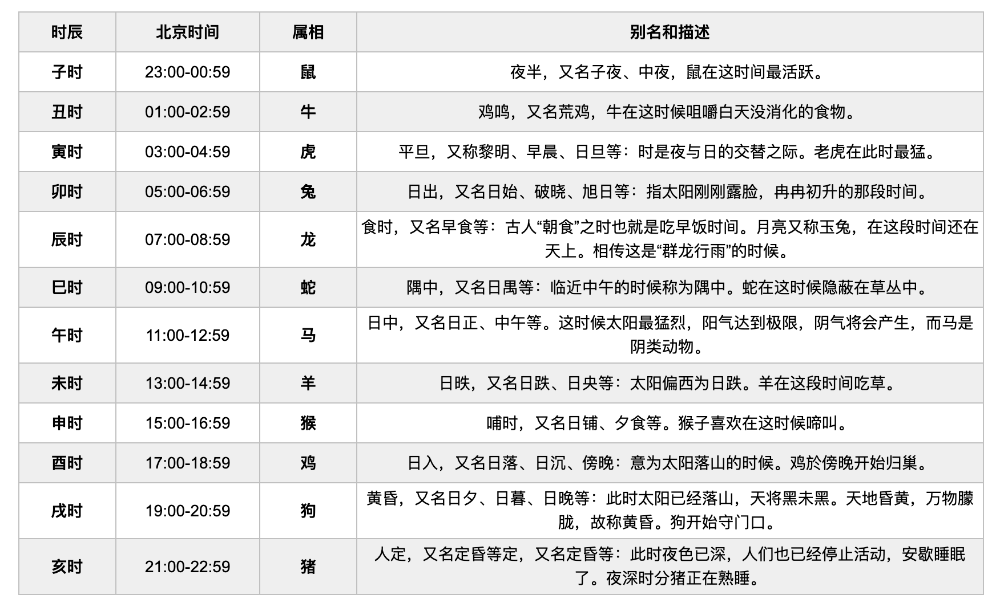
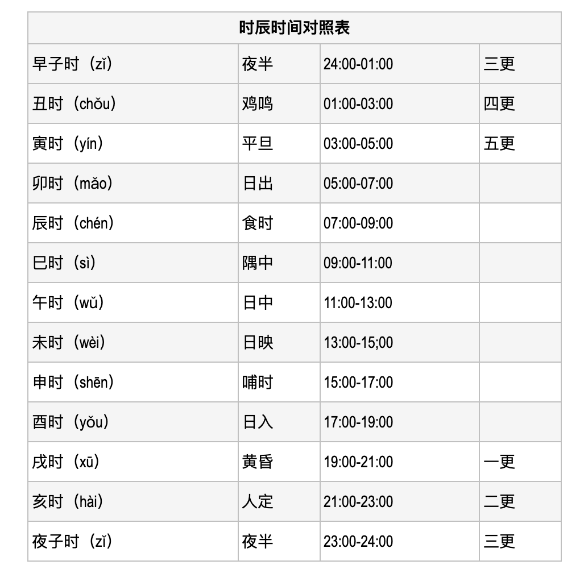

# 常识名词

---------------------------------------------------------------------------------------------------------------------

## “鲸落”（Whale Fall）

生当似鹏起，终当如鲸落

一鲸现，穹宇惊。

一鲸鸣，沧海静。

一鲸落，万物生。

“鲸落”（Whale Fall）

世上有没有一种死法，如此温柔？据说，鲸是可以预知自己死亡的。预感生命将尽时，它便孤独离去，下沉，下沉……而后，安静如水，来者不拒，任由自身被汲取享用。

生于海，逝于海，接着，归于海，反哺海。这一切在深海之境悄然上演。

世上有没有一种死法，如此慷慨？它的死，竟不是生的终结，而是喧闹的开始。

人间最美，不过鲸落，一念山河成，一念百草生。

[摘 刘诗瑶《一鲸落万物生》](https://zhuanlan.zhihu.com/p/337630550)

---------------------------------------------------------------------------------------------------------------------

## Hackathon

先说一下什么是Hackathon吧，这个词其实是由hacker和marathon 两个词合成的。

hacker就是黑客，这个我留到下面谈兴起的时候再讲。
marathon就是马拉松，

那Hackathon顾名思义，其实就是黑客的马拉松或者编程马拉松——以电脑为跑道、以编程为体力的一场技术比赛。跟马拉松的精神很类似，黑客马拉松可以让很多不认识的人在一个特定的时间内相聚在一起，以他们想要的方式，去做他们想做的事情。

[Hackathon的具体流程是什么？](https://www.zhihu.com/question/24672631)  
[Hackathon 参赛指南——如何愉快地参加一场 Hackathon](https://segmentfault.com/a/1190000014998482)

---------------------------------------------------------------------------------------------------------------------

## 极客Geek

极客，又译为技客、奇客，是英文单词geek的音译兼义译。原本的俚语是指反常的人。

这个词在“美国俚语”中意指智力超群，善于钻研但不爱社交的学者或知识分子，含有贬义，因为极客经常钻研于自己感兴趣的领域，可以牺牲个人卫生，社交技巧或社会地位（但并不是所有的geek都会这么做）。但近年来，随着互联网文化兴起，其贬义的成分正慢慢减少。

但这个词仍保留拥有超群的智力和努力的本意，又通常被用于形容对计算机和网络技术有狂热兴趣并投入大量时间钻研的人。所以俗称发烧友或怪杰。如电脑怪杰（Computer Geek），技术/科技怪杰（Techno-geek），玩家怪杰（gamer geek）等。

好奇与行动，或者说是好奇之心与改变之力，但这两者必须建立在能力的基础上。其实我们更应追寻的是这背后的人文关怀和精神。这个精神是让极客不再是最初的“怪客群体”，而成为世界的改变者和引领者的关键动力。

而在中国，这种“极客精神”是否拥有足够多的人群在践行和传承，则更是一个意义深远的话题，需要意识到这背后首先需要一种文化来支撑，也需要一个更庞大的“基数”来孕育。

极客文化，是一种起源于美国的新的反主流文化。极客一词，来自于美国俚语“Geek”的音译，一般理解为性格古怪的人。极客文化以令人惊异的产品及电影、音乐和游戏引 领潮流时尚。

[极客](https://zh.wikipedia.org/wiki/%E6%9E%81%E5%AE%A2)  
[极客精神本质内容是什么？](https://www.zhihu.com/question/20311673)  
[极客文化](https://baike.baidu.com/item/%E6%9E%81%E5%AE%A2%E6%96%87%E5%8C%96/3315040)  
  

---------------------------------------------------------------------------------------------------------------------

## 发烧友

发烧友、狂热入迷者（英语：fanatic）、狂热爱好者

爱好者（英语：enthusiast）或粉丝（英语：fans），有时又叫发烧友、狂热入迷者（英语：fanatic）、狂热爱好者、迷（英语：aficionado）、拥趸，是指对于各类组织、人物、产品、艺术品、信念或流行趋势抱有极度、无法抑制的喜爱与支持的人。

[爱好者](https://zh.wikipedia.org/wiki/%E7%88%B1%E5%A5%BD%E8%80%85)

---------------------------------------------------------------------------------------------------------------------
## 出了五服不是亲戚

本宗九族

中国人常说的“亲戚没出五福”是什么意思，是哪五福？

老人常说“出了五服不是亲戚”，五服指的是什么？

直系亲属中的五服是指高祖父，曾祖父，祖父，父亲，自身五代。

出五服的意思是：亲属关系超过五代，不再为之服丧，叫做出服，也叫出五服，在婚嫁中出五服即可通婚，现代人多认为五服是五代，这种说法是错误的。五代算一服，出五服要二十五代。

本宗九族
五服，是由父系家族组成的中国古代社会，以父宗为重。其亲属范围包括自高祖以下的男系后裔及其配偶，即自高祖至玄孙的九个世代，通常称为本宗九族。

五服也指代五辈人，比如在山东胶东半岛一带，有“五服之内为亲”的说法，就是利用上面那句话，往上推五代，从高祖开始，高祖、曾祖、祖父、父、自己，凡是血缘关系在这五代之内的都是亲戚，即同出一个高祖的人都是亲戚，从高祖到自己是五代，就成为五服。

老百姓说的家族五福准确的说法是“脱五服”、“出五服”。五服：原是指古人出丧时穿戴的五种孝服。后用来表示家族宗亲世代，谓高祖﹑曾祖﹑祖父﹑父亲﹑自身五代。

凡是血缘关系在这五代之内的都是亲戚，即同出一个高祖的人都是亲戚。从高祖到自己是五代，就成为五服。五服之后，则称谓“出五服”，就没有了亲缘关系，就可以通婚。一般情况下，家里有婚丧嫁娶之事，都是五服之内的人参加。

五服是指以自己为中心,向上推五代,向下推五代.上推高祖、曾祖、祖父、父辈、自己,这算“五服”;下推五代是即自己、儿子、孙子、曾孙、玄孙,即自高祖至玄孙的九个世代,通常称为本宗九族.

几乎大部分的人都知道“五福临门”这个成语，可是很少人知道“五福”所指的是那五种福。至于五福临门的原理，明白的人就少之又少了。   
到底什么是五福呢？  
第一福是“长寿”、第二福是“富贵”、第三福是“康宁”、第四福是“好德”、第五福是“善终”。

注：《书经》上所记载的五福是：一曰寿、二曰富、三曰康宁、四曰攸好德，五曰考终命。

长寿是命不夭折而且福寿绵长 富贵是钱财富足而且地位尊贵 康宁是身体健康而且心灵安宁 好德是生性仁善而且宽厚宁静 善终是能预先知道自己的死期。临命终时，没有遭到横祸，身体没有病痛，心里没有挂碍和烦恼，安详而且自在地离开人间。

[亲戚关系中「出五服」具体指的是哪些人？](https://www.zhihu.com/question/20368861)

---------------------------------------------------------------------------------------------------------------------

## 良药苦口利于病，忠言逆耳利于行

“良药苦口利于病，忠言逆耳利于行”，是一个汉语成语，意思是形容应该虚心接受别人的意见和批评或教育人们要勇于接受批评。良药多数是带苦味的，却有利于治病；而教人从善的语言多数是不太动听的，但有利于人们改正缺点。这句贤文是在教育人们要勇于接受批评，常用来说明应该正确地对待别人的意见和批评。

良药苦口利于病，忠言逆耳利于行  
Good medicine is bitter in the mouth but beneficial to the disease；while good advice goes against the ear but helps to act.

出处

“良药苦口利于病，忠言逆耳利于行”。出自《史记·留侯世家》 [1]  沛公刘邦十万义军攻破峣关，在蓝田大败秦朝关中守军，领先天下义军，顺利地进入咸阳。进入秦朝的咸阳宫后，沛公刘邦被宫中的美色珍玩吸引，忘乎所以，准备留在秦宫里玩个尽兴不出来了。他的连襟兄弟樊哙劝他他也听不进去。这个时候，张良入宫直谏，很严厉地数落了刘邦一顿，说明了他这样做的错误，并且说了这么一句：“忠言逆耳利于行，毒药苦口利于病，请沛公听樊哙言。”沛公这才依依不舍地离开了秦宫，宣布军队开出城市，到咸阳郊外的霸上乖乖驻扎，不许扰民。

《孔子家语·六本》：“良药苦口利于病，忠言逆耳利于行”。  
药虽然是苦的，但有利于疾病的治疗。忠实的劝告往往都是不喜欢听的，但对行动有好处。

---------------------------------------------------------------------------------------------------------------------

## 三皇五帝

常言说:自从盘古开天地，三皇五帝到如今。

三皇：天皇、地皇、人皇（出自《史记·秦始皇本纪》。还有其他的说法等）

传说中的五帝：黄帝、颛顼（zhuan一声 xu四声）帝喾（ku四声）尧、舜

三皇也是说天皇，地皇，人皇

天皇原始天尊，地皇地藏皇，人皇斩辕皇帝，五帝灶君，就是同一时代分工管辖  
天皇最大，管辖三界，而地藏皇管则管鬼界，如妖魔鬼人死后经六度地回再判投生，而人皇就是人类皇帝，

而五帝就是管辖人的生活，食，穿，住的问题，就是同一时代分工管理，等于现在国家的中央，省，县，公安局，粮食局分工管理的意思。

而三皇五帝时化就是沒有历史记截，到了尧舜禹时代才有历史文代记截，尧舜禹时代之前就是人们称为三皇五帝时代。

---------------------------------------------------------------------------------------------------------------------

## 二五仔

二五仔（ji ng zai），广东话、粤语

指告密者、叛徒、出卖组织的内奸和专门在人后说是非的人。

二五仔，是粤语俚语，即告密者或者出卖其他人者的俗称。粤语俚语，同反骨仔、鬼头仔及叛徒等。

「二五仔」是粤语里的一个市井俗语，跟它意思相近的一个词叫「反骨仔」，也就是对「叛徒」的鄙称。

- 粤语俚语，即[告密者](https://zh.wikipedia.org/wiki/告密者)或者[出卖](https://zh.wikipedia.org/w/index.php?title=出賣&action=edit&redlink=1)其他人者的俗称。
- 粤语俚语，同[反骨仔](https://zh.wikipedia.org/w/index.php?title=反骨仔&action=edit&redlink=1)、[鬼头仔](https://zh.wikipedia.org/wiki/鬼頭仔)及[叛徒](https://zh.wikipedia.org/wiki/叛徒)等。

点造句：

佢个二五仔，之前应承同我做野，宜家又去咗帮其他人。（他这个叛徒，之前答应了帮我做事，现在又去帮别人。）

你千祈唔好做二五仔，做人最紧要脚踏实地。（你千万不要当叛徒，做人最重要的是脚踏实地。）

来源说法有两种：

- 其一说是在东周春秋时期，晋国人称呼梁五和东关嬖五为二五耦，二人为骊姬谋害太子申生，因此二五就成为了奸佞、背叛者的简称，后世二五仔的说法应源于此。
- 另一说是原是中国清代秘密会社的切口，二五仔即“义忤仔”，意指告密者、叛徒、出卖组织的内奸和专门在人后说是非的人。

民间关于“二五仔”的来源说法不一，其中有一种说法是：清朝康、雍年间，朝廷要消灭反清复明的秘密会社，查得少林寺与天地会有千丝万缕的关系，派兵前往剿灭。但需要有少林寺内奸里应，于是收买了武功排名第七的少林俗家弟子马宁儿，马宁儿成为了少林寺的叛徒。秘密会社中人不齿其所为，日后便称那些告密者、叛徒为“二五仔”。

也有人认为，二，即“贰”，是“有异心”（异、二粤语读音相同）的意思；五，即“忤”，“忤逆”之意。

---------------------------------------------------------------------------------------------------------------------

## 天干地支

**天干**，是中国古代的一种文字计序符号，共10个字: 甲、乙、丙、丁、戊、己、庚、辛、壬、癸，循环使用。

中国等汉字文化圈国家古代常以之来命名、排序、纪时。

**地支**，是指木星轨道被分成的十二个部分，记为子、丑、寅、卯、辰、巳、午、未、申、酉、戌、亥。木星的公转周期大约为十二年，所以中国古代用木星来纪年，故而称为“岁星”。后来又将这十二个部分命名，这就是“地支”。

[天干 wiki](https://zh.wikipedia.org/wiki/%E5%A4%A9%E5%B9%B2)

[地支 wiki](https://zh.wikipedia.org/wiki/%E5%9C%B0%E6%94%AF)

## 干支纪年法

- 干支纪年
- 干支纪月
- 干支纪日
- 干支纪时

干支是天干与地支的合称，由两者经一定的组合方式搭配成六十对，为一个周期，循环往复，称为六十甲子或六十花甲。

古代中国用以记录年、月、日、时。日本、朝鲜、越南、琉球等汉字文化圈地区也曾跟随古代中国，使用干支来记录时间。

用干支纪年法纪年时一个周期为六十年，所以也用“甲子之年”或“花甲之年”来形容60岁的老年人。

### 六十甲子

还历、还甲、回甲、花甲等，指人的年龄满六十虚岁，也说六十甲子。

汉民族及周边许多民族受到此文化的影响，在计算年龄时，都以天干地支的顺序来表示。一个循环从甲子开始，接着是乙丑、丙寅……依序共有六十个组合，因此，干支每六十年就会循环一次，即一个人到60岁（出生时1虚岁）时，就逢一甲子，又称一轮，正是新一轮重新算起的时候，故称“还历”、“还甲”、“回甲”，又名“花甲”，与天干地支有关。

传统上，满一甲子会有一定的庆祝仪式。

[干支 wiki](https://zh.wikipedia.org/wiki/%E5%B9%B2%E6%94%AF)

## 生辰八字

八字源自古代的中国，是一种利用天干和地支来准确记录年、月、日、时的方式，由“年干，年支”、“月干，月支”、“日干，日支”、“时干，时支”，共八个干支所组成（共八个字），年、月、日、时的干支组合称为“柱”，形成“年柱”、“月柱”、“日柱”、“时柱”，故八字又称为“四柱”或“四柱八字”。

## 十二时辰

古人把一昼夜划分成十二个时段，每一个时段叫一个时辰。十二时辰既可以指一天，也可以指任何一个时辰。十二时辰是古人根据一日间太阳出没的自然规律、天色的变化以及自己日常的生产活动、生活习惯而归纳总结、独创于世的。

十二时辰，十二时辰与二十四小时对照表。昼夜分为十二个时辰：子(zǐ)、丑(chǒu)、寅(yín)、卯(mǎo)、辰(chén)、巳(sì)、午(wǔ)、未(wèi)、申(shēn)、酉(yǒu)、戌(xū)、亥(hài)。每个时辰相当于现在的两个小时。

古代将一昼夜分为十二时辰，即：子、丑、寅、卯、辰、巳、午、未、申、酉、戌、亥。每一时辰相当于现代的两个小时。古人根据中国十二生肖中的动物的出没时间来命名各个时辰。

看过武侠小说的人，肯定知道一炷香，一盏茶，一弹指，一刹那等说法，那么一炷香的时间是多久？一盏茶是多长时间？一弹指，一刹那究竟多么短暂？

一日有十二辰（一时辰合现代2小时），一时辰有八刻（一刻合现代15分钟），一刻有三盏茶（一盏茶合现代5分钟），一盏茶有两炷香（一炷香合现代2分30秒），一炷香有五分（一分合现代30秒），一分有六弹指（一弹指合现代5秒），一弹指有十刹那（一刹那合现代0.5秒）。

佛说：一弹指等于六十刹那，一刹那有九百生灭。 1、“一刹那”： 按古代印度《僧只律》(又有资料是《倡只律》) 解释：一刹那即为一念，二十念为一瞬。二十瞬为一弹指，二十弹指为一罗预。二十罗预为一须叟，一日一昼为三十须叟。照此计算：一须叟为48分钟，一罗预为114秒。一弹指为7.2秒，一瞬为0.36秒，一刹那为0.018秒。 一眨眼等于二十四刹那。

十二时辰：
子时23～1点，
丑时1～3点，
寅时3～5点，
卯时5～7点，
辰时7～9点，
巳时9～11点，
午时11～13点，
未时13～15点，
申时15～17点，
酉时17～19点，
戌时19～21点，
亥时21～23点。

### 十二时辰和二十四小时对照表

### 十二个时辰的部分别称汇总

1. 夜半 【yè bàn】：子夜　夜分　中夜　未旦　宵分
2. 鸡鸣 【jī míng】：荒鸡
3. 平旦 【píng dàn】：平明　旦明　黎明　早旦　日旦　昧旦　早晨　早夜　早朝　昧爽　旦日　旦时
4. 日出 【rì chū】：日上　日生　日始　日晞　旭日　破晓
5. 食时 【shí shí】：早食　宴食　蚤食
6. 隅中 【yú zhōng】：日禺　禺中　日禺
7. 日中 【rì zhōng】：日正　日午　日高　正午　亭午　日当午
8. 日昳 【rì dié】：日昃　日仄　日侧　日跌　日斜
9. 晡时 【bū shí】：馎时　日馎　日稷　夕食
10. 日入 【rì rù】：日没　日沉　日西　日落　日逝　日晏　日旴　日晦　傍晚
11. 黄昏 【húang hūn】：日夕　日末　日暮　日晚　日闇　日堕　日曛　曛黄
12. 人定 【rén dìng】：定昏　夤夜

### 十二时辰和十二生肖的关联

表示十二时辰的十二个字与十二生肖相结合，便有了：子鼠、丑牛、寅虎、卯兔、辰龙、巳蛇、午马、未羊、申猴、酉鸡、戌狗、亥猪。

### 表示时间的“更”、“鼓”、“刻”的区分

古人说时间，白天与黑夜各不相同，白天说“钟”，黑夜说“更”或“鼓”。又有“晨钟暮鼓”之说，古时城镇多设钟鼓楼，晨起（辰时，今之七点）撞钟报时，所以白天说“几点钟”；暮起（酉时，今之十九点）鼓报时，故夜晚又说是几鼓天。夜晚说时间又有用“更”的，这是由于巡夜人，边巡行边打击梆子，以点数报时。一声声的报时提醒着人们一去不回的时间，要珍惜当下不负光阴。

全夜分五个更（此处“更”在方言中读“jīng”，汉语规范化后读“gēng”），第三更是子时，所以又有“三更半夜”之说。出处：《宋史·赵昌言传》：“四人者（陈象舆、胡旦、董俨、梁灝）日夕会昌言第。京师为之语曰：‘陈三更，董半夜’。”

戌时（xū）	黄昏	19:00-21:00	一更
亥时（hài）	人定	21:00-23:00	二更
夜子时（zǐ）	夜半	23:00-24:00	三更
早子时（zǐ）	夜半	24:00-01:00	三更
丑时（chǒu）	鸡鸣	01:00-03:00	四更
寅时（yín）	平旦	03:00-05:00	五更

刻———古代用漏壶计时。漏壶分播水壶和受水壶两部。播水壶分二至四层，均有小孔，可滴水，最后流入受水壶，受水壶里有立箭，箭上刻分100刻，箭随蓄水逐渐上升，露出刻数，以显示时间。而一昼夜24小时为100刻，即相当于现在的1440分钟。可见每刻相当于现在的14.4分钟。所以“午时三刻”相当于现在的中午11时 43.2分

旧小说有“午时三刻开斩”之说，意即，在午时三刻钟（差十五分钟到正午）时开刀问斩，此时阳气最盛，阴气即时消散，此罪大恶极之犯，应该“连鬼都不得做”，以示严惩。阴阳家说的阳气最盛，与现代天文学的说法不同，并非是正午最盛，而是在午时三刻。古代行斩刑是分时辰开斩的，亦即是斩刑有轻重。一般斩刑是正午开刀，让其有鬼做；重犯或十恶不赦之犯，必选午时三刻开刀，不让其做鬼。皇城的午门阳气也最盛，不计时间，所以皇帝令推出午门斩首者，也无鬼做。

[十二时辰介绍](http://114.xixik.com/12shichen/)
[十二时辰导读](http://114.xixik.com/shichen)

---------------------------------------------------------------------------------------------------------------------

较真你就输了
On the Internet, nobody knows you're a dog
键盘侠，真没必要
键盘侠数量多不多，多（因为人口基数大）
键盘侠比例大不大，肯定不大
为什么感觉比例大，因为键盘侠发声比较多，正常人谁那么多时间扯这个
你越较真，键盘侠就越有力量

“在互联网上，没人知道你是一条狗”（英语：On the Internet, nobody knows you're a dog）是一句互联网上的常用语，因为《纽约客》1993年7月5日刊登的一则由彼得·施泰纳（Peter Steiner）创作的漫画标题而变得流行。这则漫画中有两条狗：一条坐在计算机前的一张椅子上，与坐在地板上的另一条狗说出了漫画的标题：“在互联网上，没人知道你是一条狗”。时至2000年，这一漫画是《纽约客》中被重印最多的一则漫画，施泰纳因为此漫画的重印而赚取了超过50,000美元。

小孩没娘，说来话长

幼儿园从外面看里面，养老院是里面看外面，还都是同一波人【小孩开学家长在围栏外观看场景】

如有雷同，纯属意外！！！：刘备用兵如神！！！关羽谦虚谨慎！！！张飞爱兵如子！！！【反讽刘关张的】

酒过三巡是一个汉语词汇，拼音：jiǔ guò sān xún 释义：三并不是指具体的三杯或者三轮。而是指时间长数量多的意思。酒过三巡是指酒已经喝了有一段时间，喝了不少酒了。

有句话叫“酒过三巡，菜过五味”，就是指跟同桌的人喝过三轮(每个人都喝过三杯)，菜色也上了五道之后。这是指饭局已到了尾声的意义。

四海之内皆兄弟

“仗义每多屠狗辈，负心多是读书人”。这是明代诗人曹学佺的著名对联，意思是说，讲义气的多半是从事卑贱职业的普通民众，而有知识的人却往往做出违背良心、背弃情义的事情。

屠龙的勇士终将成为龙？

嫁错老公毁一生，娶错老婆灭三代

宁与智者争高下，不与傻瓜论短长，如一你果定要与傻瓜论长短，这不是傻瓜的问题，是自己的问题

领导开门你上车，领导夹菜你转桌

过了星期二不愁星期三
过了星期三等于翻过一座山[偷笑]
过了星期三，一天快一天。
过了星期三，翻过一座山，
过了星期四，基本没大事，
过了星期五，还有一上午。
到了礼拜五还有一上午[破涕为笑]

不吐槽也不毒舌，安静的看看电影，品品生活

健身教练的目的很单纯，就是想骗你钱，也有不单纯的（还想要色的）
销售的目的很单纯，就是想骗你钱，也有不单纯的（还想要色的）

科技中立
Open source is dead. Long live open source!

向技术致敬，向开源致敬，向理想主义致敬。

技术无罪，开源不死

开源不死，江湖再见

好人一生平安

不怕贼偷，就怕贼惦记

NGO：非政府组织（英语：non-governmental organization，缩写：NGO， 法语：organisation non gouvernementale，缩写：ONG）是一类不属于任何政府、不由任何国家建立的组织，通常独立于国家政府。虽然从定义上包含以营利为目的的企业，但该名词一般仅限于非商业化、合法的、与社会文化和环境相关的倡导群体。非政府组织通常是非营利组织，他们的基金至少有一部分来源于私人捐款。 由于各国文化、法律等的差异，不同国家对这个概念的指称所适用的对象范围也各不相同。美国一般称之为“非营利组织”、“独立组织”或“第三部门”（The Third Sector），英国称之为“志愿组织”（voluntary organization），还有许多国家则用“社团”称之[1]。因为“非政府组织”的名称可以涵盖一切非政府的组织而存在被滥用的问题，一些非政府组织倾向于使用“民间志愿组织”（private voluntary organization，PVO）的名称。

KOL：关键意见领袖（Key Opinion Leader,简称KOL）是营销学上的概念，通常被定义为：拥有更多、更准确的产品信息，且为相关群体所接受或信任，并对该群体的购买行为有较大影响力的人。

Talk is cheap, Show me the code.
能说算不上什么，有本事就把你的代码给我看看。

赢了天上人间，输了北极海狼

拳打南山幼儿园，脚踢北海养老院

跟人沾边的事情你是一点不干

春风刮驴耳
石狮子灌米汤
长虫钻竹筒
锅里妙石头
好药难治冤孽病，好话难劝糊涂虫
伶俐人一拨三转，糊涂人棒打不回。

大约在几个小时以后，这个浑身散发着土豪气息得男人再次艾特了我，真是运气来了挡都挡不住啊，小编顿时想起来8年前扶过一个老爷爷过马路，那个老爷爷当时帮我摸了一下手相，说我8年后会有一笔横财，难道指的是这个？

遇事不决，量子力学

风格跳跃，虚拟世界

解释不通，穿越时空/平行时空

不懂配色，赛博朋克

脑洞不够，平行宇宙

画面老土，追求复古

不清不楚，致敬克苏鲁

这充分说明两件事，

一，天下苦（乐？）脑残网文沙雕剧情久矣，以至于连这种调侃都能流行

二，为了押韵什么都写得出来

[如何看待「遇事不决，量子力学」的现象？](https://www.zhihu.com/question/308988154)

---------------------------------------------------------------------------------------------------------------------