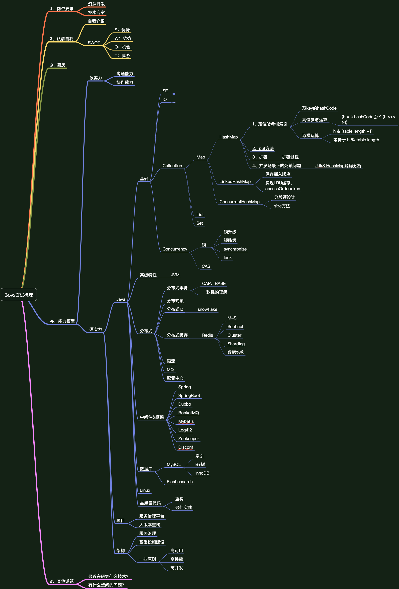

  
  
  
---------------------------------------------------------------------------------------------------------------------  
  
简历：SMART原则  
  
  
1、同盾科技面试  
2、公司面试总结  
3、招聘要求  
4、公司面试注意事项  
5、别人的面试经历1  
6、  

7、  
8、  
9、  
10、  
11、  
12、  
13、  
14、  
15、  
16、  
17、  
18、  
19、  
20、  
21、  
22、  
23、  
24、  
25、  
26、  
27、  
28、  
29、  
30、  
  
  
---------------------------------------------------------------------------------------------------------------------  
  
面试问题：  
  
netty小对象、大对象的管理  
jvm在操作系统层面的内存  
AQS的  
Zookeeper怎么保障全部通知到【定时更新】  
查找数组中重复出现次数最多的数字  
rocketmq扩容怎么保证顺序消息  
Redis的五种数据类型的实现是什么数据结构

  
---------------------------------------------------------------------------------------------------------------------  
公司面试注意事项：  
  
  
项目中遇到的技术难点：  
并发，稳定性，容错，性能等方面入手。  
内存泄漏  
  
  
  
面试经验：  
https://mp.weixin.qq.com/s/oQdmQpO4XXFaJbfjt8GvXQ?utm_medium=hao.caibaojian.com&utm_source=hao.caibaojian.com  
刷题：LeetCode+《剑指offer》  
基础知识  
简历：SMART原则  
英语  
锻炼  
面试  
  
  
消息的功能，为什么这么做，那几个接口  
怎么适配的：  
kafka的实现原理：怎么存储，怎么通信  
零拷贝，java怎么使用  
hashmap的实现原理：数据+链表，比如put操作：先定位数据位置，再比较链表中是否存在  
synchronized 和 volatile 区别  
  
  
先做个简单的自我介绍：  
主要是三个周期：  
第一个周期是14年7月到15年8月 南京亚信软件，  
第二段是15年8月到16年9月：南京快钱 平台的维护对接和需求开发  
第三段是16年9月到目前是南京亚信软件，  
  
  
  
为什么换工作到杭州  
快钱项目介绍  
目前的项目介绍  
  
 
  
  
  
  
---------------------------------------------------------------------------------------------------------------------  
同盾科技面试：  
  
为什么选择封装Acticemq和Rocketmq  
在什么情况下，选择Acticemq，什么情况下Rocketmq  
对比一下Acticemq和Rocketmq  
推荐给客户的时候，怎么推荐哪一个中间件，就是什么场景下使用哪个mq中间吗：并发、部署、运维、高可用  
  
kafka和rocketmq对比有什么区别  
语言、缓存批量发送-吞吐量和安全、存储时候文件的区别  
使用的注册中心和协调框架--zookeeper、nameSrv  
  
  
统一配置平台有几个服务：  
zookeeper通知、Redis缓存、HDFS和数据库存储，amber服务控制台  
  
如果Zookeeper主节点宕机，重新选主30S不可用，文件更新了，怎么实现实时通知  
客户端异常重试，重新多少次就打印日志  
  
使用消息通知，消息挂了怎么办，消息怎么判断客户端确实接收到了，通知的时候记录，然后消费端接收的时候，消费成功做反馈  
客户端如果宕机了，服务端怎么知道呢？  
  
实时感知，客户端和服务端之间做长连接，如果客户端有几千Client，配置中心只有几个服务，这个你怎么保证这么多连接可用  
  
  
常见的RPC框架指的是哪些，知道的开源的Rpc框架有哪些，dubbo有使用过吗？dubbo底层通讯序列化使用的是什么？负载均衡是在客户端还是服务端？  
  
netty：tcp拆包和粘包的原因是什么，netty有哪些方式？netty零拷贝指的是什么？那linux的用户态和内核态有什么区别？netty使用的是什么内存？（直接内存和堆外内存），内核态操作的是什么内存？堆内存和堆外内存怎么释放？通过操作系统的什么方法去写内存的？在java里面什么时候才会触发堆外内存回收，回答GC  
，手动释放，还有吗？如果我要实现内存池，采用什么方式？直接内存，怎么设计呢？unsafe方法有了解吗？CAS这个有了解吗？ABA问题怎么处理  
  
hashmap介绍，1.6和1.8有什么改进？hashmap扩容过程？concurrenthashmap在1.8有什么优化？lamdba表达式有什么优点，为什么使用这个？.stream是干嘛的？  
  
synch声明在静态块和普通方法有什么区别？java有几种锁？lock接口有几种锁？什么时候用读写锁？跟valitile有什么区别，用在什么场景？（其实是读多写少这种），什么时候valitile，什么时候用atom原子类型？一个变量为什么不用atom而是valitile？  
  
barracyle栅栏机制？  
  
java堆内存溢出怎么排查？什么情况下堆内存溢出？什么栈内存溢出？tlab就是内存逃逸分析？  
  
G1和cms对比，有什么优缺点？G1可以设置单个块最大的回收时间，真实有效吗？达到了这个时间会发生什么？  
  
springcloud是不是用过，springboot使用过吗？  
  
了解过微服务开发吗？答sprngcloud、servermesh，  
  
servermesh主流的技术是什么？istio的数据层面和控制面都是哪些组件？各是干什么的？  
sidecar和dubbo各有什么优势？sidecar和应用之间怎么通信？是怎么代理应用的？应用的请求sidecar怎么获取的？  
  
  
大数据有什么了解吗？没有，  
  
apigateway有接触吗？开源的接触过什么？跟后端是怎么通信的？（其实还是想问跟后端是rpc框架是什么）rpc通信是什么方式？都不用dubbo吗？那rpc都是用的什么？csf底层用的什么序列化（谷歌那个，td，protobuff），用什么通信？Zookeeper注册？，springcloud的api网关是哪个服务？还有其他的api网关？  
  
大数据不是做流计算  
  
  
  
  
---------------------------------------------------------------------------------------------------------------------  
  
别人的面试经历1  
  
 zookeeper的watcher乐观锁怎么实现   
 c. 说出一个空间换时间的场景   
  
G1和CMS的区别，G1有啥劣势；Kafka的整体架构；Netty的一次请求过程；自旋锁/偏向锁/轻量级锁（这个问题在头条的面试里也出现了一次）、hbase线上问题排查（刚好遇到过NUMA架构下的一个问题，借此把hbase的内核介绍了下）。  
  
求一棵树两个节点的最近的公共父节点。思路基本是对的，但是有些细节有问题，面试官人很好，边看边跟我讨论，我边改进，前前后后估计用来快半小时。然后又继续问问题，HTTP 301 302有啥区别？设计一个短链接算法；md5长度是多少？  
  
ThreadLocal如果引用一个static变量是不是线程安全的  
  
问了一些基础问题和netty的写流程，还问了一个redis数据结构的实现，结构他问了里面字符串是怎么实现的，有什么优势。一直感觉这个太简单，没好好看，只记得有标记长度，可以直接取。然后就来两道编程题。第一题是求一棵树所有左叶子节点的和，比较简单，一个深度优先就可以搞定。第二题是给定一个值K，一个数列，求数列中两个值a和b，使得a+b=k。我想到了一个使用数组下标的方法（感觉是在哪里有见过，不然估计是想不出来），这种可是达到O(n)的复杂度；他又加了个限制条件，不能使用更多内存，我想到了快排+遍历，他问有没有更优的，实在想不出来，他提了一个可以两端逼近，感觉很巧妙。  
  
先让我讲下kafka的结构，然后怎么防止订单重复提交，然后开始围绕缓存同步问题展开了长达半小时的讨论：先写数据库，再写缓存有什么问题？先写缓存再写数据库有什么问题？写库成功缓存更新失败怎么办？缓存更新成功写库失败怎么办？  
  
我提到了istio，介绍了设计理念，感觉他有点意外。然后他问java8的新特性，问我知不知道lambda表达式怎么来的，我从lambda演算说到lisp说到scala，感觉他更意外。  
几个netty的问题，gc的问题，  
  
第一部分就是日志上传和接收，然后就如何保证日志上传的幂等性开始不断深入，先让我设计一个方案，然后问有没有什么改进的，然后如何在保证幂等的前提下提高性能，中间穿插分布式锁、redis、mq、数据库锁等各种问题。  
  
结合秒杀的场景深入，如何实现分布式锁、如何保证幂等性、分布式事务的解决方案。问我分布式锁的缺点，我说性能会出现瓶颈，他问怎么解决，我想了比较久，他提示说发散下思维，我最后想了个简单的方案，直接不使用分布式锁，他好像挺满意。感觉他们更看重思考的过程，而不是具体方案。还问了一致性hash如何保证负载均衡，kafka和rocketmq各自的优缺点，dubbo的一个请求过程、序列化方式，序列化框架、PB的缺点、如何从数据库大批量导入数据到hbase。  
  
也是让我先介绍项目，问我有没有用过mq，如何保证消息幂等性。我就把kafka0.11版本的幂等性方案说了下，就没再问技术问题了  
  
  
  
---------------------------------------------------------------------------------------------------------------------  
公司面试总结：  
  
  
  
  
  
19年面试：  
1、19年5月14号 周二 面试 fit2cloud ，在南京刚刚起步，一个开发，两个销售，在南京建邺万达租的一个一室的房间，暂时不考虑  
2、京东数科，周三（5/15）14：00，后面确定电话面试，因为面试的回答不好，没有结果额  
3、途牛 中间件部门，微信视频面试两轮，最后还是说不合适  
4、杭州同盾，电话面试一轮，收获还是挺多的，后来又到面两轮，还是被刷了  
5、杭州呆萝卜，文滔推荐了两次，都简历不通过，要有电商业务经验的  
6、杭州滴滴，猴哥内退小橘业务部门，简历都没过  
7、在boss上投递了涂鸦，一直显示面试，都2个多星期了，都没有反应，pass  
  
  
海康  
二维火  
百世汇通  
jd  
  
  
  
---------------------------------------------------------------------------------------------------------------------  
招聘要求：  
  
java基础扎实：熟悉IO、多线程、集合操作等基础技能  
熟悉分布式、缓存、消息队列等中间件技术  
熟悉mysql数据库的基本操作  
  
熟悉常用设计模式  
熟悉并对javaEE、SOA、spring、osgi等技术潮流保持关注，  
有数据库、分布式、性能优化、高并发、高可用性系统设计开发经验  
有分布式系统开发经验，对消息服务、负载均衡、高可用机制等有深入理解;  
熟悉消息中间件，RPC框架，数据层，性能优化等相关技术经验者优先   
扎实的编程基础，精通java开发语言，熟悉jvm，web开发、缓存，分布式架构、消息中间件等核心技术；  
熟悉常用算法和数据结构，熟悉分布式系统原理  
负责分布式缓存、消息、rpc、链路跟踪等某个或某些中间件产品的设计与研发  
  
  
  
  
1、重点本科或以上学历（985/211），计算机软件或相关专业，英语CET4以上;  
2、精通java编程，熟悉java sdk提供的主要能力;  
3、理解java运行时工作原理，熟悉jvm性能调优，能够充分利用java特性支持框架与程序库的设计开发;  
4、熟悉多线程编程，熟练使用java并发包下的各项常用基础设施;  
5、熟悉网络编程，能够熟练使用java nio开发高并发、高吞吐量的服务;  
6、熟悉常用网络协议，如TCP/IP, HTTP;  
7、能够熟练使用linux，能够利用常用的工具对程序进行跟踪诊断;  
8、有分布式系统开发经验，对消息服务、负载均衡、高可用机制等有深入理解;  
9、具备良好学习、沟通能力及团队协作精神，对工作积极严谨，勇于承担压力。  
  
  
  
这里有世界一流的中间件产品和场景，包括应用托管容器、分布式调用服务、分布式消息服务、分布式数据服务和大数据计算平台等，掌控着超千亿规模的消息推送和分布式数据库调用，是全球流量最大的中间件集群之一  
这里有世界最大的电商交易业务场景，团队提供的高可用架构基础设施直面双11洪峰流量，包括容量规划、准入控制、限流降级、流量调度、弹性伸缩和全链路压测等，体系化支撑阿里巴巴电商链路的稳定运行  
这里有世界领先的企业互联网架构平台，以中间件技术部多款核心产品作为基础设施构建的云计算解决方案，面对互联网+的浪潮，帮助企业级客户轻松构建并托管分布式应用，解决集中化和互联网化的业务需求  
我们的使命：做分布式架构基础设施，建设支撑百万笔交易的分布式架构能力，建设支撑百万台服务器和超万个系统的服务能力  
我们的愿景：打造世界一流的中间件产品，打造世界一流的高可用架构基础设施，打造世界一流的企业级互联网架构平台  
全面参与阿里巴巴集团中间件（容器，服务框架、消息中间件、数据中间件等）的设计，核心代码开发，系统稳定性开发，性能优化等工作  
帮忙业务方解决技术难题，用技术推动业务发展  
岗位要求:  
1. 熟悉java concurrent包 ，熟悉高并发，分布式通信，存储等相关技术   
2. 3年以上相关工作经验   
3. 熟悉Linux操作系统、熟悉开源的中间件软件   
4. 熟悉消息中间件，RPC框架，数据层，性能优化等相关技术经验者优先   
5. 具有高并发相关工作经验优先  
6. 有很强的与客户沟通和理解能力，有良好的团队协作精神、环境适应能力和执行力，在较大压力下保持工作激情；  
  
  
职位描述：  
1. 负责阿里巴巴菜鸟基础技术组件和产品的研发和设计工作，有监控系统经验者优先。  
2. 从架构角度横向关注菜鸟业务系统，为菜鸟系统微服务化，云化，流程引擎自动化等共享技术方面做技术支撑。  
职位要求  
1. 计算机相关专业本科或以上学历，三年以上J2EE项目开发经验；  
2. 扎实的编程基础，精通java开发语言，熟悉jvm，web开发、缓存，分布式架构、消息中间件等核心技术；  
3. 精通Java EE相关的主流开源框架，能了解到它的原理和机制，如Spring、iBatis、struts等；  
4. 熟悉Oracle、MySql等数据库技术，对sql优化有一定的经验；  
5. 思路清晰，良好的沟通能力与技术学习能力；  
6. 有基础技术组件，分布式存储/计算相关经验者优先考虑。  
  
  
岗位描述:  
蚂蚁中间件团队是服务于整个蚂蚁金服集团（包括钱包、网商、小贷、芝麻、聚宝、国际、口碑等）的核心技术团队，致力于打造支撑每秒亿级金融交易规模的基础中间件平台，为高速发展的业务提供业界一流的，金融级高可用高性能的分布式基础服务，也将十年磨一剑的技术做产品化输出，为蚂蚁业务生态的合作伙伴提供技术赋能。期待您的加入，一起在蚂蚁这个极具挑战和丰富多彩的业务舞台上玩技术，支撑 DT 驱动的互联网金融生态！   
您将参与蚂蚁 Java 中间件（包括RPC通讯、消息队列、应用容器、开发框架、协调管控系统、数据中间件、搜索平台等）的高可用设计、核心编码、性能优化和产品化开发等工作。  
岗位要求:  
1.3年以上 JAVA 开发经验，有并发编程经验，熟悉文件I/O，网络 I/O 及类加载等机制细节；   
2.有大规模分布式系统或者类库的研发经验，熟悉开源中间件，深入了解实现机制；   
3.熟悉JVM基础知识，具有一定的调优经验和内存、线程相关问题排查经验；   
4.有技术热情和较强的学习能力，有很好的问题分析和技术攻关能力，具有良好的团队合作和沟通能力和抗压能力；   
5.熟悉 Linux 内核者优先，有消息中间件、RPC、数据层中间件等中间件研发经验值者优先，有性能优化经验者优先；  
  
  
 满足以下三个以上条件：  
1、从事一线研发工作5年以上，有优秀的设计与代码编写能力  
2、熟练掌握C/C++/Go/Python/Java/Nodejs等1至2种以上语言（GO加分，同时会Java+GO/Java+Python加分）  
3、熟悉多种消息中间设计实现如：Kafka,  RabbitMQ,activemq等（向社区提交过patch者优先）  
4、熟悉etcd，consul,zookeeper等分布式组件（阅读过源码并向社区提交过patch者优先）  
5、熟悉常用算法和数据结构，熟悉分布式系统原理  
6、熟悉RPC框架、系统架构优化设计等（阅读过dubbo等源码并向社区提交过PR者优先）  
7、具备网络知识，熟悉TCP/IP通信原理者优先  
8、有大型高并发项目架构设计经验者优先  
9、有开源社区贡献者经验优先  
10、熟悉微服务架构及服务治理优先  
11、熟悉Kubernetes者优先  
11、参与过PaaS平台规划，设计研发过PaaS/FaaS关键部件优先  
                                  
  
负责小桔车服架构及稳定性建设，主要包括两块工作：一、架构产品规划及架构治理，二、提升车服软件总体稳定性  
任职要求  
一、精通java语言，对java语言特性及jvm有全面深度理解；  
二、熟悉消息中间件的特性，知道高性能消息中间件的设计思路；  
三、存储系统选型能力强，熟悉搜索产品、kv存储、数据库，能根据业务的当前发展阶段做出最优的存储选型；  
四、对服务治理有体系化思考，熟悉业界知名服务治理方案如dubbo、spring boot，能比较不同方案的优劣；  
五、在存储、中间件或服务治理领域有开源贡献者优先；  
六、对稳定性建设有体系化的思考，知道如何在指定时间内按部就班地将稳定性提升至指定水平。  
  
  
  
1. 熟悉Java并发和网络编程，有良好的数据结构和算法功底；  
2. 熟悉消息中间件的原理和关键技术，熟悉Kafka/Pulsar/RocketMQ等消息产品的原理和实现，有开源社区贡献者优先；  
3. 对CAP理论、Paxos/Raft算法、高可用架构、分布式事务等有一定理解，并由一定实践经验者优先；  
4. 有分布式存储的使用和研发经验者优先；  
5. 了解或熟悉一种分布式流计算框架的应用场景和关键技术，例如Spark/Flink/Kafka Streams/Apache Samza等，有相关研发经验者优先；  
6. 有技术热情和较强的学习能力，有良好的分析解决问题和技术攻关能力，具备良好的沟通能力、抗压能力和团队协作能力；  
                                  
  
  
岗位职责：  
参与曹操专车中间件（服务框架、消息中间件、数据中间件等）的设计，代码开发，系统稳定性开发，性能优化等工作   
主要方向：监控告警、网关、日志处理、消息中间件、公用组件服务等  
岗位要求：  
1. 3年以上相关工作经验，Java基础扎实，熟悉多线程，分布式系统，数据存储等相关技术   
2. 熟悉常用的中间件技术（如消息系统、RPC框架、缓存系统、存储层中间件等）   
3. 掌握多线程及高性能的设计与编码及性能调优，有高并发应用开发经验优先  
4. 熟悉Linux操作系统、能够熟练编写shell脚本  
5. 有监控、网关、日志处理等系统经验者优先  
6. 有大数据处理框架使用经验者优先，如storm、hadoop等  
7. 对用过的开源框架能了解到它的原理和机制，有开源项目贡献者优先  
8. 有较强的沟通理解能力，有良好的团队协作精神、环境适应能力和执行力，在较大压力下保持工作激情；  
  
  
工作职责:  
1. 负责基础架构技术、产品的设计与研发  
2. 负责分布式缓存、消息、rpc、链路跟踪等某个或某些中间件产品的设计与研发  
3. 优化基础服务性能，提升服务可用性，增加系统稳定性，保障业务高效运行  
4. 解决线上服务运行期间出现的各种问题  
任职要求：  
1. 计算机或相关专业本科以上学历（5年及以上工作经验）  
2. 精通Java程序开发，熟悉Linux/Unix开发环境  
3. 熟悉常用开源分布式系统，精通但不限于kafka/rocketmq/mongodb/redis/opentsdb等任意一种开源产品源代码  
4. 良好的分布式理论与实践能力  
5. 良好的沟通协作能力，较强的分享精神  
6. 有Github等开源社区贡献经验的优先  
  
  
  
  
岗位描述:  
1. 负责中间件消息系统核心模块的设计和方案落地。  
2. 负责公共云和专有云的稳定性。  
3. 负责新产品线的调研和论证。  
更高层需求：   
1. 负责产品路线的选型。  
2. 负责公共云和专有云的具体打法，为结果负责。  
岗位要求:  
1. 4年以上分布式系统相关经验。   
2. 至少精通一种编程语言，Java或C++。   
3. 深入理解分布式存储理论，微服务优化实践。   
4. 计算机理论基础扎实，例如对操作系统原理、TCP/IP等有比较深入的理解。   
5. 具有独立设计一款生产环境高可用高可靠的中间件能力，例如RocketMQ。   
6. 熟悉高并发、分布式通信、存储、开源中间件软件等相关技术者更佳。   
7. 有很强的与客户沟通和理解能力，有良好的团队协作精神、环境适应能力和执行力，在较大压力下保持工作激情。  
                                  
  
  
岗位职责：  
1、参与曹操专车中间件（服务框架、消息中间件、数据中间件等）的设计，代码开发，系统稳定性开发，性能优化等工作；  
2、主要方向：监控告警、网关、日志处理、消息中间件、公用组件服务等。  
任职要求：  
1、4年以上相关工作经验，Java基础扎实，熟悉多线程，分布式系统，数据存储等相关技术；  
2、熟悉常用的中间件技术（如消息系统、RPC框架、缓存系统、存储层中间件等）；  
3、掌握多线程及高性能的设计与编码及性能调优，有高并发应用开发经验优先；  
4、熟悉Linux操作系统、能够熟练编写shell脚本；  
5、有监控、网关、日志处理等系统经验者优先；  
6、有大数据处理框架使用经验者优先，如storm、hadoop等；  
7、对用过的开源框架能了解到它的原理和机制，有开源项目贡献者优先；  
8、有较强的沟通理解能力，有良好的团队协作精神、环境适应能力和执行力，在较大压力下保持工作激情。  
                                  
  
  
岗位职责：  
 1. 参与有赞PaaS中间件（容器，服务框架、消息中间件、数据中间件等）的设计，核心代码开发，维护系统稳定性，性能优化等工作  
 2. 深入理解所负责的中间件的技术原理、架构和使用场景, 帮助业务方更好的利用中间件产品解决技术难题  
 3. 规划中间件产品的发展方向，用中间件技术、通用产品、通用平台解决业务架构难题,支撑业务系统的快速发展  
岗位要求：  
1. 精通Golang／Java／C++语言 ，5年以上相关工作经验  
2. 精通高并发，分布式，存储等相关技术  
3.熟悉消息中间件，RPC框架，数据层，性能优化等相关技术  
4.有优秀的问题排查能力  
5.善于独立思考，有快速学习能力，不断突破技术瓶颈，乐于探索未知领域，在较大压力下保持工作激情  
                                  
  
  
工作职责:  
1. 负责基础架构技术、产品的设计与研发  
2. 负责分布式缓存、消息、rpc、链路跟踪等某个或某些中间件产品的设计与研发  
3. 优化基础服务性能，提升服务可用性，增加系统稳定性，保障业务高效运行  
4. 解决线上服务运行期间出现的各种问题  
任职要求：  
1. 计算机或相关专业本科以上学历（5年及以上工作经验）  
2. 精通Java程序开发，熟悉Linux/Unix开发环境  
3. 熟悉常用开源分布式系统，精通但不限于kafka/rocketmq/mongodb/redis/opentsdb等任意一种开源产品源代码  
4. 良好的分布式理论与实践能力  
5. 良好的沟通协作能力，较强的分享精神  
6. 有Github等开源社区贡献经验的优先
  
  
  
 岗位描述:  
蚂蚁中间件团队是服务于整个蚂蚁金服集团（包括钱包、网商、小贷、芝麻、聚宝、国际、口碑等）的核心技术团队，致力于打造支撑每秒亿级金融交易规模的基础中间件平台，为高速发展的业务提供业界一流的，金融级高可用高性能的分布式基础服务，也将十年磨一剑的技术做产品化输出，为蚂蚁业务生态的合作伙伴提供技术赋能。期待您的加入，一起在蚂蚁这个极具挑战和丰富多彩的业务舞台上玩技术，支撑 DT 驱动的互联网金融生态！   
您将参与蚂蚁 Java 中间件（包括RPC通讯、消息队列、应用容器、开发框架、协调管控系统、数据中间件、搜索平台等）的高可用设计、核心编码、性能优化和产品化开发等工作。  
岗位要求:  
1.3年以上 JAVA 开发经验，有并发编程经验，熟悉文件I/O，网络 I/O 及类加载等机制细节；   
2.有大规模分布式系统或者类库的研发经验，熟悉开源中间件，深入了解实现机制；   
3.熟悉JVM基础知识，具有一定的调优经验和内存、线程相关问题排查经验；   
4.有技术热情和较强的学习能力，有很好的问题分析和技术攻关能力，具有良好的团队合作和沟通能力和抗压能力；   
5.熟悉 Linux 内核者优先，有消息中间件、RPC、数据层中间件等中间件研发经验值者优先，有性能优化经验者优先；  
  
  
  
岗位职责：  
1、框架和中间件产品迭代  
2、框架和中间件产品性能优化  
3、框架和中间件产品上云，支持多租户等云产品特性  
岗位要求：  
1、Java基础扎实，掌握Java NIO和Netty基本原理  
2、熟悉常用RPC框架比如Dubbo、Thrift、gRPC者优先  
3、熟悉Spring Cloud、Service Mesh微服务解决方案者优先  
4、熟悉相关调用链开源产品者优先  
5、具备良好的沟通能力以及技术产品规划改进能力  
  
  
职位描述：  
参与蚂蚁在海量数据访问、变更、灾备等场景下，业务数据一致性所依托的分布式事务中间件产品的技术设计、研发和推广；  
1. 分布式事务产品功能的设计、研发和运维，及商业版的推广；  
2. 蚂蚁分布式事务开源版 fescar 的研发和运营；  
3. 配合蚂蚁全站业务发展、技术演进的数据中间件技术；  
职位要求：  
1.2年及以上使用JAVA开发的经验，JAVA基础扎实，理解IO、多线程、集合、网络等基础框架、对JVM原理有一定的了解；  
2.熟悉数据库编程，对mysql、oracle等数据库有一定使用经验；熟悉分布式系统的设计和应用；  
3.熟悉并具有XA、TCC等分布式事务框架或者解决方案经验者优先；  
4.有技术热情和较强的学习能力，有很好的问题分析和技术攻关能力，有良好的团队合作和沟通能力。  
  
  
团队介绍：  
主要负责蚂蚁金服中间件产品的研发、运维和推广；  
团队目前运营的开源品牌SOFAStack（https://github.com/alipay），在金融级分布式架构领域非常活跃；分布式事务开源版本fescar，在社区也非常活跃；  
团队技术氛围非常好，有定期分享和参与各种开源论坛的机会，人员的成长和技术视野的提升都非常快。  
团队Leader很重视团队人员的技术成长，新人有专门的师兄，并且会制定相应成长计划，并定期Review做调整。  
注：工作地选择杭州或者北京均可；  
职位描述  
工作职责：  
1.作为底层系统开发人员，通过中间件技术、通用产品、通用平台解决业务架构难题，保障和支撑有赞业务的快速增长和迭代；  
2.参与有赞PaaS中间件(微服务框架、消息中间件、数据中间件、分布式KV存储系统等)的设计、核心代码开发，维护系统稳定性，提升产品和系统的性能；  
3.深入理解所负责的中间件的技术原理、架构和使用场景，帮忙业务开发更好的利用中间件产品解决技术难题，提升业务的开发和迭代速度；  
4.参与产品推广、技术宣讲和培训，提升业务开发对底层中间件和系统的了解，减少和消除因对底层系统不了解造成的故障；  
5.结合业界实践和有赞的实际情况，规划中间件和底层系统平台的发展方向，保障底层系统的持续稳定运行。  
工作内容：  
1.了解业务开发的需求和痛点，对业务实际中遇到的问题进行总结，抽象成为对中间件产品的需求  
设计、开发核心中间件产品，不断满足业务在功能、性能、稳定性等方面的需求；  
2.在结合有赞的业务场景和实际情况的前提下，吸纳开源产品优秀的设计和架构，并进行针对性的改良和适配；  
为需求方做技术培训，组织技术分享并能输出技术沉淀；  
3.协助业务方进行底层系统的技术选型和方案评估，为业务方提供专业的建议和支持；  
4.推动整体业务开放对底层中间件系统进行规范、合理的使用，保障底层系统的健康、稳定运行。  
任职要求：  
1.熟悉C++、Golang或Java语言 ，2年以上相关工作经验；  
2.熟悉高并发、分布式，存储、微服务架构等相关技术，熟悉网络编程；  
3.熟悉Linux操作系统、熟悉业界主流和常用的中间件软件；  
4.善于独立思考，有快速学习能力，不断突破技术瓶颈，乐于探索未知领域，在较大压力下保持工作激情；  
5.熟悉消息中间件，RPC框架，数据层，性能优化等相关技术经验者优先；  
6.熟练使用关系型数据库，对索引调优有一定经验或者了解其原理者优先；  
7.有良好的问题排查经验，有 docker 容器管控、PaaS 平台等领域的实践经验者优先。  
成长建议：  
1.关注和重视技术基础，对数据结构、算法、操作系统、网络编程等计算机基础课程进行深入的学习，并在实践中不断加深理解；  
2.不断提升对所维护和开发的产品的了解程度，结合业务实际场景进行深入的思考，提升对技术产品整体的认识能力和架构能力；  
3.学习和了解业务主流开源中间  
  
  
任职条件  
对于Java基础技术体系（包括JVM、类装载机制、多线程并发、IO、网络）有一定的掌握和应用经验；   
良好的面向对象设计理解，熟悉面向对象设计原则，掌握设计模式及应用场景；  
熟悉底层中间件、分布式技术（包括缓存、消息系统、热部署、JMX等）；  
对于高并发、高稳定可用性、高性能、大数据处理有过实际项目产品经验者优先。  
  
高可用架构团队是阿里巴巴保障稳定性的护航舰队，提供的高可用架构基础设施直面双11洪峰流量，包括全链路压测、容量规划、准入控制、限流降级、流量调度、弹性伸缩等；通过同城双活、异地多活、单元化体系建设，支撑阿里巴巴电商链路的分钟级故障切换，保证业务稳定运行。  
目前，我们承载着产品 PaaS 云化的承前启后的使命，通过阿里云赋能外部用户，急需高可用相关的研发人才，一方面完善高可用中间件自身的核心功能演进，满足业务系统大规模、高并发、高可用的需求；另一方面，需要快速迭代开发，将原来对内部为主的高可用中间件做成真正完善的可以对外部企业开放的云产品，帮助客户构建易使用、易运维的分布式系统。   
根据对云计算平台的业务需求，从稳定性、功能、性能等方面，负责设计、实现、改进云产品，把原来仅能满足内部使用的中间件组件，打造成功能完善且满足外部企业需求的云产品。开发云产品自身的管控、自动运维、监控、服务计费、产品运营、故障定位等工具。和架构师紧密合作，了解客户当前在技术上遇到的困难，帮忙业务方解决技术问题，用技术推动业务发展。  
2、熟悉 Java 常见开发框架，有扎实的 Java 基础和丰富的 WEB 开发经验  
3、精通linux平台上的Java语言编程，熟悉数据库开发技术，熟悉shell编程  
4、对数据结构、算法设计、系统架构设计等有较为深刻的理解   
5、熟悉系统高可用和稳定性方法策略，比如同城容灾、异地双活、异地多活等，有实战经验优先   
6、精于架构设计、性能优化，有故障处理、监控、限流、降级、预案、容量规划实战经验优先   
7、有前端开发经验，熟悉 ReactJS 者优先   
  
职位名称：蚂蚁金服-消息和分布式计算系统研发工程师/专家  
职位描述：参与蚂蚁分布式消息中间件和分布式流计算框架的设计和研发工作。通信产品广泛应用在蚂蚁金服的各项业务中，承担了海量的消息投递任务和复杂的单元化路由任务，并且保证系统的高可用和消息的高可靠。  
职位要求：  
1.精通 Java 并发和网络编程，有良好的数据结构、算法功底；   
2.熟悉消息中间件的应用场景和核心技术，熟悉 Kafka/ActiveMQ/RocketMQ等 MQ 产品的原理和实现，有开源社区贡献者优先； 3.对CAP理论、Paxos/Raft 算法、高可用架构、事务等理论有深入理解，并有一定的实践经验；   
4.了解或熟悉一种分布式流计算框架的应用场景和核心技术，例如 Storm/Kafka Streams/Apache Samza 等，有相关研发经验者优先；   
5.了解或熟悉IoT架构、MQTT协议等，有相关研发经验者优先；   
6.有分布式存储的使用和研发经验者优先；   
7.熟悉 JVM 基本运行原理和性能调优经验者优先；  
 8.熟悉 Linux 内核者优先。  
   
   
 岗位描述: 蚂蚁中间件团队是服务于整个蚂蚁金服集团（包括钱包、网商、小贷、芝麻、聚宝、国际、口碑等）的核心技术团队，致力于打造支撑每秒亿级金融交易规模的基础中间件平台，为高速发展的业务提供业界一流的，金融级高可用高性能的分布式基础服务，也将十年磨一剑的技术做产品化输出，为蚂蚁业务生态的合作伙伴提供技术赋能。期待您的加入，一起在蚂蚁这个极具挑战和丰富多彩的业务舞台上玩技术，支撑 DT 驱动的互联网金融生态！ 您将参与蚂蚁 Java 中间件（包括RPC通讯、消息队列、应用容器、开发框架、协调管控系统、数据中间件、搜索平台等）的高可用设计、核心编码、性能优化和产品化开发等工作。   
 岗位要求: 1.3年以上 JAVA 开发经验，有并发编程经验，熟悉文件I/O，网络 I/O 及类加载等机制细节；   
 2.有大规模分布式系统或者类库的研发经验，熟悉开源中间件，深入了解实现机制；   
 3.熟悉JVM基础知识，具有一定的调优经验和内存、线程相关问题排查经验；   
 4.有技术热情和较强的学习能力，有很好的问题分析和技术攻关能力，具有良好的团队合作和沟通能力和抗压能力；  
  5.熟悉 Linux 内核者优先，有消息中间件、RPC、数据层中间件等中间件研发经验值者优先，有性能优化经验者优先；  
  
  
  
  
  
---------------------------------------------------------------------------------------------------------------------  
  
  
  
  
  
  
  
---------------------------------------------------------------------------------------------------------------------  
  
  
  
  
  
  
  
  
---------------------------------------------------------------------------------------------------------------------  
  
  
  
  
  
  
  
  
---------------------------------------------------------------------------------------------------------------------