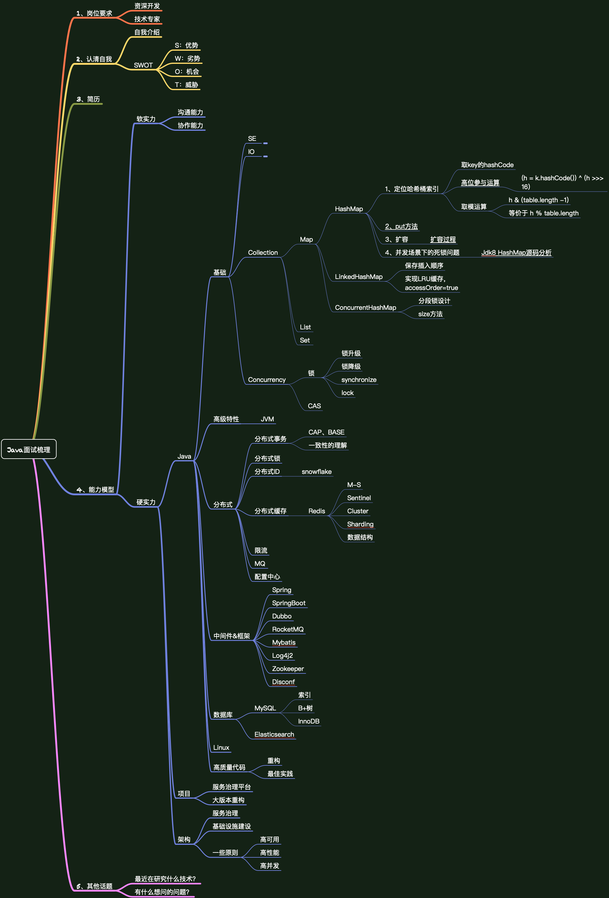

  
  
1、  

2、  

3、  

4、  

5、  
  
  
---------------------------------------------------------------------------------------------------------------------  
## 

---------------------------------------------------------------------------------------------------------------------  
## 

---------------------------------------------------------------------------------------------------------------------  
## 

---------------------------------------------------------------------------------------------------------------------  
## 

---------------------------------------------------------------------------------------------------------------------  
## 

---------------------------------------------------------------------------------------------------------------------  

设计模式、
加解密

面试过程：  
  
4：问：项目中有哪些难点，是怎么克服的？  
答：。。。。回答的稀里糊涂的，自己都不知道说了啥(记得好像是说每一个都是难点)  
5：问：项目采用分布式开发，一共使用到了几个系统？分别是哪些？  
答：7个...后面的没回答上来(客户web层，客户service层，mq消息队列...)  
6：问：项目中有用到MQ，主要是实现哪些功能？  
答：发短信，发邮件  
7：问：怎样判断mq中的方法成功执行了或者执行失败  
答：通过状态，比如，A调用B，在A这边捕捉异常，通过返回状态进行判断。  
8：问：项目中的订单和商品是一个系统还是分的两个系统？  
答：2个  
9：怎样保证这两个系统中的数据同步？比如：用户下单后，需要在商品系统那边减库存，如何保证同步？(   
  
 HR面：  
 业余爱好  
 为什么不参加竞赛？  
 你觉得你在项目运行过程中作为组长是否最大限度发挥了组员的优势？具体事例？  
 如何看待阿里在大数据方面的投入？对阿里的发展有什么建议？对蚂蚁金服的发展有什么看法？  
 职业规划，今后想发展的工作方向  
 家乡在哪里，是否愿意长期在杭州发展？  
 薪酬问题及入职情况  
 
蚂蚁金服的总部还是在杭州，一共3轮面试，第一轮电话面试，也是最重要的技术面试，面试时间大约1个多小时，聊了Java的基础知识，容器类，线程安全和非安全的，多线程相关基础知识，  
实现方式，死锁的检查与排查，JVM内存模型，Java底层代码阅读，原子性，可见性实现原理，数据库相关，ACDI相关原则，乐观锁实现方案，分库分表理论，如何设计分库分表规则，  
分布式系统的相关理论，3原则，一致性hash原理，了解或使用过哪些开源的RPC框架，基本设计原理是什么，  
另外最基础的Spring，SpringMVC，ibatis等框架的使用当然是不可缺少的拉。    技术面试感觉下来要求的是一个广度，深度尚可，要对Java各方面都有所涉猎。    第二轮面试就是技术总监当面聊了，去上海office面见了技术总监，出乎意料的是没聊技术相关的，聊了一下过往经历，以及对公司业务发展方向的看法，人很nice，感觉不错。      
第三轮就是HR当面聊了，hr面嘛，3观要正，价值观要ok，然后就是薪资待遇福利交待，balabala  
 

1.TCP/IP 三次握手 四次挥手  
osi参考模型：  
tcp/ip四层概念模型：应用层（应用层、表现层、会话层）、传输层、网络层、数据链路层（数据链路层、物理层）（3 1 1 2）  
  
TCP/IP:协议的集合，代表性的有ip、tcp、http。  
ip:网络层。代表网际协议。  
tcp：传输层。tcp是可靠的，udp是不可靠的。  
http：应用层协议，主要解决如何包装数据。除了http还有ftp、telnet等等  
把IP想像成一种高速公路，它允许其它协议在上面行驶并找到到其它电脑的出口。TCP和UDP是高速公路上的“卡车”，它们携带的货物就是像HTTP，文件传输协议FTP这样的协议等。  
  
tcp三次握手：建立tcp连接。client端发送一个数据包，server端确认收到连接并返回给client，client确认然后连接建立完成。随后client和server端可以开始传输数据。  
tcp四次握手：断开tcp连接。client端发送一个FIN请求，server收到一个FIN请求表示client这一端不在发送数据了，但是还能接收数据，此时tcp连接还没有关闭。直到server端再发送一个FIN请求，表示server端也不会再发送数据了；client端收到FIN后，给server一个ack响应，server端进入closed状态。  
  
  
  
2.Http的格式说明  
request由请求行、请求头、请求体组成  
请求行（参考：GET /mix/76.html?name=kelvin&password=123456 HTTP/1.1      请求类型 请求地址  协议版本）  
请求头（参考：HOST是主机地址，User-Agent是客户端的信息，它是检测浏览器类型的重要信息，由浏览器定义，并且在每个请求中自动发送，等等  
Host: www.fishbay.cn  
Upgrade-Insecure-Requests: 1  
User-Agent: Mozilla/5.0 (Macintosh; Intel Mac OS X 10_11_5) AppleWebKit/537.36 (KHTML, like Gecko) Chrome/56.0.2924.87 Safari/537.36  
Accept: text/html,application/xhtml+xml,application/xml;q=0.9,image/webp,*/*;q=0.8  
Accept-Encoding: gzip, deflate, sdch  
Accept-Language: zh-CN,zh;q=0.8,en;q=0.6  
）  
空行：请求头后面必须有一行空行  
请求数据：请求体  
  
response由状态行、响应头、响应体组成。参考如下：  
HTTP/1.1 200 OK   状态行  
Server: nginx  响应头  
Date: Mon, 20 Feb 2017 09:13:59 GMT  
Content-Type: text/plain;charset=UTF-8  
Vary: Accept-Encoding  
Cache-Control: no-store  
Pragrma: no-cache  
Expires: Thu, 01 Jan 1970 00:00:00 GMT  
Cache-Control: no-cache  
Content-Encoding: gzip  
Transfer-Encoding: chunked  
Proxy-Connection: Keep-alive  
				空行  
{"res":ok"}   响应体  
  
  
3.状态码说明  
200 OK 请求成功  
301 Moved Permanently 永久移动。请求的资源已被永久的移动到新URI，返回信息会包括新的URI，浏览器会自动定向到新URI。  
今后任何新的请求都应使用新的URI代替  
302 Found 临时移动。与301类似。但资源只是临时被移动。客户端应继续使用原有URI  
400 Bad Request 客户端请求的语法错误，服务器无法理解  
401 Unauthorized 请求要求用户的身份认证  
403 Forbidden 服务器理解请求客户端的请求，但是拒绝执行此请求  
404 Not Found 资源未找到  
500 Internal Server Error 服务端内部错误  
502	Bad Gateway	充当网关或代理的服务器，从远端服务器接收到了一个无效的请求  
  
  
4.进程间通讯方式（IPC）  扩展：半双工（即数据只能在一个方向上流动）、全双工  
a、管道（无名管道）  
b、FIFO（命名管道）  
c、共享内存  
d、消息队列  
e、信号量  
  
  
5.数据库事务的4大特性、数据库隔离级别，索引类别，oracle的SID 实例  explain  
ACID 原子性、一致性、隔离性（Isolation）、持久性  
  
read-uncommited 读未提交，别人修改了未提交就能看得到。会产生脏读  
read-commited  读提交，默认的就是这个。  会产生读取旧数据，  
repeatable-read  可重复读。会产生幻读，就是突然蹦出来的数据。读取数据的事务将会禁止写事务（但允许读事务），写事务则禁止任何其他事务。  
serializable  可串行化，强制事务串行执行。但是性能低下。  
  
  
索引类型：  
a、普通索引：没有限制  
b、唯一索引：索引列的值必须唯一，但允许有空值。  
c、主键索引：特殊的唯一索引，不允许有空值。  
d、组合索引：最左前缀。  
1):查询条件中出现联合索引第一列,或者全部,则能利用联合索引.  
2)条件列中只要条件相连在一起,以本文例子来说就是:  
last_name=’1′ and first_name=’1′  
与first_name=’1′ and last_name=’1′,无论前后,都会利用上联合索引.  
3)查询条件中没有出现联合索引的第一列,而出现联合索引的第二列,或者第三列,都不会利用联合索引查询.复合索引中只要有一列含有NULL值，那么这一列对于此复合索引就是无效的  
e、全文索引  
  
索引的坏处：虽然大大提高了查询速度，但是会降低表的更新速度，例如insert、delete、update时，不仅要更新表，还要更新索引文件。  
  
oracle的sid与实例  
1.SID:对应着实例，一个数据库可以有多个实例（如RAC），SID是用来标识这个数据库内部每个实例的名字。  
2.SERVICE_NAME：是这个数据库对外宣称的名字，对应着数据库。  
  
  
6.启动一个包含main方法的类时，输出字符，整个启动到输出的详细流程  
 首先java.exe 会帮助我们找到 JRE ，接着找到位于 JRE 内部的 jvm.dll ，这才是真正的 Java 虚拟机器 , 最后加载动态库，激活 Java 虚拟机器。虚拟机器激活以后，会先做一些初始化的动作，比如说读取系统参数等。一旦初始化动作完成之后，就会产生第一个类加载器―― Bootstrap Loader  
	1.加载字节码（启动类加载器，扩展类，应用程序类，自定义加载器）  
	2.验证格式  
	3.准备（分配内存）  
	4.解析（解析阶段是虚拟机将常量池中的符号引用转化为直接引用的过程）  
	5.初始化  
整个类加载过程中，除了在加载阶段用户应用程序可以自定义类加载器参与之外，其余所有的动作完全由虚拟机主导和控制。到了初始化才开始执行类中定义的Java程序代码（亦及字节码），但这里的执行代码只是个开端，它仅限于<clinit>（）方法。类加载过程中主要是将Class文件（准确地讲，应该是类的二进制字节流）加载到虚拟机内存中，真正执行字节码的操作，在加载完成后才真正开始。  
  
7.双亲委派  
a、类加载器分为启动类加载器，bootstrap classloader 加载JAVA_HOME/lib目录下面的class  
b、扩展类加载器extensnion classloader 加载JAVA_HOME/lib/ext目录下面的class  
c、程序类加载器application classloader 加载用户类路径（classpath）上所指定的类库  
d、自定义类加载器 继承ClassLoader抽象类  
  
双亲委派机制：  
指的是类加载器收到类加载的请求有，将这个请求为派给父类加载器完成。若父类无法完成这个加载请求，子类加载器进行加载。*  
也就是说，所有的请求多会传送到顶层的启动类加载器，从顶层开始试图加载类，无法加载再向下传递。  
  
打破双亲委派机制：  
JNDI 线程上下文类加载器。双亲委派模型很好地解决了各个类加载器的基础类统一问题(越基础的类由越上层的加载器进行加载)，基础类之所以被称为“基础”，是因为它们总是作为被调用代码调用的API。但是，如果基础类又要调用用户的代码，那该怎么办呢。  
这并非是不可能的事情，一个典型的例子便是JNDI服务，它的代码由启动类加载器去加载(在JDK1.3时放进rt.jar)，但JNDI的目的就是对资源进行集中管理和查找，它需要调用独立厂商实现部部署在应用程序的classpath下的JNDI接口提供者(SPI, Service Provider Interface)的代码，但启动类加载器不可能“认识”之些代码，该怎么办？  
为了解决这个困境，Java设计团队只好引入了一个不太优雅的设计：线程上下文件类加载器(Thread Context ClassLoader)。这个类加载器可以通过java.lang.Thread类的setContextClassLoader()方法进行设置，如果创建线程时还未设置，它将会从父线程中继承一个；如果在应用程序的全局范围内都没有设置过，那么这个类加载器默认就是应用程序类加载器。了有线程上下文类加载器，JNDI服务使用这个线程上下文类加载器去加载所需要的SPI代码，也就是父类加载器请求子类加载器去完成类加载动作，这种行为实际上就是打通了双亲委派模型的层次结构来逆向使用类加载器，已经违背了双亲委派模型，但这也是无可奈何的事情。  
  
  
OSGI 热部署 使用的是自定义的类加载器机制，每一个程序模块（bundle）都有一个自己的类加载器。  
  
扩展问题  
a、能不能自己写一个java.lang.Object的类？如果能怎么写,如果不能为什么?  
不能自己写以"java."开头的类，其要么不能加载进内存，要么即便你用自定义的类加载器去强行加载，也会收到1个SecurityException。  
  
b、请设计一个能够在服务端执行的分析JVM中状态的程序。  
  
8.classloader的功能和工作模式  
  
  
  
  
  
JVM内存区域：  
堆（新生代、老年代）、栈（java虚拟机栈、native方法栈）、方法区（永久代）、程序计数器、  
  
  
1、面试官可以先问你什么时候一个对象会被GC？　　 算法，根搜索算法，当一个对象不可达时，通过一系列的称为“GC Roots”的对象作为起始点,从这些节点开始向下搜索,搜索所走过的路径称为引用链(Reference Chain),当一个对象到GC Roots没有任何引用链相连(用图论的话来说,就是从GC Roots到这个对象不可达)时,则证明此对象是不可用的。  
  
2、接着继续问你为什么要在这种时候对象才会被GC？　　gc经常发生的是在堆区，堆区分为新生代、老年代，新生代分为  
一个eden空间和两个survivor空间。  
a、 对象优先在Eden中分配，当Eden中没有足够空间时，虚拟机将发生一次Minor GC，因为Java大多数对象都是朝生夕灭，所以Minor GC非常频繁，而且速度也很快；  
b、 Full GC，发生在老年代的GC，当老年代没有足够的空间时即发生Full GC，发生Full GC一般都会有一次Minor GC。大对象直接进入老年代，如很长的字符串数组，虚拟机提供一个-XX:PretenureSizeThreadhold参数，令大于这个参数值的对象直接在老年代中分配，避免在Eden区和两个Survivor区发生大量的内存拷贝；  
c、发生Minor GC时，虚拟机会检测之前每次晋升到老年代的平均大小是否大于老年代的剩余空间大小，如果大于，则进行一次Full GC，如果小于，则查看HandlePromotionFailure设置是否允许担保失败，如果允许，那只会进行一次Minor GC，如果不允许，则改为进行一次Full GC。  
  
方法区：存放了要加载的类信息、静态变量、final类型的常量、属性和方法信息。JVM用永久代（PermanetGeneration）  
来存放方法区，（在JDK的HotSpot虚拟机中，可以认为方法区就是永久代，但是在其他类型的虚拟机中，没有永久代  
  
3、接着继续问你GC策略都有哪些分类？  
标记-清除算法----------标记和清除效率低，而且产生一堆不连续的内存碎片  
复制算法------------将内存按照容量划分成几块，当某一块的用完之后，直接把存活的对象复制到另一块上面，然后把已使用的一次性清除掉。新生代用的比较多，划分比例为8：1:1，一个eden，两个survivor空间。每次可用的空间能够达到90%。  缺点是较多的复制操作，效率会变低，还会浪费空间。  
标记-整理算法----------标记之后，整理一下，然后清除掉。    老年代常用算法  
分代收集算法---------根据对象存活周期，将内存分为几块，根据不同的特点采用最适合的收集算法  
  
  
4、你如果说出来了，继续问你这些策略分别都有什么优劣势？都适用于什么场景？　　  
5、你继续说出来了以后，给你举个实际的场景，让你选择一个GC策略？　　  
6、你如果选出来了，继续问你，为什么要选择这个策略？  
  
  
GCROOT哪里来的(哪些可以是GCROOT)？  
GC管理的主要区域是Java堆，一般情况下只针对堆进行垃圾回收。方法区、栈和本地方法栈不被GC所管理,因而选择这些区域内的对象作为GC roots,被GC roots引用的对象不被GC回收。主要有以下几种：  
a.虚拟机栈(栈桢中的本地变量表)中的引用的对象  
b.本地方法栈中JNI的引用的对象  
c.方法区中的类静态属性引用的对象   
d.方法区中的常量引用的对象   
  
  
回收器：  
1、新生代，均使用标记-复制算法。  
serial收集器 单线程的收集器，在进行垃圾收集时候，必须暂停其他所有的工作线程直到它收集结束。使用标记-复制垃圾收集算法  
ParNew收集器 serial的多线程版本，新生代收集器，使用标记-复制垃圾收集算法。可以和CMS一起使用，很重要。  
Parallel Scavenge收集器，也是多线程的垃圾收集器，但是和parNew的关注点不同，关注的是如何控制系统运行的吞吐量。这里说的吞吐量，指的是CPU用于运行应用程序的时间和CPU总时间的占比，吞吐量 = 代码运行时间 / (代码运行时间 + 垃圾收集时间)   
  
2、老年代：Serial Old收集器、Parallel Old收集器以及CMS收集器。  
Serial Old收集器   标记整理算法，单线程。 主要是在JDK1.5版本之前和Parallel Scavenge年轻代收集器配合使用，或者作为CMS收集器的后备收集器。  
Parallel Old收集器    标记整理算法，多线程。和Parallel Scavenge一样，是关注吞吐量的，经常和Parallel Scavenge一起使用。  
CMS收集器    目前老年代收集器中比较优秀的垃圾收集器。使用"标记-清除"算法的并发收集器，以获取最短停顿时间为目标的收集器。  
分为个阶段：1、初始标记  stop the world  2、并发标记  3、重新标记 stop the world  
 4、并发清除。   
 由于并发清理阶段，如果用户产生了垃圾对象，但是过了标记阶段，所以会产生浮动垃圾，因为不能像其他收集器那样等到完全填满了老年代以后才进行垃圾收集，需要预留一部分空间来保证当出现浮动垃圾的时候可以有空间存放这些垃圾对象。这个空间比例可以设置。  
  
 3、G1收集器：不区分所谓的新生代、老年代，将整个内存区域混合在一起，划分成不同的子区域。  
 在小范围内还是会划分成年轻代、老年代。采用不同的GC方式来处理。  
 是用什么GC可以设置的，例如java -Xmx10m -Xms10m -XX:+UseG1GC -XX:+PrintGCDetails TestDemo  
  
  
  
  
类加载机制的简单连环炮。  
1、首先肯定是先问你Java的类加载器都有哪些  
2、回答了这些以后，可能会问你每个类加载器都加载哪些类？　　  
3、说完以后，可能会问你这些类加载之间的父子关系是怎样的？　　  
4、你在回答的时候可能会提到双亲委派模型，  
5、那么可以继续问你什么是双亲委派模型？　　  
6、你解释完了以后，可能会继续问你，为什么Java的类加载器要使用双亲委派模型？　　  
例如类java.lang.Object，它存在在rt.jar中，无论哪一个类加载器要加载这个类，最终都是委派给处于模型最顶端的Bootstrap ClassLoader进行加载，因此Object类在程序的各种类加载器环境中都是同一个类。相反，如果没有双亲委派模型而是由各个类加载器自行加载的话，如果用户编写了一个java.lang.Object的同名类并放在ClassPath中，那系统中将会出现多个不同的Object类，程序将混乱。  
  
6、你回答完以后，可能会继续问你如何自定义自己的类加载器，自己的类加载器和Java自带的类加载器关系如何处理？  
看自己的类加载器的逻辑了，如果只重写了findClass方法并没有重写loadClass方法，就没有改变父类委托机制。如果改写了loadClass，就以自己改写的loadClass逻辑为准。  
a、重写findClass方法的自定义类，首先会通过父类加载器进行加载，如果所有父类加载器都无法加载，再通过用户自定义的findClass方法进行加载。  
b、重写loadClass来实现，可以在JVM的不同类加载器中保留具有相同全限定名的类，这种情况下，就有可能有大量相同的类，被不同的自定义类加载器加载到JVM中，并且这种实现方式是不符合双亲委派模型。  
  
注意：defineClass 将二进制字节转换成Class类  
  
class文件加载过程：加载（资源，将二进制字节文件存到方法区中）--》验证（文件格式）--》准备（分配类变量的内存空间、设置类变量初始值）--》解析（将常量池的符号引用转换为直接引用）--》初始化（执行java代码，初始化类变量和其他资源）  
  
  
Java的内存模型是怎么设计的？（线程之间的通信机制有两种共享内存和消息传递，java采用的是共享内存模型）  
a、java内存模型（JAVA Memory Model）描述的是一组规则或规范，定义程序中各个变量的访问规则，即在虚拟机中将变量存储到内存和从内存中取出变量这样的底层细节。  
所有的变量都存储在主存中，每条线程有自己的工作内存，工作内存保存了被该线程所使用到的变量的主内存的副本拷贝。线程对变量的所有操作，都要在工作内存中进行。线程之间的互相访问，也要通过主内存。  
b、Happens-Before  
c、定义了8种操作：lock unlock read->load(不能单独出现) use assign  store->write(不能单独出现)、  
  
  
你回答了以后，还会继续问你为什么要这么设计？  
问完以后，还可能会让你结合内存模型的设计谈谈volatile关键字的作用？  
只能保证可见性，不能保证写入操作的原子性。  
当且仅当满足以下条件时，才应该使用  
a、对变量的写入操作不依赖当前的值，或者只有单个线程更新变量的值。  
b、该变量不会与其他变量一起，纳入不变性条件。  
  
  
  
你在谈的时候，肯定会提到可见性，那么接着可见性这三个字，还可以继续问你并发的内容。  
  
  
  
==========================================================================================  
  
9.synchronized和lock的用法区别  各自底层原理  
synchronized：  
对象级别的同步块，底层包含monitorenter和monitorexit指令  
方法级别同步，底层是 ACC_SYNCHRONIZED 标识来判断  
Java虚拟机对synchronized的优化  
锁的状态总共有四种，无锁状态、偏向锁、轻量级锁和重量级锁。随着锁的竞争，锁可以从偏向锁升级到轻量级锁，再升级的重量级锁，但是锁的升级是单向的，也就是说只能从低到高升级，不会出现锁的降级，关于重量级锁，前面我们已详细分析过，下面我们将介绍偏向锁和轻量级锁以及JVM的其他优化手段，这里并不打算深入到每个锁的实现和转换过程更多地是阐述Java虚拟机所提供的每个锁的核心优化思想，毕竟涉及到具体过程比较繁琐，如需了解详细过程可以查阅《深入理解Java虚拟机原理》。  
lock：  
  
10.分布式锁  
11.如何设计线程池 需要什么特性  怎么扩容 缩容  如何去取资源 分配资源  
12.spring中的transactional注解，requestMapping注解的实现原理  
13.springMvc原理 如何集成web  
14.什么是缓存击穿 如何避免  
缓存穿透是指查询一个一定不存在的数据，由于缓存是不命中时被动写的，并且出于容错考虑，如果从存储层查不到数据则不写入缓存，这将导致这个不存在的数据每次请求都要到存储层去查询，失去了缓存的意义。在流量大时，可能DB就挂掉了，要是有人利用不存在的key频繁攻击我们的应用，这就是漏洞。  
  
解决方案：有很多种方法可以有效地解决缓存穿透问题，最常见的则是采用布隆过滤器，将所有可能存在的数据哈希到一个足够大的bitmap中，一个一定不存在的数据会被 这个bitmap拦截掉，从而避免了对底层存储系统的查询压力。另外也有一个更为简单粗暴的方法（我们采用的就是这种），如果一个查询返回的数据为空（不管是数 据不存在，还是系统故障），我们仍然把这个空结果进行缓存，但它的过期时间会很短，最长不超过五分钟。  
  
  
15.自己做的项目对自己帮助很大的方面 成长的方面  
16.如何排查oom  
a、查看服务器运行日志、项目日志，捕捉到异常  
JAVA heap space  （dump堆转储快照，用工具进行分析，确认到底是内存泄漏还是内存溢出，如果是内存泄漏，查看泄露对象为什么无法回收；如果不存在内存泄漏，说明对象都是必须存活的，则需要修改堆参数-Xms -Xmx）  
StackOverflowError 线程请求的栈深度大于虚拟机所允许的栈深度（-Xss设置栈内存大小）  
OutOfMemoryError 虚拟机在扩展栈时，无法申请到足够的空间  
PermGen space 运行时常量池溢出 or 方法区溢出  
unsafe.allocateMemory() 直接内存溢出  
b、查看linux日志 /var/log/message 看看有没有kill掉进程的记录  
c、增加jvm启动参数，-XX:+HeapDumpOnOutOfMemoryError，当应用抛出OutOfMemoryError时生成dump文件。  
  
  
dump文件的几种方式：  
1、使用jmap -dump命令  
2、使用jconsole工具  
3、增加jvm启动参数，-XX:+HeapDumpOnOutOfMemoryErro  
4、使用hprof。启动虚拟机加入-Xrunhprof:heap=site，会生成java.hprof.txt文件。该配置会导致jvm运行非常的慢，不适合生产环境。（HPROF可以用来展示和跟踪cpu的使用情况，内存分配的统计数据等。不仅如此，它还支持对 java进程完整的内存dump，所有线程的monitor stats数据）  
  
  
jdk的命令行工具；  
1、jps 等同于ps，列出正在运行的虚拟机进程  
2、jstat 用于监视虚拟机各种运行状态信息（例如：jstat gc 2764 250 20）  
3、jinfo 实时地查看和调整jvm的各项参数  
4、jmap 用于生成堆转储快照  
5、jhat 堆转储快照的分析工具  
6、jstack java堆栈信息跟踪工具（一般多jstack几次才能看出来）  
  
jdk的可视化工具：  
1、JConsole  
2、VisualVM  
  
  
  
=====================================  
问题：  
Redis Bitmap是什么？  
  
  
HikariCP连接池（号称性能最好的JDBC连接池:HikariCP）？  
常用的JDBC连接池包括：  
DBCP：单线程，性能较差，适用于小型系统  
C3P0：单线程，并发量低，性能不好  
BoneCP：一个高效、免费、开源的Java数据库连接池实现库，它的性能几乎是C3P0、DBCP的25倍。性能高于durid  
Druid：Druid是Java语言中最好的数据库连接池。能够提供强大的监控和扩展功能。特色：为分析监控设计；快速的交互式查询；高可用；可扩展。  
  
  
  
springboot自动启动类?---------》  
答案：SpringApplication.run();  
  
  
spring常用的接口和类，实现原理（在什么时候初始化，什么时候注入，什么时候调用）？  
BeanFactory.java，基本的接口类  
ApplicationContext.java，BeanFactory的扩展类  
1、DefaultListableBeanFactory是整个bean加载的核心部分，是spring注册及加载bean的默认实现。XmlBeanFactory集成自DefaultListableBeanFactory。XmlBeanFactory与DefaultListableBeanFactory不同的地方是XmlBeanFactory使用了自定义的XML读取器XmlBeanDefinitonReader,实现了个性化的BeanDefinitionReader读取，DefaultListableBeanFactory继承了AbstractAutowireCapableBeanFactory并实现了ConfigurableListableBeanFactory接口。  
2、XmlBeanDefinitonReader集成自AbstractBeanDefinitionReader，完成了XML配置文件的读取过程。  
1）使用ResourceLoader将资源文件路径转换成对应的Resource文件  
2）通过DocumentLoader对Resource文件进行转换，将Resource文件转换为Document文件  
3）通过实现接口BeanDefinitonDocumentReader的DefaultBeanDefinitonDocumentReader类对Document进行解析，并使用BeanDefinitonParserDelegate对Element进行解析。  
3、XmlBeanFactory  
  
  
IOC容器的初始化过程：BeanDefiniton的Resource的资源定位、载入和注册的过程  
  
  
  
GC，问怎么标记回收对象的，从GCROOT不可达的对象（根据四种引用关系，强软弱虚），GCROOT哪里来的(哪些可以是GCROOT)？  
java提供finalize()方法？GC和finalize()方法都是不可靠的  
  
  
什么时候一个对象会被GC？  
答：GC发生在堆区，分为新生代和老年代。新生代还分为Eden和两个Survivor区域。  
a、对象优先在eden分配，当eden空间不够用的时候，发生minor gc  
b、当老年代空间不够用的时候，发生full gc，一般会伴随着一次minor gc，大对象直接进入老年代。  
c、发生minor gc时，会检测之前每次晋升到老年代的内存大小，是否大于当前的老年代的剩余大小。如果大于，则进行一次full gc。如果小于，则看是否允许担保失败，如果允许担保失败，则进行一次minor gc，如果不允许，进行full gc。  
  
为什么要在这个时候对象才会被GC？  
GC策略都有哪些分类？  
答：标记-清除算法，产生不连续的内存空间，标记和清除效率不高   适用于老年代  
复制算法，浪费一部分空间，较多的复制操作，效率变低   适用于新生代  
标记-整理算法，整理需要时间，但是必要的    适用于老年代  
  
  
这些策略分别都有什么优劣势？都适用于什么场景？  
给你举个实际的场景，让你选择一个GC的策略？为什么要选择这个策略？  
什么是gc，什么是cms算法？  
并发标记清除算法，分为4个步骤，初始标记-》并发标记-》重新标记-》并发清除。会产生浮动垃圾，就是重新标记过程中生产的垃圾，所以要保留一部分空间。  
  
  
cms算法实现原理？整个过程是怎么样的？  
怎么避免full gc？  
1、system.gc() 调用大多数情况下会出发full gc，应该禁止使用。  
2、老年代空间不足 调优时尽量做到让对象在minor gc阶段呗回收，避免创建过大的对象和数组。  
3、永久代空间不足也会触发full gc。增大永久代空间、或者改成cms gc。  
4、cms gc出现promotion failed和concurrent mode failure两种状况会出现full gc。  
都是因为老年代空间不足造成的  
措施：增大survivor space、老年代空间或者调低触发并发gc的比例。  
5、统计得到的Minor GC晋升到旧生代的平均大小大于老年代的剩余空间  
6、堆中分配很大的对象，此种对象会直接进入老年代，而老年代虽然有很大的剩余空间，但是无法找到足够大的连续空间来分配给当前对象，此种情况就会触发JVM进行Full GC。设置-XX:+UseCMSCompactAtFullCollection开关参数，用于在“享受”完Full GC服务之后额外免费赠送一个碎片整理的过程  
  
  
  
  
  
java g1垃圾收集器？  
  
类加载机制的相关问题：  
java的类加载器都有哪些？  
每个类加载器都加载哪些类？  
这些类加载器之间的父子关系是怎么样的？  
回答的时候可能会提到双亲委派模型，双亲委派模型是什么？  
java的类加载器为什么要使用双亲委派模型？  
如何自定义自己的类加载器？自己的类加载器和java自带的类加载器关系如何处理？  
bootstrap  
Extend  
system/app  
self defined  
  
内存的相关问题：  
内存分为哪几部分？这些部分分别都存储哪些数据？  
一个对象从创建到销毁都是怎么在这些部分里存活和转移的？  
内存的哪些部分会参与GC的回收？  
java的内存模型是怎么设计的？为什么这么设计？  
回答：Java内存模型定义了多线程之间共享变量的可见性以及如何在需要的时候对共享变量进行同步。  
在并发编程领域，有两个关键问题：线程之间的通信和同步。线程之间的通信机制有两种：共享内存和消息传递。  
Java的并发采用的是共享内存模型  
Java线程之间的通信总是隐式进行，整个通信过程对程序员完全透明。如果编写多线程程序的Java程序员不理解隐式进行的线程之间通信的工作机制，很可能会遇到各种奇怪的内存可见性问题。  
JMM决定一个线程对共享变量的写入何时对另一个线程可见。从抽象的角度来看，JMM定义了线程和主内存之间的抽象关系：线程之间的共享变量存储在主内存（main memory）中，每个线程都有一个私有的本地内存（local memory），本地内存中存储了该线程以读/写共享变量的副本。  
  
java线程、java线程池、java集合、java队列、java正则表达式、java native方法、JAVA泛型  
jdk和jre的区别  
  
java、Spring中的ServletContext相关  
Spring的DispacherServlet和ContextLoaderListener中的WebApplicationContext的关系  
获取spring的ApplicationContext几种方式：直接创建（2种），工具类WebApplicationContextUtils，extends或者implements（ApplicationObjectSupport就是实现ApplicationContextAware）  
  
java nio的selector  和linux的epoll select，类似与epoll或者java里面的selector  
  
ZeroCopy和mmap思想  
  
  
集合重写写equals，就必须重写hashCode？使用hash表的时候需要重写  
  
  
Java基础  
概述、语言基础、OO、Exceptio处理、Array、常用Class、集合、IO与文件、多线程、反射  
  
  
============================  
面试题：  
1、nio、Bio，aio的区别，大概机制，接口  
nio 同步非阻塞io（不等待，但是主动查询io是否完成），高并发的程序一般用这.Channel、Buffer、Selector     Reactor就是Java的NIO。  
bio 同步阻塞io（等待操作完成）      
aio 异步非阻塞io（不等待，也不主动查询，io完成会主动通知）   AsynchronousChannel、AsynchronousSocketChannel  
  
  
2、数据库，innobd，隔离级别，行级锁  
3、分布式  
4、类加载器和双亲委派机制，何时破坏双亲委派机制  
5、几种垃圾回收器  
6、java8新特性，lamda，函数接口  
7、多线程：创建线程池，两个线程一个初始化，一个循环，改变一个值，并发包下接口类  
8、java虚拟机的内存模型，内存工作方式  
9、spring 、aop、ioc  
10、二叉树算法  
11、MySQL的事务级别，mybatis一个mapper实现两个sql  
12、多线程，100个子线程，执行完成，将结果返回主线程  
13、如何在大量数据中查找某一段的数据，不用limit  
14、dubbo的原理，结构  
15、整体介绍负载均衡架构  
16、多线程的好处？一定能加快运行速度么？因为线程切换也是需要时间的  
17、Integer和int类型，哪个放在堆内存？哪个在栈内存？  
  
18、堆里面和栈内存，分别是什么时候回收？  
19、outofmemory的问题，怎么定位？  
20、常用有哪些设计模式？  
21、一致性hash的实现原理
  
  
  
---------------------------------------------------------------------------------------------------------------------  
  
简历：SMART原则  
  
  
1、同盾科技面试  
2、公司面试总结  
3、招聘要求  
4、公司面试注意事项  
5、别人的面试经历1  
6、  

7、  
8、  
9、  
10、  
11、  
12、  
13、  
14、  
15、  
16、  
17、  
18、  
19、  
20、  
21、  
22、  
23、  
24、  
25、  
26、  
27、  
28、  
29、  
30、  
  
  
---------------------------------------------------------------------------------------------------------------------  
  
面试问题：  
  
netty小对象、大对象的管理  
jvm在操作系统层面的内存  
AQS的  
Zookeeper怎么保障全部通知到【定时更新】  
查找数组中重复出现次数最多的数字  
rocketmq扩容怎么保证顺序消息  
Redis的五种数据类型的实现是什么数据结构

  
---------------------------------------------------------------------------------------------------------------------  
公司面试注意事项：  
  
  
项目中遇到的技术难点：  
并发，稳定性，容错，性能等方面入手。  
内存泄漏  
  
  
  
面试经验：  
https://mp.weixin.qq.com/s/oQdmQpO4XXFaJbfjt8GvXQ?utm_medium=hao.caibaojian.com&utm_source=hao.caibaojian.com  
刷题：LeetCode+《剑指offer》  
基础知识  
简历：SMART原则  
英语  
锻炼  
面试  
  
  
消息的功能，为什么这么做，那几个接口  
怎么适配的：  
kafka的实现原理：怎么存储，怎么通信  
零拷贝，java怎么使用  
hashmap的实现原理：数据+链表，比如put操作：先定位数据位置，再比较链表中是否存在  
synchronized 和 volatile 区别  
  
  
先做个简单的自我介绍：  
主要是三个周期：  
第一个周期是14年7月到15年8月 南京亚信软件，  
第二段是15年8月到16年9月：南京快钱 平台的维护对接和需求开发  
第三段是16年9月到目前是南京亚信软件，  
  
  
  
为什么换工作到杭州  
快钱项目介绍  
目前的项目介绍  
  
 
  
  
  
  
---------------------------------------------------------------------------------------------------------------------  
同盾科技面试：  
  
为什么选择封装Acticemq和Rocketmq  
在什么情况下，选择Acticemq，什么情况下Rocketmq  
对比一下Acticemq和Rocketmq  
推荐给客户的时候，怎么推荐哪一个中间件，就是什么场景下使用哪个mq中间吗：并发、部署、运维、高可用  
  
kafka和rocketmq对比有什么区别  
语言、缓存批量发送-吞吐量和安全、存储时候文件的区别  
使用的注册中心和协调框架--zookeeper、nameSrv  
  
  
统一配置平台有几个服务：  
zookeeper通知、Redis缓存、HDFS和数据库存储，amber服务控制台  
  
如果Zookeeper主节点宕机，重新选主30S不可用，文件更新了，怎么实现实时通知  
客户端异常重试，重新多少次就打印日志  
  
使用消息通知，消息挂了怎么办，消息怎么判断客户端确实接收到了，通知的时候记录，然后消费端接收的时候，消费成功做反馈  
客户端如果宕机了，服务端怎么知道呢？  
  
实时感知，客户端和服务端之间做长连接，如果客户端有几千Client，配置中心只有几个服务，这个你怎么保证这么多连接可用  
  
  
常见的RPC框架指的是哪些，知道的开源的Rpc框架有哪些，dubbo有使用过吗？dubbo底层通讯序列化使用的是什么？负载均衡是在客户端还是服务端？  
  
netty：tcp拆包和粘包的原因是什么，netty有哪些方式？netty零拷贝指的是什么？那linux的用户态和内核态有什么区别？netty使用的是什么内存？（直接内存和堆外内存），内核态操作的是什么内存？堆内存和堆外内存怎么释放？通过操作系统的什么方法去写内存的？在java里面什么时候才会触发堆外内存回收，回答GC  
，手动释放，还有吗？如果我要实现内存池，采用什么方式？直接内存，怎么设计呢？unsafe方法有了解吗？CAS这个有了解吗？ABA问题怎么处理  
  
hashmap介绍，1.6和1.8有什么改进？hashmap扩容过程？concurrenthashmap在1.8有什么优化？lamdba表达式有什么优点，为什么使用这个？.stream是干嘛的？  
  
synch声明在静态块和普通方法有什么区别？java有几种锁？lock接口有几种锁？什么时候用读写锁？跟valitile有什么区别，用在什么场景？（其实是读多写少这种），什么时候valitile，什么时候用atom原子类型？一个变量为什么不用atom而是valitile？  
  
barracyle栅栏机制？  
  
java堆内存溢出怎么排查？什么情况下堆内存溢出？什么栈内存溢出？tlab就是内存逃逸分析？  
  
G1和cms对比，有什么优缺点？G1可以设置单个块最大的回收时间，真实有效吗？达到了这个时间会发生什么？  
  
springcloud是不是用过，springboot使用过吗？  
  
了解过微服务开发吗？答sprngcloud、servermesh，  
  
servermesh主流的技术是什么？istio的数据层面和控制面都是哪些组件？各是干什么的？  
sidecar和dubbo各有什么优势？sidecar和应用之间怎么通信？是怎么代理应用的？应用的请求sidecar怎么获取的？  
  
  
大数据有什么了解吗？没有，  
  
apigateway有接触吗？开源的接触过什么？跟后端是怎么通信的？（其实还是想问跟后端是rpc框架是什么）rpc通信是什么方式？都不用dubbo吗？那rpc都是用的什么？csf底层用的什么序列化（谷歌那个，td，protobuff），用什么通信？Zookeeper注册？，springcloud的api网关是哪个服务？还有其他的api网关？  
  
大数据不是做流计算  
  
  
  
  
---------------------------------------------------------------------------------------------------------------------  
  
别人的面试经历1  
  
 zookeeper的watcher乐观锁怎么实现   
 c. 说出一个空间换时间的场景   
  
G1和CMS的区别，G1有啥劣势；Kafka的整体架构；Netty的一次请求过程；自旋锁/偏向锁/轻量级锁（这个问题在头条的面试里也出现了一次）、hbase线上问题排查（刚好遇到过NUMA架构下的一个问题，借此把hbase的内核介绍了下）。  
  
求一棵树两个节点的最近的公共父节点。思路基本是对的，但是有些细节有问题，面试官人很好，边看边跟我讨论，我边改进，前前后后估计用来快半小时。然后又继续问问题，HTTP 301 302有啥区别？设计一个短链接算法；md5长度是多少？  
  
ThreadLocal如果引用一个static变量是不是线程安全的  
  
问了一些基础问题和netty的写流程，还问了一个redis数据结构的实现，结构他问了里面字符串是怎么实现的，有什么优势。一直感觉这个太简单，没好好看，只记得有标记长度，可以直接取。然后就来两道编程题。第一题是求一棵树所有左叶子节点的和，比较简单，一个深度优先就可以搞定。第二题是给定一个值K，一个数列，求数列中两个值a和b，使得a+b=k。我想到了一个使用数组下标的方法（感觉是在哪里有见过，不然估计是想不出来），这种可是达到O(n)的复杂度；他又加了个限制条件，不能使用更多内存，我想到了快排+遍历，他问有没有更优的，实在想不出来，他提了一个可以两端逼近，感觉很巧妙。  
  
先让我讲下kafka的结构，然后怎么防止订单重复提交，然后开始围绕缓存同步问题展开了长达半小时的讨论：先写数据库，再写缓存有什么问题？先写缓存再写数据库有什么问题？写库成功缓存更新失败怎么办？缓存更新成功写库失败怎么办？  
  
我提到了istio，介绍了设计理念，感觉他有点意外。然后他问java8的新特性，问我知不知道lambda表达式怎么来的，我从lambda演算说到lisp说到scala，感觉他更意外。  
几个netty的问题，gc的问题，  
  
第一部分就是日志上传和接收，然后就如何保证日志上传的幂等性开始不断深入，先让我设计一个方案，然后问有没有什么改进的，然后如何在保证幂等的前提下提高性能，中间穿插分布式锁、redis、mq、数据库锁等各种问题。  
  
结合秒杀的场景深入，如何实现分布式锁、如何保证幂等性、分布式事务的解决方案。问我分布式锁的缺点，我说性能会出现瓶颈，他问怎么解决，我想了比较久，他提示说发散下思维，我最后想了个简单的方案，直接不使用分布式锁，他好像挺满意。感觉他们更看重思考的过程，而不是具体方案。还问了一致性hash如何保证负载均衡，kafka和rocketmq各自的优缺点，dubbo的一个请求过程、序列化方式，序列化框架、PB的缺点、如何从数据库大批量导入数据到hbase。  
  
也是让我先介绍项目，问我有没有用过mq，如何保证消息幂等性。我就把kafka0.11版本的幂等性方案说了下，就没再问技术问题了  
  
  
  
---------------------------------------------------------------------------------------------------------------------  
公司面试总结：  
  
  
  
  
  
19年面试：  
1、19年5月14号 周二 面试 fit2cloud ，在南京刚刚起步，一个开发，两个销售，在南京建邺万达租的一个一室的房间，暂时不考虑  
2、京东数科，周三（5/15）14：00，后面确定电话面试，因为面试的回答不好，没有结果额  
3、途牛 中间件部门，微信视频面试两轮，最后还是说不合适  
4、杭州同盾，电话面试一轮，收获还是挺多的，后来又到面两轮，还是被刷了  
5、杭州呆萝卜，文滔推荐了两次，都简历不通过，要有电商业务经验的  
6、杭州滴滴，猴哥内退小橘业务部门，简历都没过  
7、在boss上投递了涂鸦，一直显示面试，都2个多星期了，都没有反应，pass  
  
  
海康  
二维火  
百世汇通  
jd  
  
  
  
---------------------------------------------------------------------------------------------------------------------  
招聘要求：  
  
java基础扎实：熟悉IO、多线程、集合操作等基础技能  
熟悉分布式、缓存、消息队列等中间件技术  
熟悉mysql数据库的基本操作  
  
熟悉常用设计模式  
熟悉并对javaEE、SOA、spring、osgi等技术潮流保持关注，  
有数据库、分布式、性能优化、高并发、高可用性系统设计开发经验  
有分布式系统开发经验，对消息服务、负载均衡、高可用机制等有深入理解;  
熟悉消息中间件，RPC框架，数据层，性能优化等相关技术经验者优先   
扎实的编程基础，精通java开发语言，熟悉jvm，web开发、缓存，分布式架构、消息中间件等核心技术；  
熟悉常用算法和数据结构，熟悉分布式系统原理  
负责分布式缓存、消息、rpc、链路跟踪等某个或某些中间件产品的设计与研发  
  
  
  
  
1、重点本科或以上学历（985/211），计算机软件或相关专业，英语CET4以上;  
2、精通java编程，熟悉java sdk提供的主要能力;  
3、理解java运行时工作原理，熟悉jvm性能调优，能够充分利用java特性支持框架与程序库的设计开发;  
4、熟悉多线程编程，熟练使用java并发包下的各项常用基础设施;  
5、熟悉网络编程，能够熟练使用java nio开发高并发、高吞吐量的服务;  
6、熟悉常用网络协议，如TCP/IP, HTTP;  
7、能够熟练使用linux，能够利用常用的工具对程序进行跟踪诊断;  
8、有分布式系统开发经验，对消息服务、负载均衡、高可用机制等有深入理解;  
9、具备良好学习、沟通能力及团队协作精神，对工作积极严谨，勇于承担压力。  
  
  
  
这里有世界一流的中间件产品和场景，包括应用托管容器、分布式调用服务、分布式消息服务、分布式数据服务和大数据计算平台等，掌控着超千亿规模的消息推送和分布式数据库调用，是全球流量最大的中间件集群之一  
这里有世界最大的电商交易业务场景，团队提供的高可用架构基础设施直面双11洪峰流量，包括容量规划、准入控制、限流降级、流量调度、弹性伸缩和全链路压测等，体系化支撑阿里巴巴电商链路的稳定运行  
这里有世界领先的企业互联网架构平台，以中间件技术部多款核心产品作为基础设施构建的云计算解决方案，面对互联网+的浪潮，帮助企业级客户轻松构建并托管分布式应用，解决集中化和互联网化的业务需求  
我们的使命：做分布式架构基础设施，建设支撑百万笔交易的分布式架构能力，建设支撑百万台服务器和超万个系统的服务能力  
我们的愿景：打造世界一流的中间件产品，打造世界一流的高可用架构基础设施，打造世界一流的企业级互联网架构平台  
全面参与阿里巴巴集团中间件（容器，服务框架、消息中间件、数据中间件等）的设计，核心代码开发，系统稳定性开发，性能优化等工作  
帮忙业务方解决技术难题，用技术推动业务发展  
岗位要求:  
1. 熟悉java concurrent包 ，熟悉高并发，分布式通信，存储等相关技术   
2. 3年以上相关工作经验   
3. 熟悉Linux操作系统、熟悉开源的中间件软件   
4. 熟悉消息中间件，RPC框架，数据层，性能优化等相关技术经验者优先   
5. 具有高并发相关工作经验优先  
6. 有很强的与客户沟通和理解能力，有良好的团队协作精神、环境适应能力和执行力，在较大压力下保持工作激情；  
  
  
职位描述：  
1. 负责阿里巴巴菜鸟基础技术组件和产品的研发和设计工作，有监控系统经验者优先。  
2. 从架构角度横向关注菜鸟业务系统，为菜鸟系统微服务化，云化，流程引擎自动化等共享技术方面做技术支撑。  
职位要求  
1. 计算机相关专业本科或以上学历，三年以上J2EE项目开发经验；  
2. 扎实的编程基础，精通java开发语言，熟悉jvm，web开发、缓存，分布式架构、消息中间件等核心技术；  
3. 精通Java EE相关的主流开源框架，能了解到它的原理和机制，如Spring、iBatis、struts等；  
4. 熟悉Oracle、MySql等数据库技术，对sql优化有一定的经验；  
5. 思路清晰，良好的沟通能力与技术学习能力；  
6. 有基础技术组件，分布式存储/计算相关经验者优先考虑。  
  
  
岗位描述:  
蚂蚁中间件团队是服务于整个蚂蚁金服集团（包括钱包、网商、小贷、芝麻、聚宝、国际、口碑等）的核心技术团队，致力于打造支撑每秒亿级金融交易规模的基础中间件平台，为高速发展的业务提供业界一流的，金融级高可用高性能的分布式基础服务，也将十年磨一剑的技术做产品化输出，为蚂蚁业务生态的合作伙伴提供技术赋能。期待您的加入，一起在蚂蚁这个极具挑战和丰富多彩的业务舞台上玩技术，支撑 DT 驱动的互联网金融生态！   
您将参与蚂蚁 Java 中间件（包括RPC通讯、消息队列、应用容器、开发框架、协调管控系统、数据中间件、搜索平台等）的高可用设计、核心编码、性能优化和产品化开发等工作。  
岗位要求:  
1.3年以上 JAVA 开发经验，有并发编程经验，熟悉文件I/O，网络 I/O 及类加载等机制细节；   
2.有大规模分布式系统或者类库的研发经验，熟悉开源中间件，深入了解实现机制；   
3.熟悉JVM基础知识，具有一定的调优经验和内存、线程相关问题排查经验；   
4.有技术热情和较强的学习能力，有很好的问题分析和技术攻关能力，具有良好的团队合作和沟通能力和抗压能力；   
5.熟悉 Linux 内核者优先，有消息中间件、RPC、数据层中间件等中间件研发经验值者优先，有性能优化经验者优先；  
  
  
 满足以下三个以上条件：  
1、从事一线研发工作5年以上，有优秀的设计与代码编写能力  
2、熟练掌握C/C++/Go/Python/Java/Nodejs等1至2种以上语言（GO加分，同时会Java+GO/Java+Python加分）  
3、熟悉多种消息中间设计实现如：Kafka,  RabbitMQ,activemq等（向社区提交过patch者优先）  
4、熟悉etcd，consul,zookeeper等分布式组件（阅读过源码并向社区提交过patch者优先）  
5、熟悉常用算法和数据结构，熟悉分布式系统原理  
6、熟悉RPC框架、系统架构优化设计等（阅读过dubbo等源码并向社区提交过PR者优先）  
7、具备网络知识，熟悉TCP/IP通信原理者优先  
8、有大型高并发项目架构设计经验者优先  
9、有开源社区贡献者经验优先  
10、熟悉微服务架构及服务治理优先  
11、熟悉Kubernetes者优先  
11、参与过PaaS平台规划，设计研发过PaaS/FaaS关键部件优先  
                                  
  
负责小桔车服架构及稳定性建设，主要包括两块工作：一、架构产品规划及架构治理，二、提升车服软件总体稳定性  
任职要求  
一、精通java语言，对java语言特性及jvm有全面深度理解；  
二、熟悉消息中间件的特性，知道高性能消息中间件的设计思路；  
三、存储系统选型能力强，熟悉搜索产品、kv存储、数据库，能根据业务的当前发展阶段做出最优的存储选型；  
四、对服务治理有体系化思考，熟悉业界知名服务治理方案如dubbo、spring boot，能比较不同方案的优劣；  
五、在存储、中间件或服务治理领域有开源贡献者优先；  
六、对稳定性建设有体系化的思考，知道如何在指定时间内按部就班地将稳定性提升至指定水平。  
  
  
  
1. 熟悉Java并发和网络编程，有良好的数据结构和算法功底；  
2. 熟悉消息中间件的原理和关键技术，熟悉Kafka/Pulsar/RocketMQ等消息产品的原理和实现，有开源社区贡献者优先；  
3. 对CAP理论、Paxos/Raft算法、高可用架构、分布式事务等有一定理解，并由一定实践经验者优先；  
4. 有分布式存储的使用和研发经验者优先；  
5. 了解或熟悉一种分布式流计算框架的应用场景和关键技术，例如Spark/Flink/Kafka Streams/Apache Samza等，有相关研发经验者优先；  
6. 有技术热情和较强的学习能力，有良好的分析解决问题和技术攻关能力，具备良好的沟通能力、抗压能力和团队协作能力；  
                                  
  
  
岗位职责：  
参与曹操专车中间件（服务框架、消息中间件、数据中间件等）的设计，代码开发，系统稳定性开发，性能优化等工作   
主要方向：监控告警、网关、日志处理、消息中间件、公用组件服务等  
岗位要求：  
1. 3年以上相关工作经验，Java基础扎实，熟悉多线程，分布式系统，数据存储等相关技术   
2. 熟悉常用的中间件技术（如消息系统、RPC框架、缓存系统、存储层中间件等）   
3. 掌握多线程及高性能的设计与编码及性能调优，有高并发应用开发经验优先  
4. 熟悉Linux操作系统、能够熟练编写shell脚本  
5. 有监控、网关、日志处理等系统经验者优先  
6. 有大数据处理框架使用经验者优先，如storm、hadoop等  
7. 对用过的开源框架能了解到它的原理和机制，有开源项目贡献者优先  
8. 有较强的沟通理解能力，有良好的团队协作精神、环境适应能力和执行力，在较大压力下保持工作激情；  
  
  
工作职责:  
1. 负责基础架构技术、产品的设计与研发  
2. 负责分布式缓存、消息、rpc、链路跟踪等某个或某些中间件产品的设计与研发  
3. 优化基础服务性能，提升服务可用性，增加系统稳定性，保障业务高效运行  
4. 解决线上服务运行期间出现的各种问题  
任职要求：  
1. 计算机或相关专业本科以上学历（5年及以上工作经验）  
2. 精通Java程序开发，熟悉Linux/Unix开发环境  
3. 熟悉常用开源分布式系统，精通但不限于kafka/rocketmq/mongodb/redis/opentsdb等任意一种开源产品源代码  
4. 良好的分布式理论与实践能力  
5. 良好的沟通协作能力，较强的分享精神  
6. 有Github等开源社区贡献经验的优先  
  
  
  
  
岗位描述:  
1. 负责中间件消息系统核心模块的设计和方案落地。  
2. 负责公共云和专有云的稳定性。  
3. 负责新产品线的调研和论证。  
更高层需求：   
1. 负责产品路线的选型。  
2. 负责公共云和专有云的具体打法，为结果负责。  
岗位要求:  
1. 4年以上分布式系统相关经验。   
2. 至少精通一种编程语言，Java或C++。   
3. 深入理解分布式存储理论，微服务优化实践。   
4. 计算机理论基础扎实，例如对操作系统原理、TCP/IP等有比较深入的理解。   
5. 具有独立设计一款生产环境高可用高可靠的中间件能力，例如RocketMQ。   
6. 熟悉高并发、分布式通信、存储、开源中间件软件等相关技术者更佳。   
7. 有很强的与客户沟通和理解能力，有良好的团队协作精神、环境适应能力和执行力，在较大压力下保持工作激情。  
                                  
  
  
岗位职责：  
1、参与曹操专车中间件（服务框架、消息中间件、数据中间件等）的设计，代码开发，系统稳定性开发，性能优化等工作；  
2、主要方向：监控告警、网关、日志处理、消息中间件、公用组件服务等。  
任职要求：  
1、4年以上相关工作经验，Java基础扎实，熟悉多线程，分布式系统，数据存储等相关技术；  
2、熟悉常用的中间件技术（如消息系统、RPC框架、缓存系统、存储层中间件等）；  
3、掌握多线程及高性能的设计与编码及性能调优，有高并发应用开发经验优先；  
4、熟悉Linux操作系统、能够熟练编写shell脚本；  
5、有监控、网关、日志处理等系统经验者优先；  
6、有大数据处理框架使用经验者优先，如storm、hadoop等；  
7、对用过的开源框架能了解到它的原理和机制，有开源项目贡献者优先；  
8、有较强的沟通理解能力，有良好的团队协作精神、环境适应能力和执行力，在较大压力下保持工作激情。  
                                  
  
  
岗位职责：  
 1. 参与有赞PaaS中间件（容器，服务框架、消息中间件、数据中间件等）的设计，核心代码开发，维护系统稳定性，性能优化等工作  
 2. 深入理解所负责的中间件的技术原理、架构和使用场景, 帮助业务方更好的利用中间件产品解决技术难题  
 3. 规划中间件产品的发展方向，用中间件技术、通用产品、通用平台解决业务架构难题,支撑业务系统的快速发展  
岗位要求：  
1. 精通Golang／Java／C++语言 ，5年以上相关工作经验  
2. 精通高并发，分布式，存储等相关技术  
3.熟悉消息中间件，RPC框架，数据层，性能优化等相关技术  
4.有优秀的问题排查能力  
5.善于独立思考，有快速学习能力，不断突破技术瓶颈，乐于探索未知领域，在较大压力下保持工作激情  
                                  
  
  
工作职责:  
1. 负责基础架构技术、产品的设计与研发  
2. 负责分布式缓存、消息、rpc、链路跟踪等某个或某些中间件产品的设计与研发  
3. 优化基础服务性能，提升服务可用性，增加系统稳定性，保障业务高效运行  
4. 解决线上服务运行期间出现的各种问题  
任职要求：  
1. 计算机或相关专业本科以上学历（5年及以上工作经验）  
2. 精通Java程序开发，熟悉Linux/Unix开发环境  
3. 熟悉常用开源分布式系统，精通但不限于kafka/rocketmq/mongodb/redis/opentsdb等任意一种开源产品源代码  
4. 良好的分布式理论与实践能力  
5. 良好的沟通协作能力，较强的分享精神  
6. 有Github等开源社区贡献经验的优先
  
  
  
 岗位描述:  
蚂蚁中间件团队是服务于整个蚂蚁金服集团（包括钱包、网商、小贷、芝麻、聚宝、国际、口碑等）的核心技术团队，致力于打造支撑每秒亿级金融交易规模的基础中间件平台，为高速发展的业务提供业界一流的，金融级高可用高性能的分布式基础服务，也将十年磨一剑的技术做产品化输出，为蚂蚁业务生态的合作伙伴提供技术赋能。期待您的加入，一起在蚂蚁这个极具挑战和丰富多彩的业务舞台上玩技术，支撑 DT 驱动的互联网金融生态！   
您将参与蚂蚁 Java 中间件（包括RPC通讯、消息队列、应用容器、开发框架、协调管控系统、数据中间件、搜索平台等）的高可用设计、核心编码、性能优化和产品化开发等工作。  
岗位要求:  
1.3年以上 JAVA 开发经验，有并发编程经验，熟悉文件I/O，网络 I/O 及类加载等机制细节；   
2.有大规模分布式系统或者类库的研发经验，熟悉开源中间件，深入了解实现机制；   
3.熟悉JVM基础知识，具有一定的调优经验和内存、线程相关问题排查经验；   
4.有技术热情和较强的学习能力，有很好的问题分析和技术攻关能力，具有良好的团队合作和沟通能力和抗压能力；   
5.熟悉 Linux 内核者优先，有消息中间件、RPC、数据层中间件等中间件研发经验值者优先，有性能优化经验者优先；  
  
  
  
岗位职责：  
1、框架和中间件产品迭代  
2、框架和中间件产品性能优化  
3、框架和中间件产品上云，支持多租户等云产品特性  
岗位要求：  
1、Java基础扎实，掌握Java NIO和Netty基本原理  
2、熟悉常用RPC框架比如Dubbo、Thrift、gRPC者优先  
3、熟悉Spring Cloud、Service Mesh微服务解决方案者优先  
4、熟悉相关调用链开源产品者优先  
5、具备良好的沟通能力以及技术产品规划改进能力  
  
  
职位描述：  
参与蚂蚁在海量数据访问、变更、灾备等场景下，业务数据一致性所依托的分布式事务中间件产品的技术设计、研发和推广；  
1. 分布式事务产品功能的设计、研发和运维，及商业版的推广；  
2. 蚂蚁分布式事务开源版 fescar 的研发和运营；  
3. 配合蚂蚁全站业务发展、技术演进的数据中间件技术；  
职位要求：  
1.2年及以上使用JAVA开发的经验，JAVA基础扎实，理解IO、多线程、集合、网络等基础框架、对JVM原理有一定的了解；  
2.熟悉数据库编程，对mysql、oracle等数据库有一定使用经验；熟悉分布式系统的设计和应用；  
3.熟悉并具有XA、TCC等分布式事务框架或者解决方案经验者优先；  
4.有技术热情和较强的学习能力，有很好的问题分析和技术攻关能力，有良好的团队合作和沟通能力。  
  
  
团队介绍：  
主要负责蚂蚁金服中间件产品的研发、运维和推广；  
团队目前运营的开源品牌SOFAStack（https://github.com/alipay），在金融级分布式架构领域非常活跃；分布式事务开源版本fescar，在社区也非常活跃；  
团队技术氛围非常好，有定期分享和参与各种开源论坛的机会，人员的成长和技术视野的提升都非常快。  
团队Leader很重视团队人员的技术成长，新人有专门的师兄，并且会制定相应成长计划，并定期Review做调整。  
注：工作地选择杭州或者北京均可；  
职位描述  
工作职责：  
1.作为底层系统开发人员，通过中间件技术、通用产品、通用平台解决业务架构难题，保障和支撑有赞业务的快速增长和迭代；  
2.参与有赞PaaS中间件(微服务框架、消息中间件、数据中间件、分布式KV存储系统等)的设计、核心代码开发，维护系统稳定性，提升产品和系统的性能；  
3.深入理解所负责的中间件的技术原理、架构和使用场景，帮忙业务开发更好的利用中间件产品解决技术难题，提升业务的开发和迭代速度；  
4.参与产品推广、技术宣讲和培训，提升业务开发对底层中间件和系统的了解，减少和消除因对底层系统不了解造成的故障；  
5.结合业界实践和有赞的实际情况，规划中间件和底层系统平台的发展方向，保障底层系统的持续稳定运行。  
工作内容：  
1.了解业务开发的需求和痛点，对业务实际中遇到的问题进行总结，抽象成为对中间件产品的需求  
设计、开发核心中间件产品，不断满足业务在功能、性能、稳定性等方面的需求；  
2.在结合有赞的业务场景和实际情况的前提下，吸纳开源产品优秀的设计和架构，并进行针对性的改良和适配；  
为需求方做技术培训，组织技术分享并能输出技术沉淀；  
3.协助业务方进行底层系统的技术选型和方案评估，为业务方提供专业的建议和支持；  
4.推动整体业务开放对底层中间件系统进行规范、合理的使用，保障底层系统的健康、稳定运行。  
任职要求：  
1.熟悉C++、Golang或Java语言 ，2年以上相关工作经验；  
2.熟悉高并发、分布式，存储、微服务架构等相关技术，熟悉网络编程；  
3.熟悉Linux操作系统、熟悉业界主流和常用的中间件软件；  
4.善于独立思考，有快速学习能力，不断突破技术瓶颈，乐于探索未知领域，在较大压力下保持工作激情；  
5.熟悉消息中间件，RPC框架，数据层，性能优化等相关技术经验者优先；  
6.熟练使用关系型数据库，对索引调优有一定经验或者了解其原理者优先；  
7.有良好的问题排查经验，有 docker 容器管控、PaaS 平台等领域的实践经验者优先。  
成长建议：  
1.关注和重视技术基础，对数据结构、算法、操作系统、网络编程等计算机基础课程进行深入的学习，并在实践中不断加深理解；  
2.不断提升对所维护和开发的产品的了解程度，结合业务实际场景进行深入的思考，提升对技术产品整体的认识能力和架构能力；  
3.学习和了解业务主流开源中间  
  
  
任职条件  
对于Java基础技术体系（包括JVM、类装载机制、多线程并发、IO、网络）有一定的掌握和应用经验；   
良好的面向对象设计理解，熟悉面向对象设计原则，掌握设计模式及应用场景；  
熟悉底层中间件、分布式技术（包括缓存、消息系统、热部署、JMX等）；  
对于高并发、高稳定可用性、高性能、大数据处理有过实际项目产品经验者优先。  
  
高可用架构团队是阿里巴巴保障稳定性的护航舰队，提供的高可用架构基础设施直面双11洪峰流量，包括全链路压测、容量规划、准入控制、限流降级、流量调度、弹性伸缩等；通过同城双活、异地多活、单元化体系建设，支撑阿里巴巴电商链路的分钟级故障切换，保证业务稳定运行。  
目前，我们承载着产品 PaaS 云化的承前启后的使命，通过阿里云赋能外部用户，急需高可用相关的研发人才，一方面完善高可用中间件自身的核心功能演进，满足业务系统大规模、高并发、高可用的需求；另一方面，需要快速迭代开发，将原来对内部为主的高可用中间件做成真正完善的可以对外部企业开放的云产品，帮助客户构建易使用、易运维的分布式系统。   
根据对云计算平台的业务需求，从稳定性、功能、性能等方面，负责设计、实现、改进云产品，把原来仅能满足内部使用的中间件组件，打造成功能完善且满足外部企业需求的云产品。开发云产品自身的管控、自动运维、监控、服务计费、产品运营、故障定位等工具。和架构师紧密合作，了解客户当前在技术上遇到的困难，帮忙业务方解决技术问题，用技术推动业务发展。  
2、熟悉 Java 常见开发框架，有扎实的 Java 基础和丰富的 WEB 开发经验  
3、精通linux平台上的Java语言编程，熟悉数据库开发技术，熟悉shell编程  
4、对数据结构、算法设计、系统架构设计等有较为深刻的理解   
5、熟悉系统高可用和稳定性方法策略，比如同城容灾、异地双活、异地多活等，有实战经验优先   
6、精于架构设计、性能优化，有故障处理、监控、限流、降级、预案、容量规划实战经验优先   
7、有前端开发经验，熟悉 ReactJS 者优先   
  
职位名称：蚂蚁金服-消息和分布式计算系统研发工程师/专家  
职位描述：参与蚂蚁分布式消息中间件和分布式流计算框架的设计和研发工作。通信产品广泛应用在蚂蚁金服的各项业务中，承担了海量的消息投递任务和复杂的单元化路由任务，并且保证系统的高可用和消息的高可靠。  
职位要求：  
1.精通 Java 并发和网络编程，有良好的数据结构、算法功底；   
2.熟悉消息中间件的应用场景和核心技术，熟悉 Kafka/ActiveMQ/RocketMQ等 MQ 产品的原理和实现，有开源社区贡献者优先； 3.对CAP理论、Paxos/Raft 算法、高可用架构、事务等理论有深入理解，并有一定的实践经验；   
4.了解或熟悉一种分布式流计算框架的应用场景和核心技术，例如 Storm/Kafka Streams/Apache Samza 等，有相关研发经验者优先；   
5.了解或熟悉IoT架构、MQTT协议等，有相关研发经验者优先；   
6.有分布式存储的使用和研发经验者优先；   
7.熟悉 JVM 基本运行原理和性能调优经验者优先；  
 8.熟悉 Linux 内核者优先。  
   
   
 岗位描述: 蚂蚁中间件团队是服务于整个蚂蚁金服集团（包括钱包、网商、小贷、芝麻、聚宝、国际、口碑等）的核心技术团队，致力于打造支撑每秒亿级金融交易规模的基础中间件平台，为高速发展的业务提供业界一流的，金融级高可用高性能的分布式基础服务，也将十年磨一剑的技术做产品化输出，为蚂蚁业务生态的合作伙伴提供技术赋能。期待您的加入，一起在蚂蚁这个极具挑战和丰富多彩的业务舞台上玩技术，支撑 DT 驱动的互联网金融生态！ 您将参与蚂蚁 Java 中间件（包括RPC通讯、消息队列、应用容器、开发框架、协调管控系统、数据中间件、搜索平台等）的高可用设计、核心编码、性能优化和产品化开发等工作。   
 岗位要求: 1.3年以上 JAVA 开发经验，有并发编程经验，熟悉文件I/O，网络 I/O 及类加载等机制细节；   
 2.有大规模分布式系统或者类库的研发经验，熟悉开源中间件，深入了解实现机制；   
 3.熟悉JVM基础知识，具有一定的调优经验和内存、线程相关问题排查经验；   
 4.有技术热情和较强的学习能力，有很好的问题分析和技术攻关能力，具有良好的团队合作和沟通能力和抗压能力；  
  5.熟悉 Linux 内核者优先，有消息中间件、RPC、数据层中间件等中间件研发经验值者优先，有性能优化经验者优先；  
  
  
  
  
  
---------------------------------------------------------------------------------------------------------------------  
  
  
  
  
  
  
  
---------------------------------------------------------------------------------------------------------------------  
  
  
  
  
  
  
  
  
---------------------------------------------------------------------------------------------------------------------  
  
  
  
  
  
  
  
  
---------------------------------------------------------------------------------------------------------------------