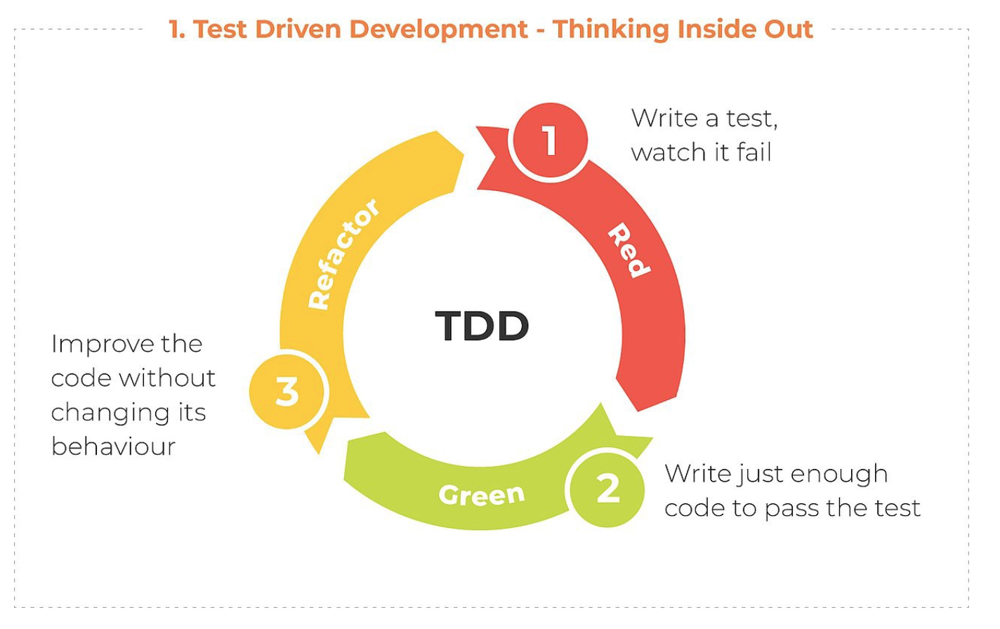
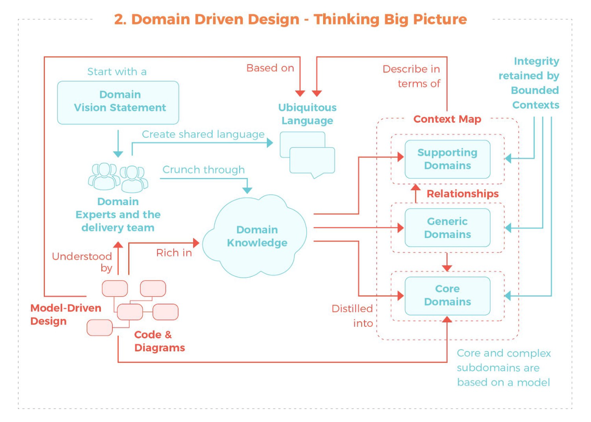
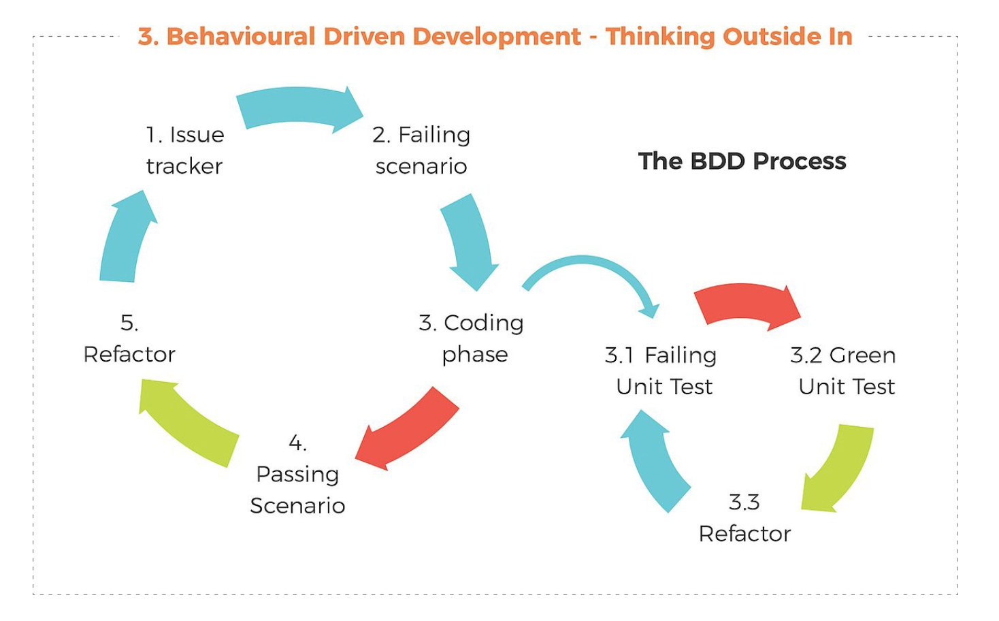
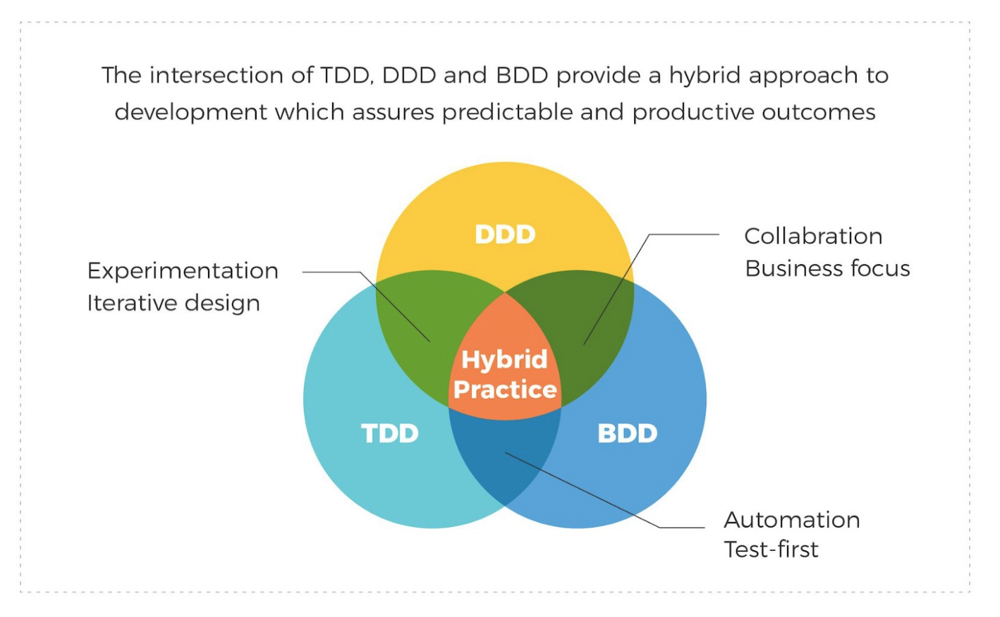

# TDD、BDD和DDD


- [TDD测试驱动开发](#TDD) : Test-driven development,即测试驱动开发
- [BDD行为驱动开发](#BDD) : Behavior-driven development,即行为驱动开发
- [DDD领域驱动设计](#DDD) : Domain-drive Design,领域驱动设计


测试驱动开发（TDD）是一种开发软件的过程，其中在编写代码之前先编写测试。一旦完成，开发人员将努力编写足够的代码以通过测试，然后开始重构。



域驱动设计（DDD）是一种将实现与不断发展的模型联系在一起的开发方法。将项目的重点放在核心领域（知识领域），背后的逻辑上，并迫使技术和非技术方面之间进行协作以改进模型。


行为驱动开发（BDD）是对TDD和DDD的改进，旨在通过缩小沟通差距，增进对客户的了解并实现持续沟通来简化开发。简而言之，BDD是将业务需求与代码结合在一起的一种方式，使您能够从业务/最终用户的角度了解系统的行为。


Hybrid Practice混合实践




## TDD

Test-driven development,即测试驱动开发。一种开发过程中应用方法。其思想为先根据需求抽象接口，先编写测试用例，然后在开始编写开发代码。TDD的本意就是通过测试来推动整个开发的进行。

TDD说白了就是先写一小段功能的测试代码，测试失败后再写实现代码，测试成功后接着迭代下一个功能。

TDD的优点：
- 提高功能的可测性
- 测试比较灵活
- 测试用例覆盖率比较高

缺点：
- 由于是单元测试代码验证，非技术人员看不懂代码，比较难验证功能是否贴合需求
- 先写单元测试代码，测试用例需要经常调整，增加了开发人员的工作量和降低了开发效率


## BDD

Behavior-driven development,即行为驱动开发。其目的是鼓励软件项目中的开发者、QA和非技术人员或商业参与者之间的协作。是从用户的需求出发，强调系统行为。通过用自然语言书写非程序员可读的测试用例扩展了测试驱动开发方法,使用混合了领域中统一的语言的母语语言来描述他们的代码的目的,让开发者得以把精力集中在代码应该怎么写，而不是技术细节上，而且也最大程度的减少了将代码编写者的技术语言与商业客户、用户、利益相关者、项目管理者等的领域语言之间来回翻译的代价.

目前主流的BDD测试框架为[Cucumber](https://cucumber.io/) ，支持多种编程语言。

cucumber支持的关键字：

```
feature | "功能" |
background | "背景" |
scenario | "场景", "剧本" |
scenario outline | "场景大纲", "剧本大纲" |
examples | "例子" |
given | "* ", "假如", "假设", "假定" |
when | "* ", "当" |
then | "* ", "那么" |
and | "* ", "而且", "并且", "同时" |
but | "* ", "但是" |
given (code) | "假如", "假设", "假定" |
when (code) | "当" |
then (code) | "那么" |
and (code) | "而且", "并且", "同时" |
but (code) | "但是" |
```

编程是通过使用以上的关键字来描述应用的功能，使非开发人员能快速便捷的了解代码的功能。


## DDD

Domain-drive Design,领域驱动设计。其目的是以一种领域专家、设计人员、开发人员都能理解的通用语言作为相互交流的工具，在交流的过程中发现领域概念，然后将这些概念设计成一个领域模型，再有该模型驱动软件设计和开发。

领域模型
- 领域模型是是对具有某个边界的领域的一个抽象，反映了领域内用户需求的本质
- 领域模型只反映业务，和技术无关
- 领域模型可以反映领域中的实体和过程
- 领域模型确保业务逻辑都在一个模型中，有助于提高应用的维护性和可重用性
- 领域模型可以让开发人员相对平滑地将业务知识转换为软件架构
- 领域模型贯穿软件分析、设计，以及开发的整个过程
- 建立正确的领域模型需要领域专家、设计、开发人员积极沟通共同努力，是大家对领域内的业务不断深入，从而不断细化和完善领域模型
- 领域模型的表达方式有多种
- 领域模型是整个软件的核心，设计足够精良且符合业务需求的领域模型能够更快速的响应需求变化


领域驱动设计的分成架构
- 用户界面/表现层
- 应用层
- 领域层 - 表达业务概念，业务信息和业务规则
- 基础设施层


业务对象的职责和策略：
- 实体（Entities）：具备唯一ID，能够被持久化，具备业务逻辑，对应业务对象
- 值对象（Value objects）：不具有唯一ID，由对象的属性描述，一般为内存中的临时对象，可以用来传递参数或对实体进行补充描述。
- 工厂（Factories）：主要用来创建实体，目前架构实践中一般采用IOC容器来实现工厂的功能
- 仓库（Repositories）：用来管理实体的集合，封装持久化框架
- 服务（Services）：为上层建筑提供可操作的接口，负责对领域对象进行调度和封装，同时可以对外提供各种形式的服务

DDD对构建企业级应用开发平台和大型核心业务系统的作用是相当大的，无论是在产品的稳定性、扩展性、可维护性、生命周期等方面都有良好的表现


参考  
[The Value at the Intersection of TDD, DDD, and BDD](https://medium.com/datadriveninvestor/the-value-at-the-intersection-of-tdd-ddd-and-bdd-da58ea1f3ac8)  
[Hybrid Development: The Value at the Intersection of TDD, DDD, and BDD](https://dzone.com/articles/hybrid-development-with-tdd-ddd-bdd)
[BDD vs TDD vs ATDD : Key Differences](https://www.browserstack.com/guide/tdd-vs-bdd-vs-atdd)  
[Differences between TDD, ATDD and BDD](https://gaboesquivel.com/blog/2014/differences-between-tdd-atdd-and-bdd/)  


