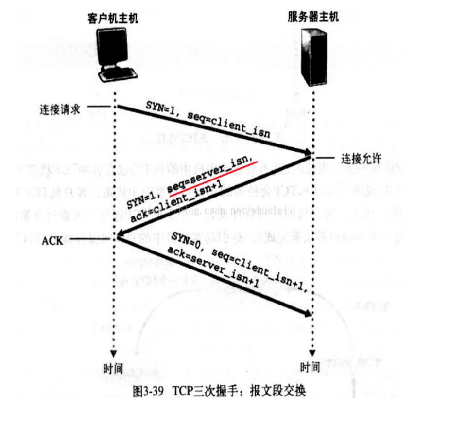

ajax请求流程，ajax状态码，http状态码
OSI七层与TCP/IP五层网络架构
TCP/IP连接过程：三次握手四次挥手
采用三次握手是：为了防止失效的连接请求报文段突然又传送到主机 B ，因而产生错误
收到server的FIN之后会进入TIME_WAIT状态将持续2个MSL(Max Segment Lifetime)原因
http连接过程（5步）：域名解析 --> 发起TCP的3次握手 --> 建立TCP连接后发起http请求 --> 服务器响应http请求，浏览器得到html代码 --> 浏览器解析html代码，并请求html代码中的资源（如js、css、图片等） --> 浏览器对页面进行渲染呈现给用户
存在的问题：不安全，被监听，被伪装，被篡改
https连接过程(5步)：+SSL层，过程是先非对称协商秘钥，然后进行加密传输

加解密
单向加密和双向加密（对称加密和非对称加密）
单向加密(信息摘要)：MD5、SHA
对称加密：DES、3DES、AES
非对称加密：RSA、DSA、ECDSA
查看项目quickstart-crypto
/Users/yangzl/git/quickstart-framework/quickstart-document/doc/base/加解密.md
---------------------------------------------------------------------------------------------------------------------

xhr对象
    【Ajax发送请求】这件事情并不是一句话带过就可以的，在Ajax中对整个请求从创建到发送都有一套严格的标准流程。在Ajax规则中，“请求”从创建到被发送需要至少经历如下几个步骤：
    1. 通过XMLHttpRequest类创建xhr对象
    2. 为xhr对象添加属性与回调方法
    3. 令xhr对象执行open()方法，指明请求被发往某处
    4.令xhr对象执行send()方法，发出请求

AJAX状态码
一共有5中请求状态，从0 到 4 发生变化。
0: 请求未初始化
1: 服务器连接已建立
2: 请求已接收
3: 请求处理中
4: 请求已完成，且响应已就绪

// readyState值说明
// 0,初始化,XHR对象已经创建,还未执行open
// 1,载入,已经调用open方法,但是还没发送请求
// 2,载入完成,请求已经发送完成
// 3,交互,可以接收到部分数据
// 4: 请求已完成，且响应已就绪

HTTP状态码
// status值说明
// 200:成功
// 404:没有发现文件、查询或URl
// 500:服务器产生内部错误
1**	信息，服务器收到请求，需要请求者继续执行操作
2**	成功，操作被成功接收并处理
3**	重定向，需要进一步的操作以完成请求 
4**	客户端错误，请求包含语法错误或无法完成请求，403 拒绝 404 not found
5**	服务器错误，服务器在处理请求的过程中发生了错误 

readyState属性
            值为0，对应常量UNSET：表示XMLHttpRequest实例已经生成，但是open()方法还没有被调用。
            值为1，对应常量OPENED：表示send()方法还没有被调用，仍可以使用setRequestHeader()设定HTTP请求头
            值为2，对应常量HEADERS_RECEIVED：表示send()方法已经执行，并且头信息和状态码已经收到。
            值为3，对应常量LOADING：表示正在接收服务器传来的body部分的数据，如果responseType属性是text或者空字符串，responseText就会包含已经收到的部分信息。
            值为4，对应常量DONE，表示服务器数据已经完全接收，或者本次接收已经失败了。

OSI七层与TCP/IP五层网络架构详解
http://network.51cto.com/art/201310/413853.htm
http://blog.csdn.net/cc1949/article/details/79063439
OSI七层模型
7层是指OSI七层协议模型，主要是：应用层（Application）、表示层（Presentation）、会话层（Session）、传输层（Transport）、网络层（Network）、数据链路层（Data Link）、物理层（Physical）。

OSI中的层 功能 TCP/IP协议族
应用层 文件传输，电子邮件，文件服务，虚拟终端 TFTP，HTTP，SNMP，FTP，SMTP，DNS，Telnet
表示层 数据格式化，代码转换，数据加密 没有协议
会话层 解除或建立与别的接点的联系 没有协议
传输层 提供端对端的接口 TCP，UDP
网络层 为数据包选择路由 IP，ICMP，RIP，OSPF，BGP，IGMP
数据链路层 传输有地址的帧以及错误检测功能 SLIP，CSLIP，PPP，ARP，RARP，MTU
物理层 以二进制数据形式在物理媒体上传输数据 ISO2110，IEEE802，IEEE802.2

(2)TCP/IP五层模型的协议
五层体系结构包括：应用层、传输层、网络层、数据链路层和物理层。

传输层：四层交换机、也有工作在四层的路由器
网络层：路由器、三层交换机
数据链路层：网桥(现已很少使用)、以太网交换机(二层交换机)、网卡(其实网卡是一半工作在物理层、一半工作在数据链路层)
物理层：中继器、集线器、还有我们通常说的双绞线也工作在物理层

TCPIP：三次握手四次挥手，查看TCP连接状态数量：netstat -n | awk '/^tcp/ {++S[$NF]} END {for(a in S) print a, S[a]}' 
http://blog.csdn.net/linux_ever/article/details/51136723
http://blog.csdn.net/whuslei/article/details/6667471
https://www.cnblogs.com/Jessy/p/3535612.html
收到server的FIN之后会进入TIME_WAIT状态将持续2个MSL(Max Segment Lifetime)
原因有二：
一、Client重发可能丢失的ACK报文：保证TCP协议的全双工连接能够可靠关闭,保证Server端收到ACK，如果Server端未收到ACK，会再次收到Server的FIN，可以再次发送ACK
二、保证这次连接的重复数据段从网络中消失，下次相同IP和Port不会再接收本次连接滞留在网络中的数据，如果新建的连接和上次的port相同，之前关闭的连接的数据滞留在网络再次发送到Server，Server会认为是新的连接发送的，导致数据混淆

TCP连接需要三次握手分开需要四次挥手：
TCP三次握手过程
1 主机A通过向主机B 发送一个含有同步序列号的标志位的数据段给主机B ,向主机B 请求建立连接,通过这个数据段,
主机A告诉主机B 两件事:我想要和你通信;你可以用哪个序列号作为起始数据段来回应我.
2 主机B 收到主机A的请求后,用一个带有确认应答(ACK)和同步序列号(SYN)标志位的数据段响应主机A,也告诉主机A两件事:
我已经收到你的请求了,你可以传输数据了;你要用哪个序列号作为起始数据段来回应我
3 主机A收到这个数据段后,再发送一个确认应答,确认已收到主机B 的数据段:"我已收到回复,我现在要开始传输实际数据了

采用三次握手是：为了防止失效的连接请求报文段突然又传送到主机 B ，因而产生错误

4次断开
1 当主机A完成数据传输后,将控制位FIN置1,提出停止TCP连接的请求
2 主机B收到FIN后对其作出响应,确认这一方向上的TCP连接将关闭,将ACK置1
3 由B 端再提出反方向的关闭请求,将FIN置1
4 主机A对主机B的请求进行确认,将ACK置1,双方向的关闭结束.
由TCP的三次握手和四次断开可以看出,TCP使用面向连接的通信方式,大大提高了数据通信的可靠性,使发送数据端和接收端在数据正式传输前就有了交互,为数据正式传输打下了可靠的基础

TCP状态码：

1、Client：发送SYN后
SYN-SENT -在发送连接请求后等待匹配的连接请求； 
2、Server：接受到SYN，并且发送ACK后
LISTEN - 侦听来自远方TCP端口的连接请求； 
SYN-RECEIVED - 在收到和发送一个连接请求后等待对连接请求的确认； 
3、Clinet+Server：Clinet发送ACK后，Server接收到ACK后
ESTABLISHED- 代表一个打开的连接，数据可以传送给用户； 

1、Client发送FIN后
FIN-WAIT-1 - 等待远程TCP的连接中断请求，或先前的连接中断请求的确认；

2、Server接收到FIN，并且返回ACK
CLOSE-WAIT - 等待从本地用户发来的连接中断请求； 

3、Client收到ACK后
FIN-WAIT-2 - 从远程TCP等待连接中断请求； 

4、Server发送FIN后
LAST-ACK - 等待原来发向远程TCP的连接中断请求的确认； 

5、Client接受FIN并且返回ACK
TIME-WAIT -等待足够的时间以确保远程TCP接收到连接中断请求的确认； 

6、Server接收到ACK和Client等待2个MSL(Max Segment Lifetime)后TimeOut超时
CLOSED - 没有任何连接状态；

CLOSING -等待远程TCP对连接中断的确认； 

SYN_RECV 状态：
服务端收到建立连接的SYN没有收到ACK包的时候处在SYN_RECV状态。

一般服务器都会设置net.ipv4.tcp_syncookies=1来防止SYN Flood攻击。假设一个用户向服务器发送了SYN报文后突然死机或掉线，那么服务器在发出SYN+ACK应答报文后是无法收到客户端的ACK报文的（第三次握手无法完成），这种情况下服务器端一般会重试（再次发送SYN+ACK给客户端）并等待一段时间后丢弃这个未完成的连接，这段时间的长度我们称为SYN Timeout，一般来说这个时间是分钟的数量级（大约为30秒-2分钟）。
这些处在SYNC_RECV的TCP连接称为半连接，并存储在内核的半连接队列中，在内核收到对端发送的ack包时会查找半连接队列，并将符合的requst_sock信息存储到完成三次握手的连接的队列中，然后删除此半连接。大量SYNC_RECV的TCP连接会导致半连接队列溢出，这样后续的连接建立请求会被内核直接丢弃，这就是SYN Flood攻击。

CLOSE_WAIT状态
发起TCP连接关闭的一方称为client，被动关闭的一方称为server。被动关闭的server收到FIN后，但未发出ACK的TCP状态是CLOSE_WAIT。出现这种状况一般都是由于server端代码的问题，如果你的服务器上出现大量CLOSE_WAIT，应该要考虑检查代码。

HTTP请求流程
域名解析 --> 发起TCP的3次握手 --> 建立TCP连接后发起http请求 --> 服务器响应http请求，浏览器得到html代码 --> 浏览器解析html代码，并请求html代码中的资源（如js、css、图片等） --> 浏览器对页面进行渲染呈现给用户

Request URL: https://www.baidu.com/img/bd_logo1.png?where=super 请求的url
Request Method: GET  请求的方法
请求的参数等
Request Version：HTTP/1.1 请求的http协议版本
Status Code: 200 OK
Remote Address: 61.135.169.125:443
Referrer Policy: unsafe-url
User-Agent： 客户端信息，用户代理信息等
Accept: 可以接受的MIME类型的所有类型
Accept: text/html,application/xhtml+xml,application/xml;q=0.9,image/webp,image/apng,*/*;q=0.8
Accept-Encoding: gzip, deflate, br
Accept-Language: zh-CN,zh;q=0.9
Cache-Control: no-cache
Connection: keep-alive  连接时候使用keep-alive特性
Cookie: BAIDUID=CB8A67CFBD7637407BE94645AA5C2D39:FG=1; BIDUPSID=CB8A67CFBD7637407BE94645AA5C2D39; PSTM=1533969843; BD_UPN=123253; BDUSS=Q2SzZ2VXViaUtQdnNzSDlTRjR4YVQtbHBiVzVsZjVFOXNoUk43Nk9IQUxFYmhiQVFBQUFBJCQAAAAAAAAAAAEAAAAh1JYfeW91bmd6aWwAAAAAAAAAAAAAAAAAAAAAAAAAAAAAAAAAAAAAAAAAAAAAAAAAAAAAAAAAAAAAAAAAAAAAAAAAAAuEkFsLhJBba2; delPer=0; BD_CK_SAM=1; BDRCVFR[C0p6oIjvx-c]=I67x6TjHwwYf0; H_PS_PSSID=1454_21106_20692_26350_22073; BD_HOME=1; BDRCVFR[feWj1Vr5u3D]=I67x6TjHwwYf0; pgv_pvi=262569984; pgv_si=s4821341184; ZD_ENTRY=baidu; MCITY=-%3A; PSINO=7; sugstore=1
Host: www.baidu.com  主机名
Pragma: no-cache
Upgrade-Insecure-Requests: 1
User-Agent: Mozilla/5.0 (Macintosh; Intel Mac OS X 10_13_6) AppleWebKit/537.36 (KHTML, like Gecko) Chrome/69.0.3497.100 Safari/537.36

HTTP Response响应头信息
Header	解释	示例
Accept-Ranges	表明服务器是否支持指定范围请求及哪种类型的分段请求	Accept-Ranges: bytes
Age	从原始服务器到代理缓存形成的估算时间（以秒计，非负）	Age: 12
Allow	对某网络资源的有效的请求行为，不允许则返回405	Allow: GET, HEAD
Cache-Control	告诉所有的缓存机制是否可以缓存及哪种类型	Cache-Control: no-cache
Content-Encoding	web服务器支持的返回内容压缩编码类型。	Content-Encoding: gzip
Content-Language	响应体的语言	Content-Language: en,zh
Content-Length	响应体的长度	Content-Length: 348
Content-Location	请求资源可替代的备用的另一地址	Content-Location: /index.htm
Content-MD5	返回资源的MD5校验值	Content-MD5: Q2hlY2sgSW50ZWdyaXR5IQ==
Content-Range	在整个返回体中本部分的字节位置	Content-Range: bytes 21010-47021/47022
Content-Type	返回内容的MIME类型	Content-Type: text/html; charset=utf-8
Date	原始服务器消息发出的时间	Date: Tue, 15 Nov 2010 08:12:31 GMT
ETag	请求变量的实体标签的当前值	ETag: “737060cd8c284d8af7ad3082f209582d”
Expires	响应过期的日期和时间	Expires: Thu, 01 Dec 2010 16:00:00 GMT
Last-Modified	请求资源的最后修改时间	Last-Modified: Tue, 15 Nov 2010 12:45:26 GMT
Location	用来重定向接收方到非请求URL的位置来完成请求或标识新的资源	Location: http://www.zcmhi.com/archives...
Pragma	包括实现特定的指令，它可应用到响应链上的任何接收方	Pragma: no-cache
Proxy-Authenticate	它指出认证方案和可应用到代理的该URL上的参数	Proxy-Authenticate: Basic
refresh	应用于重定向或一个新的资源被创造，在5秒之后重定向（由网景提出，被大部分浏览器支持）	Refresh: 5; url=http://www.zcmhi.com/archives...
Retry-After	如果实体暂时不可取，通知客户端在指定时间之后再次尝试	Retry-After: 120
Server	web服务器软件名称	Server: Apache/1.3.27 (Unix) (Red-Hat/Linux)
Set-Cookie	设置Http Cookie	Set-Cookie: UserID=JohnDoe; Max-Age=3600; Version=1
Trailer	指出头域在分块传输编码的尾部存在	Trailer: Max-Forwards
Transfer-Encoding	文件传输编码	Transfer-Encoding:chunked
Vary	告诉下游代理是使用缓存响应还是从原始服务器请求	Vary: *
Via	告知代理客户端响应是通过哪里发送的	Via: 1.0 fred, 1.1 nowhere.com (Apache/1.1)
Warning	警告实体可能存在的问题	Warning: 199 Miscellaneous warning
WWW-Authenticate	表明客户端请求实体应该使用的授权方案	WWW-Authenticate: Basic

http通信存在的问题
1、容易被监听 
http通信都是明文，数据在客户端与服务器通信过程中，任何一点都可能被劫持。比如，发送了银行卡号和密码，hacker劫取到数据，就能看到卡号和密码，这是很危险的
2、被伪装 
http通信时，无法保证通行双方是合法的，通信方可能是伪装的。比如你请求www.taobao.com,你怎么知道返回的数据就是来自淘宝，中间人可能返回数据伪装成淘宝。
3、被篡改 
hacker中间篡改数据后，接收方并不知道数据已经被更改

HTTPS是一种协议，等于HTTP+TLS（由于历史原因，SSL3.0之后就被TLS1.0替代了）。
openssl是一套开源工具集，主要有两个特性：
1、实现了ssl2,ssl3，TLSv1，TLSv1.1，TLSv1.2协议。
2、实现目前常用的加密算法。
没有一个非常精准的方法来判断HTTPS是否使用openssl，但是根据网站返回的server类型，可以大致估计是否使用了openssl，比如如果使用apache或者nginx，那么肯定是使用了openssl。保守估计至少70%以上的网站是使用openssl的。而windows系列的服务器包括IIS，windows server等都是使用schannel，没有使用openssl，不会受heartbleed影响。

https连接过程：
1、客户端发送请求到服务器端，发送客户端支持的加密协议及版本，SSL、TLS
2、服务器端返回证书和公开密钥，公开密钥作为证书的一部分而存在，服务器从中筛选合适的加密协议，返回证书，证书中有公钥
3、客户端验证证书和公开密钥的有效性，如果有效，则生成共享密钥并使用公开密钥加密发送到服务器端
4、服务器端使用私有密钥解密数据，并使用收到的共享密钥使用对称加密密钥加密数据，发送到客户端
5、客户端使用共享密钥解密数据、SSL加密建立………

HTTPS在传输数据之前需要客户端（浏览器）与服务端（网站）之间进行一次握手，在握手过程中将确立双方加密传输数据的密码信息。TLS/SSL协议不仅仅是一套加密传输的协议，更是一件经过艺术家精心设计的艺术品，TLS/SSL中使用了非对称加密，对称加密以及HASH算法。握手过程的具体描述如下：
1.浏览器将自己支持的一套加密规则发送给网站。 
2.网站从中选出一组加密算法与HASH算法，并将自己的身份信息以证书的形式发回给浏览器。证书里面包含了网站地址，加密公钥，以及证书的颁发机构等信息。 
3.浏览器获得网站证书之后浏览器要做以下工作： 
a) 验证证书的合法性（颁发证书的机构是否合法，证书中包含的网站地址是否与正在访问的地址一致等），如果证书受信任，则浏览器栏里面会显示一个小锁头，否则会给出证书不受信的提示。 
b) 如果证书受信任，或者是用户接受了不受信的证书，浏览器会生成一串随机数的密码，并用证书中提供的公钥加密。 
c) 使用约定好的HASH算法计算握手消息，并使用生成的随机数对消息进行加密，最后将之前生成的所有信息发送给网站。 
4.网站接收浏览器发来的数据之后要做以下的操作： 
a) 使用自己的私钥将信息解密取出密码，使用密码解密浏览器发来的握手消息，并验证HASH是否与浏览器发来的一致。 
b) 使用密码加密一段握手消息，发送给浏览器。 
5.浏览器解密并计算握手消息的HASH，如果与服务端发来的HASH一致，此时握手过程结束，之后所有的通信数据将由之前浏览器生成的随机密码并利用对称加密算法进行加密。

另外，HTTPS一般使用的加密与HASH算法如下：
      非对称加密算法：RSA，DSA/DSS 
      对称加密算法：AES，RC4，3DES 
      HASH算法：MD5，SHA1，SHA256

HTTP：是互联网上应用最为广泛的一种网络协议，是一个客户端和服务器端请求和应答的标准（TCP），用于从WWW服务器传输超文本到本地浏览器的传输协议，它可以使浏览器更加高效，使网络传输减少。
HTTPS（全称：Hyper Text Transfer Protocol over Secure Socket Layer），是以安全为目标的HTTP通道，简单讲是HTTP的安全版。即HTTP下加入SSL层，HTTPS的安全基础是SSL，因此加密的详细内容就需要SSL。

HTTPS和HTTP的区别：
https协议需要到ca申请证书，一般免费证书很少，需要交费。
http是超文本传输协议，信息是明文传输，https 则是具有安全性的ssl加密传输协议。
http和https使用的是完全不同的连接方式用的端口也不一样,前者是80,后者是443。
http的连接很简单,是无状态的。
HTTPS协议是由SSL+HTTP协议构建的可进行加密传输、身份认证的网络协议 要比http协议安全。 

HTTP协议的主要特点可概括如下：
1.支持客户/服务器模式。
2.简单快速：客户向服务器请求服务时，只需传送请求方法和路径。请求方法常用的有GET、HEAD、POST。每种方法规定了客户与服务器联系的类型不同。
由于HTTP协议简单，使得HTTP服务器的程序规模小，因而通信速度很快。
3.灵活：HTTP允许传输任意类型的数据对象。正在传输的类型由Content-Type加以标记。
4.无连接：无连接的含义是限制每次连接只处理一个请求。服务器处理完客户的请求，并收到客户的应答后，即断开连接。采用这种方式可以节省传输时间。
5.无状态：HTTP协议是无状态协议。无状态是指协议对于事务处理没有记忆能力。缺少状态意味着如果后续处理需要前面的信息，则它必须重传，这样可能导致每次连接传送的数据量增大。另一方面，在服务器不需要先前信息时它的应答就较快。

2.2 HTTP协议的几个重要概念
1.连接(Connection)：一个传输层的实际环流，它是建立在两个相互通讯的应用程序之间。 
2.消息(Message)：HTTP通讯的基本单位，包括一个结构化的八元组序列并通过连接传输。
3.请求(Request)：一个从客户端到服务器的请求信息包括应用于资源的方法、资源的标识符和协议的版本号
4.响应(Response)：一个从服务器返回的信息包括HTTP协议的版本号、请求的状态(例如“成功”或“没找到”)和文档的MIME类型。
5.资源(Resource)：由URI标识的网络数据对象或服务。
6.实体(Entity)：数据资源或来自服务资源的回映的一种特殊表示方法，它可能被包围在一个请求或响应信息中。一个实体包括实体头信息和实体的本身内容。
7.客户机(Client)：一个为发送请求目的而建立连接的应用程序。
8.用户代理(User agent)：初始化一个请求的客户机。它们是浏览器、编辑器或其它用户工具。
9.服务器(Server)：一个接受连接并对请求返回信息的应用程序。
10.源服务器(Origin server)：是一个给定资源可以在其上驻留或被创建的服务器。
11.代理(Proxy)：一个中间程序，它可以充当一个服务器，也可以充当一个客户机，为其它客户机建立请求。请求是通过可能的翻译在内部或经过传递到其它的服务器中。一个代理在发送请求信息之前，必须解释并且如果可能重写它。
代理经常作为通过防火墙的客户机端的门户，代理还可以作为一个帮助应用来通过协议处理没有被用户代理完成的请求。
12.网关(Gateway)：一个作为其它服务器中间媒介的服务器。与代理不同的是，网关接受请求就好象对被请求的资源来说它就是源服务器；发出请求的客户机并没有意识到它在同网关打交道。
网关经常作为通过防火墙的服务器端的门户，网关还可以作为一个协议翻译器以便存取那些存储在非HTTP系统中的资源。
13.通道(Tunnel)：是作为两个连接中继的中介程序。一旦激活，通道便被认为不属于HTTP通讯，尽管通道可能是被一个HTTP请求初始化的。当被中继的连接两端关闭时，通道便消失。当一个门户(Portal)必须存在或中介(Intermediary)不能解释中继的通讯时通道被经常使用。
14.缓存(Cache)：反应信息的局域存储。

1.建立连接 连接的建立是通过申请套接字(Socket)实现的。客户打开一个套接字并把它约束在一个端口上，如果成功，就相当于建立了一个虚拟文件。以后就可以在该虚拟文件上写数据并通过网络向外传送。

2.发送请求
打开一个连接后，客户机把请求消息送到服务器的停留端口上，完成提出请求动作。
HTTP/1.0 请求消息的格式为：
请求消息=请求行(通用信息|请求头|实体头) CRLF[实体内容]
请求 行=方法 请求URL HTTP版本号 CRLF
方 法=GET|HEAD|POST|扩展方法
U R L=协议名称+宿主名+目录与文件名
请求行中的方法描述指定资源中应该执行的动作，常用的方法有GET、HEAD和POST。不同的请求对象对应GET的结果是不同的，对应关系如下：
对象 GET的结果
文件 文件的内容
程序 该程序的执行结果
数据库查询 查询结果
HEAD——要求服务器查找某对象的元信息，而不是对象本身。
POST——从客户机向服务器传送数据，在要求服务器和CGI做进一步处理时会用到POST方法。POST主要用于发送HTML文本中FORM的内容，让CGI程序处理。
一个请求的例子为：
GET http://networking.zju.edu.cn/zju/index.htm HTTP/1.0
头信息又称为元信息，即信息的信息，利用元信息可以实现有条件的请求或应答 。
请求头——告诉服务器怎样解释本次请求，主要包括用户可以接受的数据类型、压缩方法和语言等。
实体头——实体信息类型、长度、压缩方法、最后一次修改时间、数据有效期等。
实体——请求或应答对象本身。

3.发送响应
服务器在处理完客户的请求之后，要向客户机发送响应消息。
HTTP/1.0的响应消息格式如下：
响应消息=状态行(通用信息头|响应头|实体头) CRLF 〔实体内容〕
状 态 行=HTTP版本号 状态码 原因叙述
状态码表示响应类型
1×× 保留
2×× 表示请求成功地接收
3×× 为完成请求客户需进一步细化请求
4×× 客户错误
5×× 服务器错误 
响应头的信息包括：服务程序名，通知客户请求的URL需要认证，请求的资源何时能使用。

4.关闭连接
客户和服务器双方都可以通过关闭套接字来结束TCP/IP对话

SSL是“Secure Sockets Layer”的缩写，中文叫做“安全套接层”，它是在上世纪90年代中期，由网景公司设计的（顺便插一句，网景公司不光发明了 SSL，还发明了很多 Web 的基础设施——比如“CSS 样式表”和“JS 脚本”）。
为啥要发明SSL这个协议捏？因为原先互联网上使用的HTTP协议是明文的，存在很多缺点——比如传输内容会被偷窥（嗅探）和篡改，发明SSL协议，就是为了解决这些问题。
到了1999年，SSL因为应用广泛，已经成为互联网上的事实标准，IETF就在那年把SSL标准化，标准化之后的名称改为TLS（是“Transport Layer Security”的缩写），中文叫做“传输层安全协议”。
很多相关的文章都把这两者并列称呼（SSL/TLS），因为这两者可以视作同一个东西的不同阶段。

HTTP和HTTPS的区别
https://www.cnblogs.com/bluestorm/p/5763533.html
https://segmentfault.com/a/1190000011185129
https://juejin.im/entry/58d7635e5c497d0057fae036

TCP协议中的三次握手和四次挥手(图解)
https://blog.csdn.net/whuslei/article/details/6667471
https://blog.csdn.net/qq_38950316/article/details/81087809

HTTP请求过程
https://www.linux178.com/web/httprequest.html

https请求建立过程
https://blog.csdn.net/wangjun5159/article/details/51510594
https://www.cnblogs.com/ttltry-air/archive/2012/08/20/2647898.html

OSI七层协议和TCP/IP四层协议
https://blog.csdn.net/qq_18425655/article/details/52314970

