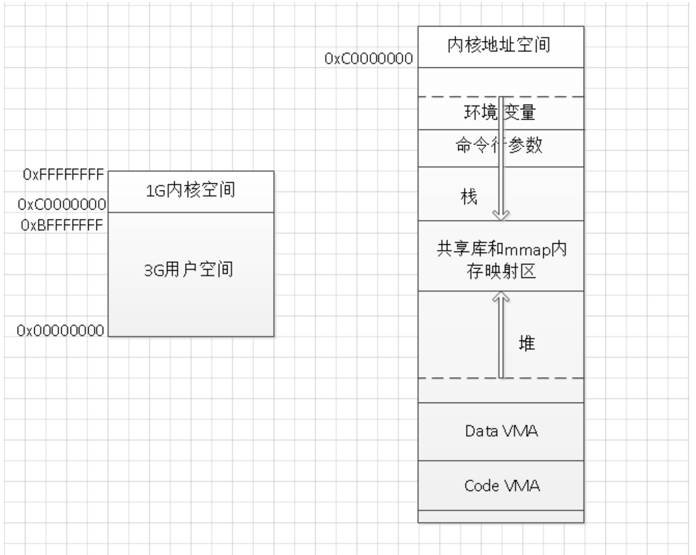

1、内核空间和用户空间
2、Linux进程地址空间
逻辑地址空间和物理地址空间
进程地址空间和内核地址空间
进程内存布局解释
3、内存地址的计算方法

---------------------------------------------------------------------------------------------------------------------
我们从内核空间和用户空间的角度看一看整个 Linux 系统的结构。它大体可以分为三个部分，从下往上依次为：硬件 -> 内核空间 -> 用户空间。

在硬件之上，内核空间中的代码控制了硬件资源的使用权，用户空间中的代码只有通过内核暴露的系统调用接口(System Call Interface)才能使用到系统中的硬件资源。其实，不光是 Linux，Windows 操作系统的设计也是大同小异。

实际上我们可以将每个处理器在任何指定时间点上的活动概括为下列三者之一：
1、运行于用户空间，执行用户进程。
2、运行于内核空间，处于进程上下文，代表某个特定的进程执行。
3、运行于内核空间，处于中断上下文，与任何进程无关，处理某个特定的中断。

以上三点几乎包括所有的情况，比如当 CPU 空闲时，内核就运行一个空进程，处于进程上下文，但运行在内核空间。
说明：Linux 系统的中断服务程序不在进程的上下文中执行，它们在一个与所有进程都无关的、专门的中断上下文中执行。之所以存在一个专门的执行环境，就是为了保证中断服务程序能够在第一时间响应和处理中断请求，然后快速地退出。

参考
https://www.cnblogs.com/sparkdev/p/8410350.html

---------------------------------------------------------------------------------------------------------------------
Linux进程地址空间

https://blog.csdn.net/dongyanxia1000/article/details/51424613

逻辑地址空间和物理地址空间：
逻辑地址：目标模块的相对地址，不同进程可以有相同的逻辑地址，用户程序和程序员只需知道逻辑地址
物理地址：主存，

重定位寄存器含最小的物理地址值，地址转换重定位的作用，将逻辑地址转换成物理地址
界地址寄存器含逻辑地址值。每个逻辑地址值必须小于界地址寄存器，控制程序使用的地址空间的最大值的

1、程序经过编译后，每个目标模块都是从0号单元开始编址，称为该目标模块的相对地址（或逻辑地址）。
2、当链接程序将各个模块链接成一个完整的可执行目标程序时，链接程序顺序依次按各个模块的相对地址构成统一的从0号单元开始编址的逻辑地址空间。
3、用户程序和程序员只需知道逻辑地址，而内存管理的具体机制则是完全透明的，它们只有系统编程人员才会涉及。
4、不同进程可以有相同的逻辑地址，因为这些相同的逻辑地址可以映射到主存的不同位置。
5、物理地址空间是指内存中物理单元的集合，它是地址转换的最终地址，进程在运行时执行指令和访问数据都要通过物理地址从主存中存取。当装入程序（Loader）将可执行代码装入内存时，必须通过地址转换将逻辑地址转换成物理地址，这个过程称为地址重定位。

内存保护
1）内存分配前，需要保护操作系统不受用户进程的影响，同时保护用户进程不受其他用户进程的影响。
2）通过采用重定位寄存器和界地址寄存器来实现这种保护。重定位寄存器含最小的物理地址值，界地址寄存器含逻辑地址值。每个逻辑地址值必须小于界地址寄存器，
3）内存管理机构动态的将逻辑地址与界地址寄存器进行比较，如果未发生地址越界，则加上重定位寄存器的值后映射成物理地址，再送交内存单元。
4）当CPU调度程序选择进程执行时，派遣程序会初始化重定位寄存器和界地址寄存器。每一个逻辑地址都需要与这两个寄存器进行核对，以保证操作系统和其他用户进程（程序）及数据不被该进程的运行所影响。

参考：共有三篇，最下面的前一篇
http://www.choudan.net/2013/10/24/Linux%E8%BF%9B%E7%A8%8B%E5%9C%B0%E5%9D%80%E7%A9%BA%E9%97%B4%E5%AD%A6%E4%B9%A0(%E4%B8%80).html

Linux进程地址空间

进程地址空间和内核地址空间
进程地址空间：用户态地址空间使用，当进程切换时，用户态地址空间的映射就会发生改变
内核地址空间：内核态地址空间使用，Linux的内核空间在所有进程中都映射到相同的物理内存上。内核代码和数据总是可寻址的（总是可以找到的），任意时刻都可处理中断和系统调用

在32位下就是一块容量为4GB的内存地址
Linux默认：0-0xC0000000 3G低地址空间为用户地址空间，0xC0000000-0xFFFFFFFF 1G高地址空间为内核地址空间
Windows默认：2G、2G

《系统虚拟化：原理与实现》，中间简单的介绍了进程的地址空间和从逻辑地址映射到线性地址，线性地址映射到物理地址的过程。突然发现大学期间学的内存分段分页的那些知识可以和进程地址空间完整的贯通起来，构成对虚拟内存的一个理解

进程地址空间

每个程序都能看到一片完整连续的地址空间，这些空间并没有直接关联到物理内存，而是操作系统提供了内存的一种抽象概念，使得每个进程都有一个连续完整的地址空间，在程序的运行过程，再完成虚拟地址到物理地址的转换。我们同样知道，进程的地址空间是分段的，存在所谓的数据段，代码段，bbs段，堆，栈等等。每个段都有特定的作用

对于32位的机器来说，虚拟的地址空间大小就是4G，可能实际的物理内存大小才1G到2G，意味着程序可以使用比物理内存更大的空间。

从0xc000000000到0xFFFFFFFF共1G的大小是内核地址空间（后面再探讨内核地址空间，先重点关注用户地址空间），余下的低地址3G空间则是用户地址空间。

用户地址空间：
1、Code VMA: 即程序的代码段，CPU执行的机器指令部分。通常，这一段是可以共享的，即多线程共享进程的代码段。并且，此段是只读的，不能修改。
2、Data VMA: 即程序的数据段，包含ELF文件在中的data段和bss段。
3、堆和栈: 这两个大家都十分熟悉了，new或者malloc分配的空间在堆上，需要程序猿维护，若没有主动释放堆上的空间，进程运行结束后会被释放。栈上的是函数栈临时的变量，还有程序的局部变量，自动释放。
4、共享库和mmap内容映射区：位于栈和堆之间，例如程序使用的printf，函数共享库printf.o固定在某个物理内存位置上，让许多进程映射共享。mmap是一个系统函数，可以把磁盘文件的一部分直接映射到内存，这样文件中的位置直接就有对应的内存地址。此处参考后面的第三条。
5、命令行参数: 程序的命令行参数
6、环境变量：类似于Linux下的PATH，HOME等环境变量，子进程会继承父进程的环境变量。

https://www.cnblogs.com/fuzhe1989/p/3936894.html
进程内存布局解释：命令行、环境变量、栈、共享库和mmap段、堆、BSS、data、代码段

内核地址空间：
在一个多任务OS中，每个进程都运行在它自己的内存沙箱中。这个沙箱就是虚拟地址空间，在32位下就是一块容量为4GB的内存地址。内核将这些虚拟地址按页表（page table）映射为物理内存，并交由CPU访问。每个进程有自己的页表集，但有一点要注意。虚拟地址一旦被启用，就会应用到机器上所有运行的程序上，也包括内核自己。因此虚拟地址空间必须为内核预留一部分（否则就没办法和内核交互了）

给内核预留那么多空间，并不是说内核真的使用了那么多物理内存，只是内核可以这部分虚拟地址自由的映射到某片物理内存上（而不用和其它虚拟地址遵循相同的规则）。
内核空间在页表中被标记为专属的特权代码（ring 2或更低），用户态的程序访问它时就会产生页错误（page fault）。
Linux的内核空间在所有进程中都映射到相同的物理内存上。内核代码和数据总是可寻址的（总是可以找到的），任意时刻都可处理中断和系统调用。作为对比，当进程切换时，用户态地址空间的映射就会发生改变

进程地址空间的最上面是栈，栈里保存了局部变量，以及大多数编程语言中的函数参数。
一次方法或函数调用就会向栈增加一个栈帧（stack frame）。当函数返回时栈帧就会被销毁。
因为数据遵循严格的“后入先出”顺序，这种简单的设计意味着不需要复杂的数据结构就能追踪到栈的上下文——栈顶的一个指针就搞定。栈的Push和pop操作因此变得快速且确定。同时，栈区域的稳定重用也有助于栈内存在CPU缓存中保持活跃，加快了访问速度。进程中的每个线程都有自己的栈。

如果推入栈的数据过多，可能会耗尽栈映射的地址区域。这会导致一次页错误，Linux将其处理为一次expand_stack()调用，实际上是调用acct_stack_growth()检查当前是否可以增加栈大小。如果栈大小小于RLIMIT_STACK（通常8MB）就可以继续增长，程序会正常继续，不会察觉到什么。这是栈大小调整的默认处理。
但是，如果栈大小达到了上限，就会发生栈溢出，程序会接到一次段错误（Segmentation Fault）。相对的，当栈变小时，不会缩减栈大小。这就像联邦预算，只增不减（笑）。

在访问到未映射内存区（上图中的白色部分）时，只有动态栈增长可能是合法的。其它方式访问到未映射区域时都会引发一次页错误，进而导致段错误。一些映射区是只读的，对它们的写操作也会导致段错误。

---------------------------------------------------------------------------------------------------------------------

https://blog.csdn.net/u014449366/article/details/65630338
内存地址的计算方法

内存是按字节编址的，所以单位是字节哈，1字节可是等于8位的。因为计算的范围一般比较小，所以就记住两个就够了。记住几个常用的
2的10次方为1024即1KB
2的20次方=（2的10次方）的平方，即1MB就行了
2的30次方=（2的10次方）的3次方=1GB，

我们常说的内存大小为4GB=4*1024M=4*1024*1024K=4*1024*1024*1024B
这里的B是Byte的简写，而不是bit：1Byte=8bit

32位地址：2^32 = 2^2*G = 4G

---------------------------------------------------------------------------------------------------------------------

---------------------------------------------------------------------------------------------------------------------

