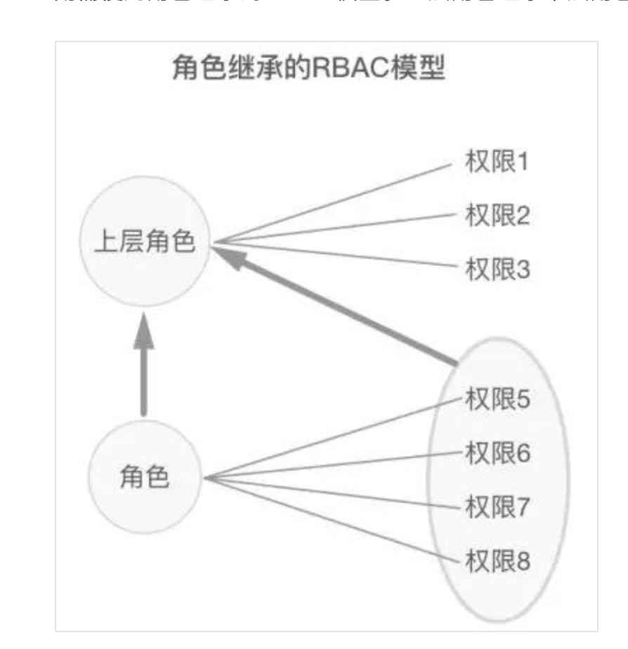
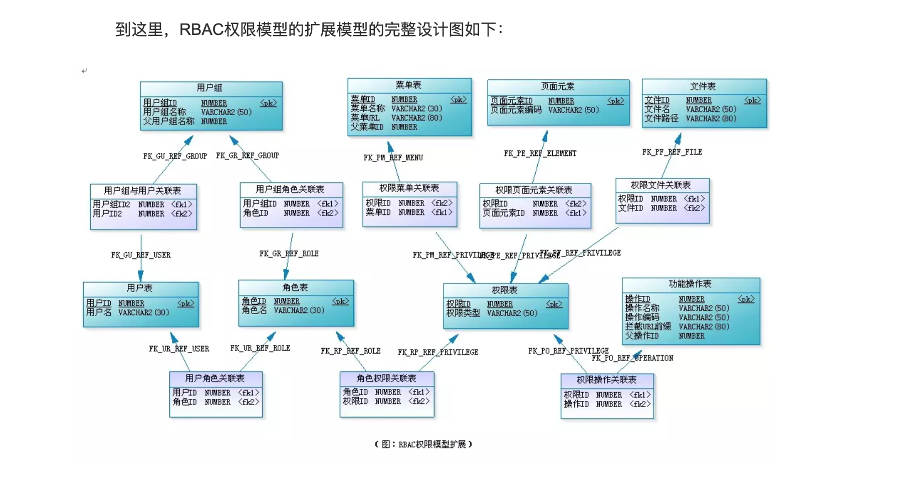

1、RBAC权限模型
2、
3、

---------------------------------------------------------------------------------------------------------------------

RBAC权限模型

在业界接受度较高的功能权限模型是 RBAC（Role-Based Access Control）模型，其基本理念是将「角色」这个概念赋予用户，在系统中用户与权限之间通过角色进行关联，以这样的方法来实现灵活配置。

用户User（用户组）
角色Role（角色组）
权限Permission（权限组）

用户--------角色---------权限
  \        /   \        /
   \      /     \      /
    用户组        权限组

权限一般的权限由页面权限、操作权限和数据权限构成
页面权限：
操作权限：增删改查等
数据权限：

参考
https://www.jianshu.com/p/179d6299bdd1

---------------------------------------------------------------------------------------------------------------------

---------------------------------------------------------------------------------------------------------------------

---------------------------------------------------------------------------------------------------------------------

