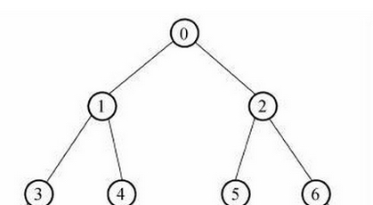

参考
/Users/yangzl/git/quickstart-database/doc
/Users/yangzl/git/quickstart-framework/quickstart-document/doc/base/db

数据库问题：
索引分类，有什么用，有什么优缺点，为什么可以加快查询，怎么检查一个SQL是否走索引，
聚集索引、非聚集索引、覆盖索引（复合索引或者多字段索引查询），不加索引（全表扫描）
  B-tree 或者 B+tree
  占用空间，增删改变慢

数据库：范式、索引、优化、锁、oracle、mysql、mybatis

数据库的锁：表级锁、页级锁、行级锁，悲观锁、乐观锁
查找算法分类：

mysql的主从是怎么实现的
mysql当表达到一定数量，查询变慢，为什么？感觉是数据库优化的问题，建索引、分库分表、主从读写分离

mysql主从同步基于什么来做的？
mysql为什么一张表到了一定量查询会变慢？

一个 SQL 语句的具体执行过程，比如会怎么利用索引，怎么优化之类的

MySQL为我们提供了一个分析sql语句执行计划的利器，那就是explain。通过explain我们可以分析一个sql语句完整的执行计划，包括使用的索引，扫描的行数以及是否使用了文件排序等等，在我们分析sql语句，优化sql语句中具有重要的意义。

MySQL：使用explain来分析sql语句:select_type(查询类型)，table（查询时使用的表名）、possible_keys（可能使用到的索引，不是最终使用的索引）、key（查询中真正使用的索引）、rows（sql执行过程中需要扫描到的行数。对于innodb引擎来说，这个值通常是一个估计值。这个值越小越好。）
Oracle：EXPLAIN PLAN FOR sql语句;
执行计划中字段解释：
       ID: 一个序号，但不是执行的先后顺序。执行的先后根据缩进来判断。
       Operation： 当前操作的内容。
       Rows： 当前操作的Cardinality，Oracle估计当前操作的返回结果集。
       Cost（CPU）：Oracle 计算出来的一个数值（代价），用于说明SQL执行的代价。
       Time：Oracle 估计当前操作的时间。

数据库优化：
1) SQL语句及索引的优化
2) 数据库表结构的优化
数据库架构扩展：主从复制与读写分离、增加缓存、分库、分表、分区，开启慢查询日志，
3) 系统配置的优化
4) 硬件优化

SQL优化原则：
1、查询使用索引，避免查询索引失效的语句
2、部分UPDATE、SELECT 语句 写得很复杂（经常嵌套多级子查询）拆分
3、在可以使用UNION ALL的语句里，使用了UNION，UNION 因为会将各查询子集的记录做比较（去重），故比起UNION ALL ，通常速度都会慢上许多。
4、限制使用select * from table这种方式：两者差别几乎可忽略。所以查询所有字段（或者大多数字段）的时候，大可select *来操作。如果某些不需要的字段数据量特别大，还是写清楚字段比较好，因为这样可以减少网络传输。考虑到今后的扩展性和可维护性，因为程序里面你需要使用到的列毕竟是确定的
5、避免使用耗费资源的操作，带有DISTINCT,UNION,MINUS,INTERSECT,ORDER BY的SQL语句会启动SQL引擎 执行，耗费资源的排序(SORT)功能. DISTINCT需要一次排序操作, 而其他的至少需要执行两次排序
6、慎重使用临时表可以极大的提高系统性能

索引建立：
主键、数据量大、查询条件的字段，不要在对于大的文本字段甚至超长字段，不要建索引；

1、避免对列的操作：在SQL编译的时候，就可以查询编译时就能得到，那么就可以被SQL优化器优化，使用索引，避免全表扫描
2、避免不必要的类型转换
3、增加查询的范围限制
4、尽量去掉"IN"、"OR"、 "<>"、去掉Where子句中的IS NULL和IS NOT NULL，因为使索引失效；
不要在建立的索引的数据列上进行下列操作:
◆避免对索引字段进行计算操作
◆避免在索引字段上使用not，<>，!=
◆避免在索引列上使用IS NULL和IS NOT NULL
◆避免在索引列上出现数据类型转换
◆避免在索引字段上使用函数
◆避免建立索引的列中使用空值。
在WHERE 语句中，尽量避免对索引字段进行计算操作
where 中的like 使用了%express%,尽量固化查询字段，比如express%

如果查询的表完全没有顺序，那么一个要返回记录数小于10％的查询可能会读取表中大部分的数据块，这样使用索引会使查询效率提高很多。但是如果表非常有顺序，那么如果查询的记录数大于40％时，可能使用全表扫描更快。因此，有一个索引范围扫描的总体原则是：
      1) 对于原始排序的表  仅读取少于表记录数40％的查询应该使用索引范围扫描。反之，读取记录数目多于表记录数的40％的查询应该使用全表扫描。
      2) 对于未排序的表    仅读取少于表记录数7％的查询应该使用索引范围扫描。反之，读取记录数目多于表记录数的7％的查询应该使用全表扫描。

ANALYZE TABLE 作用的对象是 InnoDB, NDB, 和 MyISAM 表，对视图不起作用。在分析期间，会对表加上read lock(InnoDB, MyISAM) , 如果自从上次分析之后，表没有发生变化，则不会被再次分析。

Cardinality 的意思是基数，也就是不重复的记录的数目，对于索引来讲，Cardinality越大越好，最好接近真实的记录数，如果Cardinality太小，则索引就失去意义了。

select *与select 所有字段的查询效率比较
结论：两者差别几乎可忽略。所以查询所有字段（或者大多数字段）的时候，大可select *来操作。如果某些不需要的字段数据量特别大，还是写清楚字段比较好，因为这样可以减少网络传输。

（1）SELECT *，需要数据库先 Query Table Metadata For Columns，一定程度上为数据库增加了负担。 
但是实际上，两者效率差别不大。
（2）考虑到今后的扩展性。 
因为程序里面你需要使用到的列毕竟是确定的， SELECT * 只是减少了一句 SQL String 的长度，并不能减少其他地方的代码。
综上：除平时练习使用，其他情况都不推荐使用 SELECT * FROM xxx

https://blog.csdn.net/xusheng__zhang/article/details/78949107
https://blog.csdn.net/LoveLion/article/details/8462814
http://database.51cto.com/art/200904/118526.htm
https://juejin.im/entry/5adfef105188256712782f68

https://blog.csdn.net/qingsong3333/article/details/77170831
数据库优化：https://blog.csdn.net/baidu_37107022/article/details/77460464

如何设计一个高并发的系统
1) 数据库的优化，包括合理的事务隔离级别、SQL语句优化、索引优化
2) 使用缓存、尽量减少数据库IO
3) 分布式数据库、分布式缓存
4) 服务器的负载均衡

---------------------------------------------------------------------------------------------------------------------
1、DML、DDL、DCL的区别
DDL（data definition language）数据库定义语言：CREATE、ALTER、DROP等
DCL（Data Control Language）数据库控制语言：包括（grant,deny,revoke等）语句
DML（data manipulation language）数据操纵语言:常用到的 SELECT、UPDATE、INSERT、DELETE。

2、SQL优化：执行计划和Hint：EXPLAIN 或 EXPLAIN PLAN FOR 、/*+ all_rows */

查看执行计划：mysql：EXPLAIN  或者 oracle：EXPLAIN PLAN FOR
访问数据扫描方式：全表扫描、通过ROWID的扫描、索引扫描（索引唯一扫描、索引范围扫描、索引全扫描、索引快速扫描）
表之间连接：四种
SQL优化：执行计划和Hint（提示）、SQL语句优化
SQL语句优化：优化语句使用索引、加Hint(提示)

3、
SQL唯一约束、主键、外键
三范式：
第一范式(1NF)：定义所需要的数据项、确保有数据没有重复的组、确保有一个主键、
第二范式(2NF)：满足所有1NF的规则，必须有任意列不依赖主键关系
第三范式(3NF)：满足第二范式 、所有非主字段都是依赖于主键

第一范式是最基本的范式。如果数据库表中的所有字段值都是不可分解的原子值，就说明该数据库表满足了第一范式。
第二范式：在一个数据库表中，一个表中只能保存一种数据，不可以把多种数据保存在同一张数据库表中。也就是一类，比如订单信息和客户信息分成两个表
第三范式需要确保数据表中的每一列数据都和主键直接相关，而不能间接相关。

Select、where、order by、COUNT、HAVING 、

锁表原因及解决思路

4、redis怎么防止内存穿透，怎么做到缓存和数据库一致
5、数据库中事务的四大特性（ACID）
6、数据库深度分页
7、什么是数据库事务
  事务（Transaction）的隔离级别SQL标准定义了4种事务隔离级别：读未提交，读已提交，可重复读，串行化
  分别解决了：脏读、不可重复读、幻读

8、数据库优化套路
分库分表、优化SQL语句、执行计划和Hint（提示）

9、
  1、数据库事务的4大特性、数据库隔离级别，索引类别，oracle的SID 实例  explain
  2、数据库，innobd，隔离级别，行级锁
  3、数据库事务，事务特性，隔离界别（解决什么问题），怎么实现？
  4、索引的作用，结构，为什么可以加快查询，缺点
  聚集索引、非聚集索引、覆盖索引
  B-tree 或者 B+tree
  占用空间，增删改变慢
  

10、锁表原因及解决思路

11、
JDBC规范提供的接口和类 
Statement、PreparedStatement、CallableStatement区别

12、mybatis中的 $｛param｝与#｛param｝区别

13、mysql主从复制
主从好处：数据安全备份、读写分离、业务数据分库存储
主从原理：主库的binlog、position输出线程、从库的I/O线程接收binlog、position线程 和 从库的SQL线程

mysql主从复制存在的问题：
主库宕机后，数据可能丢失
从库只有一个sql Thread，主库写压力大，复制很可能延时

解决方法：
半同步复制—解决数据丢失的问题
并行复制—-解决从库复制延迟的问题

14、Oracle
JDBC 链接oracle的三种URL写法：SID方式 、ServerName方式、RAC方式 

SID是数据库实例的名字
Service_name参数，该参数对应一个数据库，而不是一个实例
一个数据库对应多个实例（SID）
一个数据库可以对应多个Service_name

Oracle序列的创建

15、数据库
   quickstart-framework/quickstart-document/doc/base/db

16、

17、

18、

19、

20、

21、

22、

23、

24、

25、
---------------------------------------------------------------------------------------------------------------------

数据库事务：
定义：一致性、隔离性
特性：ACID
事务隔离级别：Read uncommitted、Read committed、Repeatable read、Serializable：实现原理：共享锁、独占锁、行级锁、表级锁
1、实现原理是，读数据时候不加锁，写数据时候加行级别的共享锁，提交时释放锁。
2、实现原理是，事务读取数据（读到数据的时候）加行级共享锁，读完释放；事务写数据时候（写操作发生的瞬间）加行级独占锁，事务结束释放。【读到数据的时候才加锁】
3、和读提交数据不同的是，事务读取数据在读操作开始的瞬间就加上行级共享锁，而且在事务结束的时候才释放。【未读就开始加锁】
4、实现原理是，在读操作时，加表级共享锁，事务结束时释放；写操作时候，加表级独占锁，事务结束时释放。【前面都是行级锁，串行化是表级锁】
事务隔离解决问题：脏读、不可重复读、幻读
怎么实现ACID：并发控制、日志
并发控制：2PL、OCC、MVCC
日志：redo/undo、WAL

DB深度分页：覆盖索引、主键索引+join、倒序排列、缓存若干页、业务不允许查太多页

---------------------------------------------------------------------------------------------------------------------
什么样的sql不走索引：where条件上索引列有计算、比较等操作，%%通配符，使用or关键字等等
http://blog.csdn.net/bigtree_3721/article/details/72471206
http://jaskey.github.io/blog/2016/01/19/mysql-bad-sql-with-no-index/
 http://blog.csdn.net/m0_37808356/article/details/72526687
 
 
 检查SQL是否使用了索引：
 mysql:key列显示MySQL实际决定使用的键（索引）
 用explain 来执行检验sql 例如
 explain select * from a
 
 Explain用来分析 SQL 语句，分析结果中比较重要的字段有：
 select_type : 查询类型，有简单查询、联合查询和子查询
 key : 使用的索引
 rows : 扫描的行数
 
 oracle
 explain Plan在sqlplus中使用起来非常的便捷，使用方法如下
 sec@ora10g> explain plan for select count(*) from t;
 
 
 深入理解 MySQL 底层实现
 http://blog.csdn.net/gitchat/article/details/78787837
 MySQL 的相关优化
 1. MySQL 性能优化：组成、表的设计
 开启查询缓存。避免某些 SQL 函数直接在 SQL 语句中使用，从而导致 Mysql 缓存失效。
 避免画蛇添足。目的是什么就取什么，例如某个逻辑是只需要判断是否存在女性，若是查到了一条即可，勿要全部都查一遍，此时要善用 limit。
 建合适的索引。所以要建在合适的地方，合适的对象上。经常操作 / 比较 / 判断的字段应该建索引。
 字段大小合宜。字段的取值是有限而且是固定的，这种情况下可以用 enum，IP 字段可以用 unsigned int 来存储。
 表的设计。垂直分割表，使得固定表与变长表分割，从而降低表的复杂度和字段的数目。
 
 2. SQL 语句优化：避免全表扫描
 建索引：一般在 where 及 order by 中涉及到的列上建索引，尽量不要对可以重复的字段建索引。
 尽量避免在 where 中使用 !（<>）或 or，也不要进行 null 值判断。
 尽量避免在 where 中对字段进行函数操作、表达式操作。
 尽量避免使用 like- %，在此种情况下可以进行全文检索。
 
 mysql分页查询：limit，oracle分页：ROWNUM
 
 MySQL行级锁、表级锁、页级锁
 http://www.jb51.net/article/50047.htm
 http://www.hollischuang.com/archives/914
 http://www.cnblogs.com/chenqionghe/p/4845693.html
 页级:引擎 BDB。
 表级:引擎 MyISAM ， 理解为锁住整个表，可以同时读，写不行
 行级:引擎 INNODB ， 单独的一行记录加锁
 
 表级，直接锁定整张表，在你锁定期间，其它进程无法对该表进行写操作。如果你是写锁，则其它进程则读也不允许
 行级,，仅对指定的记录进行加锁，这样其它进程还是可以对同一个表中的其它记录进行操作。
 页级，表级锁速度快，但冲突多，行级冲突少，但速度慢。所以取了折衷的页级，一次锁定相邻的一组记录。
 
 
 oracle的行级锁与表级锁
 https://www.cnblogs.com/li1111xin/p/4775240.html
 
 悲观锁（加的是表级锁）
 一方：查询语句加 for update;另一方：查询语句加 for update;当进行更新语句的时候，另一方不能进行更新操作
 
 乐观锁
 更新语句设置版本号或者时间，在指定版本中更新数据
 
 如果更新多，查询少，用悲观锁；反之，乐观锁
 表级锁，where用的是非主键
 行级锁，where用主键一般是id
 如果用表级锁，其他客户将不能进行查询操作，因此开发中记得用行级锁
 对于MySQL，如果表锁是读锁，可以并发读，如果是写锁，就会阻止读和写
 
 查询慢可能原因：
 1、数据量大
 2、没有建主键和索引
 3、sql中有排序
 4、left join是相当耗资源的操作，如果关联的字段没有索引的话，速度是很慢的，所以如果有left join的话，最好用索引字段取关联。或者给关联的字段加索引，将left join右边的表数据补齐，然后将left join 替换为 inner join。我试过，速度确实快很多
 
 一般不会影响查询效率：
 sql包含数据处理函数，比如nvl函数,case when函数等
 使用inner join查询
 
 
 数据库中主键与索引的区别：
 主键ID，主键既是约束也是索引，同时也用于对象缓存的键值。
 区别:
 1:主键是为了标识数据库记录唯一性,不允许记录重复,且键值不能为空,主键也是一个特殊索引.
 2:数据表中只允许有一个主键,但是可以有多个索引.
 3.使用主键会数据库会自动创建主索引,也可以在非主键上创建索引,方便查询效率.
 4:索引可以提高查询速度,它就相当于字典的目录,可以通过它很快查询到想要的结果,而不需要进行全表扫描.
 5:主键索引外索引的值可以为空. 
 6:主键也可以由多个字段组成,组成复合主键,同时主键肯定也是唯一索引.
 7:唯一索引则表示该索引值唯一,可以由一个或几个字段组成,一个表可以有多个唯一索引.
 
 索引详解：
 https://www.cnblogs.com/aspwebchh/p/6652855.html
 http://blog.csdn.net/weiliangliang111/article/details/51333169
 http://blog.csdn.net/suifeng3051/article/details/52669644
 加索引能使查询变快，加索引后会使写入、修改、删除变慢，占用存储空间
 主流的RDBMS都是把平衡树（平衡树」(非二叉)，也就是b tree或者 b+ tree，比如MySQL就普遍使用B+Tree实现其索引结构）当做数据表默认的索引数据结构的，有的数据库也使用哈希桶作用索引的数据结构
 一个没加主键的表，它的数据无序的放置在磁盘存储器上，一行一行的排列的很整齐， 跟我认知中的「表」很接近。
 如果给表上了主键，那么表在磁盘上的存储结构就由整齐排列的结构转变成了树状结构，也就是上面说的「平衡树」结构，换句话说，就是整个表就变成了一个索引，也就是所谓的「聚集索引」，这就是为什么一个表只能有一个主键， 一个表只能有一个「聚集索引」，因为主键的作用就是把「表」的数据格式转换成「索引（平衡树）」的格式放置。
 平时建表的时候都会为表加上主键， 在某些关系数据库中， 如果建表时不指定主键，数据库会拒绝建表的语句执行。 事实上， 一个加了主键的表，并不能被称之为「表」。
 
 
 索引能让数据库查询数据的速度上升， 而使写入数据的速度下降，原因很简单的， 因为平衡树这个结构必须一直维持在一个正确的状态， 增删改数据都会改变平衡树各节点中的索引数据内容，破坏树结构， 因此，在每次数据改变时， DBMS必须去重新梳理树（索引）的结构以确保它的正确，这会带来不小的性能开销，也就是为什么索引会给查询以外的操作带来副作用的原因。
 
 非聚集索引和聚集索引一样， 同样是采用平衡树作为索引的数据结构。索引树结构中各节点的值来自于表中的索引字段， 假如给user表的name字段加上索引 ， 那么索引就是由name字段中的值构成，在数据改变时， DBMS需要一直维护索引结构的正确性。如果给表中多个字段加上索引 ， 那么就会出现多个独立的索引结构，每个索引（非聚集索引）互相之间不存在关联。
 
 每次给字段建一个新索引， 字段中的数据就会被复制一份出来， 用于生成索引。 因此， 给表添加索引，会增加表的体积， 占用磁盘存储空间。
 
 非聚集索引和聚集索引的区别在于， 通过聚集索引可以查到需要查找的数据， 而通过非聚集索引可以查到记录对应的主键值 ， 再使用主键的值通过聚集索引查找到需要的数据
 
 这句SQL语句的执行过程如下
 首先，通过非聚集索引查找到记录的主键ID值
 然后，通过得到的主键ID值执行聚集索引查找，找到主键ID值对就的真实数据（数据行）存储的位置
 最后， 从得到的真实数据中取得所查字段的值返回， 也就是取得最终的结果
 
 覆盖索引：
 有一种例外可以不使用聚集索引就能查询出所需要的数据， 这种非主流的方法 称之为「覆盖索引」查询， 也就是平时所说的复合索引或者多字段索引查询。
 当为字段建立索引以后， 字段中的内容会被同步到索引之中， 如果为一个索引指定两个字段， 那么这个两个字段的内容都会被同步至索引之中。
 所以如果只查询这两个字段，不需要通过主键ID值的查找数据行的真实所在， 直接取得叶节点中的值返回即可。 通过这种覆盖索引直接查找的方式， 可以省略不使用覆盖索引查找的后面两个步骤， 大大的提高了查询性能
 
 不加索引：
 在查询到第一个符合条件的行后，不能停止查询，因为可能还有其他符合条件的行。所以，必须一行一行的查找直到最后一行-这就意味数据库不得不检查上千行数据才能找到所以名字为Jesus的雇员。这就是所谓的全表扫描。
 
 
 
 查找算法：
 1、最基本的查询算法当然是顺序查找（linear search），也就是对比每个元素的方法，不过这种算法在数据量很大时效率是极低的。 
 数据结构：有序或无序队列 
 复杂度：O(n) 
 
 2、二分查找（binary search）
 数据结构：有序数组 
 复杂度：O(logn) 
 
 3、二叉排序树的特点是：
 
 若它的左子树不空，则左子树上所有结点的值均小于它的根结点的值；
 若它的右子树不空，则右子树上所有结点的值均大于它的根结点的值；
 它的左、右子树也分别为二叉排序树。
 搜索的原理：
 
 若b是空树，则搜索失败，否则：
 若x等于b的根节点的数据域之值，则查找成功；否则：
 若x小于b的根节点的数据域之值，则搜索左子树；否则：
 查找右子树。
 数据结构：二叉排序树 
 时间复杂度： O(log2N)
 
 4、哈希散列法(哈希表)
 其原理是首先根据key值和哈希函数创建一个哈希表（散列表），燃耗根据键值，通过散列函数，定位数据元素位置。
 
 数据结构：哈希表 
 时间复杂度：几乎是O(1)，取决于产生冲突的多少，也就是链表长度，因为链表查找复杂度为O(n)
 
 5、分块查找
 分块查找又称索引顺序查找，它是顺序查找的一种改进方法。其算法思想是将n个数据元素”按块有序”划分为m块（m ≤ n）。每一块中的结点不必有序，但块与块之间必须”按块有序”；即第1块中任一元素的关键字都必须小于第2块中任一元素的关键字；而第2块中任一元素又都必须小于第3块中的任一元素，依次类推。 
 
 算法流程：
 先选取各块中的最大关键字构成一个索引表；
 查找分两个部分：先对索引表进行二分查找或顺序查找，以确定待查记录在哪一块中；然后，在已确定的块中用顺序法进行查找。
 
 
 6、平衡多路搜索树B树（B-tree）
 B树（Balance Tree）又叫做B- 树（其实B-是由B-tree翻译过来，所以B-树和B树是一个概念） ，它就是一种平衡多路查找树。
 
 首先从根节点进行二分查找，如果找到则返回对应节点的data，否则对相应区间的指针指向的节点递归进行查找，直到找到节点或找到null指针，前者查找成功，后者查找失败。
 例如一个度为d的B-Tree，设其索引N个key，则其树高h的上限为logd((N+1)/2)，检索一个key，其查找节点个数的渐进复杂度为O(logdN)
 
 由于插入删除新的数据记录会破坏B-Tree的性质，因此在插入删除时，需要对树进行一个分裂、合并、转移等操作以保持B-Tree性质
 
 
 7、B+Tree
 其实B-Tree有许多变种，其中最常见的是B+Tree，比如MySQL就普遍使用B+Tree实现其索引结构。
 
 
 树的概念：
 结点：指二叉树中一个个的点，就是下图中的0、1、2、3、4、5、6；
 度：指父结点下面有几个孩子结点，举两个例子你就明白了。针对结点1，他下面有两个孩子3、4，所以说结点1的度为2；针对结点4，他下面一个孩子都没有，所以说结点4的度为0；叶子就是度为0的结点。
 置于遍历有一点点麻烦，但要抓住以下要点就可以了（不管任何大小的树）：
 前序：是先访问根，再访问左子树，然后访问右子树
 后序：是先访问左子树，再访问右子树，然后访问根
 中序：是先访问左子树，再访问根，然后访问右子树
 完全二叉树，除了叶子结点这层外，其他层结点都是度为2的，所以这样的树高度应该最矮了。
 以下图为例子：
 前序序列：0134256后序序列：3415620中序序列：3140526
 
 

图论（离散数学）：

出度和入度
可以把人与人之间为识的关系对应到一个图中。如果a认识b就a->b连一条边。
有向图来说，结常与结点间的连接。V1到V2，V1到V3。说明V1的出度是2。V2到V1说明V1的入度是1

数据结构中入度出度分别用什么符号表示
入度：ID in degree
出度：OD out degree

有向图顶点集的度数是不是等于出度加入度
在一个有向图中，所有顶点的入度之和等于所有顶点出度之和，一条边必有起点和终点，这是同时存在的，不存在一条边只有起点或者只有终点，所以所有顶点的入度之和等于所有顶点出度之和

在有向图中，入度高的点和出度高的点各自的含义是不同的。粗浅地说，出度高的点我们往往叫做Authority，就是那种权威性很好，所以对其他点影响力较强或者输出信息较多的点。而相应的，入度比较高的点称为Hub，即那种作为中介的，从别人那里获取信息比较多的点。当然，计算Authority和Hub更权威的方法有HITS算法等，往往并非单纯依赖出入度这么简单。

度数这个概念仅适用于无向图，即相邻的点的个数（或者说是连接的边的个数）。在有向图中，一般来说只分开考虑入度和出度，基本上见不到说把两者加起来记做度数的。

索引数据结构设相关的计算机原理：

在计算机系统中一般包含两种类型的存储，计算机主存（RAM）和外部存储器（如硬盘、CD、SSD等）。主存的读取速度快，相对于主存，外部磁盘的数据读取速率要比主从慢好几个数量级，具体它们之间的差别后面会详细介绍。 上面讲的所有查询算法都是假设数据存储在计算机主存中的，计算机主存一般比较小，
实际数据库中数据都是存储到外部存储器的。一般来说，索引本身也很大，不可能全部存储在内存中，因此索引往往以索引文件的形式存储的磁盘上。这样的话，索引查找过程中就要产生磁盘I/O消耗，相对于内存存取，I/O存取的消耗要高几个数量级，所以评价一个数据结构作为索引的优劣最重要的指标就是在查找过程中磁盘I/O操作次数的渐进复杂度。换句话说，索引的结构组织要尽量减少查找过程中磁盘I/O的存取次数。

当系统需要读取主存时，则将地址信号放到地址总线上传给主存，主存读到地址信号后，解析信号并定位到指定存储单元，然后将此存储单元数据放到数据总线上，供其它部件读取。
写主存的过程类似，系统将要写入单元地址和数据分别放在地址总线和数据总线上，主存读取两个总线的内容，做相应的写操作。
主存存取的时间仅与存取次数呈线性关系

磁盘存取原理：每次读取数据花费的时间可以分为寻道时间、旋转延迟、传输时间三个部分
当需要从磁盘读取数据时，系统会将数据逻辑地址传给磁盘，磁盘的控制电路按照寻址逻辑将逻辑地址翻译成物理地址，即确定要读的数据在哪个磁道，哪个扇区
为了读取这个扇区的数据，需要将磁头放到这个扇区上方，为了实现这一点，磁头需要移动对准相应磁道，这个过程叫做寻道，所耗费时间叫做寻道时间
然后磁盘旋转将目标扇区旋转到磁头下，这个过程耗费的时间叫做旋转时间
最后便是对读取数据的传输
所以每次读取数据花费的时间可以分为寻道时间、旋转延迟、传输时间三个部分

寻道时间是磁臂移动到指定磁道所需要的时间，主流磁盘一般在5ms以下。
旋转延迟就是我们经常听说的磁盘转速，比如一个磁盘7200转，表示每分钟能转7200次，也就是说1秒钟能转120次，旋转延迟就是1/120/2 = 4.17ms。
传输时间指的是从磁盘读出或将数据写入磁盘的时间，一般在零点几毫秒，相对于前两个时间可以忽略不计。

局部性原理：当一个数据被用到时，其附近的数据也通常会马上被使用。
磁盘预读：由于磁盘顺序读取的效率很高（不需要寻道时间，只需很少的旋转时间），因此对于具有局部性的程序来说，预读可以提高I/O效率。预读的长度一般为页（page）的整倍数。页是计算机管理存储器的逻辑块，硬件及操作系统往往将主存和磁盘存储区分割为连续的大小相等的块，每个存储块称为一页（在许多操作系统中，页得大小通常为4k），主存和磁盘以页为单位交换数据。当程序要读取的数据不在主存中时，会触发一个缺页异常，此时系统会向磁盘发出读盘信号，磁盘会找到数据的起始位置并向后连续读取一页或几页载入内存中，然后异常返回，程序继续运行。

数据库系统的设计者巧妙利用了磁盘预读原理，将一个节点的大小设为等于一个页，这样每个节点只需要一次I/O就可以完全载入。为了达到这个目的，在实际实现B-Tree还需要使用如下技巧：每次新建节点时，直接申请一个页的空间，这样就保证一个节点物理上也存储在一个页里，加之计算机存储分配都是按页对齐的，就实现了一个node只需一次I/O。

B-Tree中一次检索最多需要h-1次I/O（根节点常驻内存），渐进复杂度为O(h)=O(logdN)。一般实际应用中，出度d是非常大的数字，通常超过100，因此h非常小（通常不超过3）。
综上所述，如果我们采用B-Tree存储结构，搜索时I/O次数一般不会超过3次，所以用B-Tree作为索引结构效率是非常高的。

B树的搜索复杂度为O(h)=O(logdN)，所以树的出度d越大，深度h就越小，I/O的次数就越少。B+Tree恰恰可以增加出度d的宽度，因为每个节点大小为一个页大小，所以出度的上限取决于节点内key和data的大小：
dmax=floor(pagesize/(keysize+datasize+pointsize))//floor表示向下取整
由于B+Tree内节点去掉了data域，因此可以拥有更大的出度，从而拥有更好的性能。

真实的情况是，3层的b+树可以表示上百万的数据，如果上百万的数据查找只需要三次IO，性能提高将是巨大的，如果没有索引，每个数据项都要发生一次IO，那么总共需要百万次的IO，显然成本非常非常高。

数据库隔离级别：四种
http://blog.csdn.net/gaopu12345/article/details/50868501
http://blog.csdn.net/tolcf/article/details/49283575

MySQL的默认隔离级别就是Repeatable read。

数据库事务的隔离级别有4个，由低到高依次为
Read uncommitted(未授权读取、读未提交)、可能出现脏读。也就是说事务B读取到了事务A未提交的数据。
Read committed（授权读取、读提交）、可能出现不可重复读。事务A事先读取了数据，事务B紧接了更新了数据，并提交了事务，而事务A再次读取该数据时，数据已经发生了改变。
Repeatable read（可重复读取）、可能出现幻读
Serializable（序列化）

√: 可能出现    ×: 不会出现
 						脏读	不可重复读	幻读
Read uncommitted		√				√				√
Read committed			×				√				√
Repeatable read			×				×				√
Serializable				×				×				×

Read uncommitted(未授权读取、读未提交)：
如果一个事务已经开始写数据，则另外一个事务则不允许同时进行写操作，但允许其他事务读此行数据。该隔离级别可以通过“排他写锁”实现。
避免了更新丢失，却可能出现脏读。也就是说事务B读取到了事务A未提交的数据。
Read committed（授权读取、读提交）：
读取数据的事务允许其他事务继续访问该行数据，但是未提交的写事务将会禁止其他事务访问该行。
该隔离级别避免了脏读，但是却可能出现不可重复读。事务A事先读取了数据，事务B紧接了更新了数据，并提交了事务，而事务A再次读取该数据时，数据已经发生了改变。
Repeatable read（可重复读取）：
读取数据的事务将会禁止写事务（但允许读事务），写事务则禁止任何其他事务。
避免了不可重复读取和脏读，但是有时可能出现幻读。这可以通过“共享读锁”和“排他写锁”实现。

Serializable（序列化）：
提供严格的事务隔离。它要求事务序列化执行，事务只能一个接着一个地执行，但不能并发执行。如果仅仅通过“行级锁”是无法实现事务序列化的，必须通过其他机制保证新插入的数据不会被刚执行查询操作的事务访问到。
序列化是最高的事务隔离级别，同时代价也花费最高，性能很低，一般很少使用，在该级别下，事务顺序执行，不仅可以避免脏读、不可重复读，还避免了幻像读。

（零）没有并发控制
存在的问题：更新遗失。 
解决办法就是下面的“可读取未确认”。

（一）可读取未确认（Read uncommitted）：
写事务阻止其他写事务，避免了更新遗失。但是没有阻止其他读事务。 读事务不会阻止其他任何事务。 
存在的问题：脏读。即读取到不正确的数据，因为另一个事务可能还没提交最终数据，这个读事务就读取了中途的数据，这个数据可能是不正确的。 
解决办法就是下面的“可读取确认”。

（二）可读取确认（Read committed）：
写事务会阻止其他读写事务。读事务不会阻止其他任何事务。 
存在的问题：不可重复读。即在一次事务之间，进行了两次读取，但是结果不一样，可能第一次id为1的人叫“李三”，第二次读id为1的人就叫了“李四”。因为读取操作不会阻止其他事务。 
解决办法就是下面的“可重复读”。

（三）可重复读（Repeatable read）：
读事务会阻止其他写事务，但是不会阻止其他读事务。 写事务会阻止其他读写事务
存在的问题：幻读。可重复读阻止的写事务包括update和delete（只给存在的表加上了锁），但是不包括insert（新行不存在，所以没有办法加锁），所以一个事务第一次读取可能读取到了10条记录，但是第二次可能读取到11条，这就是幻读。 
解决办法就是下面的“串行化”。

（四）可串行化（Serializable）：
读加共享锁，写加排他锁。这样读取事务可以并发，但是读写，写写事务之间都是互斥的，基本上就是一个个执行事务，所以叫串行化。

 
 
---------------------------------------------------------------------------------------------------------------------

---------------------------------------------------------------------------------------------------------------------

---------------------------------------------------------------------------------------------------------------------

---------------------------------------------------------------------------------------------------------------------

---------------------------------------------------------------------------------------------------------------------

---------------------------------------------------------------------------------------------------------------------

---------------------------------------------------------------------------------------------------------------------

---------------------------------------------------------------------------------------------------------------------

---------------------------------------------------------------------------------------------------------------------

---------------------------------------------------------------------------------------------------------------------

---------------------------------------------------------------------------------------------------------------------

---------------------------------------------------------------------------------------------------------------------

---------------------------------------------------------------------------------------------------------------------

---------------------------------------------------------------------------------------------------------------------

---------------------------------------------------------------------------------------------------------------------

---------------------------------------------------------------------------------------------------------------------

---------------------------------------------------------------------------------------------------------------------

---------------------------------------------------------------------------------------------------------------------

---------------------------------------------------------------------------------------------------------------------

---------------------------------------------------------------------------------------------------------------------

---------------------------------------------------------------------------------------------------------------------

数据库：数据源（）、druid、h2、sqlite、yugong、，mybatis、liquibase、jooq、sharding-sphere、thinkjd

