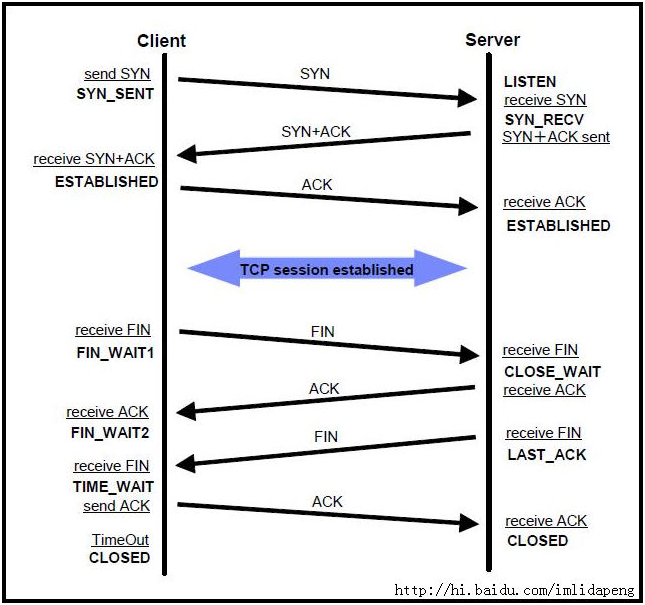

---------------------------------------------------------------------------------------------------------------------
1、
熟悉常用网络协议，如TCP/IP, HTTP;
ajax请求流程，ajax状态码，http状态码
  OSI七层与TCP/IP五层网络架构
  TCP/IP连接过程：三次握手四次挥手
  采用三次握手是：为了防止失效的连接请求报文段突然又传送到主机 B ，因而产生错误
  收到server的FIN之后会进入TIME_WAIT状态将持续2个MSL(Max Segment Lifetime)原因
  http连接过程：域名解析 --> 发起TCP的3次握手 --> 建立TCP连接后发起http请求 --> 服务器响应http请求，浏览器得到html代码 --> 浏览器解析html代码，并请求html代码中的资源（如js、css、图片等） --> 浏览器对页面进行渲染呈现给用户
  存在的问题：不安全，被监听，被伪装，被篡改
  https连接过程：+SSL层，过程是先非对称协商秘钥，然后进行加密传输
  HTTP状态码
   TCP粘包、拆包问题
   

2、网络：
  http和TCP
  http和http2的区别:http、https、spdy、http2
  Socket和TCP/IP

3、

4、

5、

6、

7、

8、

9、

10、

11、

12、

13、

14、

15、

16、

17、

18、

19、

20、

21、

22、

23、

24、

25、

http调用：feign、httpClient、okhttp、unirest、jdk、jersey-http

网络：
1、TCP/IP 三次握手 四次挥手
2、Http的格式说明、状态码说明
3、进程间通信方式

---------------------------------------------------------------------------------------------------------------------
OSI七层与TCP/IP五层网络架构详解
http://network.51cto.com/art/201310/413853.htm
http://blog.csdn.net/cc1949/article/details/79063439
OSI七层模型
7层是指OSI七层协议模型，主要是：应用层（Application）、表示层（Presentation）、会话层（Session）、传输层（Transport）、网络层（Network）、数据链路层（Data Link）、物理层（Physical）。

OSI中的层 功能 TCP/IP协议族
应用层 文件传输，电子邮件，文件服务，虚拟终端 TFTP，HTTP，SNMP，FTP，SMTP，DNS，Telnet
表示层 数据格式化，代码转换，数据加密 没有协议
会话层 解除或建立与别的接点的联系 没有协议
传输层 提供端对端的接口 TCP，UDP
网络层 为数据包选择路由 IP，ICMP，RIP，OSPF，BGP，IGMP
数据链路层 传输有地址的帧以及错误检测功能 SLIP，CSLIP，PPP，ARP，RARP，MTU
物理层 以二进制数据形式在物理媒体上传输数据 ISO2110，IEEE802，IEEE802.2

(2)TCP/IP五层模型的协议
五层体系结构包括：应用层、运输层、网络层、数据链路层和物理层。

传输层：四层交换机、也有工作在四层的路由器
网络层：路由器、三层交换机
数据链路层：网桥(现已很少使用)、以太网交换机(二层交换机)、网卡(其实网卡是一半工作在物理层、一半工作在数据链路层)
物理层：中继器、集线器、还有我们通常说的双绞线也工作在物理层
---------------------------------------------------------------------------------------------------------------------
http、tcp/ip和socket的区别
tcp/ip协议的详解
http状态码

有两种缓存方法：让代理服务器进行缓存和让客户端浏览器进行缓存。
Cache-Control 用于控制缓存的行为。Cache-Control: no-cache 有两种含义，如果是客户端向缓存服务器发送的请求报文中含有该指令，表示客户端不想要缓存的资源；如果是源服务器向缓存服务器发送的响应报文中含有该指令，表示缓存服务器不能对资源进行缓存。
Expires 字段可以用于告知缓存服务器该资源什么时候会过期。当首部字段 Cache-Control 有指定 max-age 指令时，比起首部字段 Expires，会优先处理 max-age 指令。

TCPIP、Http、Socket的区别
http://blog.csdn.net/lu123535884/article/details/43270041
https://www.cnblogs.com/fuyuanming/articles/4848250.html

网络由下往上分为
　　物理层、数据链路层、网络层、传输层、会话层、表示层和应用层。
　　IP协议对应于网络层，TCP协议对应于传输层，而HTTP协议对应于应用层。
　　三者从本质上来说没有可比性。
       socket则是对TCP/IP协议的封装和应用。 
　　也可以说，TPC/IP协议是传输层协议，主要解决数据如何在网络中传输，
　　而HTTP是应用层协议，主要解决如何包装数据。
关于TCP/IP和HTTP协议的关系，网络有一段比较容易理解的介绍：
　　“我们在传输数据时，可以只使用(传输层)TCP/IP协议，但是那样的话，如果没有应用层，便无法识别数据内容。
　　如果想要使传输的数据有意义，则必须使用到应用层协议。
　　应用层协议有很多，比如HTTP、FTP、TELNET等，也可以自己定义应用层协议。
　　WEB使用HTTP协议作应用层协议，以封装HTTP文本信息，然后使用TCP/IP做传输层协议将它发到网络上。”
　　而我们平时说的最多的socket是什么呢，实际上socket是对TCP/IP协议的封装，Socket本身并不是协议，而是一个调用接口(API)。
　　通过Socket，我们才能使用TCP/IP协议。
　　实际上，Socket跟TCP/IP协议没有必然的联系。
　　所以说，Socket的出现只是使得程序员更方便地使用TCP/IP协议栈而已，是对TCP/IP协议的抽象，
总结：
socket是针对TCP/IP协议开放的API。
自建socket等于废弃应用层的协议（例如http），自己新建应用层协议（所以 socket套接字要绑定端口，类似于http要一个端口）。再换句话说，http是用socket实现了TCP/IP。
因为socket是针对TCP/IP协议开放的API，所以socket是有三次握手这样的特性的。

    而我们平时说的最多的socket是什么呢，实际上socket是对TCP/IP协议的封装，Socket本身并不是协议，而是一个调用接口(API)。 通过Socket，我们才能使用TCP/IP协议。实际上，Socket跟TCP/IP协议没有必然的联系。Socket编程接口在设计的时候，就希望也 能适应其他的网络协议。所以说，Socket的出现只是使得程序员更方便地使用TCP/IP协议栈而已，是对TCP/IP协议的抽象，从而形成了我们知道 的一些最基本的函数接口，比如create、listen、connect、accept、send、read和write等等。网络有一段关于 socket和TCP/IP协议关系的说法比较容易理解：“TCP/IP只是一个协议栈，就像操作系统的运行机制一样，必须要具体实现，同时还要提供对外 的操作接口。这个就像操作系统会提供标准的编程接口，比如win32编程接口一样，TCP/IP也要提供可供程序员做网络开发所用的接口，这就是 Socket编程接口。”
   
   HTTP是轿车，提供了封装或者显示数据的具体形式;Socket是发动机，提供了网络通信的能力。实际上，传输层的TCP是基于网络层的IP协议的，而应用层的HTTP协议又是基于传输层的TCP协议的，而Socket本身不算是协议，就像上面所说，它只是提供了一个针对TCP或者UDP编程的接口。 
    
   TCP是面向链接的，虽然说网络的不安全不稳定特性决定了多少次握手都不能保证连接的可靠性，但TCP的三次握手在最低限度上(实际上也很大程度上 保证了)保证了连接的可靠性;而UDP不是面向连接的，UDP传送数据前并不与对方建立连接，对接收到的数据也不发送确认信号，发送端不知道数据是否会正 确接收，当然也不用重发，所以说UDP是无连接的、不可靠的一种数据传输协议。 

HTTP协议
http://www.blogjava.net/zjusuyong/articles/304788.html

HTTP协议永远都是客户端发起请求，服务器回送响应。这样就限制了使用HTTP协议，无法实现在客户端没有发起请求的时候，服务器将消息推送给客户端。

HTTP状态码：https://www.cnblogs.com/hjxcode/p/5663830.html
http://blog.csdn.net/ahzxj2012/article/details/52510491
Type	Reason-phrase	Note
1XX	Informational	信息性状态码，表示接受的请求正在处理
2XX	Success	成功状态码，表示请求正常处理完毕
3XX	Redirection	重定向状态码，表示需要客户端需要进行附加操作
4XX	Client Error	客户端错误状态码，表示服务器无法处理请求
5XX	Server Error	服务器错误状态码，表示服务器处理请求出错

TCPIP：三次握手四次挥手，查看TCP连接状态数量：netstat -n | awk '/^tcp/ {++S[$NF]} END {for(a in S) print a, S[a]}' 
http://blog.csdn.net/linux_ever/article/details/51136723
http://blog.csdn.net/whuslei/article/details/6667471
https://www.cnblogs.com/Jessy/p/3535612.html
收到server的FIN之后会进入TIME_WAIT状态将持续2个MSL(Max Segment Lifetime)
原因有二：
一、Client重发可能丢失的ACK报文：保证TCP协议的全双工连接能够可靠关闭,保证Server端收到ACK，如果Server端未收到ACK，会再次收到Server的FIN，可以再次发送ACK
二、保证这次连接的重复数据段从网络中消失，下次相同IP和Port不会再接收本次连接滞留在网络中的数据，如果新建的连接和上次的port相同，之前关闭的连接的数据滞留在网络再次发送到Server，Server会认为是新的连接发送的，导致数据混淆

TCP连接需要三次握手分开需要四次挥手：
TCP三次握手过程
1 主机A通过向主机B 发送一个含有同步序列号的标志位的数据段给主机B ,向主机B 请求建立连接,通过这个数据段,
主机A告诉主机B 两件事:我想要和你通信;你可以用哪个序列号作为起始数据段来回应我.
2 主机B 收到主机A的请求后,用一个带有确认应答(ACK)和同步序列号(SYN)标志位的数据段响应主机A,也告诉主机A两件事:
我已经收到你的请求了,你可以传输数据了;你要用哪个序列号作为起始数据段来回应我
3 主机A收到这个数据段后,再发送一个确认应答,确认已收到主机B 的数据段:"我已收到回复,我现在要开始传输实际数据了

采用三次握手是：为了防止失效的连接请求报文段突然又传送到主机 B ，因而产生错误

4次断开
1 当主机A完成数据传输后,将控制位FIN置1,提出停止TCP连接的请求
2 主机B收到FIN后对其作出响应,确认这一方向上的TCP连接将关闭,将ACK置1
3 由B 端再提出反方向的关闭请求,将FIN置1
4 主机A对主机B的请求进行确认,将ACK置1,双方向的关闭结束.
由TCP的三次握手和四次断开可以看出,TCP使用面向连接的通信方式,大大提高了数据通信的可靠性,使发送数据端
和接收端在数据正式传输前就有了交互,为数据正式传输打下了可靠的基础

TCP状态码：

各个状态的意义如下： 
1、Client：发送SYN后
SYN-SENT -在发送连接请求后等待匹配的连接请求； 
2、Server：接受到SYN，并且发送ACK后
LISTEN - 侦听来自远方TCP端口的连接请求； 
SYN-RECEIVED - 在收到和发送一个连接请求后等待对连接请求的确认； 
3、Clinet+Server：Clinet发送ACK后，Server接收到ACK后
ESTABLISHED- 代表一个打开的连接，数据可以传送给用户； 

1、Client发送FIN后
FIN-WAIT-1 - 等待远程TCP的连接中断请求，或先前的连接中断请求的确认；

2、Server接收到FIN，并且返回ACK
CLOSE-WAIT - 等待从本地用户发来的连接中断请求； 

3、Client收到ACK后
FIN-WAIT-2 - 从远程TCP等待连接中断请求； 

4、Server发送FIN后
LAST-ACK - 等待原来发向远程TCP的连接中断请求的确认； 

5、Client接受FIN并且返回ACK
TIME-WAIT -等待足够的时间以确保远程TCP接收到连接中断请求的确认； 

6、Server接收到ACK和Client等待2个MSL(Max Segment Lifetime)后TimeOut超时
CLOSED - 没有任何连接状态；

CLOSING -等待远程TCP对连接中断的确认； 

SYN_RECV 状态：
服务端收到建立连接的SYN没有收到ACK包的时候处在SYN_RECV状态。

一般服务器都会设置net.ipv4.tcp_syncookies=1来防止SYN Flood攻击。假设一个用户向服务器发送了SYN报文后突然死机或掉线，那么服务器在发出SYN+ACK应答报文后是无法收到客户端的ACK报文的（第三次握手无法完成），这种情况下服务器端一般会重试（再次发送SYN+ACK给客户端）并等待一段时间后丢弃这个未完成的连接，这段时间的长度我们称为SYN Timeout，一般来说这个时间是分钟的数量级（大约为30秒-2分钟）。
这些处在SYNC_RECV的TCP连接称为半连接，并存储在内核的半连接队列中，在内核收到对端发送的ack包时会查找半连接队列，并将符合的requst_sock信息存储到完成三次握手的连接的队列中，然后删除此半连接。大量SYNC_RECV的TCP连接会导致半连接队列溢出，这样后续的连接建立请求会被内核直接丢弃，这就是SYN Flood攻击。

CLOSE_WAIT状态
发起TCP连接关闭的一方称为client，被动关闭的一方称为server。被动关闭的server收到FIN后，但未发出ACK的TCP状态是CLOSE_WAIT。出现这种状况一般都是由于server端代码的问题，如果你的服务器上出现大量CLOSE_WAIT，应该要考虑检查代码。

---------------------------------------------------------------------------------------------------------------------

---------------------------------------------------------------------------------------------------------------------

---------------------------------------------------------------------------------------------------------------------

---------------------------------------------------------------------------------------------------------------------

---------------------------------------------------------------------------------------------------------------------

---------------------------------------------------------------------------------------------------------------------

---------------------------------------------------------------------------------------------------------------------

---------------------------------------------------------------------------------------------------------------------

---------------------------------------------------------------------------------------------------------------------

---------------------------------------------------------------------------------------------------------------------

---------------------------------------------------------------------------------------------------------------------

---------------------------------------------------------------------------------------------------------------------

---------------------------------------------------------------------------------------------------------------------

---------------------------------------------------------------------------------------------------------------------

---------------------------------------------------------------------------------------------------------------------

---------------------------------------------------------------------------------------------------------------------

---------------------------------------------------------------------------------------------------------------------

---------------------------------------------------------------------------------------------------------------------

---------------------------------------------------------------------------------------------------------------------

---------------------------------------------------------------------------------------------------------------------

---------------------------------------------------------------------------------------------------------------------

