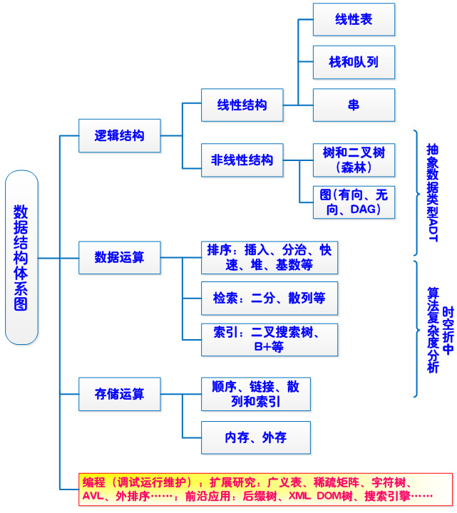
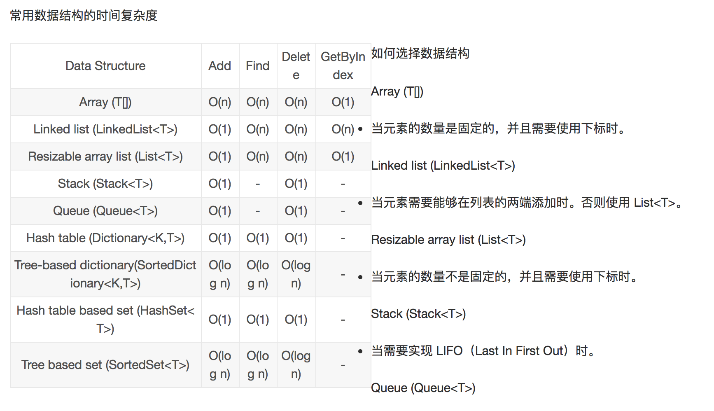
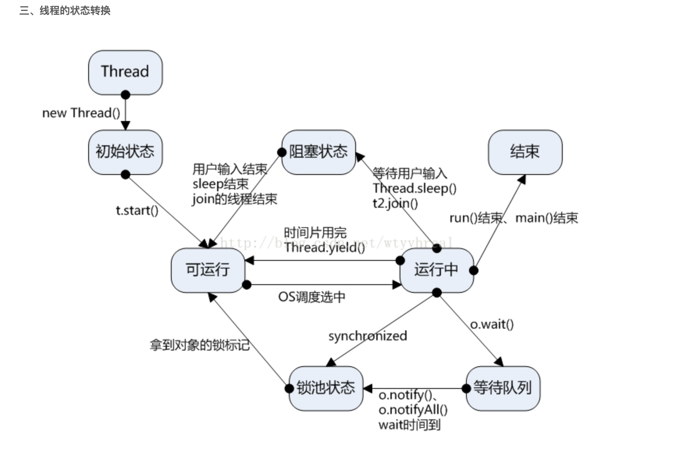

mmap：安全、高效（zero copy）、gc

.java 编译到.class过程？
类加载过程
java文件编译成class文件的过程
类加载过程：校验，加载-双亲委派模型，初始化，卸载等

在那些场景用了哪些多线程的什么接口

blockqueue中获取数据流程？
lock方法？condation
concurrenthashmap
并发工具类

多线程用过的一个场景，用了哪些jdk的接口
线程池的参数使用，接收任务的流程？执行的流程？线程池中线程空闲销毁原理？等待知道超时销毁？
blockqueue从里面去任务，阻塞知道取出任务，源码查看过吗？
lock方法？
candition怎么使用？
并发工具类：四个，concurrenthashmap，

虚拟机了解多少？服务器上只有jre没有jdk，怎么看文件，启动参数设置oom打印日志

JVM崩溃Log日志和GC日志
https://blog.csdn.net/warship_f/article/details/78078945
https://blog.csdn.net/Me_ZH/article/details/78700671

JVM 发生OOM的四种情况
https://www.cnblogs.com/baizhanshi/p/6704731.html?utm_source=itdadao&utm_medium=referral
https://blog.csdn.net/pbuzhidaol/article/details/72871898

https://www.cnblogs.com/gdpuzxs/p/7044963.html
https://www.cnblogs.com/ITtangtang/p/3978102.html
重写classloader：（1）继承ClassLoader    （2）重写findClass（）方法   （3）调用defineClass（）方法

http://www.cnblogs.com/aspirant/p/7200523.html
(1)阿里的面试官问我，可以不可以自己写个String类
答案：不可以，因为 根据类加载的双亲委派机制，会去加载父类，父类发现冲突了String就不再加载了;

(2)能否在加载类的时候，对类的字节码进行修改
答案：可以，使用Java探针技术，可以参考：Java探针-Java Agent技术-阿里面试题

什么是类加载器
类加载器与类的”相同“判断
类加载器种类
双亲委派模型
类加载过程
自定义类加载器
JAVA热部署实现

SPI和Class.forName()：SPI使用的是本类加载器，是AppClassLoader，后者使用的Bootstrap ClassLoader

何时触发初始化
1、为一个类型创建一个新的对象实例时（比如new、反射、序列化）
2、调用一个类型的静态方法时（即在字节码中执行invokestatic指令）
3、调用一个类型或接口的静态字段，或者对这些静态字段执行赋值操作时（即在字节码中，执行getstatic或者putstatic指令），不过用final修饰的静态字段除外，它被初始化为一个编译时常量表达式
4、调用JavaAPI中的反射方法时（比如调用java.lang.Class中的方法，或者java.lang.reflect包中其他类的方法）
5、初始化一个类的派生类时（Java虚拟机规范明确要求初始化一个类时，它的超类必须提前完成初始化操作，接口例外）
6、JVM启动包含main方法的启动类时。

热部署步骤：
1、销毁自定义classloader(被该加载器加载的class也会自动卸载)；
2、更新class
3、使用新的ClassLoader去加载class 

JVM中的Class只有满足以下三个条件，才能被GC回收，也就是该Class被卸载（unload）：
   - 该类所有的实例都已经被GC，也就是JVM中不存在该Class的任何实例。
   - 加载该类的ClassLoader已经被GC。
   - 该类的java.lang.Class 对象没有在任何地方被引用，如不能在任何地方通过反射访问该类的方法

详解Javac将java文件编译为class文件的过程
https://blog.csdn.net/shaozengwei/article/details/38659569
http://wiki.jikexueyuan.com/project/java-vm/polymorphism.html
http://www.voidcn.com/article/p-dzpxhmqt-bnx.html

Java 代码编译和执行的整个过程包含了以下三个重要的机制：
1、Java 源码编译机制
2、类加载机制
3、类执行机制

Java 源码编译由以下三个过程组成：
1、分析和输入到符号表
2、注解处理
3、语义分析和生成 class 文件

最后生成的 class 文件由以下部分组成：
1、结构信息。包括 class 文件格式版本号及各部分的数量与大小的信息。
2、元数据。对应于 Java 源码中声明与常量的信息。包含类/继承的超类/实现的接口的声明信息、域与方法声明信息和常量池。
3、方法信息。对应 Java 源码中语句和表达式对应的信息。包含字节码、异常处理器表、求值栈与局部变量区大小、求值栈的类型记录、调试符号信息。

类从被加载到虚拟机内存中开始，到卸载出内存为止，它的整个生命周期包括：加载、验证、准备、解析、初始化、使用和卸载七个阶段。
JVM 的类加载是通过 ClassLoader 及其子类来完成的：双亲委派模型
1）Bootstrap ClassLoader
负责加载$JAVA_HOME中jre/lib/rt.jar里所有的 class，由 C++ 实现，不是 ClassLoader 子类。

2）Extension ClassLoader
负责加载Java平台中扩展功能的一些 jar 包，包括$JAVA_HOME中jre/lib/*.jar或-Djava.ext.dirs指定目录下的 jar 包。

3）App ClassLoader
负责记载 classpath 中指定的 jar 包及目录中 class。

4）Custom ClassLoader
属于应用程序根据自身需要自定义的 ClassLoader，如 Tomcat、jboss 都会根据 J2EE 规范自行实现 ClassLoader。

加载过程中会先检查类是否被已加载，检查顺序是自底向上，从 Custom ClassLoader 到 BootStrap ClassLoader 逐层检查，只要某个 Classloader 已加载就视为已加载此类，保证此类只所有 ClassLoade r加载一次。而加载的顺序是自顶向下，也就是由上层来逐层尝试加载此类。

验证：验证的目的是为了确保 Class 文件中的字节流包含的信息符合当前虚拟机的要求，而且不会危害虚拟机自身的安全。不同的虚拟机对类验证的实现可能会有所不同，但大致都会完成以下四个阶段的验证：文件格式的验证、元数据的验证、字节码验证和符号引用验证。

准备阶段是正式为类变量分配内存并设置类变量初始值的阶段，这些内存都将在方法区中分配。

解析阶段是虚拟机将常量池中的符号引用转化为直接引用的过程。

初始化
初始化是类加载过程的最后一步，到了此阶段，才真正开始执行类中定义的 Java 程序代码。在准备阶段，类变量已经被赋过一次系统要求的初始值，而在初始化阶段，则是根据程序员通过程序指定的主观计划去初始化类变量和其他资源，或者可以从另一个角度来表达：初始化阶段是执行类构造器()方法的过程。

类执行机制
JVM 是基于栈的体系结构来执行 class 字节码的。线程创建后，都会产生程序计数器（PC）和栈（Stack），
程序计数器存放下一条要执行的指令在方法内的偏移量，
栈中存放一个个栈帧，每个栈帧对应着每个方法的每次调用，而栈帧又是有局部变量区和操作数栈两部分组成，
局部变量区用于存放方法中的局部变量和参数，操作数栈中用于存放方法执行过程中产生的中间结果。

编译过程java文件---》class文件：源代码、词法分析、语法分析、语法树、语义分析器、注解抽象语法树、字节码生成器，JVM字节码

Java 语法糖
语法糖（Syntactic Sugar），也称糖衣语法，指在计算机语言中添加的某种语法，这种语法对语言的功能并没有影响，但是更方便程序员使用。
Java 中最常用的语法糖主要有泛型、变长参数、条件编译、自动拆装箱、内部类等。虚拟机并不支持这些语法，它们在编译阶段就被还原回了简单的基础语法结构，这个过程成为解语法糖。

https://my.oschina.net/hosee/blog/618953
https://blog.csdn.net/u013256816/article/details/84917112
https://blog.csdn.net/varyall/article/details/81283231
https://blog.csdn.net/u010454030/article/details/82458413
https://blog.csdn.net/qq_27093465/article/details/52279473

hashmap数据结构：线程不安全的，操作丢失put、remove等，扩容造成链表的闭环所致CPU 100%等
线程不安全的，安全的有：hashtable、concurrenthashmap
jdk7数组+链表，基于一个数组以及多个链表的实现，hash值冲突的时候，就将对应节点以链表的形式存储。JDK7中HashMap采用的是位桶+链表的方式，即我们常说的散列链表的方式
jdk8中链表变为红黑树结构，便于查询，JDK8中采用的是位桶+链表/红黑树（有关红黑树请查看红黑树）的方式，也是非线程安全的。当某个位桶的链表的长度达到某个阀值的时候，这个链表就将转换成红黑树。
JDK8中，当同一个hash值的节点数不小于8时，将不再以单链表的形式存储了，会被调整成一颗红黑树
因为在hash冲突严重的情况下，链表的查询效率是O(n），所以JDK8做了优化对于单个链表的个数大于8的链表，会直接转为红黑树结构算是以空间换时间，这样以来查询的效率就变为O(logN)

这个Entry应该放在数组的哪一个位置上（这个位置通常称为位桶或者hash桶，即hash值相同的Entry会放在同一位置，用链表相连），是通过key的hashCode来计算的。
当两个key通过hashCode计算相同时，则发生了hash冲突(碰撞)，HashMap解决hash冲突的方式是用链表。

总结一下map.put后的过程：当hashCode 值相同时候，在本链表使用equals方法进行比较，都不相同时才放入数组中，并且next指向之前的链表
当向 HashMap 中 put 一对键值时，它会根据 key的 hashCode 值计算出一个位置， 该位置就是此对象准备往数组中存放的位置。 
如果该位置没有对象存在，就将此对象直接放进数组当中；如果该位置已经有对象存在了，则顺着此存在的对象的链开始寻找(为了判断是否是否值相同，map不允许<key,value>键值对重复)， 如果此链上有对象的话，再去使用 equals方法进行比较，如果对此链上的每个对象的 equals 方法比较都为 false，则将该对象放到数组当中，然后将数组中该位置以前存在的那个对象链接到此对象的后面。 
值得注意的是，当key为null时，都放到table[0]中

ConcurrentHashMap扩容：默认16个Segment，
在JDK7里面最大并发个数就是Segment的个数，默认值是16，可以通过构造函数改变一经创建不可更改，这个值就是并发的粒度，每一个segment下面管理一个table数组，加锁的时候其实锁住的是整个segment，这样设计的好处在于数组的扩容是不会影响其他的segment的，简化了并发设计，不足之处在于并发的粒度稍粗
在JDK8里面，去掉了分段锁，将锁的级别控制在了更细粒度的table元素级别，也就是说只需要锁住这个链表的head节点，并不会影响其他的table元素的读写，好处在于并发的粒度更细，影响更小，从而并发效率更好，但不足之处在于并发扩容的时候，由于操作的table都是同一个，不像JDK7中分段控制，所以这里需要等扩容完之后，所有的读写操作才能进行，所以扩容的效率就成为了整个并发的一个瓶颈点

volidate关键字作用：线程可见性、有序性，不保证原子性

如何实现一个并发情况下线程安全性的方案？加锁、排队、线程变量，原子变量
threadlocal实现原理？如何实现线程安全？线程为单位隔离，
是否会造成内存溢出？

https://blog.csdn.net/hellorichen/article/details/71107594
java中一个线程等待另一个线程执行完后再执行：
1.notify、wait方法，Java中的唤醒与等待方法，关键为synchronized代码块，参数线程间应相同，也常用Object作为参数
2.CountDownLatch类：重要方法为countdown()与await()；一个同步辅助类，常用于某个条件发生后才能执行后续进程。给定计数初始化CountDownLatch，调用countDown(）方法，在计数到达零之前，await方法一直受阻塞。
3.join方法：将线程B加入到线程A的尾部，当A执行完后B才执行。
4.线程共享一个变量，根据变量状态来判断，类似CountDownLatch类的作用

http://www.importnew.com/14958.html
https://blog.csdn.net/u012050154/article/details/50903326
yield()方法：线程的优先权（高中低，1-10，并不是一定的，由调度程序决定哪一个线程被执行，相同优先级通常受时间片管制，但这并不是Java的要求。）：一个调用yield()方法的线程告诉虚拟机它乐意让其他线程占用自己的位置。这表明该线程没有在做一些紧急的事情。注意，这仅是一个暗示，并不能保证不会产生任何影响。
join()方法：线程实例的方法join()方法可以使得一个线程在另一个线程结束后再执行。如果join()方法在一个线程实例上调用，当前运行着的线程将阻塞直到这个线程实例完成了执行。

1、sleep()方法正在执行的线程主动让出CPU（然后CPU就可以去执行其他任务），在sleep指定时间后CPU再回到该线程继续往下执行(注意：sleep方法只让出了CPU，而并不会释放同步资源锁！！！)；
wait()方法则是指当前线程让自己暂时退让出同步资源锁，以便其他正在等待该资源的线程得到该资源进而运行，只有调用了notify()方法，之前调用wait()的线程才会解除wait状态，可以去参与竞争同步资源锁，进而得到执行。（注意：notify的作用相当于叫醒睡着的人，而并不会给他分配任务，就是说notify只是让之前调用wait的线程有权利重新参与线程的调度）；
2、sleep()方法可以在任何地方使用；wait()方法则只能在同步方法或同步块中使用；
3、sleep()是线程线程类（Thread）的方法，调用会暂停此线程指定的时间，但监控依然保持，不会释放对象锁，到时间自动恢复；wait()是Object的方法，调用会放弃对象锁，进入等待队列，待调用notify()/notifyAll()唤醒指定的线程或者所有线程，才会进入锁池，不再次获得对象锁才会进入运行状态；

jvm的内存结构？
堆怎么区分的？为什么分代？对象回收，内存等
怎么判断是否回收？哪些类型的对象？
java中一个类加载过程？主要考虑类加载器过程，加载过程，双亲委派模型

java基础知识掌握程度一般，对于Java 引用，堆外内存不了解，对于HashMap，线程池了解一点；对于LRU算法实现没有清晰思路；对于并发问题接触较少。

nio的代码，三个标识
虚拟机：
使用，看问题
只有jre，没有jdk，可以设置dumpoutlog

如何快速定位JVM中消耗CPU最多的线程？
1、首先我们可以通过top -Hp <pid>来看这个进程里所有线程的 CPU 消耗情况，得到类似下面的数据。可以看到 cpu 最高的线程是 pid 为 18250 的线程，占了 99.8%：
2、接着我们可以通过 jstack的输出来看各个线程栈：线程栈我们注意到 nid 的值其实就是线程 ID，它是十六进制的
3、我们将消耗 CPU 最高的线程18250，转成十六进制0X47A，然后从上面的线程栈里找到nid=0X47A的线程，然后可以查看其堆栈信息

---------------------------------------------------------------------------------------------------------------------
参考项目
java示例：quickstart-example
java基础：quickstart-javase

直接内存详解

熟悉IO、多线程、集合
理解java运行时工作原理，熟悉jvm性能调优，能够充分利用java特性支持框架与程序库的设计开发;
4、熟悉多线程编程，熟练使用java并发包下的各项常用基础设施;
5、熟悉网络编程，能够熟练使用java nio开发高并发、高吞吐量的服务;
1. 熟悉java concurrent包 ，熟悉高并发，分布式通信，存储等相关技术 
2. 扎实的编程基础，精通java开发语言，熟悉jvm，web开发、缓存，分布式架构、消息中间件等核心技术；
1.3年以上 JAVA 开发经验，有并发编程经验，熟悉文件I/O，网络 I/O 及类加载等机制细节； 
3.熟悉JVM基础知识，具有一定的调优经验和内存、线程相关问题排查经验； 
1、Java基础：概述、语言基础、OO、Exceptio处理、Array、常用Class、集合、IO网络与文件、多线程、concurrent包并发、反射

SOA、
环形缓冲区的实现原理（ring buffer）quickstart-disruptor

  
  
1、JVM和类加载机制：jvm学习.md

计算机内存模型和CPU缓存一致性协议MESI
缓存伪共享
零拷贝
在JavaSE.md

JVM内存模型：五个区域和各自保存的对象，会抛出什么异常：年轻代、年老代、持久代（方法去）、堆外内存（直接内存）

垃圾回收：垃圾收集算法、垃圾收集器，对象存活方式判断，类回收条件，堆（年轻代、年老代），java对象的引用（强引用，软引用，弱引用，虚引用）
方法区垃圾回收：废弃常量、无用的类

finalize()方法不可靠表现2方面
判断对象是否存活一般有两种方式、GC Roots包括

内存调优：减少youngGC的频率和fullGC的次数
常见参数：废弃类回收的控制参数、堆参数（初始大小，最大大小、年轻代和年老代比例）、设置GC回收器，GC打印格式和文件、HeapDump日志路径、并行收集器设置
查看垃圾回收和内存问题定位工具和步骤 

类加载机制和双亲委派机制，类加载过程，java创建一个对象的流程          
类加载机制（双亲委派）：安全、缓存、高效，类加载过程：加载、验证、准备、初始化、卸载，4中类加载器，重写findClass是符合双拼委派机制，重写loadclass是破坏的，
                   ClassLoader可以实现的功能：
1、自定义加载类，实现切面功能、方法调用链、代码保护加解密等，如切面log日志，切面其他功能、
2、系统开发模块化，比如阿里的jarslink、支付宝的sofaArk
3、热部署功能、热加载

java对象的引用包括：强引用，软引用，弱引用，虚引用
Java中提供这四种引用类型主要有两个目的：
第一是可以让程序员通过代码的方式决定某些对象的生命周期；
第二是有利于JVM进行垃圾回收。

JVM内存结构，和Java虚拟机的运行时区域有关。 
Java内存模型，和Java的并发编程有关。 
Java对象模型，和Java对象在虚拟机中的表现形式有关。

JAVA中的内存泄露：堆区不断增长，最后不断触发FullGC, 甚至crash
jdk的命令行工具：jps、jinfo + jstat 、jmap（-dump、jhat）、jstack
堆外内存：原因、场景、使用：存活时间长，大内存的

2、IO网络与文件
BIO是面向流、阻塞IO，顺序读
   NIO面向缓冲、非阻塞IO、选择器Selector，可以使用position等跳跃读
   AIO
   
   
   字节流和字符流
   输入流、输出流
   
   
   Channels：4种
   Buffers：1+2+3+1
   Selectors：4个事件
   Buffer分配：3种
   方法：常用的读写切换、定位等
   buffer读写方法
   Buffer的capacity,position和limit

https://blog.csdn.net/Big_Blogger/article/details/77654240
https://blog.csdn.net/Big_Blogger/article/details/77654240
直接内存详解：分配和回收 
   直接内存：不受young gc的影响，只有full gc的时候回收，当众多的DirectByteBuffer对象从新生代被送入老年代后触发了 full gc才会会释放回收，MappedByteBuffer在处理大文件时的确性能很高，但也存在一些问题，如内存占用、文件关闭不确定，被其打开的文件只有在垃圾回收的才会被关闭，而且这个时间点是不确定的。

（1）直接内存DirectMemory的大小默认为 -Xmx 的JVM堆的最大值，但是并不受其限制，而是由JVM参数 MaxDirectMemorySize单独控制。
（2）直接内存不是分配在JVM堆中。并且直接内存不受 GC(新生代的Minor GC)影响，只有当执行老年代的 Full GC时候才会顺便回收直接内存！而直接内存是通过存储在JVM堆中的DirectByteBuffer对象来引用的，所以当众多的DirectByteBuffer对象从新生代被送入老年代后才触发了 full gc。
（3）MappedByteBuffer在处理大文件时的确性能很高，但也存在一些问题，如内存占用、文件关闭不确定，被其打开的文件只有在垃圾回收的才会被关闭，而且这个时间点是不确定的。
  
  直接内存回收：
  1、GC之后，“触发”调用Cleaner.clean() 方法，进而调用Deallocator.run() 在run方法中调用unsafe.freeMemory(long var1)释放堆外内存。 
  2、当然我也找到一种不需要GC回收由程序员自己回收的方式，不推荐使用((DirectBuffer)buffer).cleaner().clean();
  3、Unsafe进行分配和回收
  
  
   
   
   网络：
   SocketChannel:创建连接，读写数据，从channel到buffer，从buffer到channel
   ServerSocketChannel:监听连接，默认是阻塞模式，可以设置为非阻塞模式（while循环）
   
   
   零拷贝( zero-copy )
   文件IO：通过mmap实现的零拷贝I/O，内存映射文件：mmap()方法
   网络IO：FileChannel.transferTo 和 FileChannel.transferFrom方法
   零拷贝：减少内核态和用户态时的数据重复拷贝，java.nio.channel.FileChannel的transferTo()，transferFrom()方法
   
   
3、多线程

Java线程的5种状态及切换
java进程和Linux线程的关系
多线程概念：线程同步（两种锁、特殊变量volatile、线程变量ThreadLocal、并发工具类）、线程间通信、线程死锁、线程控制（挂起、停止和恢复）
Unsafe类的使用
java线程的创建和分类
Linux进程间通信
线程池：查看ThreadPool.md

线程状态切换的代价

   ThreadPoolExecutor或者Executors工具类（4种）来创建
   参数：7个
   创建线程流程和销毁线程流程
   
   提交任务：execute() 和 submit()
   execute()：FutureTask（ExecutorCompletionService）
   submit()：Callable接口、Future接口
   
   RejectedExecutionHandler策略
   其他方法：beforeExecute、afterExecute、
   
   ThreadLocal使用：以线程为单位进行隔离，因为WeakReference不会导致内存泄漏，线程复用的时候没有remove可能会导致后面的任务取到前面任务存进去的值，导致程序出错

4、集合：java集合.md
List、Set、Map、Queue
并发集合：ConcurrentHashMap、ConcurrentSkipListSet、CopyOnWriteArrayList等

5、concurrent包并发、并发工具类：java并发包concurrent和并发工具类.md

java并发包concurrent：
1、Atomic原子类型：Long、Integer、Boolean、Refrence等
2、并发锁Lock锁：ReentrantLock、ReentrantReadWriteLock等
3、线程池：Callable接口、Future接口、FutureTask（ExecutorCompletionService）、Executors、ExecutorService、ThreadPoolExecutor、ThreadFactory、
4、并发集合：ConcurrentHashMap、ConcurrentSkipListSet、CopyOnWriteArrayList和CopyOnWriteArraySet等
5、并发工具类：CountDownLatch、CyclicBarrier、Semaphore、Exchanger、ForkJoinPool等
Java并发工具类：
并发开始：同步屏障CyclicBarrier
并发结束：等待多线程完成的CountDownLatch
并发控制：控制并发线程数的Semaphore
并发交换：两个线程进行数据交换的Exchanger

并发类，如ThreadLocal 、volatile
并发编程中的三个概念：原子性，可见性，有序性，和volatile关键字的两层语义
java线程状态转换和线程并发
Unsafe类的CAS操作
java并发基础AQS类.md

6、反射、java agent，反射初始化：java反射和agent.md
RTTI和反射机制区别
反射的使用：获取类、构造方法，成员变量，成员方法、注解、泛型

7、Java的简单类型及其封装器类

8、Object类的方法，和Thread类方法的区别

9、String StringBuffer,StringBuilder原理：底层的数据结构是 字符数组 char[]

10、sleep、wait  notyfi都干啥的，sycnized怎么用的，concurrent包下面的锁用过哪些，怎么实现的

11、io  jvm  多线程1

12、图的遍历，深度广度啊

13、内存溢出，内存泄露，，怎么调优，类加载

14、BloomFilter 与 CuckooFilter

15、计算机内存模型和CPU缓存一致性协议MESI
   缓存伪共享
   零拷贝：transTo

16、CPU缓存分类：CPU三级缓存：CPU、L1、L2、L3、主内存
   缓存一致性协议：MESI
   伪共享(False Sharing)：缓存行进行字节填充，保证头尾加载到不同的缓存行，避免出入对互斥，不能并发，成为伪共享。jdk8中Contended注解
   缓存系统中是以缓存行（cache line）为单位存储的：现在64byte，早期32byte，范围32-128byte
   缓存段竞争：导致总线风暴
   volatile字段：使用内存屏障，保证可见性和有序性，不保证原子性

17、synchronized的缺陷：不中断，不并发读，不知道有没有成功获取到锁
   Lock和synchronized对比：可重入，不中断，不公平，lock可中断、可公平，并发读，手动释放，是接口类
   
   锁的分类和升级：可升不可降
   sleep和wait区别：sleep不会释放对象锁，wait释放对象锁
   线程的状态切换
   
   总的来说, Lock + Condition + await()/signal/signalAll ≈ Synchronized + Object.wait()/notify/signalAll
   Condition原理：线程放入等待链表,可以实现“选择性通知”，而notify由JVM随机选择的

18、分布式锁实现.md：数据库、redis、zookeeper

19、加解密.md：加解密的分类和实现

20、单例模式有三种实现方式

21、图片加载缓慢优化.md：

22、泛型通配符extends与super的区别.md：泛型：泛型上限通配符extends与泛型下限通配符super

23、负载均衡.md:负载均衡算法

24、java热部署、模块化：jarslink

25、SPI和JDK、JDK7、JDK8

26、一致性哈希算法(consistent hashing)

27、java常见异常

28、Comparable与Comparator的区别

29、对Runtime的了解:Runtime类

30、什么是线程死锁？如何避免线程死锁？如何加一个线程死锁检查机制？

31、java进程间通信(IPC interProcess communication)：

32、如何实现分布式缓存

33、volatile原理

34、数据结构：堆和树

35、Queue队列的常用方法

36、数组、链表，队列 ，栈，散列表，树，图

37、Java线程的5种状态及切换

38、Linux探秘之用户态与内核态

39、java进程CPU过高问题如何排查？

40、Java8中用sun.misc.Contended避免伪共享(false sharing)

41、动态代理和静态代理

42、

43、

44、

45、

46、

47、

48、

49、

50、

---------------------------------------------------------------------------------------------------------------------
Java8中用sun.misc.Contended避免伪共享(false sharing)：
https://blog.csdn.net/aigoogle/article/details/41518369
1、long padding来避免伪共享 
2、jdk8新特性，Contended注解避免false sharing：需要在jvm启动时设置-XX:-RestrictContended 

---------------------------------------------------------------------------------------------------------------------
动态代理和静态代理.md
动态代理：cglib、jdk
静态代理：javassist、AspectJ

---------------------------------------------------------------------------------------------------------------------

java se：
单例
锁的种类：可重入锁，
阻塞锁，自旋锁：在线程竞争不激烈的情况下，使用自旋锁，竞争激烈的情况下使用，阻塞锁。
关键字synchronized与wait()和notify()/notifyAll()方法相结合可以实现等待/通知模式。
     Lock、Condition+await+signal/signalAll
Servlet、Filter、Listener
线程池的参数、队列、流程、超时原理
ExecutorService（ThreadPoolExecutor）：submit()、execute()
Callable、Future、FutureTask、ExecutorCompletionService
工具类Executors
unsafe的使用：直接内存分配、cas、park线程挂起和恢复
ThreadLocal、InheritableThreadLocal

GC日志分析工具：GCHisto
java对象的引用包括：强引用，软引用，弱引用，虚引用
Java中提供这四种引用类型主要有两个目的：第一是可以让程序员通过代码的方式决定某些对象的生命周期；第二是有利于JVM进行垃圾回收。
finalize()方法不可靠表现2方面
判断对象是否存活一般有两种方式
GC Roots包括？
内存模型
分代：年轻代（一个Eden区，两个Survivor区）、年老代、持久代（java8，元空间，本地内存）
young GC、full GC
垃圾收集算法：Copying（复制）、Mark-Sweep（标记-清除）、Mark-Compact（标记-整理）、Generational Collection（分代收集）
垃圾收集器：串行Serial/Serial Old、Parallel、Parallel Old、并发标记CMS，G1
CMS流程：初始标记、并发标记、重新标记、并发清楚，并发重置
初始标记(CMS-initial-mark) -> 并发标记(CMS-concurrent-mark) -> 重新标记(CMS-remark) -> 并发清除(CMS-concurrent-sweep) ->并发重设状态等待下次CMS的触发(CMS-concurrent-reset)。
其中的1，3两个步骤需要暂停所有的应用程序线程的

---------------------------------------------------------------------------------------------------------------------
一致性哈希算法(consistent hashing)
http://blog.csdn.net/cywosp/article/details/23397179/
https://blog.csdn.net/bntX2jSQfEHy7/article/details/79549368
https://blog.csdn.net/thinkmo/article/details/26833565
一致性hash算法
1、使用的MurMurHash算法，是非加密HASH算法，性能很高， 比传统的CRC32,MD5，SHA-1（这两个算法都是加密HASH算法，复杂度本身就很高，带来的性能上的损害也不可避免） 等HASH算法要快很多，而且据说这个算法的碰撞率很低. http://murmurhash.googlepages.com/
2、使用FNV1_32_HASH算法计算服务器的Hash值,这里不使用重写hashCode的方法，最终效果没区别 

一致性hash算法提出了在动态变化的Cache环境中，判定哈希算法好坏的四个定义：
1、平衡性(Balance)：平衡性是指哈希的结果能够尽可能分布到所有的缓冲中去，这样可以使得所有的缓冲空间都得到利用。很多哈希算法都能够满足这一条件。
2、单调性(Monotonicity)：单调性是指如果已经有一些内容通过哈希分派到了相应的缓冲中，又有新的缓冲加入到系统中。哈希的结果应能够保证原有已分配的内容可以被映射到原有的或者新的缓冲中去，而不会被映射到旧的缓冲集合中的其他缓冲区。 
3、分散性(Spread)：在分布式环境中，终端有可能看不到所有的缓冲，而是只能看到其中的一部分。当终端希望通过哈希过程将内容映射到缓冲上时，由于不同终端所见的缓冲范围有可能不同，从而导致哈希的结果不一致，最终的结果是相同的内容被不同的终端映射到不同的缓冲区中。这种情况显然是应该避免的，因为它导致相同内容被存储到不同缓冲中去，降低了系统存储的效率。分散性的定义就是上述情况发生的严重程度。好的哈希算法应能够尽量避免不一致的情况发生，也就是尽量降低分散性。 
4、负载(Load)：负载问题实际上是从另一个角度看待分散性问题。既然不同的终端可能将相同的内容映射到不同的缓冲区中，那么对于一个特定的缓冲区而言，也可能被不同的用户映射为不同 的内容。与分散性一样，这种情况也是应当避免的，因此好的哈希算法应能够尽量降低缓冲的负荷。

把机器和对象使用相同的hash均衡分散到hash环上，对象顺时针放在距离自己最近的机器节点上
平衡性：使用虚拟节点来保证，新增或者删除机器节点，对象平衡分散被影响，并且之后的对象依然平衡分散
单调性：新增或者删除机器节点，只是影响相邻的部分对象，但按照顺时候移动，可能出现不平衡问题（使用虚节点）
分散性：节点hash后分散
---------------------------------------------------------------------------------------------------------------------
Object类的方法
getClass
hashcode
equal
clone()
toString
wait
notify
notifyAll
finalize()

Thread类：start、run、sleep、stop
Object类：wait、notify、notifyAll，这三个方法都依赖锁对象，所对象可以是任意对象，所以定义在Object中

start()和run()的区别
start():启动线程并调用线程中的run()方法。
run():执行该线程对象要执行的任务

sleep()和wait()的区别
sleep():不释放锁对象，释放CPU使用权在休眠的时间内，不能唤醒。
wait():释放锁对象，释放CPU释放权，在等待时间内能被唤醒。

---------------------------------------------------------------------------------------------------------------------
一个英文字母(不分大小写)或者符号占一个字节的空间，一个中文汉字或者符号占两个字节的空间． 
字节(Byte):通常将可表示常用英文字符8位二进制称为一字节。 1字节(Byte） = 8位(bit) 
---------------------------------------------------------------------------------------------------------------------
java常见异常
http://blog.csdn.net/qq635785620/article/details/7781026
NullPointerException - 空指针引用异常
ClassCastException - 类型强制转换异常。
IllegalArgumentException - 传递非法参数异常。
ArithmeticException - 算术运算异常
ArrayStoreException - 向数组中存放与声明类型不兼容对象异常
IndexOutOfBoundsException - 下标越界异常
NegativeArraySizeException - 创建一个大小为负数的数组错误异常
NumberFormatException - 数字格式异常
SecurityException - 安全异常
UnsupportedOperationException - 不支持的操作异常

RuntimeException
当应用程序试图在需要对象的地方使用 null 时，抛出NullPointerException异常
当试图将对象强制转换为不是实例的子类时，抛出该异常（ClassCastException)
指示索引或者为负，或者超出字符串的大小，抛出StringIndexOutOfBoundsException异常

Throwable、Error、Exception、RuntimeException 区别和联系各是什么
http://blog.csdn.net/liuj2511981/article/details/8524418
http://blog.csdn.net/kingzone_2008/article/details/8535287
http://blog.csdn.net/kwu_ganymede/article/details/51382461
1.Throwable类是 Java 语言中所有错误或异常的超类。它的两个子类是Error和Exception；
2.Error是Throwable 的子类，用于指示合理的应用程序不应该试图捕获的严重问题。
3.Exception类及其子类是 Throwable 的一种形式，它指出了合理的应用程序想要捕获的条件
4.RuntimeException类是Exception类的子类。RuntimeException是那些可能在 Java 虚拟机正常运行期间抛出的异常的超类。可能在执行方法期间抛出但未被捕获的RuntimeException 的任何子类都无需在 throws 子句中进行声明。它是Exception的子类。

Exception：
1．可以是可被控制(checked) 或不可控制的(unchecked) 
2．表示一个由程序员导致的错误 
3．应该在应用程序级被处理

Error：
1．总是不可控制的(unchecked) 
2．经常用来表示系统错误或低层资源的错误 
3．如何可能的话，应该在系统级被捕捉

Java 中定义了两类异常： 
　　1) Checked exception: 这类异常都是Exception的子类 。异常的向上抛出机制进行处理，假如子类可能产生A异常，那么在父类中也必须throws A异常。可能导致的问题：代码效率低，耦合度过高。
　　2) Unchecked exception: 这类异常都是RuntimeException的子类，虽然RuntimeException同样也是Exception的子类，但是它们是非凡的，它们不能通过client code来试图解决，所以称为Unchecked exception 。
您应该知道的是Java 提供了两种Exception 的模式，一种是执行的时候所产生的Exception (Runtime Exception)，另外一种则是受控制的Exception (Checked Exception)。
　　所有的Checked Exception 均从java.lang.Exception 继承而来，而Runtime Exception 则继承java.lang.RuntimeException 或java.lang.Error (实际上java.lang.RuntimeException 的上一层也是java.lang.Exception)。
 
 因此从程序的运作机制上看，Runtime Exception与Checked Exception 不一样，然而从逻辑上看，Runtime Exception 与Checked Exception 在使用的目的上也不一样。
　　一般而言，Checked Exception 表示这个Exception 必须要被处理，也就是说程序设计者应该已经知道可能会收到某个Exception(因为要try catch住) ，所以程序设计者应该能针对这些不同的Checked Exception 做出不同的处理。
　　而Runtime Exception 通常会暗示着程序上的错误，这种错误会导致程序设计者无法处理，而造成程序无法继续执行下去。

---------------------------------------------------------------------------------------------------------------------
Comparable与Comparator的区别
http://www.importnew.com/17434.html
Comparable：bean实现该接口，//Collections.sort(list)（Arrays.sort）; 两种方式都可以，此种方式源码中就是调用的list.sort(null)
Comparator：bean不需要实现该接口，直接当做实现传递给Collections.sort(list)（Arrays.sort）
Collections.sort(list, new Comparator<Employee>() {
            @Override
            public int compare(Employee o1, Employee o2) {
                return o1.getSalary() - o2.getSalary();
            }
        });

一、Comparator 
强行对某个对象collection进行整体排序的比较函数，可以将Comparator传递给Collections.sort或Arrays.sort。 
接口方法： int compare(Object o1, Object o2);  

二、Comparable 
强行对实现它的每个类的对象进行整体排序，实现此接口的对象列表（和数组）可以通过Collections.sort或Arrays.sort进行自动排序。 
接口方法： int compareTo(Object o);  
Comparable的用法
一般来说，Comparable是为了对某个类的集合进行排序，所以此时一般都是这个需要排序的类本身去实现Comparable接口。换句话说，如果某个类实现了Comparable接口，那么这个类的数组或者说List就可以进行排序了。

一个类实现了Camparable接口则表明这个类的对象之间是可以相互比较的，这个类对象组成的集合就可以直接使用sort方法排序。 
Comparator可以看成一种算法的实现，将算法和数据分离，Comparator也可以在下面两种环境下使用： 
1、类的设计师没有考虑到比较问题而没有实现Comparable，可以通过Comparator来实现排序而不必改变对象本身 
2、可以使用多种排序标准，比如升序、降序等 

Comparable & Comparator 都是用来实现集合中元素的比较、排序的，只是 Comparable 是在集合内部定义的方法实现的排序，
Comparator 是在集合外部实现的排序，所以，如想实现排序，就需要在集合外定义 Comparator 接口的方法或在集合内实现 Comparable 接口的方法。
---------------------------------------------------------------------------------------------------------------------
对Runtime的了解:Runtime类
Runtime:运行时，是一个封装了JVM的类。每一个JAVA程序实际上都是启动了一个JVM进程，每一个JVM进程都对应一个Runtime实例，此实例是由JVM为其实例化的。所以我们不能实例化一个Runtime对象，应用程序也不能创建自己的 Runtime 类实例，但可以通过 getRuntime 方法获取当前Runtime运行时对象的引用。一旦得到了一个当前的Runtime对象的引用，就可以调用Runtime对象的方法去控制Java虚拟机的状态和行为。
查看官方文档可以看到，Runtime类中没有构造方法，本类的构造方法被私有化了， 所以才会有getRuntime方法返回本来的实例化对象，这与单例设计模式不谋而合
public static Runtime getRuntime()
注意：Runtime类本身就是单例设计模式的一种应用，因为整个JVM中只存在一个Runtime类的对象，可以使用Runtime类取得JVM的系统信息，或者使用gc()方法释放掉垃圾空间，还可以运行本机的程序run.exec("notepad.exe")exec()方法的返回值是Process类，Process类也有一些方法可以使用，比如结束一个进程，通过destroy()结束
---------------------------------------------------------------------------------------------------------------------
什么是线程死锁？如何避免线程死锁？如何加一个线程死锁检查机制？
http://blog.csdn.net/ls5718/article/details/51896159
死锁检测：http://blog.csdn.net/littleschemer/article/details/47449911
https://www.cnblogs.com/lovedesy123/p/7752077.html
死锁的定义
多线程以及多进程改善了系统资源的利用率并提高了系统 的处理能力。然而，并发执行也带来了新的问题——死锁。所谓死锁是指多个线程因竞争资源而造成的一种僵局（互相等待），若无外力作用，这些进程都将无法向前推进。

互斥锁(mutex)Mutex可以分为递归锁(recursive mutex)和非递归锁(non-recursive mutex)。可递归锁也可称为可重入锁(reentrant mutex)，
非递归锁又叫不可重入锁(non-reentrant mutex)。
  二者唯一的区别是，同一个线程可以多次获取同一个递归锁，不会产生死锁。而如果一个线程多次获取同一个非递归锁，则会产生死锁。

死锁产生的原因
产生死锁必须同时满足以下四个条件，只要其中任一条件不成立，死锁就不会发生。
1、互斥条件：进程要求对所分配的资源（如打印机）进行排他性控制，即在一段时间内某 资源仅为一个进程所占有。此时若有其他进程请求该资源，则请求进程只能等待。
2、不剥夺条件：进程所获得的资源在未使用完毕之前，不能被其他进程强行夺走，即只能 由获得该资源的进程自己来释放（只能是主动释放)。
3、请求和保持条件：进程已经保持了至少一个资源，但又提出了新的资源请求，而该资源 已被其他进程占有，此时请求进程被阻塞，但对自己已获得的资源保持不放。
4、循环等待条件：存在一种进程资源的循环等待链，链中每一个进程已获得的资源同时被 链中下一个进程所请求。即存在一个处于等待状态的进程集合{Pl, P2, ..., pn}，其中Pi等 待的资源被P(i+1)占有（i=0, 1, ..., n-1)，Pn等待的资源被P0占有，如图2-15所示。

如何避免死锁
在有些情况下死锁是可以避免的。三种用于避免死锁的技术：
1、加锁顺序（线程按照一定的顺序加锁）【破坏循环等待条件】
2、加锁时限、或 一次加锁所有的资源（线程尝试获取锁的时候加上一定的时限，超过时限则放弃对该锁的请求，并释放自己占有的锁）
	超时和重试机制是为了避免在同一时间出现的竞争，但是当线程很多时，其中两个或多个线程的超时时间一样或者接近的可能性就会很大，因此就算出现竞争而导致超时后，由于超时时间一样，它们又会同时开始重试，导致新一轮的竞争，带来了新的问题【破坏请求保持条件】
3、使用锁等待机制：Java 显示锁支持通知(notify/notifyall)和等待(wait)【破坏不可剥夺条件】
3、死锁检测
一个简单的死锁检测算法
每个进程、每个资源制定唯一编号
设定一张资源分配表，记录各进程与占用资源之间的关系
设置一张进程等待表，记录各进程与要申请资源之间的关系

死锁恢复
打破死锁有两种方法：
（1）简单地终止一个或多个进程以打破循环等待。——进程终止
（2）从一个或多个死锁进程那里抢占一个或多个资源。——资源抢占
进程终止有以下两中方法：
（i）终止所有死锁进程。
（II)一次只终止一个进程直到取消死锁循环为止。
如果选择资源抢占，那么将必须考虑三个问题：
（i）选择一个牺牲品
（II）回滚
（III）饥饿（在代价因素中加上回滚次数，回滚的越多则越不可能继续被作为牺牲品）

jstack可以看到Found one Java-level deadlock
pstack： 功能是打印输出此进程的堆栈信息。可以输出所有线程的调用关系栈
jstack：jstack是java虚拟机自带的一种堆栈跟踪工具，所以仅适用于java程序，功能跟pstack一样，但是更强大，可以提示哪个地方可能死锁了。
pstack和jstack判断死锁，都需要多执行几次命令，观察每次的输出结果，才能推测是否死锁了。
---------------------------------------------------------------------------------------------------------------------
java进程间通信(IPC interProcess communication)：
除了上面提到的Socket之外，当然首选的IPC可以使用Rmi，或者Corba也可以。另外Java nio的MappedByteBuffer也可以通过内存映射文件来实现进程间通信(共享内存)。
远程过程调用（Remote Procedure Call, RPC）
远程方法调用（Remote Method Invocation, RMI）

在java中主要的通信方式有以下几种： 
1、socket通信 
2、RMI（远程方法调用） 
3、消息队列（第三方框架Kafka，ActiveMQ等） 
4、JMX（java management extensions）java扩展管理 
5、文件共享，文件锁（一个进程向文件中写文件，一个负责读文件） 
6、信号 
7、信号量
---------------------------------------------------------------------------------------------------------------------

java进程CPU过高问题如何排查？
一般JAVA进程CPU过高主要是程序中出现了死循环，死循环会导致两种情况：
第一种，死循环本身不需要耗费太多CPU时间，但会不停创建对象，从而导致java堆内存溢出，但有时候内存快占满了，没有报内存移除错误，JVM在不停的做FGC，从而出现CPU使用超过100%；
第二种情况，就是死循环内有请求资源或者网络连接等操作；

第一种情况需要dump出当前jvm内存对象进行分析，找到导致JVM频繁做FGC的对象，再结合业务代码定位具体代码位置；
第二种情况需要查找占用cpu时间的线程，根据线程代码提示定位具体出问题的代码。

第一种情况分析方法：
1. 通过top命令查看当前系统CPU使用情况，定位CPU使用率超过100%的进程ID；
2. jstat -gc pid time 命令查看JVM垃圾回收情况，time参数是统计频率，一般1-3秒都可以，若出现频繁的FGC，则需要进一步分析内存情况；
3. 用命令jmap -dump:format=b,file=test.dump pid导出当前进程内存信息，然后用MAT工具进行分析，即可找出问题；

第二种情况的分析方法：
1. 通过top命令查看当前系统CPU使用情况，定位CPU使用率超过100%的进程ID；
2. 通过ps aux | grep PID命令进一步确定具体的线程信息；
3. 通过ps -mp pid -o THREAD,tid,time命令显示线程信息列表，然后找到耗时的线程ID；
4. 将需要的线程ID转换为16进制格式：printf "%x\n" tid
5. 最后找到线程堆栈信息：jstack pid |grep tid -A 30,其中tid是上面转换后的16进制的线程ID
这样就找到了最终导致CPU100%的代码了，然后就是对具体的代码分析原因。

---------------------------------------------------------------------------------------------------------------------

volatile原理：http://blog.csdn.net/opensure/article/details/46669337
Java中Volatile底层原理与应用：内存屏障
http://blog.csdn.net/u012465296/article/details/53020676
volatile是一种“轻量级的锁”，它能保证锁的可见性，但不能保证锁的原子性。 

http://ifeve.com/memory-barriers-or-fences/
内存屏障或内存栅栏，也就是让一个CPU处理单元中的内存状态对其它处理单元可见的一项技术。
Java内存模型中volatile变量在写操作之后会插入一个store屏障，在读操作之前会插入一个load屏障。

缓存一致性：
http://www.infoq.com/cn/articles/cache-coherency-primer
http://www.infoq.com/cn/articles/atomic-operations-and-contention
MESI－CPU缓存一致性协议：http://blog.csdn.net/realxie/article/details/7317630
volatile使用场景：Double-Check Locking，缓存对象的map等（不保证原子性，使用在并发环境下的原子操作情况下）
一旦一个共享变量（类的成员变量、类的静态成员变量）被volatile修饰之后，那么就具备了两层语义：
1）保证了不同线程对这个变量进行操作时的可见性，即一个线程修改了某个变量的值，这新值对其他线程来说是立即可见的。
2）禁止进行指令重排序。
3）并发编程中的三个概念：原子性，可见性，有序性，volatile只保证可见性和有序性，不保证原子性
1、CPU的三级缓存，volatile的缓存失效是指的cpu的二级缓存，CPU的三级缓存：一级在CPU内部，容量小，速度快，二级是在CPU和内存之间的，当线程需要读取数据时候，先读取缓存，不存在才读取内存数据，三级缓存是对二级缓存的补充。
2、普通变量与volatile变量的区别是volatile的特殊规则保证了新值能立即同步到主内存，以及每次使用前可以立即从内存刷新，即一个线程修改了某个变量的值，其它线程读取的话肯定能看到新的值；
3、Lock前缀指令会引起处理器缓存回写到内存。一个处理器的缓存回写到内存会导致其他处理器的缓存无效。
1）将当前处理器缓存行的数据会写回到系统内存。
它会锁定这块内存区域的缓存并回写到内存，并使用缓存一致性机制来确保修改的原子性，此操作被称为“缓存锁定”，缓存一致性机制会阻止同时修改被两个以上处理器缓存的内存区域数据。
2）这个写回内存的操作会引起在其他CPU里缓存了该内存地址的数据无效。
关键点：其实相当于线程 像缓存行写数据的时候，会锁住缓存行，是其他线程不能读，写完后失效缓存行，其他线程便可以从内存读到共享变量的最新值了；
4、如果对声明了Volatile变量进行写操作，JVM就会向处理器发送一条Lock前缀的指令，将这个变量所在缓存行的数据写回到系统内存。但是就算写回到内存，如果其他处理器缓存的值还是旧的，再执行计算操作就会有问题，所以在多处理器下，为了保证各个处理器的缓存是一致的，就会实现缓存一致性协议，每个处理器通过嗅探在总线上传播的数据来检查自己缓存的值是不是过期了，当处理器发现自己缓存行对应的内存地址被修改，就会将当前处理器的缓存行设置成无效状态，当处理器要对这个数据进行修改操作的时候，会强制重新从系统内存里把数据读到处理器缓存里。

当CPU看到一条读内存的指令时，它会把内存地址传递给一级数据缓存，一级数据缓存会检查它是否有这个内存地址对应的缓存段。如果没有，它会把整个缓存段从内存（或者从更高一级的缓存，如果有的话）中加载进来。是的，一次加载整个缓存段，这是基于这样一个假设：内存访问倾向于本地化（localized），如果我们当前需要某个地址的数据，那么很可能我们马上要访问它的邻近地址。一旦缓存段被加载到缓存中，读指令就可以正常进行读取。

如果我们只处理读操作，那么事情会很简单，因为所有级别的缓存都遵守以下规律，我称之为：
基本定律：在任意时刻，任意级别缓存中的缓存段的内容，等同于它对应的内存中的内容。
一旦我们允许写操作，事情就变得复杂一点了。这里有两种基本的写模式：直写（write-through）和回写（write-back）。

直接模式更简单，但是回写模式有它的优势：它能过滤掉对同一地址的反复写操作，并且，如果大多数缓存段都在回写模式下工作，那么系统经常可以一下子写一大片内存，而不是分成小块来写，前者的效率更高。

不同的级别缓存可能使用不同的写策略，所以缓存行大小也可能不同。

MESI定律：在所有的脏缓存段（M状态）被回写后，任意缓存级别的所有缓存段中的内容，和它们对应的内存中的内容一致。此外，在任意时刻，当某个位置的内存被一个处理器加载入独占缓存段时（E状态），那它就不会再出现在其他任何处理器的缓存中。
MESI协议（译者注：MESI是Modified、Exclusive、Shared、Invalid的首字母缩写，代表四种缓存状态
失效（Invalid）缓存段、共享（Shared）缓存段、独占（Exclusive）缓存段、已修改（Modified）缓存段，属于脏段
只有E、M状态下的缓存才能写，也就是在写之前，先申请独占，使其他的CPU的同段缓存失效

1、缓存行：所谓缓存行就是缓存中可以分配的最小存储单位。一般是64字节，老的是32字节如P6系列和奔腾处理器，它们的L1和L2高速缓存行是32个字节宽
缓存是分“段”（line）的，一个段对应一块存储空间，大小是32（较早的ARM、90年代/2000年代早期的x86和PowerPC）、64（较新的ARM和x86）或128（较新的Power ISA机器）字节。
我们会看到有CPU的一级缓存是32字节，而二级缓存却有128字节。
2、缓存伪共享：因为对于英特尔酷睿i7，酷睿， Atom和NetBurst， Core Solo和Pentium M处理器的L1，L2或L3缓存的高速缓存行是64个字节宽，不支持部分填充缓存行，导致一个缓存行加载多个共享变量，一个处理器锁定时，锁定该缓存行时候，多锁定了对象，导致其他处理器处理不了，变为锁的互斥性，导致不能并发，成为伪共享
如JDK7的并发包里新增一个队列集合类LinkedTransferQueue（它使用一个内部类类型来定义队列的头队列（Head）和尾节点（tail）），JDK加载时候会把头尾分别进行字节填充，保证头尾加载到不同的缓存行，避免出入对互斥，不能并发，成为伪共享。
Java8中用sun.misc.Contended避免伪共享(false sharing)：
https://blog.csdn.net/aigoogle/article/details/41518369
1、long padding来避免伪共享 
2、jdk8新特性，Contended注解避免false sharing：需要在jvm启动时设置-XX:-RestrictContended 
3、CPU处理器的缓存三级：L1、L2、L3，最早CPU和L1通信，L1和内存通信，现在CPU--》L1--》L2--》内存
L1　Cache(一级缓存)是CPU第一层高速缓存，分为数据缓存和指令缓存。内置的L1高速缓存的容量和结构对CPU的性能影响较大，不过高速缓冲存储器均由静态RAM组成，结构较复杂，容量小
L2 Cache 都在CPU中
L3　Cache(三级缓存)，分为两种，早期的是外置，现在的都是内置的。而它的实际作用即是，L3缓存的应用可以进一步降低内存延迟，同时提升大数据量计算时处理器的性能。降低内存延迟和提升大数据量计算能力对游戏都很有帮助。
4、缓存一致性协议
MESI定律：在所有的脏缓存段（M状态）被回写后，任意缓存级别的所有缓存段中的内容，和它们对应的内存中的内容一致。此外，在任意时刻，当某个位置的内存被一个处理器加载入独占缓存段时（E状态），那它就不会再出现在其他任何处理器的缓存中。
MESI协议（译者注：MESI是Modified、Exclusive、Shared、Invalid的首字母缩写，代表四种缓存状态
失效（Invalid）缓存段、共享（Shared）缓存段、独占（Exclusive）缓存段、已修改（Modified）缓存段，属于脏段
只有E、M状态下的缓存才能写，也就是在写之前，先申请独占，使其他的CPU的同段缓存失效

缓存段竞争：要产生缓存段竞争，我们需要多个处理器频繁访问同一缓存段，并且其中部分的访问是写操作。
如果两个或多个处理器频繁地访问相同的缓存段，那么这些缓存段的内容必须保持同步。如果想更新其中一个缓存段的内容，必须先获得独占权，这意味着其他所有处理器必须先丢弃它们缓存中的同一缓存段的拷贝。这带来的结果是，下一次有另外一个处理器要访问这个缓存段，它的内容必须先通过总线来加载。所以结果就是缓存失效率（对于其他处理器来说）和总线上额外的通讯流量都增加了。这种多个处理器访问一个频繁被更新的缓存段的现象，叫做“缓存（段）竞争”。如果你想在多个处理器共用内存的环境中拖慢一个并行的程序，这也许是最简单的方法。
总线风暴：总线上额外的通讯流量增加很多

---------------------------------------------------------------------------------------------------------------------
数据结构：堆和树
http://blog.csdn.net/juanqinyang/article/details/51418629
http://blog.csdn.net/leex_brave/article/details/51490647
堆（heap）也被称为优先队列（priority queue）。队列中允许的操作是先进先出（FIFO），在队尾插入元素，在队头取出元素。而堆也是一样，在堆底插入元素，在堆顶取出元素，但是堆中元素的排列不是按照到来的先后顺序，而是按照一定的优先顺序排列的。这个优先顺序可以是元素的大小或者其他规则。
堆优先顺序就是大的元素排在前面，小的元素排在后面，这样得到的堆称为最大堆。最大堆中堆顶的元素是整个堆中最大的，并且每一个分支也可以看成一个最大堆。同样的，我们可以定义最小堆，

树：树是由结点或顶点和边组成的(可能是非线性的)且不存在着任何环的一种数据结构。没有结点的树称为空(null或empty)树。一棵非空的树包括一个根结点，还(很可能)有多个附加结点，所有结点构成一个多级分层结构。
http://blog.jobbole.com/111680/
http://blog.csdn.net/HaoDaWang/article/details/78065162?locationNum=2&fps=1

1二叉树：每个结点至多拥有两棵子树(即二叉树中不存在度大于2的结点)，并且，二叉树的子树有左右之分，其次序不能任意颠倒。
2满二叉树：一个深度为k(>=-1)且有2^(k+1) - 1个结点的二叉树称为满二叉树。
3完全二叉树：完全二叉树从根结点到倒数第二层满足完美二叉树，最后一层可以不完全填充，其叶子结点都靠左对齐。
二叉查找树定义：又称为是二叉排序树（Binary Sort Tree）或二叉搜索树。
4平衡二叉树定义：平衡二叉树（Balanced Binary Tree）又被称为AVL树（有别于AVL算法），且具有以下性质：它是一 棵空树或它的左右两个子树的高度差的绝对值不超过1，并且左右两个子树都是一棵平衡二叉树。平衡二叉树的常用算法有红黑树、AVL树等。在平衡二叉搜索树中，我们可以看到，其高度一般都良好地维持在O(log2n)，大大降低了操作的时间复杂度。
平衡查找树之AVL树
平衡二叉树之红黑树
B树的定义：B树（B-tree）是一种树状数据结构，能够用来存储排序后的数据。这种数据结构能够让查找数据、循序存取、插入数据及删除的动作，都在对数时间内完成。B树，概括来说是一个一般化的二叉查找树，可以拥有多于2个子节点。与自平衡二叉查找树不同，B-树为系统最优化大块数据的读和写操作。B-tree算法减少定位记录时所经历的中间过程，从而加快存取速度。这种数据结构常被应用在数据库和文件系统的实作上。
B+树是B树的变体，也是一种多路搜索树，叶子节点指向下一个叶子节点
B*树是B+树的变体，在B+树的非根和非叶子结点再增加指向兄弟的指针，将结点的最低利用率从1/2提高到2/3。
Tire树称为字典树，又称单词查找树，Trie树，是一种树形结构，是一种哈希树的变种。

---------------------------------------------------------------------------------------------------------------------
Queue队列的常用方法
Queue方法：
add、remove、element  抛异常
offer、poll、peek	 返回boolean
put、take  阻塞
队列：FIFO，栈：FILO
---------------------------------------------------------------------------------------------------------------------
数组、链表，队列 ，栈，散列表，树，图：
http://blog.csdn.net/mz454619501/article/details/46652317
http://blog.csdn.net/hhu1506010220/article/details/52128383
http://blog.csdn.net/wei78008023/article/details/50735415
http://blog.csdn.net/qq_15654993/article/details/75267581
http://blog.csdn.net/RodeStillFaraway/article/details/50530142
常用数据结构的时间复杂度：http://blog.csdn.net/CloudyBird/article/details/51206789
数组Array：数组是最最基本的数据结构，很多语言都内置支持数组。数组是使用一块连续的内存空间保存数据，保存的数据的个数在分配内存的时候就是确定的
链表Linked List：非连续非顺序的存储结构，循环链表和单链表、双向链表，链表不需要提前分配固定大小存储空间，当需要存储数据的时候分配一块内存并将这块内存插入链表中。
队列Queue：FIFO，顺序队列和循序队列
栈Stack：FILO
散列表Hash表:
树Tree：树（tree）是包含n（n>0）个结点的有穷集
堆Heap：
图Graph：

访问数组中第 n 个数据的时间花费是 O(1) 但是要在数组中查找一个指定的数据则是 O(N)。当向数组中插入或者删除数据的时候，最好的情况是在数组的末尾进行操作，时间复杂度是O(1) ，但是最坏情况是插入或者删除第一个数据，时间复杂度是 O(N) 。在数组的任意位置插入或者删除数据的时候，后面的数据全部需要移动，移动的数据还是和数据个数有关所以总体的时间复杂度仍然是 O(N) 。

在链表中查找第 n 个数据以及查找指定的数据的时间复杂度是 O(N) ，但是插入和删除数据的时间复杂度是 O(1) ，因为只需要调整指针就可以

基本概念
    程序 = 算法 + 数据结构
    数据结构是计算机存储、组织数据的方式。
    数据结构是指相互之间存在一种或多种特定关系的数据元素的集合。
    通常情况下，精心选择的数据结构可以带来更高的运行或者存储效率。
    数据结构往往同高效的检索算法和索引技术有关。
    
常见数据结构
    集合：set，multiset
    线性结构：数组、链表、队列、栈
    树形结构：二叉树及其变型，线段树
    图形结构：各种图

数据结构体系图：

---------------------------------------------------------------------------------------------------------------------
Java线程的5种状态及切换(透彻讲解)
https://www.cnblogs.com/nwnu-daizh/p/8036156.html
http://blog.csdn.net/pange1991/article/details/53860651

新建-->就绪-->运行-->死亡（start(),获取cpu时间片,run/main结束）
运行-->阻塞-->就绪-->运行（sleep、t2.join、等用户输入，3中阻塞条件结束，获取cpu时间片）
运行-->等待队列-->锁池队列-->就绪（wait()+notify/notifyAll、synchronized(obj) ）
运行-->就绪（yield()、时间片用完）

在调用sleep()方法的过程中，线程不会释放对象锁。
而当调用wait()方法的时候，线程会放弃对象锁，让出cpu该其他线程，进入等待此对象的等待锁定池，只有针对此对象调用notify()方法后本线程才进入对象锁定池准备

---------------------------------------------------------------------------------------------------------------------
Linux探秘之用户态与内核态

https://blog.csdn.net/qq_39823627/article/details/78736650
https://blog.csdn.net/qq_42022528/article/details/87860311
https://www.jianshu.com/p/85e931636f27
https://www.cnblogs.com/xuhj001/p/3374440.html
用户态和内核态的理解和区别：

执行的内核代码会使用当前进程的内核栈，每个进程都有自己的内核栈。
比如linux进程有4GB地址空间，可能0G-3G是用户空间，3G-4G大部分是共享的，是内核态的地址空间。这里存放整个内核的代码和所有的内核模块以及内核所维护的数据。

用户运行一个程序，该程序创建的进程开始时运行自己的代码，处于用户态。如果要执行文件操作、网络数据发送等操作必须通过write、send等系统调用，这些系统调用会调用内核的代码。进程会切换到Ring0，然后进入3G-4G中的内核地址空间去执行内核代码来完成相应的操作。内核态的进程执行完后又会切换到Ring3，回到用户态。这样，用户态的程序就不能随意操作内核地址空间，具有一定的安全保护作用。这说的保护模式是指通过内存页表操作等机制，保证进程间的地址空间不会互相冲突，一个进程的操作不会修改另一个进程地址空间中的数据。

用户态和内核态的区别：
1、特权等级不同，安全
2、集中管理，减少有限资源的访问和使用冲突

内核态：硬盘读取数据, 网络数据发送、或者从键盘获取输入等
CPU可以访问内存所有数据, 包括外围设备, 例如硬盘, 网卡. CPU也可以将自己从一个程序切换到另一个程序

用户态
只能受限的访问内存, 且不允许访问外围设备. 占用CPU的能力被剥夺, CPU资源可以被其他程序获取

由于需要限制不同的程序之间的访问能力, 防止他们获取别的程序的内存数据, 或者获取外围设备的数据, 并发送到网络, CPU划分出两个权限等级 :用户态 和 内核态 

用户态和内核态的切换：
当在系统中执行一个程序时，大部分时间是运行在用户态下的，在其需要操作系统帮助完成一些用户态自己没有特权和能力完成的操作时就会切换到内核态。
系统调用完成后, 操作系统会重置CPU为用户态并返回系统调用的结果

用户态切换到内核态的3种方式：系统调用可以认为是用户进程主动发起的，异常和外围设备中断则是被动的。
（1）系统调用：fork（）等
（2）异常：如缺页异常
（3）外围设备的中断

Linux探秘之用户态与内核态
https://www.cnblogs.com/bakari/p/5520860.html
https://www.cnblogs.com/yuyang0920/p/7278446.html
http://blog.csdn.net/benjamin721/article/details/51316596
http://blog.csdn.net/ljlstart/article/details/51279184
http://blog.csdn.net/u014142287/article/details/51934940

Linux零拷贝zero-copy技术：减少数据在内核和用户空间之间拷贝次数
https://www.jianshu.com/p/fad3339e3448
https://www.cnblogs.com/metoy/p/4033366.html
http://blog.csdn.net/hzrandd/article/details/51025341
http://blog.csdn.net/linsongbin1/article/details/77650105
当应用程序访问某块数据时，操作系统首先会检查，是不是最近访问过此文件，文件内容是否缓存在内核缓冲区，如果是，操作系统则直接根据read系统调用提供的buf地址，将内核缓冲区的内容拷贝到buf所指定的用户空间缓冲区中去。如果不是，操作系统则首先将磁盘上的数据拷贝的内核缓冲区，这一步目前主要依靠DMA来传输，然后再把内核缓冲区上的内容拷贝到用户缓冲区中。
接下来，write系统调用再把用户缓冲区的内容拷贝到网络堆栈相关的内核缓冲区中，最后socket再把内核缓冲区的内容发送到网卡上。

减少拷贝次数的一种方法是调用mmap()来代替read调用
应用程序调用mmap()，磁盘上的数据会通过DMA被拷贝的内核缓冲区，接着操作系统会把这段内核缓冲区与应用程序共享，这样就不需要把内核缓冲区的内容往用户空间拷贝。应用程序再调用write(),操作系统直接将内核缓冲区的内容拷贝到socket缓冲区中，这一切都发生在内核态，最后，socket缓冲区再把数据发到网卡去。

内存映射文件File Mapping
在大文件或者非常频繁的文件操作中内存映射文件性能较高的原因
http://blog.csdn.net/whoamiyang/article/details/53365385
https://www.oschina.net/translate/10-things-to-know-about-memory-mapped-file-in-java
https://baike.baidu.com/item/%E5%86%85%E5%AD%98%E6%98%A0%E5%B0%84%E6%96%87%E4%BB%B6

内存映射文件的效率
原因是read()是系统调用，其中进行了数据 拷贝，它首先将文件内容从硬盘拷贝到内核空间的一个缓冲区，如图2中过程1，然后再将这些数据拷贝到用户空间，如图2中过程2，在这个过程中，实际上完成 了两次数据拷贝 ；而mmap()也是系统调用，如前所述，mmap()中没有进行数据拷贝，真正的数据拷贝是在缺页中断处理时进行的，由于mmap()将文件直接映射到用户空间，所以中断处理函数根据这个映射关系，直接将文件从硬盘拷贝到用户空间，只进行了 一次数据拷贝 。因此，内存映射的效率要比read/write效率高。 

数据共享编辑
文件数据共享
这种数据共享是让两个或多个进程映射同一文件映射对象的视图，即它们在共享同一物理存储页。这样，当一个进程向内存映射文件的一个视图写入数据时，其他的进程立即在自己的视图中看到变化。注意，对文件映射对象要使用同一名字。
访问方法
这样，文件内的数据就可以用内存读/写指令来访问，而不是用ReadFile和WriteFile这样的I/O系统函数，从而提高了文件存取速度。

为什么使用缓冲区读取文件会比不使用快: 
原因是每次进行IO操作,都要从用户态陷入内核态,由内核把数据从磁盘中读到内核缓冲区,再由内核缓冲区到用户缓冲区,如果没有buffer，读取都需要从用户态到内核态切换，而这种切换很耗时，所以，采用预读，减少IO次数，如果有buffer,根据局部性原理,就会一次多读数据,放到缓冲区中,减少了IO次数.

pageCache
https://blog.csdn.net/iter_zc/article/details/44195731
https://blog.csdn.net/kisimple/article/details/42559779

---------------------------------------------------------------------------------------------------------------------

String StringBuffer,StringBuilder原理

String对象有final修饰，是不可变的，也可以理解为常量，显然是线程安全的。

StringBuilder与StringBuffer有公共父类AbstractStringBuilder(抽象类)。

　　抽象类与接口的其中一个区别是：抽象类中可以定义一些子类的公共方法，子类只需要增加新的功能，不需要重复写已经存在的方法；而接口中只是对方法的申明和常量的定义。

　　StringBuilder、StringBuffer的方法都会调用AbstractStringBuilder中的公共方法，如super.append(...)。只是StringBuffer会在方法上加synchronized关键字，进行同步。

　　最后，如果程序不是多线程的，那么使用StringBuilder效率高于StringBuffer。
  因为StringBuilder是线程不安全的，直接调用了父类的方法，而StringBuffer中每个方法都加了synchronized，保证了线程安全，其他全部一样。
  
  StringBuffer与Stringbuilder用法完全相同，但是StringBuffer的线程是安全的，执行速度慢，StringBuilderd执行速度快，线程不安全，遇到多线程时，用StringBuffer。
  
  StringBuffer与StringBilder使用时都不改变字符串的地址。
  String使用时改变字符串地址。
  因为String是一个不可变的字符串，每次追加会生成一个新字符串，在最新的jdk中 + 也是调用StringBuilder来实现的
  而StringBuffer和StringBuilder是在原基础上追加。

本身都是通过字符数组来存储，对象内部定义字符数组
String：new是放在堆区，+或者substring都是通过改变字符数组生成新的字符数组来实现
一个是非同步的StringBuilder，一个是同步的StringBuffer（synchronized在方法上），都是字符数组，
append时先扩容，把字符数组拷贝到一个新的大的字符数组，再进行拼接，还是拼接拷贝到一个新的字符数组，
---------------------------------------------------------------------------------------------------------------------
https://blog.csdn.net/qq_42022528/article/details/87860311 

线程状态切换的代价：

因为线程切换也是需要时间的，就跟自旋锁和互斥锁的效率一样，线程睡眠和唤醒也是需要时间和消耗资源的。

java的线程是映射到操作系统原生线程之上的，如果要阻塞或唤醒一个线程就需要操作系统介入，需要在户态与核心态之间切换，这种切换会消耗大量的系统资源，因为用户态与内核态都有各自专用的内存空间，专用的寄存器等，用户态切换至内核态需要传递给许多变量、参数给内核，内核也需要保护好用户态在切换时的一些寄存器值、变量等，以便内核态调用结束后切换回用户态继续工作。

synchronized会导致争用不到锁的线程进入阻塞状态，所以说它是java语言中一个重量级的同步操纵，被称为重量级锁，为了缓解上述性能问题，JVM从1.5开始，引入了轻量锁与偏向锁，默认启用了自旋锁，他们都属于乐观锁。所以明确java线程切换的代价，是理解java中各种锁的优缺点的基础之一。

---------------------------------------------------------------------------------------------------------------------

---------------------------------------------------------------------------------------------------------------------

---------------------------------------------------------------------------------------------------------------------

---------------------------------------------------------------------------------------------------------------------

---------------------------------------------------------------------------------------------------------------------

---------------------------------------------------------------------------------------------------------------------

---------------------------------------------------------------------------------------------------------------------

---------------------------------------------------------------------------------------------------------------------

---------------------------------------------------------------------------------------------------------------------

