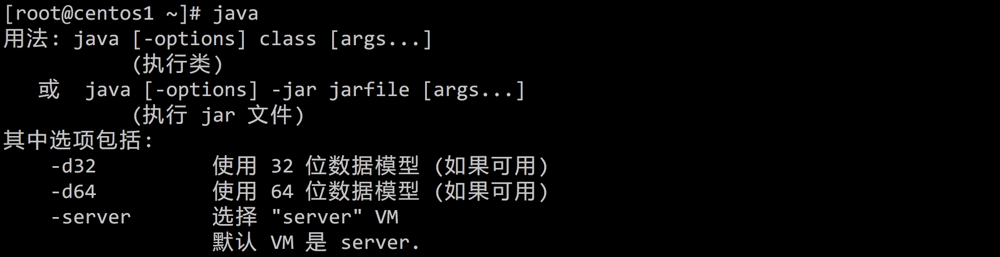

参考
http://xianbai.me/learn-md/article/extension/table.html


标题：
#h1级标题
##h2级标题
###h3级标题
####h4级标题
#####h5级标题
######h6级标题

<h1 id="user-content-锚点">锚点1级</h1>
<h2 id="user-content-锚点">锚点2级</h2>
<h3 id="user-content-锚点">锚点3级</h3>
<h4 id="user-content-锚点">锚点4级</h4>
<h5 id="user-content-锚点">锚点5级</h5>
<h6 id="user-content-锚点">锚点6级</h6>
<h7 id="user-content-锚点">锚点7级</h7>
<h8 id="user-content-锚点">锚点8级，可见7、8级都被忽略了</h8>


分割线：三个以上的短线 即可作出分割线，有空行

----

分割线
三个或者三个以上的 - 或者 * 都可以。

示例：

---
----
***
*****


图片语法：

图片alt就是显示在图片下面的文字，相当于对图片内容的解释。
图片title是图片的标题，当鼠标移到图片上时显示的内容。title可加可不加
示例：


超链接：[连接名称](网址 , 标题)
[我是链接名](http://www.baidu.com "我是标题")
[<i class="icon-refresh"></i> 点我刷新](/sonfilename/)

超链接语法：[超链接名](超链接地址 "超链接title")title可加可不加
示例：

[简书](http://jianshu.com)
[百度](http://baidu.com)

<a href="超链接地址" target="_blank">超链接名</a>

示例
<a href="https://www.jianshu.com/u/1f5ac0cf6a8b" target="_blank">简书</a>


另一种超链接写法：[链接名][链接代号]
[here][3]
然后在别的地方定义 3 这个详细链接信息，
[3]: http://www.izhangbo.cn "聚牛团队"

直接展示链接的写法：<http://www.izhangbo.cn>

键盘键
<kbd>Ctrl+[</kbd> and <kbd>Ctrl+]</kbd>

code格式：反引号
Use the `printf()` function.

``There is a literal backtick (`) here.针对在代码区段内插入反引号的情况`` 

强调：
*斜体强调*
**粗体强调**

**这是加粗的文字**

*这是倾斜的文字*`

***这是斜体加粗的文字***

~~这是加删除线的文字~~


>这是引用的内容
>>这是引用的内容
>>>>>>>>>>这是引用的内容

图片




使用 icon 图标文字
<i class="icon-cog"></i>

段落：以一个空行开始，以一个空行结束，中间的就是一个段落。

表格：

Item     | Value  |value
-------- | ---    |------
Computer | $1600  |sss
Phone    | $12    |ssss
Pipe     | $1     |sss

表头|表头|表头
---|:--:|---:
内容|内容|内容
内容|内容|内容

第二行分割表头和内容。
- 有三个才行，为了对齐，多加了几个
文字默认居左
-两边加：表示文字居中
-右边加：表示文字居右
注：原生的语法两边都要用 | 包起来。此处省略

姓名|技能|排行
---|:--:|--:
刘备|哭|大哥
关羽|打|二哥
张飞|骂|三弟


无序列表：使用 - 加一个空格（）

- 无需列表1
- 无序列表2
- 无序列表3

无序列表
语法：
无序列表用 - + * 任何一种都可以

- 列表内容
+ 列表内容
* 列表内容

注意：- + * 跟内容之间都要有一个空格

有序列表：使用 数字 加一个英文句点，点后面有空格是换行

1. 有序列表
2. 有序列表
3. 有序列表
4. 有序列表
5. 有序列表


列表嵌套
上一级和下一级之间敲三个空格即可

- 一级无序列表内容
   - 二级无序列表内容
   - 二级无序列表内容
   - 二级无序列表内容
- 一级无序列表内容
   1. 二级有序列表内容
   2. 二级有序列表内容
   3. 二级有序列表内容
1. 一级有序列表内容
   - 二级无序列表内容
   - 二级无序列表内容
   - 二级无序列表内容
2. 一级有序列表内容
   1. 二级有序列表内容
   2. 二级有序列表内容
   3. 二级有序列表内容


注意：序号跟内容之间要有空格

换行缩进形成代码区块

    这里先换行，然后缩进4个空格，之后的内容便可以原样显示了，适合用于显示代码内容。直到文本结束或最后一个存在缩进的行为止。
    

块引用
>给引用的文本开始位置都加一个 '>'，
>便可组成一个块引用。在块引用中，可以结合
>其他markdown元素一块使用，比如列表。
>**强调**
也可以只在第一行加大于号，其他位置不加。

>- 块引用里使用列表，需要和上面的内容隔开一个空行
>- 记得加空格哦。


语法：
单行代码：代码之间分别用一个反引号包起来

	`代码内容`
代码块：代码之间分别用三个反引号包起来，且两边的反引号单独占一行

```
  代码...
  代码...
  代码...
```

单行代码

`create database hero;`

代码块

```
    function fun(){
         echo "这是一句非常牛逼的代码";
    }
    fun();
```

```flow
st=>start: 开始
op=>operation: My Operation
cond=>condition: Yes or No?
e=>end
st->op->cond
cond(yes)->e
cond(no)->op
&```


```flow
st=>start: 开始
op=>operation: My Operation
cond=>condition: Yes or No?
e=>end
st->op->cond
cond(yes)->e
cond(no)->op
&```


