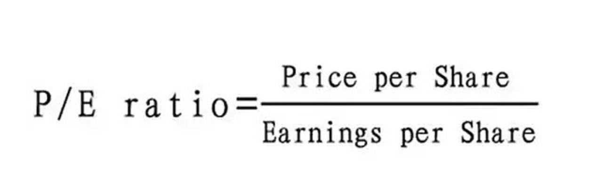

- [躺赢计划](#躺赢计划)
- [场内与场外的区别](#场内与场外的区别)
   - [场内基金与场外基金的区别](#场内基金与场外基金的区别)
- [基金的开放封闭](#基金的开放封闭)
- [ETF基金](#ETF基金)
- [联接基金](#联接基金)
- [LOF基金](#LOF基金)
- [套利](#套利)
- [股票、基金、证券、债券、信托、期货、国债、外汇](#股票、基金、证券、债券、信托、期货、国债、外汇)
   - [股票](#股票)
   - [基金](#基金)
   - [证券](#证券)
   - [债券](#债券)
   - [信托](#信托)
   - [期货](#期货)
   - [外汇](#外汇)
- [市盈率（静态市盈率，动态市盈率，TTM市盈率）](#市盈率（静态市盈率，动态市盈率，TTM市盈率）)
  
---------------------------------------------------------------------------------------------------------------------

## 躺赢计划

【躺赢计划】是一个以指数基金为主要投资对象，以定投为投资方式，以低估买入、中估持有、高估卖出为投资策略，长期投资收益目标为年化15%的财富计划。

计划具体细节如下：

1.每周二午间进行定投，若遇节假日，顺延到下一个周二。

2.定投金额以300元一周为基准，市场越低估定投金额越大，越高估则金额越小。基准根据普通上班族一月工资6000的20%即1200设定，这是一个基本不影响生活的比例。

3.买入对象主要是场外的指数基金，若无低估品种可买则会买入货币基金，等有低估品种出现，再卖出货币基金买入。

4.股市有波动，短期买入有下跌风险，若无长期持有打算，或者3年~5年内需要用到的钱，请不要投入股市。

作者：躺赢君
链接：https://xueqiu.com/6943090400/127326199
来源：雪球
著作权归作者所有。商业转载请联系作者获得授权，非商业转载请注明出处。
风险提示：本文所提到的观点仅代表个人的意见，所涉及标的不作推荐，据此买卖，风险自负。

---------------------------------------------------------------------------------------------------------------------

1. 市值=股价×总股本 在不同的地方上市，根据不同的地方股价计算，市值不同 总市值=A股市值+H股市值 总股本:225.78亿 港股本:158.82亿 股价13.260 总市值:2993.79亿 港市值:2106.01亿

2. 一手：一手是证券市场的一个交易的最低限额，每个市场的规定不一样。 A股买卖交易规则以100股的整数倍为单位，也说以手为单位，即一手是100股。每次买进都只能是100股的整数，或是说一手的整数倍。

3. 集合竞价、连续竞价、交易时间

4. 股票振幅：股票振幅就是股票开盘后的当日最高价和最低价之间的差的绝对值与前日收盘价的百分比，它在一定程度上表现股票的活跃程度。

5. 市盈率＝每股市价／每股盈利，反映市盈率偏低，股票价值被低估，一般来说，市盈率极高（如大于100倍）的股票，其股息收益率为零。因为当市盈率大于100倍，表示投资者要超过100年的时间才能回本，股票价值被高估，没有股息派发。

6. 股票的市净率＝每股市价／每股净资产，市净率指的是每股股价与每股净资产的比率。 市净率可用于股票投资分析，一般来说市净率较低的股票，投资价值较高，相反，则投资价值较低

7. 周转率(换手率)＝(某一段时期内的成交量)/(发行总股数)x100%，“换手率”也称“周转率”，指在一定时间内市场中股票转手买卖的频率，是反映股票流通性强弱的指标之一。

8. 量比=（现成交总手数 / 现累计开市时间(分) ）/
   过去5日平均每分钟成交量，量比的数值越大，表明了该股当日流入的资金越多，市场活跃度越高；反之，量比值越小，说明了资金的流入越少，市场活跃度越低。我们可以从量比曲线与数值与曲线上，可以看出主流资金的市场行为，如主力的突发性建仓，建完仓后的洗盘，洗盘结束后的拉升，这些行为可以让我们一目了然！

9. 内盘（空方急于卖出的能量大小）、外盘（主动性买盘）这两个数据大体可以用来判断买卖力量的强弱。 若外盘数量大于内盘，则表现买方力量较强，若内盘数量大于外盘则说明卖方力量较强。

10.

各种指数 各种交易所 各种板块、行业 新经济公司将“回A股” 发行的CDR到底是什么？

场外暗盘交易：暗盘交易只局限于有限的范围。交易时间，比较短暂，一般为新股正式上市日前一个营业日下午4时15分至6时30分的两个多小时的时间。

新股破发：最新的股票跌破发行价，新股破发中的发，是指股票的发行价格。新股破发是指股票发行上市当日就跌破发行价，在一级市场申购中签的股民也是要赔钱的。在股市中，当股价跌破发行价时即为破发。而普遍情况，特别在牛市行情中比较少见，在市场徘徊期常见到。

交易时间 周一至周五 (法定休假日除外)
上午9：30 --11：30 下午13：00 -- 15：00

竞价成交
(1) 竞价原则：价格优先、时间优先。价格较高的买进委托优先于价格较低买进委托，价格较低卖出委托优先于较高的卖出委托；同价位委托，则按时间顺序优先。
(2) 竞价方式：上午9：15--9：25进行集合竞价；上午9：30--11：30、下午13：00--15：00进行连续竞价 (对有效委托逐笔处理)。

什么是市值？ 一般来说，市值是指一家上市公司的发行股份按市场价格计算出来的股票总价值，公式表达就是“市值=股价×总股本”，这个概念几乎没有分歧。 1、站在上市公司的角度：市值=股价×总股本=净利润×市盈率
2、站在财务（外部）投资人的角度：市值=未来合宜的净利润水平÷预期回报率

严格的说，一家公司的股票其实不是“同时”在内地和香港上市，而是“一部分在香港一部分在内地”上市。比方说一亿股股票，不是在内地上市一亿、在香港也上市一亿。而是内地上市8000万，香港上市2000万。在内地上市的部分不可以在香港市场交易，在香港上市的部分也不可以在内地股市交易（除非经过复杂手续退出香港市场重新在内地股市上市）。所以两地上市也没什么冲突的，一边一部分而已。【引自《A＋H股公司总市值怎么算》】

中国上海证券交易所和深圳证券交易所的规定中，一手等于100股；香港一手可能是100股、200股、400股或20000股，每家公司都不一样。一手是证券市场的一个交易的最低限额，每个市场的规定不一样。

分为以下两种情况：
1、A股一手是100股。A股主要指的沪A（上海交易所上市的股票）与深A（深圳交易所上市的股票）。A股买卖交易规则以100股的整数倍为单位，也说以手为单位，即一手是100股。每次买进都只能是100股的整数，或是说一手的整数倍。
2、港股交易跟国内的股票交易不一样，它交易的每手股数是不固定的，不同的股票规定数是不同的，具体在股票的详情页能看到。有400股为一手、1000股为一手、2000股为一手、4000股为一手等。

股票振幅： （当日最高点的价格－当日最低点的价格）/昨天收盘价×100%=振幅 或者：最高点的幅度 - 最低点的幅度 = 振幅

数据分析编辑 股票振幅的数据分析，对考察股票有较大的帮助，一般可以预示几种可能： 1、可能是庄家高度控盘，散户手中流动的筹码很少，数量不多的成交量就会对股价形成很大波动。 2、可能是庄家通过大幅拉高或杀跌进行吸筹或出货的操作。
3、处于多空明显分歧的阶段，如某股票在连续上涨或者涨停后，打开涨停或跌停时，就会出现较大的价格波动。

股票的市盈率（Price-to-Earning Ratio，P/E或PER），又称为市盈率，指每股市价除以每股盈利（Earnings Per
Share，EPS），通常作为股票是便宜抑或昂贵的指标（通货膨胀会使每股收益虚增，从而扭曲市盈率的比较价值）。市盈率把企业的股价与其制造财富的能力联系起来。

每股盈利的计算方法，一般是以该企业在过去一年的净利润除以总发行已售出股数。市盈率越低，代表投资者能够以相对较低价格购入股票。假设某股票的市价为24元，而过去一年的每股盈利为3元，则市盈率为24/3=8。该股票被视为有8倍的市盈率，即在假设该企业以后每年净利润和去年相同的基础上，如果不考虑通货膨胀因素，回本期为8年，折合平均年回报率为12.5%，投资者每付出8元可分享1元的企业盈利。但上市公司通常只会把部分盈利用来派发股息，其余用来作进一步发展，所以市盈率的倒数不等于股息率。

股息收益率 上市公司通常会把部分盈利派发给股东作为股息。上一年度的每股股息除以股票现价，是为现行股息收益率。如果股价为50元，去年股息为每股5元，则股息收益率为10%，此数字一般来说属于偏高，反映市盈率偏低，股票价值被低估。
一般来说，市盈率极高（如大于100倍）的股票，其股息收益率为零。因为当市盈率大于100倍，表示投资者要超过100年的时间才能回本，股票价值被高估，没有股息派发。

市盈率所代表的意义：

如果某股票有较高市盈率，则有可能因以下原因： 市场预测未来的盈利增长速度快。 该企业一向录得可观盈利，但在前一个年度出现一次过的特殊支出，降低了盈利。 出现泡沫，该股被以超过其内在价值的价格在交易。
该企业有特殊的优势，保证能在低风险情况下持久录得盈利。 市场上可选择的股票有限，在供求定律下，股价将上升。这令跨时间的市盈率比较变得意义不大。

如果某股票有较低市盈率，则有可能因以下原因： 市场预测该企业和去年相比较，盈利将减少，企业价值将下降。 该企业在去年出现过一次性的特殊收入，暂时提高了去年的盈利。 该股的价格被市场低估。 股票的供给超过了市场上资金的投资需求。
※值得一提，如果某股票的市盈率为零，即代表股票去年是在于亏损状态。

股票的市净率（Price-to-Book Ratio, PBR, P/B），又名市账率、股價淨值比，指每股市价除以每股净资产，通常作为股票孰贱孰贵的指标之一。

市净率指的是每股股价与每股净资产的比率。 市净率可用于股票投资分析，一般来说市净率较低的股票，投资价值较高，相反，则投资价值较低；但在判断投资价值时还要考虑当时的市场环境以及公司经营情况、盈利能力等因素。

每股净资产 每股净资产是指股东权益与总股数的比率。其计算公式为：每股净资产= 股东权益 /
总股数。这一指标反映每股股票所拥有的资产现值。每股净资产越高，股东拥有的每股资产价值越多；每股净资产越少，股东拥有的每股资产价值越少。通常每股净资产越高越好。 在基本分析（Fundamental Analysis
）的各种指标中，每股净资产是判断企业内在价值最重要的参考指标之一。

什么是换手率 “换手率”也称“周转率”，指在一定时间内市场中股票转手买卖的频率，是反映股票流通性强弱的指标之一。 换手率(Turnover Rate)
是以百分比衡量的一年内股票的成交量占股票总数的比例。以样本总体的性质不同有不同的指标类型，如交易所所有上市股票的总换手率、基于某单个股票发行数量的换手率、基于某机构持有组合的换手率。

换手率的计算公式 换手率的计算公式为： 周转率(换手率)＝(某一段时期内的成交量)/(发行总股数)x100%

换手率的实质意义 换手率的高低往往意味着这样几种情况：
(l)股票的换手率越高，意味着该只股票的交投越活跃，人们购买该只股票的意愿越高，属于热门股；反之，股票的换手率越低，则表明该只股票少人关注，属于冷门股。
(2)换手率高一般意味着股票流通性好，进出市场比较容易，不会出现想买买不到、想卖卖不出的现象，具有较强的变现能力。然而值得注意的是，换手率较高的股票，往往也是短线资金追逐的对象，投机性较强，股价起伏较大，风险也相对较大。
(3)
将换手率与股价走势相结合，可以对未来的股价做出一定的预测和判断。某只股票的换手率突然上升，成交量放大，可能意味着有投资者在大量买进，股价可能会随之上扬。如果某只股票持续上涨了一个时期后，换手率又迅速上升，则可能意昧着一些获利者要套现，股价可能会下跌。

量比是衡量相对成交量的指标。它是指股市开市后平均每分钟的成交量与过去5个交易日平均每分钟成交量之比。其计算公式为：量比=（现成交总手数 / 现累计开市时间(分) ）/ 过去5日平均每分钟成交量 [1]  。

量比这个指标所反映出来的是当前盘口的成交力度与最近五天的成交力度的差别，这个差别的值越大表明盘口成交越趋活跃，从某种意义上讲，越能体现主力即时做盘，准备随时展开攻击前蠢蠢欲动的盘口特征。因此量比资料可以说是盘口语言的翻译器，它是超级短线临盘实战洞察主力短时间动向的秘密武器之一。它更适用于短线操作。

量比反映出的主力行为从计算公式中可以看出，量比的数值越大，表明了该股当日流入的资金越多，市场活跃度越高；反之，量比值越小，说明了资金的流入越少，市场活跃度越低。我们可以从量比曲线与数值与曲线上，可以看出主流资金的市场行为，如主力的突发性建仓，建完仓后的洗盘，洗盘结束后的拉升，这些行为可以让我们一目了然！

内盘外盘，股市术语。内盘常用S（取英文 sell [sel] 卖出 的首字母S）表示，外盘用B（取英文buy [baɪ] 买入 的首字母B）表示。
内盘：以买入价格成交的数量，即卖方主动以低于或等于当前买一、买二、买三等价格下单卖出股票时成交的数量，用绿色显示。内盘的多少显示了空方急于卖出的能量大小。
外盘：以卖出价格成交的数量，即买方主动以高于或等于当前卖一、卖二、卖三等价格下单买入股票时成交的数量，用红色显示。外盘的多少显示了多方急于买入的能量大小。 内盘：以买一、买二、买三等价格成交的交易，买入成交数量统计加入内盘。
外盘：以卖一、卖二、卖三等价格成交的交易。卖出成交数量统计加入外盘。 内盘、外盘这两个数据大体可以用来判断买卖力量的强弱。若外盘数量大于内盘，则表现买方力量较强，若内盘数量大于外盘则说明卖方力量较强。

参考
https://www.jianshu.com/p/d333c2873153
https://baike.baidu.com/item/%E8%82%A1%E7%A5%A8/22647

---------------------------------------------------------------------------------------------------------------------

## 场内与场外的区别

场内场外的“场”指的是证券交易所。

通常在股票账户内买卖就是场内交易，在支付宝天天基金等平台申购赎回就是场外。

场内买卖交易，就可以看成是像咸鱼这样的二手市场，和其他投资人进行二手买卖。

场外申购赎回，就是我们直接向厂家（基金公司）进货或退货

我们把基金份额看做是一种商品，基金公司就是生产这种商品的厂家。

1. 场内的价格实时变动，交易相对灵活，但是场内交易需要花更多的时间精力去操作。
2. 场外3点前按当天的净值，3点后按下一个交易日的净值，比较省心省事。

### 场内基金与场外基金的区别

场内交易是指通过证券交易所进行的买卖活动。

用场内交易方式进行买卖的基金，就是场内基金，最典型的场内基金就是ETF。

只要不是场内交易的基金，全都是场外基金。比如我们用支付宝，蛋卷申购赎回的就是场外基金。

场内与场外基金的区别有几点：
1. 交易价格不一样。场外基金所有的申购赎回都是按照当天统一的净值进行确认，一天只有一个价格。

而场内基金价格收市场涨跌影响，买卖价格是随时变化的。

2. 场外基金未知价原则。

场外基金申购赎回是未知价原则，申购赎回时不知道净值多少，收盘后按照当天最终净值来确认。

场内交易，买卖时价格多少，就按什么价格清算。

3. 交易时间不同

场内基金只有交易时间才能买卖，早上9点15到11点半，下午1点到3点。

场外基金随时可以委托，但是3点前委托按照当天的净值确认，3点后委托按照第二天的净值确认。

4. 买卖的确认时间不同。

场内基金今天买入，明天就可以卖出。今天卖出的钱，当天就可以继续买入。

场外基金，一般周一买入，周三才能赎回。赎回的到账时间也比较长，一般都要几天时间才到账。

参考：  
[场内基金与场外基金的区别](https://zhuanlan.zhihu.com/p/69084767)
[场内场外，傻傻分不清楚](https://zhuanlan.zhihu.com/p/115616502)  

---------------------------------------------------------------------------------------------------------------------

## 基金的开放封闭

开放基金就是开放给投资者，可以在场外申购赎回的基金，故而基金的规模也是随时在变化的；

封闭基金就是发行完毕后，就不能申购赎回的基金。申购赎回期过后，投资者只能通过场内买卖，故而基金的规模是固定的。

## ETF基金
ETF的全称为Exchange Traded Funds，是一种在交易所上市交易的、基金份额可变的一种指数基金。  
中文名叫“交易型开放基金”。是一种场内场外都可以交易的基金。

而且场内场外的份额可以互通。场外申购的可以在场内卖出；场内购买的，也可以在场外赎回。

不过ETF的申购门槛比较高，一般100万起步。所以我们普通投资者想买ETF，就只能到场内进行买卖，操作和买卖股票一样

## 联接基金
因为ETF的申购门槛较高，而场内买卖需要股票账户，而且需要手动操作，不能设置自动扣款定投等原因，于是有基金公司成立了联接基金。

联接基金就是买ETF的基金。买了联接基金，就等于买了对应的ETF。只不过联接基金是场外交易，方便没有股票账户的投资者和想要设置自动定投的投资者。

它的管理费和托管费一般和对应的ETF一致，不再额外多收费。只不过申购赎回费会比场内买卖的买卖佣金贵。

## LOF基金
LOF基金是Listed Open-Ended Fund的缩写，称为上市开放式基金。
LOF和ETF类似，也是场内场外均可交易、场内场外份额互通的基金。

和ETF不同的是它的申购门槛较低，一般1000元起申购。所以我们普通投资者也可以在场外申购

- ETF：场内买卖的指数基金
- ETF链接：主要投资于ETF的开放式指数基金。
- LOF：同时可以场内买卖和场外申购赎回的基金，可以是指数基金，也可以是普通的开放式基金。

## 套利
由于ETF和LOF都是场内场外均可交易，且份额互通，所以就会存在套利。

套利是什么呢？简单来说就是倒买倒卖。

比如香港的苹果手机比内地便宜，就会有很多代购从香港买了拿到内地卖，赚差价，这就叫套利。

基金也是一样。当同一只基金场内场外的价格出现价差，比如场内价格比场外便宜，就会有投资者买入场内的基金份额，拿去场外卖。

而一般ETF的交易量较大，报价比较实时，几分钟一次，所以场内外价差都比较小；而LOF的交易量较小，几小时甚至一天才报一次价，场内外价差一般较大。

买卖ETF和LOF时，一定要注意场内外的价差，在价格便宜的地方买，价格贵的地方卖。

参考：  
[小白指数基金课：三分钟搞懂场内场外、开放封闭、ETF、联接、LOF](https://xueqiu.com/6943090400/127326199)  
[什么是ETF，ETF链接，LOF？](https://mp.weixin.qq.com/s?__biz=MzA5MDQxODY5MQ==&mid=2247487926&idx=1&sn=fac7303cb101d5bd059d2e53a9d603c9&source=41#wechat_redirect)  

---------------------------------------------------------------------------------------------------------------------

## 股票、基金、证券、债券、信托、期货、国债、外汇

### 股票

股票（stock）或是资本存货（capital stock）是一种有价证券，股份公司将其所有权借由这种有价证卷进行分配。因为股份公司需要筹集资金，因此将股票发给投资者作为公司资本部分所有权的凭证，成为股东以此获得股息（股利），并分享公司成长或交易市场波动带来的利润；但也要共同承担公司运作错误所带来的风险。

### 基金

通过发行基金份额，将众多资金集合成独立资产，由基金托管人（例如银行）托管，由专业的基金管理公司管理和运作，以投资组合的方式进行证券投资的一种利益共享、风险共担的投资方式。间接参与投资。

### 证券

证券（Securities）是有价证券的简称，是一种表示财产权的有价凭证，持有者可以依据此凭证，证明其所有权或债权等私权的证明文件。例如：股票、债券、权证和股票价款缴纳凭证等。

### 债券

债券，是发行者为筹集资金发行的、在约定时间支付一定比例的利息，并在到期时偿还本金的一种有价证券。

### 信托

信托是委托人基于对受托人的信任，将其财产权委托给受托人，由受托人按委托人的意愿以自己的名义，为受益人的利益或特定目的，进行管理和处分的行为。

### 期货

期货合约（Futures contract），简称期货（Futures），是一种跨越时间的交易方式。买卖双方透过签订合约，同意按指定的时间、价格与其他交易条件，交收指定数量的现货。通常期货集中在期货交易所，以标准化合约进行买卖，但亦有部分期货合约可透过柜台交易进行买卖，称为场外交易合约。交易的资产通常是商品或金融工具。双方同意购买和出售资产的预定价格被称为远期价格。未来的指定时间 - 即交付和付款发生时 - 称为交货日期。因为它是标的资产的函数，期货合约是衍生产品。

### 外汇

外汇是货币行政当局（中央银行、货币机构、外汇平准基金组织及财政部）以银行存款、财政部库券、长短期政府证券等形式所保有的在国际收支逆差时可以使用的债权。

1. 股票，股票就是作为公司股东的一个凭证，证明股东的身份。需要关注的点是股东可以定期享受公司的盈利分红，可以去参与公司的一些管理。如果公司效益不好，也有可能会负担公司的亏损，你相当于是公司的所有者，公司的盈亏都和你有关。（市面小散户一般不参与公司管理）

2. 债券，债券相当于是一个借款证明，公司为了筹集资金向社会公众发行债券，会写明到期日以及利息的支付，将来到期不管公司财务状况如何，都要支付本金和利息，所以如果你买债券，相当于是把自己的钱借给公司用，你到时候收固定的本金和利息，在这期间不会参与公司的管理、享受分红。公司的亏损也不需要你负责

3. 基金，基金就是大家买了基金的钱会统一由基金公司来运作，由他们的基金经理去投资买股票、债券等，然后根据这些股票的收益来计算基金的收益

参考：  
[【通俗理解】股票、基金、证券、债券、信托、期货、国债、外汇](https://zhuanlan.zhihu.com/p/109369360)  

---------------------------------------------------------------------------------------------------------------------

## 股票分类

按票面形式，可分为记名股票、无记名股票和有面额股票。

按股东权利，分为优先股和普通股。

按流通状况，分为流通股和非流通股。

按上市交易所和买卖主体，可分为
- A股：人民币普通股票。境内、港、澳、台居民均可开立A股账户。
- B股：人民币特种股票。以人民币标明面值，以外币认购和买卖，在境内（上海及深圳）证券交易所上市交易的股票。准许持有合法外汇的境内居民自由开户买卖B股。
- H股：境外上市外资股，是境内上市公司在境外发行上市的股份。
- N股
- S股
- L股

我国上市公司的股票有A股、B股、H股、N股和S股等的区分。这一区分主要依据股票的上市地点和所面对的投资者而定。
1、A股的正式名称是人民币普通股票。它是由我国境内的公司发行，供境内机构、组织或个人（不含台、港、澳投资者）以人民币认购和交易的普通股股票。
2、B股的正式名称是人民币特种股票，它是以人民币标明面值，以外币认购和买卖，在境内（上海、深圳）证券交易所上市交易的。
它的投资人限于：外国的自然人、法人和其他组织，香港、澳门、台湾地区的自然人、法人和其他组织，定居在国外的中国公民。中国证监会规定的其他投资人。现阶段B股的投资人，主要是上述几类中的机构投资者。B股公司的注册地和上市地都在境内。只不过投资者在境外或在中国香港，澳门及台湾。
3、H股，即注册地在内地、上 市地在香港的外资股。香港的英文是HOngKOng，取其字首，在港上市外资股就叫做H股。依此类推，纽约的第一个英文字母是N，新加坡的第一个英文字母 是S纽约和新加坡上市的股票就分别叫做N股和S股。
4、N股，是指那些在中国大陆注册、在纽约（New York）上市的外资股。在我国股市中，当股票名称前出现了N字，表示这只股是当日新上市的股票，字母N是英语New(新)的缩写。看到带有N字头的股票
时，投资者除了知道它是新股，还应认识到这只股票的股价当日在市场上是不受涨跌幅限制的，涨幅可以高于10％，跌幅也可深于10％。这样就较容易控制风险和把握投资机会。 如N北化、N建行、N石油等。

A股的正式名称是人民币普通股票。它是由我国境内的公司发行,供境内机构、组织或个人(不含台、港、澳投资者)以人民币认购和交易的普通股股票。 B股的正式名称是人民币特种股票。它是以人民币标明面值,以外币认购和买卖,在境内(上海、深圳)
证券交易所上市交易的股票。在2001年2月前,B股的投资人仅限于:
外国的自然人、法人和其他组织,香港、澳门、台湾地区的自然人、法人和其他组织,定居在国外的中国公民,以及中国证监会规定的其他投资人。2001年2月19日之后,中国证监会宣布对内开放B股市场,准许持有合法外汇的境内居民自由开户买卖B股。
H股又称境外上市外资股,是境内上市公司在境外发行上市的股份。

红筹股：

红筹股：在中华人民共和国境外注册，在香港上市的股票称为红筹股。红筹股已经成为除B股及H股外，内地企业进入国际资本市场筹资的一条重要渠道。
按公司业绩，可分为绩优股和垃圾股。

红筹股是指在中国境外注册、在香港上市的带有中国大陆概念的股票。“带有中国大陆概念”主要指中资控股和主要业务在中国大陆。

早期的红筹股，主要是一些中资公司收购香港中小型上市公司后改造而形成的，如“中信泰富”等。近年来出现的红筹股，主要是内地一些省市将其在香港的窗口公司改组并在香港上市后形成，如“上海实业”、“北京控股”等。

蓝筹股：

蓝筹股是指稳定的现金股利政策对公司现金流管理有较高的要求，通常将那些经营业绩较好，具有稳定且较高的现金股利支付的公司股票称为“蓝筹股”。蓝筹股多指长期稳定增长的、大型的、传统工业股及金融股。“蓝筹”一词源于西方赌场，在西方赌场中，有三种颜色的筹码、其中蓝色筹码最为值钱。

“蓝筹”一词源于西方赌场。在西方赌场中，有三种颜色的筹码、其中蓝色筹码最为值钱，红色筹码次之，白色筹码最差，投资者把这些行话套用到股票。

龙头股：

指的是某一时期在股票市场的炒作中对同行业板块的其他股票具有影响和号召力的股票，它的涨跌往往对其他同行业板块股票的涨跌起引导和示范作用。

黑马股：

黑马原本指在赛马场上本来不被看好的马匹，却能在比赛中成为出乎意料的获胜者。反映到股市上，黑马股是指投资者本来不看好，却能够异军突起，价格可能脱离过去的价位而在短期内大幅上涨的个股。

白马股：

是指长期绩优、回报率高并具有较高投资价值的股票，具有成长性，但是还没成为蓝筹权重的股票称为白马股。

白菜股：

指股票单价偏低的个股，没有确切的衡量标准的股票。白菜股不代表是烂股，有一部分银行股、钢铁股也是白菜股。

妖股：

股市上通常把那些股价走势奇特、怪异的股票称为“妖股”。

什么是ST股和PT股

ST股

根据证监会规定:当一个公司连续两年亏损或者净资产低于股票面值的时候，在股票名称前就会加上“ST”，表示“特殊处理”的意思。

沪深证券交易所在1998年4月22日宣布,根据1998年实施的股票上市规则,将对财务状况或其它状况出现异常的上市公司的股票交易进行特别处理,由于“特别处理”的英文是Special treatment（缩写是“ST”）,因此这些股票就简称为ST股。

ST股票每天的涨跌都不得超过5%。用于警示投资者注意投资风险和防止庄家恶意炒作。

如果在第三年，公司的经营未有改善，依旧处于亏损状态，股票名称前除“ST”外还会加上“*”，即“*ST”，意为有退市风险。

上述财务状况或其它状况出现异常主要是指两种情况,
一是上市公司经审计连续两个会计年度的净利润均为负值,
二是上市公司最近一个会计年度经审计的每股净资产低于股票面值。

在上市公司的股票交易被实行特别处理期间,其股票交易应遵循下列规则：
（1）股票报价日涨跌幅限制为5％；
（2）股票名称改为原股票名前加“ST”,例如“ST辽物资”；
（3）上市公司的中期报告必须审计。

PT股

“PT”的英语 Particular Transfer（意为特别转让）的缩写。这是旨在为暂停上市股票提供流通渠道的“特别转让服务”。对于进行这种特别转让的股票,沪深交易所在其简称前冠以“PT”,称之为“PT股” 。

根据《公司法》和证券法的规定,上市公司出现连续三年亏损等情况,其股票将暂停上市。沪深交易所从1999年7月9日起,对这类暂停上市的股票实施“特别转让服务”。第一批这类股票有“PT双鹿”,“PT农商社”,“PT苏三山”和“PT渝太白”。

PT即特别转让。依据《公司法》和《证券法》规定，上市公司出现连续三年亏损等情况，其股票将暂停上市。沪深交易所对这类暂停上市的股票实施特别转让服务，并在其简称前冠以PT，称之为PT股票。

PT股票在历史上曾经出现过几只，它与正常的股票也存在着很大的区别。

PT股票和正常股票的区别：
1、交易时间不同。PT股票仅限于每周五的开市时间内进行，而非交易日持续交易。
2、跌幅限制不同。PT股票申报价不得超过上一次转让价格的上下5％，这个和ST股票的日涨跌幅相同。
3、撮合方式不同。PT股票是交易所于收市后一次性对该股票当天所有有效申报按集合竞价方式进行撮合，产生唯一的成交价格，所有符合成交条件的委托盘均按此价格成交。
4、交易性质不同。PT股票不是上市交易，因此，这类股票不计入指数计算，成交数不计入市场统计，其转让信息也不在交易所行情中显示，只由指定报刊设专栏在次日公告。

在目前，PT股票已经被停止交易，仅供大家了解此概念。

[红筹股、蓝筹股、 龙头股、黑马股、白马股、白菜股、妖股有什么区别](https://zhuanlan.zhihu.com/p/358883942)  
[什么是ST股和PT股](https://www.zhihu.com/column/p/21972976)  
[金融100问：什么是ST股、PT股？](https://zhuanlan.zhihu.com/p/54417590)  

---------------------------------------------------------------------------------------------------------------------

## 常见股票术语

开盘价、收盘价、最高价、最低价、压力线、支撑线、K线、美国线、牛市、熊市、多头、空头、除息、除权、买空、卖空

日KDJ，周KDJ，月KDJ同时低价金叉。

K线就是指将各种股票每日、每周、每月的开盘价、收盘价、最高价、最低价等涨跌变化状况，

那么，为什么叫“K线”呢？实际上，在日本的“K”并不是写成“K”字，而是写做“罫”(日本音读kei)，K线是“罫线”的读音，K线图称为“罫线”，西方以英文第一个字母“K”直译为“K”线，由此发展而来。

K线的支撑线、压力线和趋势线
压力线(Resistance Line)、、

1. 将两个或两个以上的相对低点连成一条直线即得到支撑线。
2. 将两个或两个以上的相对高点连成一条直线即得到阻力线。

支撑线又称为抵抗线。当股价跌到某个价位附近时，股价停止下跌，甚至有可能还有回升。这个起着阻止股价继续下跌或暂时阻止股价继续下跌的价格就是支撑线所在的位置。

压力线又称为阻力线。当股价上涨到某价位附近时，股价会停止上涨，甚至回落。这个起着阻止或暂时阻止股价继续上升的价位就是压力线所在的位置。

支撑线与压力线相互转化

一条支撑线如果被跌破，那么这个支撑线将成为压力线；同理，一条压力线被突破，这个压力线将成为支撑线。这说明支撑线和压力线的地位不是一成不变的，而是可以改变的，条件是它被有效的足够强大的股价变动突破。

[k线中支撑线、压力线、趋势线的画法分析](https://www.zcaijing.com/zhichengxian/102594.html)  
  
  
  
  

---------------------------------------------------------------------------------------------------------------------

## 常见股票指数

我们常提到的股票指数（如沪深300、中证50等），是一种以股票价格为对象的价格指数。价格指数指的是统计学里的动态相对数，能够表现出当前指数价格相对于基期的涨跌变化。

国内

上海证券交易所综合股价指数（上证综指）
深圳证券交易所成份股价指数（深证成指）
沪深300指数
创业版指数

我们比较常看到的上证50、沪深300、中证500指数等就是按照规模分类的指数。

上证50就是上海市场市值前50的公司组成的指数，沪深300就是沪深两市市值前300的公司组成的指数。

但也有一些特殊的情况：比如中证500是沪深两市排名从301开始到800的这500只股票，而不是排名从1到500；中证1000是从801到1800这1000只股票。

1. 富时中国A50指数
   富时中国A50指数，是由全球四大指数公司之一的富时指数有限公司(现名为富时罗素指数)为满足中国国内投资者以及合格境外机构投资者需求所推出的实时可交易指数。富时中国A50指数是沪深交易所市值排名前50的A股公司的实时可交易指数，其总市值占A股总市值的33%，是最能代表中国A股市场的指数，是投资中国内地A股市场的一个基准，也是富时中国指数系列的旗舰指数。

2. 道琼斯指数
   道琼斯指数其实是一系列指数的统称，但通常指其中的道琼斯工业平均指数。道琼斯工业平均指数是根据美国股票市场上30只可靠而且重要的蓝筹股的加权平均数计算出来的，这30只股票来自不同的领域，目前包括美国运通、迪士尼、维萨、3M、苹果、微软、英特尔、IBM、思科、威瑞森、埃克森美孚、雪佛龙、陶氏杜邦、家得宝、沃尔玛、耐克、宝洁、强生、波音、卡特彼勒、可口可乐、麦当劳、辉瑞、默克制药、高盛、摩根大通、旅行者保险、联合健康保险、联合技术、沃尔格林博姿联合公司。

3. 标普500指数
   标准普尔指数是美国最大的证券研究机构即标准·普尔公司编制的股票价格指数。最初采选了230种股票，编制两种股票价格指数。从1976年7月1日开始，改为 400种工业股票，20种运输业股票，40种公用事业股票和40种金融业股票。几十年来，虽然有股票更迭，但始终保持为500种。标普500指数覆盖的是最受欢迎、持有者最多的美国股票，代表性很强。

4. 纳斯达克指数
   通常说的纳斯达克指数指纳斯达克综合指数，是以在NASDAQ市场上市的、所有本国和外国的上市公司的普通股为基础计算的。其中代表性的是纳斯达克100指数。

纳斯达克100指数做为纳斯达克的主要指数，其100只成分股均具有高科技、高成长和非金融的特点，可以说是美国科技股的代表。值得一提的是，纳斯达克100指数里，这些高成长性股票的良好业绩，都是各自内生性的高成长带来的，特别是创新业务，而非例如资产注入等外延式的增长。

从纳斯达克100指数十大权重成分股来看，他们主要为高科技企业，其中计算机行业的公司居多，目前权重最大的为苹果(Apple)，另外包括微软(Microsoft)、谷歌(Google)、思科(Cisco)、英特尔(Intel)等诸多知名公司。

5. 罗素2000指数
   美股市场的三大股指是指道琼斯指数、标普500指数和纳斯达克指数。除此之外，还有一个追踪小盘股的罗素2000指数。罗素2000指数是代表市场上的中、小型股的市值指标，在市场上总市值只有8100亿美元，不及标普500的十分之一。

6. 香港恒生指数
   恒生指数，由香港恒生银行全资附属的恒生指数服务有限公司编制，是以香港股票市场中的50家上市股票为成分股样本，以其发行量为权数的加权平均股价指数，是反映香港股市价幅趋势最有影响的一种股价指数。

恒生指数的成份股具有广泛的市场代表性，其总市值占香港联合交易所市场资本额总和的90%左右。为了进一步反映市场中各类股票的价格走势，恒生指数于1985年开始公布四个分类指数，把33种成份股分别纳入工商业、金融、地产和公共事业四个分类指数中。

7. 日经指数
   日经指数是日本代表性的股票指数，是代表日本股市或资本市场是好是坏的晴雨表，也是反映日元价值的因素之一，因此会对日元在外汇市场上的汇率造成相关的影响。日元目前是七大工业国的货币也是外汇市场上交投最活跃的外汇之一，而日经指数的升跌的影响可谓举足轻重。日经指数因延续时间较长，具有很好的可比性，成为考察日本股票市场股价长期演变及最新变动最常用和最可靠的指标，传媒日常引用的日经指数，指的是日经225指数。

[全球最著名的16个股票指数，你知道几个？](https://cn.investing.com/blog/article-192)  
[国内常见的股票指数，你知道多少](https://zhuanlan.zhihu.com/p/29157378)  

---------------------------------------------------------------------------------------------------------------------

## 市盈率（静态市盈率，动态市盈率，TTM市盈率）

PE（TTM）、PE（静）、PE（动）

市盈率（Priceearnings ratio，即P/E）也称“本益比”，理论上的计算方法是每股股价除以每股收益，但是股价/每股市盈率=总市值/净利润，通常为了方便就用当前总市值除以一年的总净利润来计算，是反映该股票估值水平的重要指标。

市盈率（Priceearnings ratio，即P/Eratio）是某种股票每股市价与每股盈利的比率，最直接地表达投资者的投入与产出的关系。简单的公式为，市盈率=当前股价÷每股收益率，或者市盈率=当前股票总市值÷上年度净利润

如果PE=15，意味着按现价买入该股票，假如该公司保持不变的盈利能力，需要15年时间公司所赚的净利润按照你所持有的股权份额计算，刚好等于初始投入买股票的钱。说通俗一点就是持有该股票15年才能收回你的投入成本。以常见的房产投资为例，假设房租15年回本，我们可以理解为该套房产现在的PE就是15。

### 静态市盈率
静态市盈率，简称PE LYR，计算方式：当前总市值除以去年一年的总净利润。但是这种方法就会出现一个问题，如果说2018年3月想要参考PE的时候,很有可能出现这家公司年报还没更新出来（年度报告由上市公司在每个会计年度结束之日起4个月内编制完成），那么我就无法得知2017年的总净利润了，数据还是需要统计的，所以一般的炒股软件都是以2016年的数据来填充。那么就是说，大家看到的是市盈率(静态)=2018年3月的当前总市值/2016年的总净利润，时隔两年，这种误差可想而知！所以就有了PE TTM

### 滚动市盈率(TTM市盈率)
滚动市盈率，简称PE TTM，计算方式：当前总市值除以前面四个季度的总净利润。“去年一年”和“前面四个季度”有什么区别，我就不需要多加解释了，简单点想就是PE TTM要比PE LYR更加准确一点，数据来得更新一些。那么PE TTM就是我们常见的PE（动）吗？很肯定地说“不是”，这个教滚动市盈率，区别等等下面讲PE（动）的时候你就知道了。一般PE TTM用在比较严谨的期刊、研报等地方，讲究数据的准确性，不用PE（动）的原因也就是其中的计算数据是“虚”的

TTM市盈率又称为滚动市盈率，与静态市盈率不同，其分母为最近四个季度（仍以一年为周期）的净利润之和。滚动市盈率也叫市盈率TTM(Trailing Twelve Month)，是以最近报告的12个月(四个季度)的净利润或者每股收益为基础来计算的，我们分别用PE3和PE4来表示：滚动市盈率(PE3)=当前股价÷最近4个季度基本每股收益之和，或者是：滚动市盈率(PE4)=当前市值÷最近4个季度归属于上市公司股东的净利润。

### 动态市盈率
动态市盈率，简称PE（动），计算方式：当前总市值除以预估今年全年总净利润。注意这个“预估今年全年总净利润”，说得难听点这就是“虚”的，这个数据具体怎么来的也不得而知，总是会有他的一套计算方式，据说是以6个月内券商预测的净利润取平均数

动态市盈率的计算公式分母为未来一年的预测净利润，计算的公式也稍微要复杂一点点

比如说该股票已经发布第一季度财报，这时我们的公式分母就要×4，半年度财报，这时我们的公式分母就要×2，三季度财报，这时我们的公式分母就要×4/3。

如果说静态市盈率看的股票的过去，那么动态市盈率则是预测该股票的未来

如果动态市盈率＞静态市盈率说明这只股票该季度或者一段时间公司的净利润降低了，公司发展有些担忧。

市盈率作为最常见的价值投资指标，经常给投资人的决策带来了许多盲点和误区。  
市盈率研究的核心是：如果我按照当前股价买入股票，那么我几年后才能回本？一般来说市盈率是多少，那就是几年后能回补，其实中里面就存在着两个致命的误区。
1. 第一，没有考虑净利润的变动，不可能用企业一年的净利润来判断今后几年，甚至几十年的净利润，净利润是动态的，所以还需要结合净利润增加率来做进一步的判断

2. 第二，“回本”是什么意思？光同净利润来算本金，而完全不考虑公司本身的净资产，这本身就是不合理的。

[市盈率（静态市盈率，动态市盈率，TTM市盈率）你了解吗？](https://zhuanlan.zhihu.com/p/134100342)  
[市盈率如何找低估？PE（TTM）、PE（静）、PE（动）傻傻分不清](https://xueqiu.com/2790850726/110453289)  
  
  

---------------------------------------------------------------------------------------------------------------------

