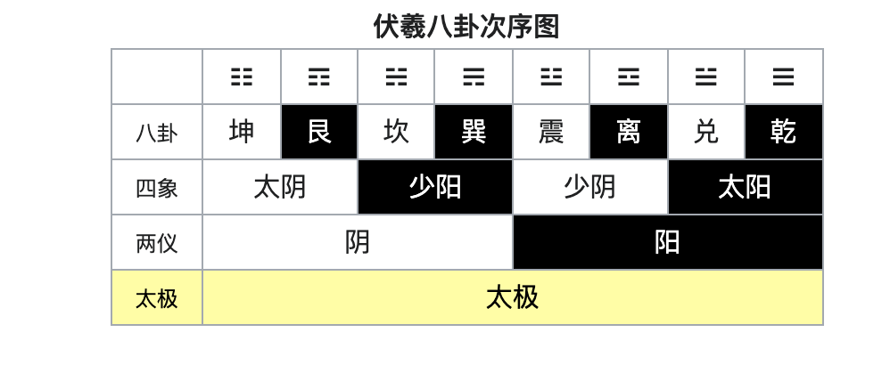
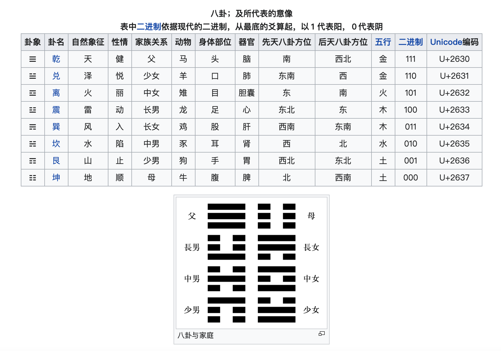

- [爻](#爻)
- [单卦（经卦）](#单卦（经卦）)
- [重卦(别卦)](#重卦(别卦))
- [八卦/六十四卦](#八卦/六十四卦)

## 爻

爻（音同肴，汉拼：yáo，注音：ㄧㄠˊ，粤拼：ngaau4）的本义是“交”、“效”，综横之交、阴阳之交，“效”则是通过“交”所产生的“效用”，可以通过全局计算来衡量，依不同方法、体系、定位立极，有相应不同解释。

《易经》八卦中有两个符号，一个是“⚊”，另一个是“⚋”。在《易经》中并没有“阴阳”二字，数百年后的《易传》才把“⚊”叫阳爻，把“⚋”叫阴爻。八卦是以阴阳符号反映客观现象。

“爻”是最基本的符号，意指交错，以奇画（“⚊”称阳爻）或偶画（“⚋”称阴爻）表示。

爻有阴、阳两种仪态，若两两相重则形成四象（太阳、少阴、少阳、太阴）。四象再增加一爻，就形成八卦。

爻自下而上排列。“三个”爻的含义，象征着“天人地”（上有天、下为地、人在其中）。

## 单卦（经卦）

由三个爻可组成一个单卦（经卦）。

八卦，意谓八个单卦（八个经卦）。

## 重卦(别卦)

经由八卦可再演化出六十四卦。两个八卦相叠(复卦)，即成八八六十四卦。
六十四卦，意谓六十四个重卦(六十四个别卦)。亦即八个“单卦”(经卦)如经纬交织组成六十四个“重卦”(别卦)。
在下的单卦称“内卦”，上者则称其“外卦”。

## 八卦/六十四卦

☰ 乾三连 天 乾qián  
☷ 坤六断 地 坤kūn  
☵ 坎中满 水  
☲ 离中虚 火  
☳ 震仰盂 雷 震zhèn  
☴ 巽下断 风 巽xùn  
☶ 艮覆碗 山 艮gèn  
☱ 兑上缺 泽 兑duì  

八卦是《易经》的基本概念，可代表一切自然现象的动静状态，每个卦由三个爻组成。

天为象。一种卦可挂在很多很多的现象，但不是任意挂，有特定的规则。每一现象都可以找到一种卦去挂，也不是任意的。先有象，后有卦。万象纳入八卦，八卦悬挂万象。将万象以八卦作为模型，硏究理解八卦这个模型，有助理解万象。

易经八卦的产生可回溯至河图与洛书，以及太极。

太极生两仪、两仪生四象、四象生八卦、八卦定吉凶、吉凶生大业。

若将八卦两两相重，形成六十四卦。原本八卦（三个爻）亦称为八个“单卦”，而两个八卦上下组合（六个爻）则称“重卦”。
在下的单卦称“内卦”，上者则称其“外卦”。

每一卦代表一种状态或过程。

宋代朱熹在《周易本义》中写了一首《八卦取象歌》帮助人记住八卦的卦象：

乾三连（☰），坤六断（☷）；
震仰盂（☳），艮覆碗（☶）；
离中虚（☲），坎中满（☵）；
兑上缺（☱），巽下断（☴）。

宋朝学者邵雍认为四象演八卦（方位），八八生成六十四卦，此为伏羲八卦，也叫先天八卦；

亦有学者认为八卦应该出自周文王的乾坤学说，他认为先有天地，天地相交而生成万物，天即乾，地即坤，八卦其余六卦皆为其子女：震为长男，坎为中男，艮（普通话读音：gèn；国语注音：ㄍㄣˋ；粤音：gan3，同“觐”）为少男；巽（普通话读音：xùn；国语注音：ㄒㄩㄣˋ；粤音：seon3，同“逊”）为长女，离为中女，兑为少女，是为文王八卦，又称后天八卦。

参考  
[八卦 wiki](https://zh.wikipedia.org/wiki/%E5%85%AB%E5%8D%A6)  
[六十四卦](https://zh.wikipedia.org/wiki/%E5%85%AD%E5%8D%81%E5%9B%9B%E5%8D%A6)  
[周易六十四卦列表](https://zh.wikipedia.org/wiki/%E5%91%A8%E6%98%93%E5%85%AD%E5%8D%81%E5%9B%9B%E5%8D%A6%E5%88%97%E8%A1%A8)

