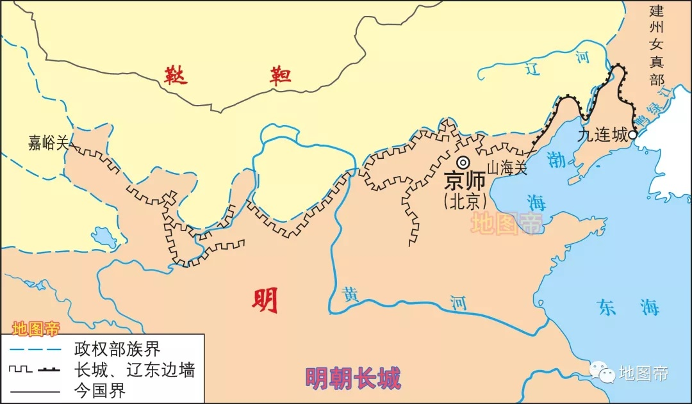

关内、关外、关中、关东

明长城地图
 

- 关内：指长城山海关以西或嘉峪关以东一带地区，秦汉时期指潼关以西的渭河平原（关中地区），也称关中谷地。

- 关外：指长城山海关以东或嘉峪关以西一带地区。

- 关中：秦汉时候此关指函谷关所谓关中是陕西渭河流域的平原地区。

- 关东：明代以来对山海关以东地区的称呼，又称“关外”；相当于中国东北地区，包括辽宁、吉林、黑龙江等省份

####嘉峪关：
    嘉峪关位于甘肃省嘉峪关市向西5公里处，是明长城西端的第一重关，也是古代“丝绸之路”的交通要冲。  
    嘉峪关关城，位于嘉峪关最狭窄的山谷中部，地势最高的嘉峪山上，城关两翼的城墙横穿沙漠戈壁。嘉峪关以地势险要，巍峨壮观著称于世，被称为“天下第一雄关”。与千里之外的“天下第一关”——山海关遥相呼应，闻名天下。

####山海关：
    山海关位于中华人民共和国河北省秦皇岛市山海关区与辽宁省的省界附近，又名渝关、榆关[1]。  
    山海关位于燕山和渤海之间，是明长城最东端的关隘，故而被称为“天下第一关”。  
    此处早在战国时期就曾修筑有长城，明洪武十四年（1381年）修筑现有关隘，自此山海关成为地理分界，该关口以东区域被称为“关外”。

##明长城
明长城，为明朝从洪武帝至万历帝的二百多年，经过20次大规模的修建，筑成的一条西起甘肃嘉峪关，东至辽东虎山，全长8851.8公里的长城[1]。这也是现在所见到的大部分完整长城。

##辽宁
位于辽宁省的明代万里长城，亦称辽东边墙，东起丹东市宽甸鸭绿江畔的虎山，西至辽宁省绥中县锥子山与河北省明长城相接。
  - 虎山长城

##河北
位于河北省的明代万里长城，东起秦皇岛市山海关老龙头，西至河北张家口地区怀安县马市口村进入山西省天镇县界。同时由北京市怀柔区结起一道内长城，经八达岭后进入河北省怀来县，复入北京市门头沟区，然后再进入涿鹿县，至涞源县，由涞源县七亩地村进入山西灵丘县境内。
- 山海关
- 大境门

##天津
黄崖关

##北京
北京段明长城由河北蓟县进入北京平谷县彰作关，经密云县到怀柔区北京结地区分为两叉，外线长城向北经延庆四海冶由白河堡附近出北京进入河北赤城县境内，内线长城经昌平、延庆、河北怀来县，复入北京门头沟地区，再从东灵山地区出北京市。北京段明长城在明十三陵外存在多道长城。
- 居庸关

##山西
- 平型关
- 雁门关
- 娘子关

##陕西
陕西省长城东起清水营（今陕西府谷县东北），经过府谷县﹑神木县﹑榆阳区﹑横山县﹑靖边县﹑吴起县﹑定边县七县区。西至花马池（今宁夏盐池县东北）。成化年间由延绥镇巡抚都御史余子俊率领将士4万人历时3月筑成。

##宁夏
宁夏位于黄河河套，自古为兵家必争之地。《读史方舆纪要》称其为“关中之屏蔽，河陇之上噤喉”。宁夏长城位于黄河之东，所以被称为“河东墙”，每隔30里修筑一军堡，每隔60里筑一城。明朝中叶后放弃内蒙古河套平原，退守宁夏。[7]

##甘肃
位于甘肃嘉峪关市的一段明长城，又称“悬壁长城”
- 嘉峪关

##青海
明廷在青海浩门城、门源城、永安城皆修建有长城，长约360公里。至今大都损毁严重。

##湖南
主条目：苗疆长城

