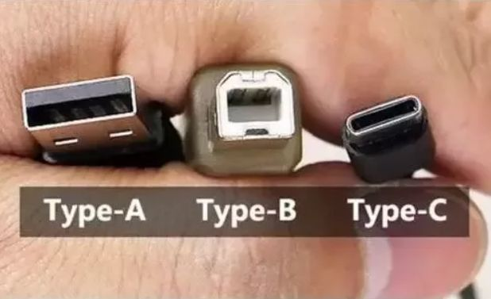
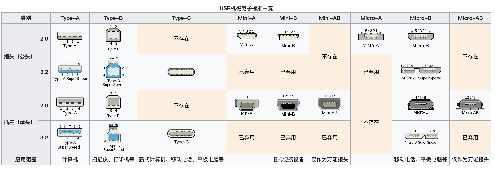

- [硬盘和闪存的概念](#硬盘和闪存的概念)
- [USB介绍](#USB介绍)
  - [怎么区分USB2.0和USB3.0的](#怎么区分USB2.0和USB3.0的)
  - [USB分类](#USB分类)
- [SD卡(内存卡、存储卡)](#SD卡(内存卡、存储卡))
- [闪存Flash](#闪存Flash)
  - [闪存分类](#闪存分类)
  - [存储单元电位阶数划分](#存储单元电位阶数划分)
  - [NAND分类](#NAND分类)
  - [内存和闪存的区别](#内存和闪存的区别)
- [USB闪存盘、固态硬盘和闪存卡中的SLC、MLC、TLC和3D NAND之间的区别](#USB闪存盘、固态硬盘和闪存卡中的SLC、MLC、TLC和3D NAND之间的区别)
- [传统机械硬盘（HDD）和固态硬盘（SSD）](#传统机械硬盘（HDD）和固态硬盘（SSD）)
- [U盘和固态硬盘](#U盘和固态硬盘)
  - [那么闪存与固态具体的相似和不同有哪些呢？](#那么闪存与固态具体的相似和不同有哪些呢？)
- [固态硬盘SSD分类](#固态硬盘SSD分类)
  - [SSD按接口分类](#SSD按接口分类)
  - [SSD按颗粒分类](#SSD按颗粒分类)

---------------------------------------------------------------------------------------------------------------------
## 硬盘和闪存的概念

USB：通用串行总线（英语：Universal Serial Bus，缩写：USB）

SD卡：Secure Digital，缩写为SD，全名为Secure Digital Memory Card，中文翻译为安全数码卡

闪存Flash：快闪存储器（英语：flash memory）
闪存又分为NOR与NAND两型：NOR Flash和NAND Flash
一至四阶存储单元为SLC、MLC、TLC和QLC
NAND：2D NAND和3D NAND

传统机械硬盘（HDD）和固态硬盘（SSD）
SSD:固态驱动器 (Solid-State Drive, SSD)
HDD:硬盘驱动器 (Hard Disk Drive, HDD)

U盘：U盘是USB(universal serial bus)盘的简称，据谐音也称“优盘”。U盘是闪存的一种，故有时也称作闪盘。U盘与硬盘的最大不同是，它不需物理驱动器，即插即用，且其存储容量远超过软盘，极便于携带

---------------------------------------------------------------------------------------------------------------------

## USB介绍

概念：
USB：通用串行总线（英语：Universal Serial Bus，缩写：USB）是连接计算机系统与外部设备的一种串口总线标准，也是一种输入输出接口的技术规范，被

最新一代的USB是USB4，传输速度为40Gbit/s。物理接头USB Type-A、Type-B接头分正反面，新型USB Type-C接头不分正反。

USB 3.0在实际设备应用中将被称为“USB SuperSpeed”，顺应此前的USB 1.1 FullSpeed和USB 2.0 HighSpeed。

### 怎么区分USB2.0和USB3.0的

1. 黑色是USB 2.0，蓝色或其它颜色是USB 3.0?
2. USB 2.0只有一排4针脚，USB 3.0上边5个，下边4个，一共9个针脚
3. SS是SuperSpeed的意思，带SS标示即为USB3.0接口。

上面这种也是 USB TYPE-A 接口, 不过因为 USB 3.0 标准的推出, 为了方便区分 USB 2.0, 所以接口的颜色通常使用蓝色. 所以如果你的主板背板有黑色和蓝色两种 USB 接口, 通常表示黑色的是 USB2.0, 而蓝色的是 USB3.0或更高标准.

### USB分类

1. USB Type A一般用于个人电脑中，是应用于最广泛的接口标准。上述举例图片的接口全部为USB Type A。
2. USB Type B一般用于3.5寸移动硬盘、打印机、以及显示器等的连接。
3. USB Type C由于支持正反插、可选功能多也越来越受到广泛使用。
4. 同样 Micro USB 是我们通常叫法, 严谨的叫法是 USB 2.0 Micro-B, 也是因为还有一个 USB 2.0 Micro-A, 不过几乎看不到.
   这种接口相比 Mini USB 要更加小巧, 在 USB Type-C 普及之前, 几乎市面上所有的安卓机采用此接口.

比如，若USB Type C支持PD协议，可以给笔记本供电；
若支持DP，可以连接外接显示器支持显示（一般会有标示“D”，示例图片为灵耀U4100UN）；
若支持Thunderbolt3更是不得了（一般会有标示“带箭头的闪电”，示例图片为灵耀X）。

Thunderbolt3(雷电3)是啥？
“Thunderbolt”(雷电)接口是Intel发布的Light Peak技术，Thunderbolt3的理论传输速度为40Gb/s，且可以支持USB3.1、DisplayPort、PCI Express和Thunderbolt四种协议。

  

  

[USB维基百科](https://zh.wikipedia.org/wiki/USB)  
[USB接口](https://baike.baidu.com/item/USB%E6%8E%A5%E5%8F%A3/493294)  
[你想了解的USB知识，都在这里了！](https://zhuanlan.zhihu.com/p/67225765)  
[USB接口详细读解, 更新USB3.2/USB4标准与Gen2和Gen1的区别](https://www.bybusa.com/community/usb-interface-detailed-explanation)  
  

---------------------------------------------------------------------------------------------------------------------

## SD卡(内存卡、存储卡)

Secure Digital，缩写为SD，全名为Secure Digital Memory Card，中文翻译为安全数码卡[1][2]，为一种存储卡，被广泛地于便携式设备上使用，例如数字相机、个人数码助理和多媒体播放器等。SD卡的技术是建基于MultiMedia卡格式上。SD卡有比较高的资料发送速度，而且不断更新标准。大部分SD卡的侧面设有写保护控制，以避免一些资料意外地写入，而少部分的SD卡甚至支持数字版权管理的技术。SD卡的大小为32mm×24mm×2.1mm，但官方标准亦有记载“薄版”1.4mm厚度，与MMC卡相同。

中文界有时会把SD卡称为内存卡[3][4]、存储卡，但此“内存卡”、“存储卡”与“内存”、“存储器”其实是两个完全不同的概念。

[SD卡](https://zh.wikipedia.org/wiki/SD%E5%8D%A1)  

---------------------------------------------------------------------------------------------------------------------

## 闪存Flash

闪存usb flash disk

快闪存储器（英语：flash memory）

快闪存储器（英语：flash memory），是一种电子式可清除程序化只读存储器的形式，允许在操作中被多次擦或写的存储器。这种科技主要用于一般性数据存储，以及在计算机与其他数字产品间交换传输数据，如储存卡与U盘。闪存是一种特殊的、以宏块抹写的EPROM。早期的闪存进行一次抹除，就会清除掉整颗芯片上的数据。

闪存是一种非易失性存储器，即断电数据也不会丢失。因为闪存不像RAM（随机存取存储器）一样以字节为单位改写数据，因此不能取代RAM。

闪存卡（Flash Card）是利用闪存（Flash Memory）技术达到存储电子信息的存储器，一般应用在数码相机，掌上电脑，MP3等小型数码产品中作为存储介质，所以样子小巧，有如一张卡片，所以称之为闪存卡。根据不同的生产厂商和不同的应用，闪存卡大概有SmartMedia（SM卡）、Compact Flash（CF卡）、MultiMediaCard（MMC卡）、Secure Digital（SD卡）、Memory Stick（记忆棒）、XD-Picture Card（XD卡）和微硬盘（MICRODRIVE）这些闪存卡虽然外观、规格不同，但是技术原理都是相同的。

### 闪存分类

闪存又分为NOR与NAND两型
1. NOR Flash需要很长的时间进行抹写，但是它提供完整的寻址与资料总线，并允许随机存取存储器上的任何区域，这使的它非常适合取代老式的ROM芯片。
2. NAND Flash具有较快的抹写时间，而且每个存储单元的面积也较小，这让NAND Flash相较于NOR Flash具有较高的存储密度与较低的每比特成本。同时它的可抹除次数也高出NOR Flash十倍。然而NAND Flash的I/O接口并没有随机存取外部地址总线，它必须以区块性的方式进行读取，NAND Flash典型的区块大小是数百至数千比特。

NAND Flash广泛应用在各种存储卡，U盘，SSD，eMMC等等大容量设备中。它的颗粒根据每个存储单元内存储比特个数的不同，可以分为 SLC（Single-Level Cell）、MLC（Multi-Level Cell） 和 TLC（Triple-Level Cell） 三类。

[杂谈闪存二：NOR和NAND Flash](https://zhuanlan.zhihu.com/p/26745577)  
[NAND Flash和Nor Flash到底有什么区别](https://tools.zlg.cn/tools/article/detail/id/454.html)  

## 存储单元电位阶数划分

通过对闪存内最小的物理存储单元的电位划分不同的阶数，可以在一个存储单元内存储一至多个二进制位数。常见的一至四阶存储单元为SLC、MLC、TLC和QLC。

存储单元电位阶数划分
1. 单阶存储单元（Single-Level Cell,SLC）
2. 多阶存储单元（Multi-Level Cell,MLC）
3. 三阶储存单元（Triple-Level Cell, TLC）
4. 四阶储存单元（Quad-Level Cell, QLC）

### NAND分类

2D NAND和3D NAND

3D NAND指的是闪存芯片的存储单元是 3D 的。此前的闪存多属于平面闪存 (Planar NAND)，而3D NAND，顾名思义，即是指立体结构的闪存。

如果平面闪存是平房，那 3D NAND 就是高楼大厦。把存储单元立体化，意味着每个存储单元的单位面积可以大幅下降。

顾名思义，2D NAND SD 闪存是扁平的。可以存储数据的单元格是并排放置的。在 2D NAND SD 闪存中，闪存是根据放置在设备上的单元数量和包含的存储位数量来计算的。

[什么是3D NAND？与2D NAND相比有什么优势？](https://www.chinaflashmarket.com/Instructor/163856)  
[What Is The Difference Between 2d And 3d Nand](https://www.insightssuccess.com/what-is-the-difference-between-2d-and-3d-nand/)  

### 内存和闪存的区别

内存RAM使用寄生电容充放电来表示0和1，充了电的电容需要不断的被充电维持状态，否则很快漏电，所以需要持续供电，但是速度块。

Flash闪存使用MOS管中间的一个绝缘体包括层来储备电子，充电之后可以长期保存，外部使用sense amp比较放大器来感受每个MOS管内的状态，从而输出0和1状态，断电后数据依然保存，比RAM慢一个数量级，但是比磁盘快多个数量级。

内存在计算机里是一个临时缓存空间数据无法保存，也就是RAM-RamdomAccessMemory易挥发性随机存取存储器，高速存取，读写时间相等，且与地址无关，如计算机内存等。 

而闪存是电子可擦除只读存储器（EEPROM）的变种，闪存与EEPROM不同的是，EEPROM能在字节水平上进行删除和重写而不是整个芯片擦写，而闪存的大部分芯片需要块擦除。由于其断电时仍能保存数据，闪存通常被用来保存设置信息；

内存Ram, 和闪存Flash
这个电脑的运行内存（=内存=Ram=Random-access memory）是8GB，而物理内存（=闪存=Flash memory）是256GB

[闪存](https://zh.wikipedia.org/wiki/%E9%97%AA%E5%AD%98)  
[内存和闪存的区别是什么？](https://www.zhihu.com/question/24759973)

---------------------------------------------------------------------------------------------------------------------

## USB闪存盘、固态硬盘和闪存卡中的SLC、MLC、TLC和3D NAND之间的区别

存储单元电位阶数划分
单阶存储单元（Single-Level Cell,SLC）
多阶存储单元（Multi-Level Cell,MLC）
三阶储存单元（Triple-Level Cell, TLC）
四阶储存单元（Quad-Level Cell, QLC）
五级单元（PLC）SSD
3D NAND（多层数存储）

它们的每个存储单元的存储容量是不一样的，它们的单元存储容量分别为：
SLC ——1bit/单元；
MLC——2bit/单元；
TLC ——3bit/单元；
QLC——4bit/单元；
PLC——5bit/单元；

NAND Flash广泛应用在各种存储卡，U盘，SSD，eMMC等等大容量设备中。它的颗粒根据每个存储单元内存储比特个数的不同，可以分为 SLC（Single-Level Cell）、MLC（Multi-Level Cell） 和 TLC（Triple-Level Cell） 三类。

现在高端SSD会选取MLC甚至SLC，低端SSD则选取TLC。SD卡一般选取TLC。

NAND 是一种非易失性闪存，可在未连接电源时存储数据。断电后保留数据的能力使得 NAND 成为内置设备、外置设备和便携设备的理想选择。USB 闪存盘、固态硬盘和 SD 卡均利用闪存技术，为手机或数码相机等设备提供存储。

市场上存在多种类型的 NAND。简言之，不同类型之间的区别在于每个单元可以存储的位数。位代表电荷，电荷只能存储 0 和 1 两个值（代表开/关）中的一个。

各种 NAND 类型之间的关键区别在于成本、容量和耐久性。耐久性是由一个闪存单元在开始磨损前可以完成的程序擦除 (P/E) 周期数量决定的。一个 P/E 周期是指擦除和写入一个单元的过程，NAND 技术支持的 P/E 周期越多，设备的耐久性越高。

NAND 闪存的常见类型是 SLC、MLC、TLC 和 3D NAND。本文将探讨各种 NAND 类型的不同特征。

SLC NAND
优点：最高耐久性 - 缺点：价格贵、容量低

单级单元 (SLC) NAND 每个单元存储一位信息。一个单元存储 0 或 1，因此可以更快地写入和检索数据。SLC 提供最佳性能和最高耐久性，高达 100,000 个 P/E 周期， 因而比其他类型的 NAND 更加耐用。不过，低数据密度使得 SLC 成为最贵的 NAND 类型，因此通常不用于消费类产品。它通常用于服务器以及其他要求速度与耐久性的行业应用。

MLC NAND
优点：比 SLC 便宜 - 缺点：速度和耐久性不如 SLC

多级单元 (MLC) NAND 每单元存储多个位，尽管 MLC 一词通常意味着每单元两位。MLC 的数据密度比 SLC 高，因此可以实现更大的容量。MLC 在价格、性能和耐久性之间取得良好平衡。不过，MLC 对数据错误更加敏感，拥有 10,000 个 P/E 周期， 因此耐久性比 SLC 低。MLC 通常用于对耐久性要求不算高的消费类产品。

TLC NAND
优点：最便宜、高容量 - 缺点：低耐久性

三级单元 (TLC) NAND 每单元存储三个位。通过向每单元添加更多位，可以降低成本并提高容量。不过，这对性能和耐久性具有负面影响，只有 3,000 个 P/E 周期。许多消费类产品采用 TLC，因为这是最便宜的方案。

3D NAND

近十年来，3D NAND 是闪存市场最大创新之一。闪存制造商开发了 3D NAND 来解决缩小 2D NAND 时面临的问题，从而以更低成本实现更高密度。在 2D NAND 中，用于存储数据的单元水平并排放置。这意味着，可用于放置单元的空间量有限，试图缩小单元则会降低其可靠性。

因此，NAND 制造商决定在另一个维度叠放单元，从而促成纵向叠放单元的 3D NAND 的产生。更高存储密度可实现更高的存储容量，同时不会导致价格大幅上升。3D NAND 还提供更高的耐久度和更低功耗。

总体而言，NAND 是一项非常重要的闪存技术，能以较低的每位成本提供更快的擦除和写入速度。随着游戏行业的发展，NAND 技术料将进一步发展，帮助满足消费者日益增长的存储需求。

[USB 闪存盘、固态硬盘和闪存卡中的 SLC、MLC、TLC 和 3D NAND 之间的区别](https://www.kingston.com.cn/austria/cn/solutions/pc-performance/difference-between-slc-mlc-tlc-3d-nand)  
[SLC vs MLC vs TLC](https://www.crucial.cn/articles/about-ssd/difference-between-slc-mlc-tlc)  
[固态硬盘颗粒：SLC/MLC/TLC有什么区别？](https://www.zhihu.com/question/39495513)  
[多层SSD：什么是SLC，MLC，TLC，QLC和PLC？](https://www.bytesea.com/3698.html)  
[SSD闪存颗粒类型分类——SLC、MLC、TLC、QLC和PLC](https://www.jidianwang.com/item/1123417.html?tree=10123766)  

  
  

---------------------------------------------------------------------------------------------------------------------

## 传统机械硬盘（HDD）和固态硬盘（SSD）

SSD:固态驱动器 (Solid-State Drive, SSD)
HDD:硬盘驱动器 (Hard Disk Drive, HDD)

机械硬盘（HDD）、固态硬盘（SSD）以及混合硬盘（SSHD）

HDD 存储采用旋转磁盘、电机和读写磁头，通过电磁机制在旋转盘片中存储数据。

机械硬盘(HDD)是传统硬盘，为电脑主要的存储媒介之一。由一个或者多个铝制或者玻璃制成的磁性碟片，磁头，转轴，控制电机，磁头控制器，数据转换器，接口和缓存等几个部分组成。工作时，磁头悬浮在高速旋转的碟片上进行读写数据。机械硬盘是集精密机械、微电子电路、电磁转换为一体的电脑存储设备。

固态硬盘（SSD）是由多个闪存芯片加主控以及缓存组成的阵列式存储，属于以固态电子存储芯片阵列制成的硬盘。相对机械硬盘，读取速度更快，寻道时间更小，可加快操作系统启动速度和软件启动速度。

### 未来的闪存存储

过去，SSD 一直采用与硬盘驱动器 (Hard Disk Drive, HDD) 相同的 I/O 接口设计连接到主计算机，例如 SATA 和 SAS 接口。尽管如今大多数 SSD 都使用基于 3D TLC NAND 的闪存存储，但非易失性内存标准 (Nonvolatile Memory Express, NVMe)、基于网络结构的 NVMe (NVMe over Fabrics, NVMe-oF) 以及存储级内存 (Storage Class Memory, SCM) 技术给数据中心带来了无限可能。

NVMe 是一款用于通过 PCI Express (PCIe) 总线访问闪存存储的接口协议。不同于只能使用单一串行命令序列的传统全闪存架构，NVMe 支持成千上万个并行序列，每一个序列都能支持成千上万个并发命令。

NVMe-oF 是存储系统中的一个主机端接口，可以通过远程直接内存访问 (Remote Direct Memory Access, RDMA) 或光纤通道网络结构提供许多相关的 NVMe 功能。利用 NVMe-oF，可以横向扩展到许多 NVMe 设备，甚至支持远距离 NVMe 设备。

也称持久内存 (Persistent Memory, PMEM)，是一种新型介质技术，它模糊了内存与存储之间的界线，可作为其中任何一种介质使用。SCM 的示例包括 Intel 的 3D XPoint 和三星的 Z-NAND 介质。

广泛部署 NVMe 和 NVMe-oF，特别是结合 SCM 使用时，可以大幅加快下一代应用程序的性能，将延迟降低到原来的 1/10，并提供最高 IOPS。

NetApp 率先向市场推出基于 3D NAND 技术的大容量 15 TB SSD。目前，NetApp 引领闪存的未来发展，在其强有力的愿景中，基于 NVMe、NVMe-oF 和 SCM 的全新闪存系统将可以无中断集成到现有基础架构中。

[什么是闪存存储？](https://www.netapp.com/zh-hans/data-storage/what-is-flash-storage/)  
[硬盘分类详解](https://blog.nowcoder.net/n/ee5264230fe748489062f66e8694be4e)  
  

---------------------------------------------------------------------------------------------------------------------

## U盘和固态硬盘

U盘，全称USB闪存驱动器，英文名“ USB flash disk”。

U盘：U盘是USB(universal serial bus)盘的简称，据谐音也称“优盘”。

U盘是闪存的一种，故有时也称作闪盘。U盘与硬盘的最大不同是，它不需物理驱动器，即插即用，且其存储容量远超过软盘，极便于携带

U盘=USB控制器+闪存控制器+FLASH
固态硬盘=硬盘控制器+FLASH
FLASH一般就是各种闪存芯片，一般都是NAND的片子。

所以，U盘和SSD是加了控制器的闪存，而影响闪存速度的是控制器的性能，比如SSD性能高于U盘，主要靠的不是闪存的速度而是控制器的实现。
补充一点：高速U盘用的其实是硬盘机的主控芯片，所以才比一般U盘速度要快，SSD的主控一般都是32位的芯片，而山寨U盘一般是量产的8位芯片，性能差别是非常大的。

我们日常生活中所使用的U盘、还有一些高速的读写卡，都属于闪存产品，其实固态硬盘也属于闪存产品，毕竟是基于闪存颗粒基础上研发出来的硬盘，我们通常把一些性能不太好的固态笑称为大号U盘，由此可见U盘和固态的相似之处还是蛮大的。

[U盘 （USB闪存盘）](https://baike.baidu.com/item/U%E7%9B%98/99846)  
[闪存盘](https://zh.wikipedia.org/wiki/%E9%97%AA%E5%AD%98%E7%9B%98)

### 那么闪存与固态具体的相似和不同有哪些呢？

相同点：
1. 都采用闪存颗粒作为存储的主体，主控+闪存芯片这样的结构。
2. 基本运作原理相似，可以视为同一类产品的简化版和高配版

不同点：
1. 闪存通常的输出接口是USB，固态硬盘是SATA接口或其他接口，比如sata固态硬盘、msata固态硬盘、M.2固态硬盘等
2. 闪存通常是单闪存颗粒，偶尔有两个颗粒做双通道，固态硬盘是多颗粒，所以闪存通常容量不大，而固态硬盘可以以比较大的容量起步，比如256G固态硬盘。
3. 闪存的主控非常简单，通常只包含读写策略和缓存机制；而固态除了这两个以外，还要进行各个方面的优化，比如读写、策略、缓存、电气特性、垃圾回收机制等等
4. 闪存的体积较小，通常只有手指大小，便于携带，不怕摔；固态硬盘通常较大，不算硬盘盒，一个msata的固态都要大半张银行卡的大小，一些M.2和PCIe的还要长一些
5. 性能上差异较大，普通的闪存产品，同一时间内，只能进行读或者写其中一项操作，因为闪存颗粒的电压变化收到主控的影响，通常只能有一种；固态硬盘主控更复杂，能够同时控制不同的电压变化，读和写几乎没有影响，可以同时进行。

[闪存和固态硬盘的区别](https://www.crucial.cn/articles/about-ssd/the-difference-between-usb-flash-disk-and-ssd)  

---------------------------------------------------------------------------------------------------------------------

## 固态硬盘SSD分类

1. 按接口分类
2. 按颗粒分类

### SSD按接口分类

首先还是从SSD的结构来说起，SSD最基本的组成部件分为：主控芯片、闪存芯片、固件算法

目前SSD的主流接口分为，SATA 3.0、M.2、PCI-E三种，U.2和mSATA目前并不多见，这里不过多介绍。

SATA和M.2或PCI-E的主要区别在于：二者采用不同的通道。
可以把两种通道理解成两辆相同的汽车，PCI-E通道的汽车就像是在高速上行驶，而SATA通道的汽车就像是在崎岖山路上行驶，你说哪个速度快？

M.2最初叫做NGFF，全名是Next Generation Form Factor。这个接口很特殊，同时支持SATA和PCI-E两个通道，很容易让人误解。

其实并不是所有的M.2固态硬盘读写速度都很快，如果是采用SATA通道的M.2接口固态硬盘，读写速度不会超过550MB/s。还要注意的是，主板厂商的M.2接口有的选择了CPU原生的PCI-E通道，有的是通过PCH南桥扩展出来的，这可能对固态硬盘的速度产生影响。

总线：总线在电脑的主板上，这样理解，固态硬盘这个大仓库在郊外，CPU需要数据，但是内存条容量太小，没有存储，只有从固态硬盘这边调取，总线＝运输数据的公路，

固态硬盘送货给CPU和内存需要走的路就是总线。

这条路又分为两种：SATA总线、PCI-E总线。
- SATA总线：“乡村公路”
- PCI-E总线：“高速公路”

第一种：SATA接口，SATA接口的固态硬盘是老式接口，走SATA总线，这种固态硬盘的速度不会超过550MB/S

### SSD按颗粒分类

NAND闪存的常见类型是SLC、MLC、TLC 和3D NAND

存储单元电位阶数划分
单阶存储单元（Single-Level Cell,SLC）
多阶存储单元（Multi-Level Cell,MLC）
三阶储存单元（Triple-Level Cell, TLC）
四阶储存单元（Quad-Level Cell, QLC）
3D NAND（多层数存储）

[干货！史上最全SSD科普贴：科学购买SSD](https://ssd.zol.com.cn/676/6766649_all.html)  
[花几分钟，了解SSD分类，让你买固态硬盘不再吃亏——《分类篇》](https://www.163.com/dy/article/F6FHMG9P0531BTT4.html)  
[科普讲堂——固态硬盘(SSD)扫盲](https://zhuanlan.zhihu.com/p/46607534)  

---------------------------------------------------------------------------------------------------------------------

