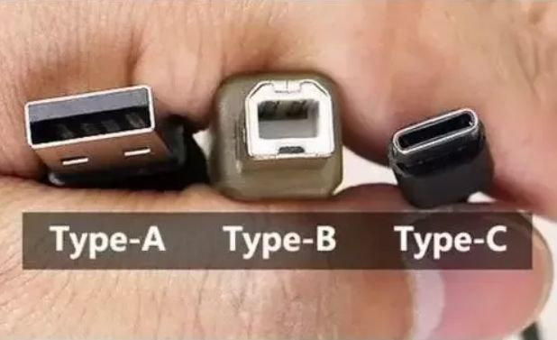
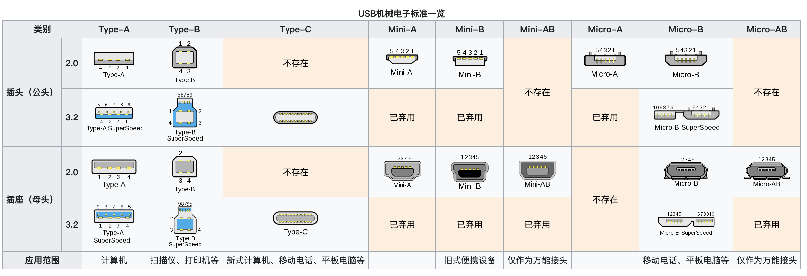
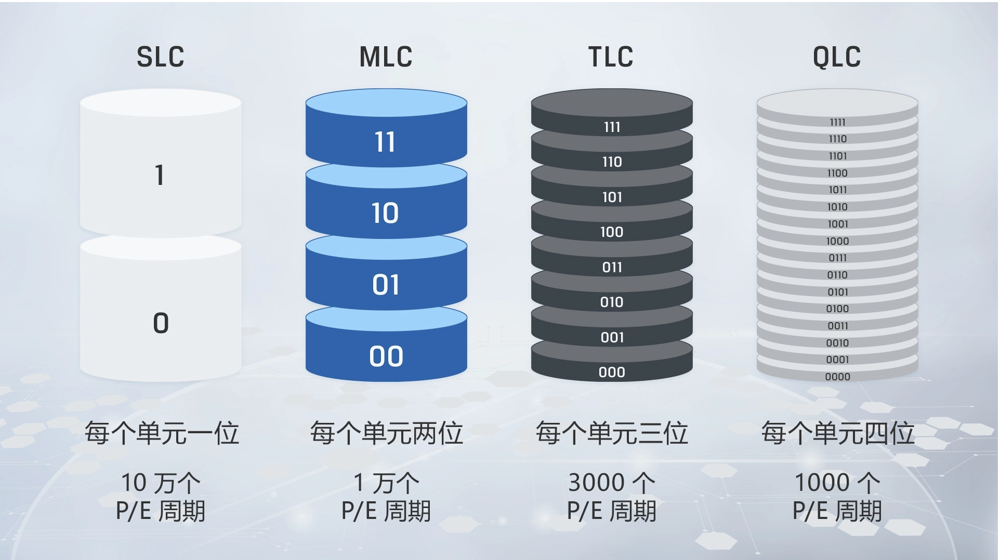
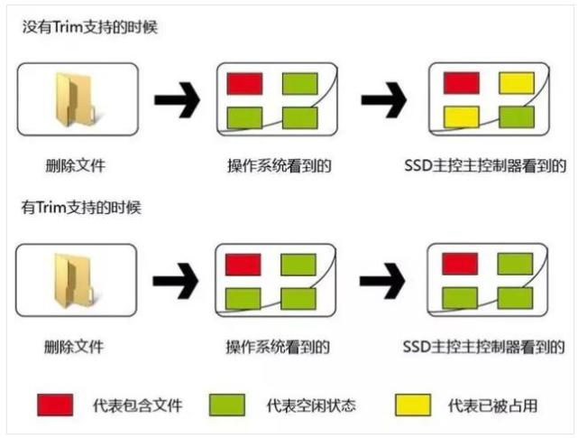

- [硬盘和闪存的概念](#硬盘和闪存的概念)
- [USB介绍](#USB介绍)
  - [怎么区分USB2.0和USB3.0的](#怎么区分USB2.0和USB3.0的)
  - [USB分类](#USB分类)
  - [USB HUB](#USB-HUB)
- [SD卡(内存卡、存储卡)](#SD卡(内存卡、存储卡))
- [闪存Flash](#闪存Flash)
  - [闪存分类](#闪存分类)
  - [存储单元电位阶数划分](#存储单元电位阶数划分)
  - [NAND分类](#NAND分类)
  - [内存和闪存的区别](#内存和闪存的区别)
- [USB闪存盘、固态硬盘和闪存卡中的SLC、MLC、TLC和3D NAND之间的区别](#USB闪存盘、固态硬盘和闪存卡中的SLC、MLC、TLC和3D NAND之间的区别)
- [传统机械硬盘（HDD）和固态硬盘（SSD）](#传统机械硬盘（HDD）和固态硬盘（SSD）)
  - [未来的闪存存储](#未来的闪存存储)
- [U盘和固态硬盘](#U盘和固态硬盘)
  - [那么闪存与固态具体的相似和不同有哪些呢？](#那么闪存与固态具体的相似和不同有哪些呢？)
- [固态硬盘SSD分类](#固态硬盘SSD分类)
  - [SSD按接口分类](#SSD按接口分类)
  - [IDE和SCSI](#IDE和SCSI)
  - [SAS与SATA的区别](#SAS与SATA的区别)
  - [SSD按颗粒分类](#SSD按颗粒分类)
- [S.M.A.R.T概述](#S.M.A.R.T概述)
- [UASP协议与TRIM指令](#UASP协议与TRIM指令)
- [SSD固态硬盘的的GC和TRIM、写入放大简介](#SSD固态硬盘的的GC和TRIM、写入放大简介)
- [NAS](#NAS)
- [机械硬盘LMR、PMR、CMR、SMR](#机械硬盘LMR、PMR、CMR、SMR)

---------------------------------------------------------------------------------------------------------------------
## 硬盘和闪存的概念

USB：通用串行总线（英语：Universal Serial Bus，缩写：USB）

SD卡：Secure Digital，缩写为SD，全名为Secure Digital Memory Card，中文翻译为安全数码卡

闪存Flash：快闪存储器（英语：flash memory）
闪存又分为NOR与NAND两型：NOR Flash和NAND Flash
一至四阶存储单元为SLC、MLC、TLC和QLC
NAND：2D NAND和3D NAND

传统机械硬盘（HDD）和固态硬盘（SSD）
SSD:固态驱动器 (Solid-State Drive, SSD)
HDD:硬盘驱动器 (Hard Disk Drive, HDD)

U盘：U盘是USB(universal serial bus)盘的简称，据谐音也称“优盘”。U盘是闪存的一种，故有时也称作闪盘。U盘与硬盘的最大不同是，它不需物理驱动器，即插即用，且其存储容量远超过软盘，极便于携带

---------------------------------------------------------------------------------------------------------------------

## USB介绍

概念：
USB：通用串行总线（英语：Universal Serial Bus，缩写：USB）是连接计算机系统与外部设备的一种串口总线标准，也是一种输入输出接口的技术规范，被

最新一代的USB是USB4，传输速度为40Gbit/s。物理接头USB Type-A、Type-B接头分正反面，新型USB Type-C接头不分正反。

USB 3.0在实际设备应用中将被称为“USB SuperSpeed”，顺应此前的USB 1.1 FullSpeed和USB 2.0 HighSpeed。

USB-IF（USB开发者论坛）是位于美国的USB标准化组织，全称USB Implementers Forum。

[USB-IF官网](https://www.usb.org/)  
  

### 怎么区分USB2.0和USB3.0的

1. 黑色是USB 2.0，蓝色或其它颜色是USB 3.0?
2. USB 2.0只有一排4针脚，USB 3.0上边5个，下边4个，一共9个针脚
3. SS是SuperSpeed的意思，带SS标示即为USB3.0接口。

上面这种也是 USB TYPE-A 接口, 不过因为 USB 3.0 标准的推出, 为了方便区分 USB 2.0, 所以接口的颜色通常使用蓝色. 所以如果你的主板背板有黑色和蓝色两种 USB 接口, 通常表示黑色的是 USB2.0, 而蓝色的是 USB3.0或更高标准.

### USB分类

1. USB Type A一般用于个人电脑中，是应用于最广泛的接口标准。上述举例图片的接口全部为USB Type A。
2. USB Type B一般用于3.5寸移动硬盘、打印机、以及显示器等的连接。
3. USB Type C由于支持正反插、可选功能多也越来越受到广泛使用。
4. 同样 Micro USB 是我们通常叫法, 严谨的叫法是 USB 2.0 Micro-B, 也是因为还有一个 USB 2.0 Micro-A, 不过几乎看不到.
   这种接口相比 Mini USB 要更加小巧, 在 USB Type-C 普及之前, 几乎市面上所有的安卓机采用此接口.

比如，若USB Type C支持PD协议，可以给笔记本供电；
若支持DP，可以连接外接显示器支持显示（一般会有标示“D”，示例图片为灵耀U4100UN）；
若支持Thunderbolt3更是不得了（一般会有标示“带箭头的闪电”，示例图片为灵耀X）。

Thunderbolt3(雷电3)是啥？
“Thunderbolt”(雷电)接口是Intel发布的Light Peak技术，Thunderbolt3的理论传输速度为40Gb/s，且可以支持USB3.1、DisplayPort、PCI Express和Thunderbolt四种协议。

  

  

[USB维基百科](https://zh.wikipedia.org/wiki/USB)  
[USB接口](https://baike.baidu.com/item/USB%E6%8E%A5%E5%8F%A3/493294)  
[你想了解的USB知识，都在这里了！](https://zhuanlan.zhihu.com/p/67225765)  
[USB接口详细读解, 更新USB3.2/USB4标准与Gen2和Gen1的区别](https://www.bybusa.com/community/usb-interface-detailed-explanation)  
[USB Type-C / Type-A等有什么不同？一次关于USB的研究手记(V1.3）](https://zhuanlan.zhihu.com/p/47887907)  
  

---------------------------------------------------------------------------------------------------------------------
## USB HUB

USB Hub，指的是一种可以将一个USB接口扩展为多个，并可以使这些接口同时使用的装置。USB HUB根据所属USB协议可分为USB2.0 HUB、USB3.0 HUB与USB3.1 HUB。

USB集线器（英语：USB hub）是一个让多个USB设备连接到计算机上一个USB接口或另一个USB集线器上某个接口的设备。

第一、USB是英文Universal SerialBus的缩写,中文就是“通用串行总线”，也称通用串联接口。
第二、Hub是大家常说的集线器，它使用星型拓扑结构连接多个USB接口设备。

可将一个USB接口扩展成多个独立工作的USB接口。

---------------------------------------------------------------------------------------------------------------------

## SD卡(内存卡、存储卡)

Secure Digital，缩写为SD，全名为Secure Digital Memory Card，中文翻译为安全数码卡[1][2]，为一种存储卡，被广泛地于便携式设备上使用，例如数字相机、个人数码助理和多媒体播放器等。SD卡的技术是建基于MultiMedia卡格式上。SD卡有比较高的资料发送速度，而且不断更新标准。大部分SD卡的侧面设有写保护控制，以避免一些资料意外地写入，而少部分的SD卡甚至支持数字版权管理的技术。SD卡的大小为32mm×24mm×2.1mm，但官方标准亦有记载“薄版”1.4mm厚度，与MMC卡相同。

中文界有时会把SD卡称为内存卡[3][4]、存储卡，但此“内存卡”、“存储卡”与“内存”、“存储器”其实是两个完全不同的概念。

[SD卡](https://zh.wikipedia.org/wiki/SD%E5%8D%A1)  

---------------------------------------------------------------------------------------------------------------------

## 闪存Flash

闪存usb flash disk

快闪存储器（英语：flash memory）

快闪存储器（英语：flash memory），是一种电子式可清除程序化只读存储器的形式，允许在操作中被多次擦或写的存储器。这种科技主要用于一般性数据存储，以及在计算机与其他数字产品间交换传输数据，如储存卡与U盘。闪存是一种特殊的、以宏块抹写的EPROM。早期的闪存进行一次抹除，就会清除掉整颗芯片上的数据。

闪存是一种非易失性存储器，即断电数据也不会丢失。因为闪存不像RAM（随机存取存储器）一样以字节为单位改写数据，因此不能取代RAM。

闪存卡（Flash Card）是利用闪存（Flash Memory）技术达到存储电子信息的存储器，一般应用在数码相机，掌上电脑，MP3等小型数码产品中作为存储介质，所以样子小巧，有如一张卡片，所以称之为闪存卡。根据不同的生产厂商和不同的应用，闪存卡大概有SmartMedia（SM卡）、Compact Flash（CF卡）、MultiMediaCard（MMC卡）、Secure Digital（SD卡）、Memory Stick（记忆棒）、XD-Picture Card（XD卡）和微硬盘（MICRODRIVE）这些闪存卡虽然外观、规格不同，但是技术原理都是相同的。

### 闪存分类

闪存又分为NOR与NAND两型
1. NOR Flash需要很长的时间进行抹写，但是它提供完整的寻址与资料总线，并允许随机存取存储器上的任何区域，这使的它非常适合取代老式的ROM芯片。
2. NAND Flash具有较快的抹写时间，而且每个存储单元的面积也较小，这让NAND Flash相较于NOR Flash具有较高的存储密度与较低的每比特成本。同时它的可抹除次数也高出NOR Flash十倍。然而NAND Flash的I/O接口并没有随机存取外部地址总线，它必须以区块性的方式进行读取，NAND Flash典型的区块大小是数百至数千比特。

NAND Flash广泛应用在各种存储卡，U盘，SSD，eMMC等等大容量设备中。它的颗粒根据每个存储单元内存储比特个数的不同，可以分为 SLC（Single-Level Cell）、MLC（Multi-Level Cell） 和 TLC（Triple-Level Cell） 三类。

[杂谈闪存二：NOR和NAND Flash](https://zhuanlan.zhihu.com/p/26745577)  
[NAND Flash和Nor Flash到底有什么区别](https://tools.zlg.cn/tools/article/detail/id/454.html)  

## 存储单元电位阶数划分

通过对闪存内最小的物理存储单元的电位划分不同的阶数，可以在一个存储单元内存储一至多个二进制位数。常见的一至四阶存储单元为SLC、MLC、TLC和QLC。

存储单元电位阶数划分
1. 单阶存储单元（Single-Level Cell,SLC）
2. 多阶存储单元（Multi-Level Cell,MLC）
3. 三阶储存单元（Triple-Level Cell, TLC）
4. 四阶储存单元（Quad-Level Cell, QLC）

### NAND分类

2D NAND和3D NAND

3D NAND指的是闪存芯片的存储单元是 3D 的。此前的闪存多属于平面闪存 (Planar NAND)，而3D NAND，顾名思义，即是指立体结构的闪存。

如果平面闪存是平房，那 3D NAND 就是高楼大厦。把存储单元立体化，意味着每个存储单元的单位面积可以大幅下降。

顾名思义，2D NAND SD 闪存是扁平的。可以存储数据的单元格是并排放置的。在 2D NAND SD 闪存中，闪存是根据放置在设备上的单元数量和包含的存储位数量来计算的。

[什么是3D NAND？与2D NAND相比有什么优势？](https://www.chinaflashmarket.com/Instructor/163856)  
[What Is The Difference Between 2d And 3d Nand](https://www.insightssuccess.com/what-is-the-difference-between-2d-and-3d-nand/)  

### 内存和闪存的区别

内存RAM使用寄生电容充放电来表示0和1，充了电的电容需要不断的被充电维持状态，否则很快漏电，所以需要持续供电，但是速度块。

Flash闪存使用MOS管中间的一个绝缘体包括层来储备电子，充电之后可以长期保存，外部使用sense amp比较放大器来感受每个MOS管内的状态，从而输出0和1状态，断电后数据依然保存，比RAM慢一个数量级，但是比磁盘快多个数量级。

内存在计算机里是一个临时缓存空间数据无法保存，也就是RAM-RamdomAccessMemory易挥发性随机存取存储器，高速存取，读写时间相等，且与地址无关，如计算机内存等。 

而闪存是电子可擦除只读存储器（EEPROM）的变种，闪存与EEPROM不同的是，EEPROM能在字节水平上进行删除和重写而不是整个芯片擦写，而闪存的大部分芯片需要块擦除。由于其断电时仍能保存数据，闪存通常被用来保存设置信息；

内存Ram, 和闪存Flash
这个电脑的运行内存（=内存=Ram=Random-access memory）是8GB，而物理内存（=闪存=Flash memory）是256GB

[闪存](https://zh.wikipedia.org/wiki/%E9%97%AA%E5%AD%98)  
[内存和闪存的区别是什么？](https://www.zhihu.com/question/24759973)

---------------------------------------------------------------------------------------------------------------------

## USB闪存盘、固态硬盘和闪存卡中的SLC、MLC、TLC和3D NAND之间的区别

存储单元电位阶数划分
单阶存储单元（Single-Level Cell,SLC）
多阶存储单元（Multi-Level Cell,MLC）
三阶储存单元（Triple-Level Cell, TLC）
四阶储存单元（Quad-Level Cell, QLC）
五级单元（PLC）SSD
3D NAND（多层数存储）

它们的每个存储单元的存储容量是不一样的，它们的单元存储容量分别为：
SLC ——1bit/单元；
MLC——2bit/单元；
TLC ——3bit/单元；
QLC——4bit/单元；
PLC——5bit/单元；

NAND Flash广泛应用在各种存储卡，U盘，SSD，eMMC等等大容量设备中。它的颗粒根据每个存储单元内存储比特个数的不同，可以分为 SLC（Single-Level Cell）、MLC（Multi-Level Cell） 和 TLC（Triple-Level Cell） 三类。

现在高端SSD会选取MLC甚至SLC，低端SSD则选取TLC。SD卡一般选取TLC。

NAND 是一种非易失性闪存，可在未连接电源时存储数据。断电后保留数据的能力使得 NAND 成为内置设备、外置设备和便携设备的理想选择。USB 闪存盘、固态硬盘和 SD 卡均利用闪存技术，为手机或数码相机等设备提供存储。

市场上存在多种类型的 NAND。简言之，不同类型之间的区别在于每个单元可以存储的位数。位代表电荷，电荷只能存储 0 和 1 两个值（代表开/关）中的一个。

各种 NAND 类型之间的关键区别在于成本、容量和耐久性。耐久性是由一个闪存单元在开始磨损前可以完成的程序擦除 (P/E) 周期数量决定的。一个 P/E 周期是指擦除和写入一个单元的过程，NAND 技术支持的 P/E 周期越多，设备的耐久性越高。

NAND 闪存的常见类型是 SLC、MLC、TLC 和 3D NAND。本文将探讨各种 NAND 类型的不同特征。

SLC NAND
优点：最高耐久性 - 缺点：价格贵、容量低

单级单元 (SLC) NAND 每个单元存储一位信息。一个单元存储 0 或 1，因此可以更快地写入和检索数据。SLC 提供最佳性能和最高耐久性，高达 100,000 个 P/E 周期， 因而比其他类型的 NAND 更加耐用。不过，低数据密度使得 SLC 成为最贵的 NAND 类型，因此通常不用于消费类产品。它通常用于服务器以及其他要求速度与耐久性的行业应用。

MLC NAND
优点：比 SLC 便宜 - 缺点：速度和耐久性不如 SLC

多级单元 (MLC) NAND 每单元存储多个位，尽管 MLC 一词通常意味着每单元两位。MLC 的数据密度比 SLC 高，因此可以实现更大的容量。MLC 在价格、性能和耐久性之间取得良好平衡。不过，MLC 对数据错误更加敏感，拥有 10,000 个 P/E 周期， 因此耐久性比 SLC 低。MLC 通常用于对耐久性要求不算高的消费类产品。

TLC NAND
优点：最便宜、高容量 - 缺点：低耐久性

三级单元 (TLC) NAND 每单元存储三个位。通过向每单元添加更多位，可以降低成本并提高容量。不过，这对性能和耐久性具有负面影响，只有 3,000 个 P/E 周期。许多消费类产品采用 TLC，因为这是最便宜的方案。

3D NAND

近十年来，3D NAND 是闪存市场最大创新之一。闪存制造商开发了 3D NAND 来解决缩小 2D NAND 时面临的问题，从而以更低成本实现更高密度。在 2D NAND 中，用于存储数据的单元水平并排放置。这意味着，可用于放置单元的空间量有限，试图缩小单元则会降低其可靠性。

因此，NAND 制造商决定在另一个维度叠放单元，从而促成纵向叠放单元的 3D NAND 的产生。更高存储密度可实现更高的存储容量，同时不会导致价格大幅上升。3D NAND 还提供更高的耐久度和更低功耗。

总体而言，NAND 是一项非常重要的闪存技术，能以较低的每位成本提供更快的擦除和写入速度。随着游戏行业的发展，NAND 技术料将进一步发展，帮助满足消费者日益增长的存储需求。

[USB 闪存盘、固态硬盘和闪存卡中的 SLC、MLC、TLC 和 3D NAND 之间的区别](https://www.kingston.com.cn/austria/cn/solutions/pc-performance/difference-between-slc-mlc-tlc-3d-nand)  
[SLC vs MLC vs TLC](https://www.crucial.cn/articles/about-ssd/difference-between-slc-mlc-tlc)  
[固态硬盘颗粒：SLC/MLC/TLC有什么区别？](https://www.zhihu.com/question/39495513)  
[多层SSD：什么是SLC，MLC，TLC，QLC和PLC？](https://www.bytesea.com/3698.html)  
[SSD闪存颗粒类型分类——SLC、MLC、TLC、QLC和PLC](https://www.jidianwang.com/item/1123417.html?tree=10123766)  

---------------------------------------------------------------------------------------------------------------------

## 传统机械硬盘（HDD）和固态硬盘（SSD）

SSD:固态驱动器 (Solid-State Drive, SSD)
HDD:硬盘驱动器 (Hard Disk Drive, HDD)

机械硬盘（HDD）、固态硬盘（SSD）以及混合硬盘（SSHD）

HDD 存储采用旋转磁盘、电机和读写磁头，通过电磁机制在旋转盘片中存储数据。

机械硬盘(HDD)是传统硬盘，为电脑主要的存储媒介之一。由一个或者多个铝制或者玻璃制成的磁性碟片，磁头，转轴，控制电机，磁头控制器，数据转换器，接口和缓存等几个部分组成。工作时，磁头悬浮在高速旋转的碟片上进行读写数据。机械硬盘是集精密机械、微电子电路、电磁转换为一体的电脑存储设备。

固态硬盘（SSD）是由多个闪存芯片加主控以及缓存组成的阵列式存储，属于以固态电子存储芯片阵列制成的硬盘。相对机械硬盘，读取速度更快，寻道时间更小，可加快操作系统启动速度和软件启动速度。

### 未来的闪存存储

过去，SSD 一直采用与硬盘驱动器 (Hard Disk Drive, HDD) 相同的 I/O 接口设计连接到主计算机，例如 SATA 和 SAS 接口。尽管如今大多数 SSD 都使用基于 3D TLC NAND 的闪存存储，但非易失性内存标准 (Nonvolatile Memory Express, NVMe)、基于网络结构的 NVMe (NVMe over Fabrics, NVMe-oF) 以及存储级内存 (Storage Class Memory, SCM) 技术给数据中心带来了无限可能。

NVMe 是一款用于通过 PCI Express (PCIe) 总线访问闪存存储的接口协议。不同于只能使用单一串行命令序列的传统全闪存架构，NVMe 支持成千上万个并行序列，每一个序列都能支持成千上万个并发命令。

NVMe-oF 是存储系统中的一个主机端接口，可以通过远程直接内存访问 (Remote Direct Memory Access, RDMA) 或光纤通道网络结构提供许多相关的 NVMe 功能。利用 NVMe-oF，可以横向扩展到许多 NVMe 设备，甚至支持远距离 NVMe 设备。

也称持久内存 (Persistent Memory, PMEM)，是一种新型介质技术，它模糊了内存与存储之间的界线，可作为其中任何一种介质使用。SCM 的示例包括 Intel 的 3D XPoint 和三星的 Z-NAND 介质。

广泛部署 NVMe 和 NVMe-oF，特别是结合 SCM 使用时，可以大幅加快下一代应用程序的性能，将延迟降低到原来的 1/10，并提供最高 IOPS。

NetApp 率先向市场推出基于 3D NAND 技术的大容量 15 TB SSD。目前，NetApp 引领闪存的未来发展，在其强有力的愿景中，基于 NVMe、NVMe-oF 和 SCM 的全新闪存系统将可以无中断集成到现有基础架构中。

[什么是闪存存储？](https://www.netapp.com/zh-hans/data-storage/what-is-flash-storage/)  
[硬盘分类详解](https://blog.nowcoder.net/n/ee5264230fe748489062f66e8694be4e)  
  

---------------------------------------------------------------------------------------------------------------------

## U盘和固态硬盘

U盘，全称USB闪存驱动器，英文名“ USB flash disk”。

U盘：U盘是USB(universal serial bus)盘的简称，据谐音也称“优盘”。

U盘是闪存的一种，故有时也称作闪盘。U盘与硬盘的最大不同是，它不需物理驱动器，即插即用，且其存储容量远超过软盘，极便于携带

U盘=USB控制器+闪存控制器+FLASH
固态硬盘=硬盘控制器+FLASH
FLASH一般就是各种闪存芯片，一般都是NAND的片子。

所以，U盘和SSD是加了控制器的闪存，而影响闪存速度的是控制器的性能，比如SSD性能高于U盘，主要靠的不是闪存的速度而是控制器的实现。
补充一点：高速U盘用的其实是硬盘机的主控芯片，所以才比一般U盘速度要快，SSD的主控一般都是32位的芯片，而山寨U盘一般是量产的8位芯片，性能差别是非常大的。

我们日常生活中所使用的U盘、还有一些高速的读写卡，都属于闪存产品，其实固态硬盘也属于闪存产品，毕竟是基于闪存颗粒基础上研发出来的硬盘，我们通常把一些性能不太好的固态笑称为大号U盘，由此可见U盘和固态的相似之处还是蛮大的。

[U盘 （USB闪存盘）](https://baike.baidu.com/item/U%E7%9B%98/99846)  
[闪存盘](https://zh.wikipedia.org/wiki/%E9%97%AA%E5%AD%98%E7%9B%98)

### 那么闪存与固态具体的相似和不同有哪些呢？

相同点：
1. 都采用闪存颗粒作为存储的主体，主控+闪存芯片这样的结构。
2. 基本运作原理相似，可以视为同一类产品的简化版和高配版

不同点：
1. 闪存通常的输出接口是USB，固态硬盘是SATA接口或其他接口，比如sata固态硬盘、msata固态硬盘、M.2固态硬盘等
2. 闪存通常是单闪存颗粒，偶尔有两个颗粒做双通道，固态硬盘是多颗粒，所以闪存通常容量不大，而固态硬盘可以以比较大的容量起步，比如256G固态硬盘。
3. 闪存的主控非常简单，通常只包含读写策略和缓存机制；而固态除了这两个以外，还要进行各个方面的优化，比如读写、策略、缓存、电气特性、垃圾回收机制等等
4. 闪存的体积较小，通常只有手指大小，便于携带，不怕摔；固态硬盘通常较大，不算硬盘盒，一个msata的固态都要大半张银行卡的大小，一些M.2和PCIe的还要长一些
5. 性能上差异较大，普通的闪存产品，同一时间内，只能进行读或者写其中一项操作，因为闪存颗粒的电压变化收到主控的影响，通常只能有一种；固态硬盘主控更复杂，能够同时控制不同的电压变化，读和写几乎没有影响，可以同时进行。

[闪存和固态硬盘的区别](https://www.crucial.cn/articles/about-ssd/the-difference-between-usb-flash-disk-and-ssd)  

---------------------------------------------------------------------------------------------------------------------

## 固态硬盘SSD分类

1. 按接口分类
2. 按颗粒分类

### SSD按接口分类

首先还是从SSD的结构来说起，SSD最基本的组成部件分为：主控芯片、闪存芯片、固件算法

当下主流的固态硬盘接口有M.2、U.2、PCIe、SATA、SATA Express、SAS等。M.2和U.2可选PCIe接口。NVMe协议是目前最高效的PCIe SSD协议标准。
目前SSD的主流接口分为，SATA 3.0、M.2、PCI-E三种，U.2和mSATA目前并不多见，这里不过多介绍。

SATA和M.2或PCI-E的主要区别在于：二者采用不同的通道。
可以把两种通道理解成两辆相同的汽车，PCI-E通道的汽车就像是在高速上行驶，而SATA通道的汽车就像是在崎岖山路上行驶，你说哪个速度快？

M.2最初叫做NGFF，全名是Next Generation Form Factor。这个接口很特殊，同时支持SATA和PCI-E两个通道，很容易让人误解。

其实并不是所有的M.2固态硬盘读写速度都很快，如果是采用SATA通道的M.2接口固态硬盘，读写速度不会超过550MB/s。还要注意的是，主板厂商的M.2接口有的选择了CPU原生的PCI-E通道，有的是通过PCH南桥扩展出来的，这可能对固态硬盘的速度产生影响。

总线：总线在电脑的主板上，这样理解，固态硬盘这个大仓库在郊外，CPU需要数据，但是内存条容量太小，没有存储，只有从固态硬盘这边调取，总线＝运输数据的公路，

固态硬盘送货给CPU和内存需要走的路就是总线。

这条路又分为两种：SATA总线、PCI-E总线。
- SATA总线：“乡村公路”
- PCI-E总线：“高速公路”

第一种：SATA接口，SATA接口的固态硬盘是老式接口，走SATA总线，这种固态硬盘的速度不会超过550MB/S

PCIe无疑是最为流行的传输总线标准，这几年的更新换代也十分频繁：PCIe 3.0目前还是最普及的，PCIe 4.0正在快速崛起，PCIe 5.0即将和大家见面，PCIe 6.0规范已经完成了0.5版本，并提供给组织成员，将在明年按期发布最终正式版。

NVMe是一种协议，是一组允许SSD使用PCIe总线的软硬件标准；而PCIe是实际的物理连接通道。

### IDE和SCSI
IDE(Integrated Drive Electronics 集成驱动器电子)的缩写，它的本意是指把控制器与 盘体集成在一起的硬盘驱动器，是一种硬盘的传输接口，它有另一个名称叫做 ATA (Advanced Technology Attachment)，这两个名词都有厂商在用，指的是相同的东西。

SCSI 的英文全称为“Small Computer System Interface”(小型计算机系统接口)，是同 IDE(ATA)完全不同的接口，IDE 接口是普通 PC 的标准接口，而 SCSI 并不是专门为硬 盘设计的 接口，是一种广泛应用于小型机上的高速数据传输技术。SCSI 接口具有应用范 围广、多任务、带宽大、CPU 占用率低，以及热插拔等优点，但较高的价格使得 它很难 如 IDE 硬盘般普及，因此 SCSI 硬盘主要应用于中、高端服务器和高档工作站中。

### SAS与SATA的区别

SAS(Serial Attached SCSI)即串行连接SCSI，是新一代的SCSI技术
SATA（Serial Advanced Technology Attachment）即串行高级技术附件，SAS是新一代的SCSI技术。

SAS接口可向下兼容SATA，在物理层和协议层实现兼容，实现SAS控制器直接操控SATA硬盘，但SAS不可使用与SATA的环境中。SAS接口理论传输速度为12Gb/s，SATA理论传输速度为6Gb/s，SAS接口支持热插拔。

SAS(Serial Attached SCSI)即串行连接SCSI，是新一代的SCSI技术，和现在流行的Serial ATA(SATA)硬盘相同，都是采用串行技bai术以获得更高的传输速度，并通过缩短连结线改善内部空间等。
SAS是并行SCSI接口之后开发出的全新接口。此接口的设计是为了改善存储系统的效能、可用性和扩充性，并且提供与SATA硬盘的兼容性。

SAS的接口技术可以向下兼容SATA。具体来说，二者的兼容性主要体现在物理层和协议层的兼容。
在物理层，SAS接口和SATA接口完全兼容，SATA硬盘可以直接使用在SAS的环境中，
从接口标准上而言，SATA是SAS的一个子标准，因此SAS控制器可以直接操控SATA硬盘，
但是SAS却不能直接使用在SATA的环境中，因为SATA控制器并不能对SAS硬盘进行控制;

在协议层，SAS由3种类型协议组成，根据连接的不同设备使用相应的协议进行数据传输。
- 其中串行SCSI协议(SSP)用于传输SCSI命令;
- SCSI管理协议(SMP)用于对连接设备的维护和管理;
- SATA通道协议(STP)用于SAS和SATA之间数据的传输。

因此在这3种协议的配合下，SAS可以和SATA以及部分SCSI设备无缝结合。

NL-SAS是采用了SAS的磁盘接口和SATA的盘体的综合体
NL-SAS和SAS从技术上来说，没啥大区别。就像上面阿超说的，NL-SAS更注重容量和价格，SAS更注重性能上的考虑

[SAS与SATA的区别](https://www.cnblogs.com/cainiao-chuanqi/p/11945371.html)
[SATA与SAS的区别?](https://www.nasge.com/archives/107.html)

### SSD按颗粒分类

NAND闪存的常见类型是SLC、MLC、TLC 和3D NAND

存储单元电位阶数划分
单阶存储单元（Single-Level Cell,SLC）
多阶存储单元（Multi-Level Cell,MLC）
三阶储存单元（Triple-Level Cell, TLC）
四阶储存单元（Quad-Level Cell, QLC）
3D NAND（多层数存储）

[干货！史上最全SSD科普贴：科学购买SSD](https://ssd.zol.com.cn/676/6766649_all.html)  
[花几分钟，了解SSD分类，让你买固态硬盘不再吃亏——《分类篇》](https://www.163.com/dy/article/F6FHMG9P0531BTT4.html)  
[科普讲堂——固态硬盘(SSD)扫盲](https://zhuanlan.zhihu.com/p/46607534)  

---------------------------------------------------------------------------------------------------------------------

## S.M.A.R.T概述

S.M.A.R.T.（Self-Monitoring Analysis And Reporting Technology），意思为“自我检测分析与报告技术”，从名字也能看出其作用是故障预警，固态硬盘可以通过监测自身的健康状态，并将参数值反馈给监控软件或者操作系统，事实上，大部分的参数仅仅对工程师而言有意义，对于最终用户而言，只关注一些关键指标即可，如：新增坏块统计，剩余使用寿命，擦除次数等即可。

一些常用的测试软件也可以获取到SSD的S.M.A.R.T信息：

经过多年HDD硬盘厂商的完善，S.M.A.R.T已经形成了一些标准，但对于SSD来说，大多数SATA协议的S.M.A.R.T都是自定义的，以至于每个厂商所提供的参数并不一致，但大体都会参考HDD S.M.A.R.T来设定。

SSD S.M.A.R.T信息保存在特定的区域中，由Firmware安排，有可能保存在OP区中，也有可能保存在任何FW工程师想要放置的地方，或者由单独的表来存放。

固态硬盘的S.M.A.R.T与HDD不完全相同，网络上常用的测试软件提供的S.M.A.R.T都是基于HDD设置的，SSD厂商通常会自行根据Nand Flash的特性设定S.M.A.R.T。

[SATA协议固态硬盘的S.M.A.R.T详解](https://blog.csdn.net/qq1327798176/article/details/110673102)

---------------------------------------------------------------------------------------------------------------------

## UASP协议与TRIM指令

UASP协议与TRIM指令到底是什么意思？能提升硬盘读写速度吗？

USAP是什么？

USAP，是USB-IF所制定用于透过USB接口连接序列设备的一个传输协议，能让大容量储存设备传输速度提升20％，并降低CPU利用率、数据延迟和等待时间等。

而实现UASP加速需要满足以下条件：
1、电脑主板上的USB3.2 Gen 1或者Gen2主控芯片要支持UASP；
2、电脑系统要必须是Win8、10或者Mac OS 8 & 9以上的系统版本；
3、外接设备比如移动硬盘盒要支持UASP传输协议；
具备条件才能开启UASP加速协议，而且一般是自动开启。

Trim是什么？

Trim指令，也叫disable delete notify（禁用删除通知），是为了增强SSD主控垃圾回收效率、解决硬盘降速问题而引入的ATA指令。其正常工作的三个前提：操作系统、驱动程序和固态硬盘三个层面的共同支持，缺一不可。

电脑办公时，删除数据文件并非真正意义上的“清除”，只是将其标记为可覆盖区块，这样操作对于可以直接进行数据覆盖写入的机械硬盘来说是没有问题的，但对于采用NAND（闪存）作为存储介质的固态硬盘（SSD）来说并不友好。

  

由于NAND（闪存）不支持覆盖写入，而是先擦除旧数据后再写入新资料，也就是说固态硬盘（SSD）在对“已删除文件对应的位置”再次写入新数据时，才会知道“已删除文件”是无效数据，这种特性会让导致固态硬盘（SSD）陷入越用越慢的窘境。

而TRIM命令则是由操作系统(OS)对固态硬盘（SSD）下指令，来标记出哪些数据是可以擦除，从而提升垃圾回收的效率可以在一定程度上避免SSD掉速的情况，又能减轻了固态硬盘的损耗。

简单来说，TRIM指令的存在，让固态硬盘能够更科学的进行垃圾文件的删除、整理、回收，是固态硬盘维持长期稳定性能的重要依赖。需要注意的是，固态硬盘上删除的数据不能通过软件恢复，建议大家养成数据备份的良好习惯。

---------------------------------------------------------------------------------------------------------------------

## SSD固态硬盘的的GC和TRIM、写入放大简介

操作系统：
其实并没有删除数据；
事实上，它只是在硬盘前的索引区里标记这块文件占用的区域为无效的，
所以等该区域被擦除后，下次数据将要再次写入的时候，可以写入这块被标记的区域。
这也就是为啥那 些所谓的文件恢复软件能恢复的道理。（数据依然存在）。

固态硬盘：
在固态硬盘闪存内，数据存储一般是以page（页）为最小单位存储的（典型的为4KB），而128个page组成了一个block（块），
数据以页（page）为单位来读取和写入，但却只能以块（Block）为单位来删除。
当读取数据或者写入到一个没有被使用过的page上时，固态硬盘的速度是很快的，
但是在无效数据区上的话，就比较复杂了，需要许多步骤来完成。

GC：要覆写（这里指在无效数据区域写）一个4KB 页的文件系统，首先要把整个512KB 块复制进缓存里。
然后，在缓存里删除这个4KB页，替换成新的数据。
接下来，清空整个闪存内的这个512KB区域，并从缓存里把新的数据写回去。

Trim：SSD一样会复制整个包含删除数据的块到缓存，清空块并写入有效数据的页回去，

区别是这样等于把这个延迟时间从覆写数据的那个时间提前到了删除数据的时候

也就是GC在新的数据写入的时候，才开始删除数据，如果有之前没清除干净的数据，所有写入的页的操作都要先清除块再改写，将严重影响写入速度。

当数据删除时候让系统告诉SSD数据没了，让SSD立即擦掉那些数据占用的块，这就是Trim命令做的事。提前在删除数据的时候就删除数据

SSD的GC和写入放大

GC是（Garbage Collection，垃圾回收）的缩写，是固态硬盘（SSD）的一个基本技术，它对SSD的性能和寿命有直接的影响。这里主要介绍一下GC是如何工作的。

当使用机械硬盘时，文件系统可以直接将新数据写入到旧数据存储的位置，即可以直接覆盖旧数据。
在固态硬盘中，境况有所不同。如果想让存储无用数据的块写入新数据，就需要先把整个块删除，才可以写入新的数据，也就是说固态硬盘并不具备直接覆盖旧数据的能力。

对于固态硬盘来说，GC（垃圾回收）是指把现存数据重新转移到其他闪存位置，并且把一些无用的数据彻底删除的过程。

上面介绍了，数据写入的方式，即以页面为单位写入，但是要想删除数据却需要以块为单位。
因此要删除无用的数据，固态硬盘首先需要把一个块内包含有用的数据先复制粘贴到全新的块中的页面内，这样原来块中包含的无用数据才能够以块为单位删除。
删除后，才能够写入新的数据，而在擦除之前是无法写入新数据的。

写入放大：
说了GC之后，再说一下经常听到的SSD的写放大问题。因为当写入新数据时，如果SSD控制器找不到可以写入的page时，会执行GC过程，然后GC机制会将一些block中的有效数据合并写入其他的block中，然后将这些block的无效数据擦出，再将新数据写入到这些block中，而在整个过程中除了要写入用户的数据之外，实际上SSD还写入了一些其他block合并过来的数据，所以这就叫写入放大。

TRIM或DISCARD
了解了GC和写入放大之后，再来说一下TRIM和DISCARD。

TRIM（或者DISCARD）的出现主要为了提高SSD垃圾资源的回收效率以及减少写入放大的发生。

我们知道，在文件系统上删除某个文件时候，它只是简单的在逻辑数据表内把存储要删除的数据的位置标记为可用而已，而并不是真正将磁盘上的数据给删除掉。使用机械硬盘的系统根本就不需要向存储设备发送任何有关文件删除的消息，因为在将来，系统可以随时把新数据直接覆盖到无用的数据上。

固态硬盘的情况就不同，只有当系统准备把新数据要写入那个位置的时候，固态硬盘才意识到原来这写数据已经被删除了！（无用数据。），而如果在这之前，SSD执行了GC操作，那么GC会把这些实际上已经删除了的数据还当作是有效数据进行迁移写入到其他的block中，这是没有必要的。

TRIM和DISCARD的支持，不仅仅要SSD实现这个功能，而是整个数据链路中涉及到的文件系统、RAID控制卡以及SSD都需要实现。要使用这个功能必须要在mount文件系统时，加上discard选项。如果想要确认SSD是否支持，可以通过hdparm -I命令检查。

[SSD的GC和TRIM、写入放大简介](https://www.geek-share.com/detail/2725881018.html)
[SSD固态硬盘的GC与Trim](https://www.huaweicloud.com/zhishi/arc-13238932.html)

---------------------------------------------------------------------------------------------------------------------
## NAS

NAS（Network Attached Storage）网络附属存储，可以理解为长时间连网的存储设备，其功能基本和市面上的各种云盘相似。NAS或云盘除了提供大容量的资料存储，也帮一般人省了携带移动硬盘的麻烦，因为资料或数据可以随时访问（只要能连网）。

如果打算搭建自己的NAS，最容易的方案还是FreeNAS或群晖，所需的时间也就大概下班后的一个晚上就可以完成上线。
除非是喜欢自己折腾尝试，那可以安照自己喜欢的方式去搭建，估计大家可以玩出更多花样。

收费：群晖（Synology）和 威联通（QNAP）
免费：黑裙（黑群晖） 、FreeNAS 、自建NAS

纵观NAS市场，系统层面几乎是被群晖和威联通所垄断的，只要你使用NAS基本都逃不过这两个系统。所以只要能够玩转这两个系统就基本上通吃市面所有的NAS了。

目前主流的文件共享方案有FTP、SFTP、SMB、NFS和WebDav。

UPS也很重要，不然停电了，硬盘就很容易损坏

不间断电源（或称UPS，即 Uninterruptible Power System）是在电网异常（如停电、欠压、干扰或浪涌“也称：涌浪电流”）的情况下不间断的为电器负载设备提供后备交流电源，维持电器正常运作的设备。通常情况下不间断电源被用于维持计算机（尤其是服务器）或交换机等关键性商用设备或精密仪器的不间断运行，防止计算机数据丢失，电话通信网络中断或仪器失去控制。

[搞机日常 – 搭建私人云存储NAS](https://zhuanlan.zhihu.com/p/85854889)  
[2020年家用NAS DIY指南（小白篇）](https://zhuanlan.zhihu.com/p/138153055)  

群晖（Synology）和 威联通（QNAP）

[群晖 nas 有些什么基本和好玩的功能？](https://www.zhihu.com/question/31480960)  
[群晖Synology官网](https://www.synology.cn/zh-cn)  
[威联通（QNAP）官网](https://www.qnap.com/zh-cn/)  

TrueNAS（FreeNAS）

TrueNAS（12.0版前称为FreeNAS）是一套基于FreeBSD操作系统核心的开放源代码的网络存储设备（英语：NAS）服务器系统，支持众多服务，用户访问权限管理，提供网页设置接口。FreeNAS当前版本整个系统总共需2GB以上USB驱动器进行安装，并支持USB存储设备、LiveCD、CF卡（转接成IDE设备）及硬盘等引导方式。目前有LiveCD、镜像档、VMware磁盘映像档三种发行方式。

原本的FreeNAS定位为单纯的网络文件服务器，但在发布0.684版本之后，由于市面上小型的NAS系统功能越来越多的情况下，FreeNAS渐渐加入P2P、iTunes、PHP Webserver等等的功能。

从2009年之后原开发者Olivier Cochard-Labbe宣布由于作者不能拿出大量时间进行版本更新，从0.7版本以后FreeNAS将转为维护模式，不会发布新的版本。新版本开发及发布由iXsystem公司负责。新版本FreeNAS工程开始于2010年，在2011年5月2日FreeNAS 8.0成功发布。由于需要与FreeBSD版本号进行匹配，FreeNAS主版本号更新为8，紧跟FreeBSD发行。

[TrueNAS](https://www.truenas.com/)  
[TrueNAS Github](https://github.com/truenas/)  

[FreeNAS](https://github.com/freenas/)  
[FreeNAS Github](https://www.freenas.org/)  

---------------------------------------------------------------------------------------------------------------------

## RAID

既然是存储，那就可能涉及组RAID（Redundant Array of Independent Disk）。
除了一般提到的RAID 0,1,10,5,6等，RAID又分硬RAID和软RAID。
硬RAID是在硬件层面（RAID扩展卡，主板Bios）实现硬盘冗余，
而软RAID则是在操作系统层面完成。
正常情况（条件允许）下，推荐使用的都是硬RAID。而我在买回来后才发现主板不支持RAID，而原本的PCIE槽打算预留给万兆网卡，因此只能使用软RAID。

### RAID是什么？

RAID 是英文 Redundant Array of Independent Disk 的首字母缩写，中文意思是：独立磁盘冗余阵列。通俗的讲就是把多块硬盘组成一个独立的磁盘阵列进行管理。

RAID 白皮书上的解释：RAID（独立冗余磁盘阵列）是一项能提升外部存储解决方案性能的简单技术。它能让您根据自己的需要选择最佳的设备使用方式。简单地说，RAID 技术可以将一个硬盘上的任务分散或复制到多个（少则两个）磁盘上，借此来提高性能或建立数据冗余以防驱动器发生故障。您可以通过设定设备的 RAID 模式来决定设备以何种方式处理数据。

### 使用RAID的好处是什么呢？

对于普通用户而言，使用 RAID 技术管理硬盘其实是没有多大必要，但是对于企业用户，尤其是要使用高可用、稳定等解决方案保证硬盘数据稳定、安全、可靠时，RAID 就显得尤为重要。因为 RAID 技术可以为硬盘提供安全性和稳定性的保障，保证硬盘数据容错性或者读写性能的提升等。

### RAID的实现方式分类

RAID 可以按照硬盘数量和组织方式不同分为不同类型的 RAID 实现。
- 常见的有： RAID 0、RAID 1、RAID 5、RAID 6、RAID 01、RAID 10。
- 不常见的有：RAID 2、RAID 3、RAID 4、RAID 7、RAID 50、RAID 53。

### RAID术语
- 每个方块代表一个磁盘，竖的叫块或磁盘阵列，横称之为带区。
- 条带化：指将数据分到多个驱动器上。条带 RAID 阵列通常用于将最大的容量合并到单个卷中。
- 镜像：指将数据复制到多个磁盘上。镜像 RAID 阵列通常能在阵列中有磁盘（至少一个）发生故障时确保数据不丢失，具体取决于阵列的 RAID 级别。
- 容错：指可让 RAID 阵列在磁盘发生故障时继续工作（即用户仍然可以使用阵列中存储的数据）。

### 各类RAID实现详解
RAID0：无差错控制的带区组，非冗余，读写性能好，数据可靠性低于单个磁盘。
RAID1：镜象结构，读性能好，写性能与单个磁盘相当，数据可靠性高，成本高。
RAID2：带海明码校验
RAID3：带奇偶校验码的并行传送
RAID4：带奇偶校验码的独立磁盘结构
RAID5：分布式奇偶校验的独立磁盘结构
RAID6：带有两种分布存储的奇偶校验码的独立磁盘结构
RAID7：优化的高速数据传送磁盘结构
RAID 01： RAID 0和RAID 1的组合形式，先做RAID 0再将RAID 0组合成RAID 1，拥有两种RAID的特性。
RAID 10： RAID 0和RAID 1的组合形式，先做RAID 1再将RAID 1组合成RAID 0，拥有两种RAID的特性，安全性能高。

RAID2~RAID7：各种数据校验机制+磁盘结构上的变化

RAID 0又称为Stripe或Striping，中文称之为条带化存储，它代表了所有RAID级别中最高的存储性能。

原理：
是把连续的数据分散到多个磁盘上存取，系统有数据请求就可以被多个磁盘并行的执行，每个磁盘执行属于它自己的那部分数据请求。这种数据上的并行操作可以充分利用总线的带宽，显著提高磁盘整体存取性能。

RAID 1又称为Mirror或者Mirroring，中文称之为镜像存储。RAID 1是磁盘阵列中单位成本最高的，磁盘利用率最低，但提供了很高的数据安全性和可用性。

原理：
将一个两块硬盘所构成RAID磁盘阵列，其容量仅等于一块硬盘的容量，因为另一块只是当作数据“镜像”通过镜像实现数据冗余，成对的独立磁盘上产生互为备份的数据。当原始数据繁忙时，可直接从镜像拷贝中读取数据，因此RAID 1可以提高读取性能。当一个磁盘失效时，系统可以自动切换到镜像磁盘上读写，而不需要重组失效的数据。最大允许互为镜像内的单个磁盘故障，如果出现互为镜像的两块磁盘故障则数据丢失。

RAID 01： RAID 0和RAID 1的组合形式

原理：
先做RAID 0再将RAID 0组合成RAID 1，拥有两种RAID的特性。

RAID 10： RAID 0和RAID 1的组合形式

原理：
先做RAID 1再将RAID 1组合成RAID 0，拥有两种RAID的特性，安全性能高。

### Linux中RAID配置

在Linux系统中，主要提供RAID 0、RAID 1、RAID 5三种级别的RAID。mdadm是 linux下标准的的软raid管理工具，是一个模式化工具（在不同的模式下）；程序工作在内存用户程序区，为用户提供RAID接口来操作内核的模块，实现各种功能。

### RAID方案

Ubuntu可以通过MDADM和ZFS来组RAID。

### ZFS
ZFS（Zettabyte File System）其实是集合文件系统+磁盘管理+RAID管理三项功能一个的软件。ZFS的Snapshot、Copy-on-write及大容量等都是它比一般的RAID方案有优势的地方。

ZFS是一个拥有逻辑卷管理功能的文件系统，最早源自于Oracle为Solaris操作系统开发的文件系统。ZFS具有可扩展性，并且包括大量保护措施防止数据损坏，支持高存储容量、高效数据压缩、集成文件系统、卷管理、快照和写时复制、连续完整性检查与自动修复、RAID-Z、原生NFSv4 ACL等功能，并且能被精确配置。

ZFS有两个主要实现，分别来自Oracle和OpenZFS，它们之间极度相似，这使得ZFS在类Unix系统中广泛可用。

[ZFS的基本使用教程、替换损坏的硬盘以及增加扩展容量](https://tstrs.me/1466.html)

### MDADM

mdadm 是 多磁盘和设备管理(Multiple Disk and Device Administration) 的缩写。它是一个命令行工具，可用于管理 Linux 上的软件 RAID 阵列。

[使用 mdadm 管理 RAID 阵列](https://zhuanlan.zhihu.com/p/63990027)  
[mdadm命令详解](https://www.cnblogs.com/lpfuture/p/6385657.html)

### OpenZFS
OpenZFS is an advanced file system and volume manager which was originally developed for Solaris and is now maintained by the OpenZFS community. This repository contains the code for running OpenZFS on Linux and FreeBSD.
OpenZFS 是一种高级文件系统和卷管理器，最初是为 Solaris 开发的，现在由 OpenZFS 社区维护。该存储库包含在 Linux 和 FreeBSD 上运行 OpenZFS 的代码。

[OpenZFS](https://openzfs.org/wiki/Main_Page)  
[OpenZFS Github](https://github.com/openzfs/zfs)  

[各种 RAID 详解](https://zhuanlan.zhihu.com/p/119452913)
[各类RAID详解](https://blog.csdn.net/ChenVast/article/details/77906712)
[Raid 详解](https://zhuanlan.zhihu.com/p/27812871)
[linux中RAID详解](https://www.huaweicloud.com/articles/91b523dc4377cadc893662b1247ae7e6.html)
[RAID原理详解](https://www.huaweicloud.com/articles/c1d5bf967bf4e2a1514458abebe5dc72.html)

---------------------------------------------------------------------------------------------------------------------

## 机械硬盘LMR、PMR、CMR、SMR

水平磁性记录的方法，LMR（Longitudinal magnetic recording）
垂直磁性记录的方法，叫做PMR（Perpendicular Magnetic Recording）
Shingled Magneting Recording（SMR）技术，又叫叠瓦式磁记录技术。

随着技术的发展，现在PMR的磁记录方式里，又细分出了两种形式：CMR和SMR (这两者是相互的一对概念)

CMR称为传统磁记录方式，这种方式保留了最早PMR替代LMR时的传统技术，即：磁道间留有保护间距，数据不会被重复叠写。(按照这个说法，在上文中，我朋友问我买的是PMR还是SMR硬盘，其实问题的本质是在问，买的是CMR还是SMR技术硬盘)

那么，为什么说CMR与SMR是一对相互概念呢？或许可以这么来解答：正是因为PMR阵营中随着技术的创新，出现了两种同属于PMR技术的磁记录方式，一种是保留传统的未经改变的技术CMR，另一种是新技术叠瓦磁记录SMR。这样一来，仅仅说一款硬盘采用PMR磁记录方式，就显得很笼统，没有细化描述磁记录方式的具体分类，为了避免这种模糊不清的概念，采用了CMR和SMR这一对称谓来区分。

我们已经知道，磁头通过感应盘片上磁场的变化来读取数据；通过改变盘片上的磁场来写入数据，以磁场方向的不同来记录0和1。

在早期，磁盘上每个存储位的磁性粒子是平铺在盘面上的，磁感应的方向也是水平的。这种感应记录方式被称为LMR（Longitudinal magnetic recording），也就是水平磁性记录，这种方式有一个缺点，就是比较占面积，另外当磁粒过小，相互靠得太近，磁性就很容易受到热能的干扰，令方向发生混乱。
所以，LMR的时代，单个磁盘能够存储的数据有限，整个硬盘的容量也就存在瓶颈。

为了解决这个问题，后来人们想了一个办法，原来磁感应的方向不是水平的吗？如果让磁性粒子和磁感应的方向相对盘片垂直，这样不就能腾出很多空间了？于是人们发明了这种垂直磁性记录的方法，叫做PMR（Perpendicular Magnetic Recording），在此基础上，科学家还利用了热辅助磁记录技术，来提高在高密度下的信息写入能力。这种技术采用了一种热稳定记录介质，通过在局部进行激光加热，来短暂减小磁阻力，从而有效提高磁头在微场强条件下的高密度信息写入能力。

在PMR技术的帮助下，硬盘的存储容量得到了很大的提升，3.5英寸的硬盘，单碟磁盘的容量高可达1TB左右，这本质上是磁盘内信息存储的密度大大提升。

SMR硬盘是不适合用来当做系统盘或者需要频繁读写的硬盘来用的，它更适合当做小编在开头所说的仓储盘来使用，用来备份、留存一些数据。尽管现在硬盘的整体寿命已经有了很大的提升，但是当你要选购硬盘作为计算机主力硬盘时，还是应该尽可能避免买到SMR硬盘。

CMR和SMR是机械硬盘的两种不同数据记录方式。CMR翻译过来的中文意思是传统磁记录方式，采用该技术的硬盘会在磁道间保有保护间距，数据不会被重复叠写，安全稳定性更高。这里再延申一下，其实在更早之前还有一种叫PMR的垂直磁道记录技术，后来随着技术的发展，PMR细分出了CMR和SMR，一般我们认为PMR=CMR。

CMR 传统磁记录方式

SMR被称为叠瓦式磁记录方式，顾名思义该技术是把硬盘中的磁道像瓦片一样重叠堆放在一起，它的优点是提升硬盘的存储密度，从而增加约25%的容量。但是SMR也有缺点，就是它不适合频繁改写（数据），由于其磁头读头小、写头大，叠瓦磁道密度高的原因，会影响磁盘的写头工作，在随机写入或改写内容时，会把相邻磁道也一起改掉，因此叠瓦通常叠几圈以后会有一行正常宽度的磁道，把磁盘分成一个个区域。要改写内容，需要把这个数据所在的整个区域的内容先转存到缓存里，在缓存里改好，再一起写回去。

由于SMR硬盘并不适合频繁读写，，我们应尽量避开SMR硬盘。适合备份。

SMR称为叠瓦式磁记录方式，也就是网上很多人口中的坑王，它的“威名”相信很多人都已经了解，不详细阐述了。

[机械硬盘避坑大法：一文搞懂PMR和SMR有什么区别](https://www.ithome.com/0/436/608.htm)  
[关于机械硬盘的 CMR 和 SMR 。不买叠瓦盘！！！](https://zhuanlan.zhihu.com/p/353963603)  
[[HDD] 零售3.5'' SATA HDD汇总列表 (2018-10-24更新)](https://www.chiphell.com/thread-1676546-1-1.html)  
[机械硬盘LMR、PMR、CMR、SMR的解惑和自己购买西数企业硬盘经历 ](https://www.itsk.com/thread-398770-1-1.html)  

---------------------------------------------------------------------------------------------------------------------

